Our CTO dropped a spreadsheet on my desk during a sprint planning meeting.

"We need to track where every dollar goes," he said. "Customer payments, driver payouts, Stripe fees, refunds—everything needs to balance to zero."

I looked at the columns labeled "Debit" and "Credit" and realized I'd been treating financial data like simple database records when it's actually a directed graph of money movement. Every transaction has a source and a destination, and if you can't trace both sides, you don't have the full picture.

That's double-entry bookkeeping. And if you're building anything that handles money, you'll need to understand it.

## The Core Principle: Every Dollar Has a Story

Traditional accounting teaches debits and credits as abstract concepts with confusing rules. Here's a simpler way to think about it:

**Every financial event affects at least two accounts.**

When a customer pays you $100:
- Your Cash account increases by $100 (you received money)
- Your Revenue account increases by $100 (you earned it)

The total change across all accounts is always zero. That's the "balance" in balance sheet.

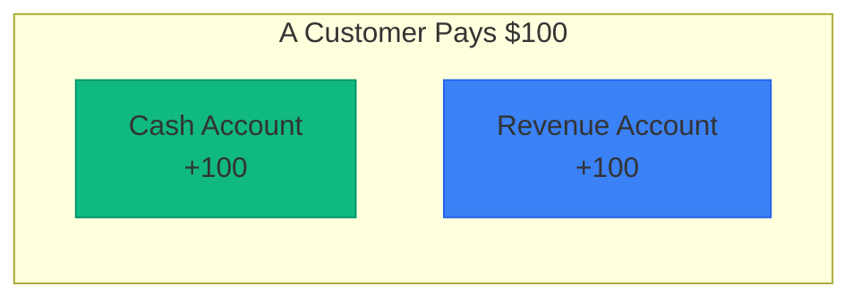
```mermaid
flowchart LR
    subgraph "A Customer Pays $100"
        C[Cash Account<br/>+100]
        R[Revenue Account<br/>+100]
    end
    
    style C fill:#10b981,stroke:#059669
    style R fill:#3b82f6,stroke:#2563eb
```

This might seem like extra work—why track both sides when you could just increment a balance? Because real financial systems involve timing differences, holds, fees, disputes, and reversals. When something goes wrong (and it will), you need to know exactly where the money is.

## Account Types: Assets, Liabilities, and Everything Between

Before we look at real-world examples, let's map the five account types to concepts developers understand:

| Account Type | Think of it as... | Increases When... |
|--------------|-------------------|-------------------|
| **Assets** | Your bank account, holdings | Money comes to you |
| **Liabilities** | Money you owe others | You owe someone |
| **Equity** | Owner's stake in the business | Investment or profit |
| **Revenue** | Income streams | You earn money |
| **Expenses** | Costs you incur | You spend money |

The key insight: **Assets = Liabilities + Equity**. This equation must always hold true.

When you receive $100 from a customer:
- Assets (Cash) ↑ $100
- Revenue ↑ $100
- Revenue eventually flows to Equity (Retained Earnings)

When you pay a $10 server bill:
- Assets (Cash) ↓ $10
- Expenses ↑ $10
- Expenses reduce Equity

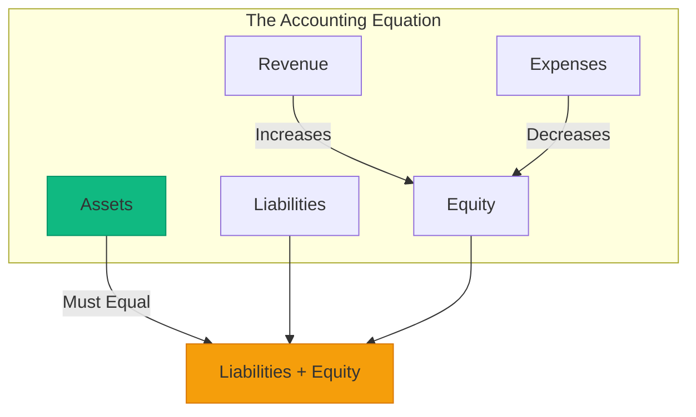
```mermaid
flowchart TB
    subgraph "The Accounting Equation"
        A[Assets]
        L[Liabilities]
        E[Equity]
        R[Revenue]
        Exp[Expenses]
    end
    
    A -->|Must Equal| Sum["Liabilities + Equity"]
    L --> Sum
    E --> Sum
    
    R -->|Increases| E
    Exp -->|Decreases| E
    
    style A fill:#10b981,stroke:#059669
    style Sum fill:#f59e0b,stroke:#d97706
```

## Use Case 1: Ride-Hailing Platform

Let's trace what happens when a rider takes a $25 trip. The platform charges 20% commission, and the driver receives the rest.

### Step 1: Ride Completes

The rider pays $25 via credit card:

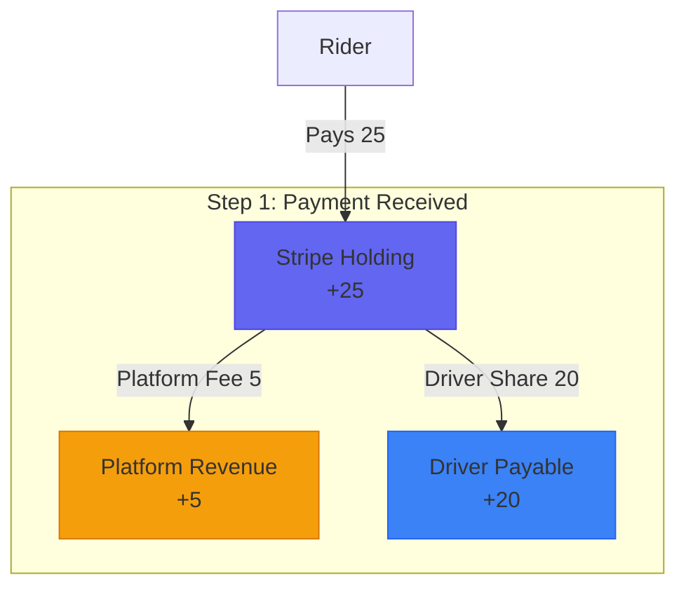
```mermaid
flowchart TB
    subgraph "Step 1: Payment Received"
        direction TB
        Stripe["Stripe Holding<br/>+25"]
        Revenue["Platform Revenue<br/>+5"]
        Payable["Driver Payable<br/>+20"]
    end
    
    Rider[Rider] -->|Pays 25| Stripe
    Stripe -->|Platform Fee 5| Revenue
    Stripe -->|Driver Share 20| Payable
    
    style Stripe fill:#6366f1,stroke:#4f46e5
    style Revenue fill:#f59e0b,stroke:#d97706
    style Payable fill:#3b82f6,stroke:#2563eb
```

**Why we use a Stripe Holding account:** The money hasn't settled to your bank yet. It's in Stripe's custody, and you need to track that.

**Why Driver Payable is a liability:** You owe the driver $20. Until you transfer it, it's debt on your books.

**Journal Entry for Step 1:**

| Account | Debit (+) | Credit (−) | Balance Impact |
|---------|-----------|------------|----------------|
| **Stripe Holding** (Asset) | $25.00 | | +$25.00 |
| **Platform Revenue** (Equity) | | $5.00 | +$5.00 |
| **Driver Payable** (Liability) | | $20.00 | +$20.00 |
| **Total** | **$25.00** | **$25.00** | **✓ Balanced** |

**Verification:** Assets ($25) = Liabilities ($20) + Equity ($5) ✓

---

### Step 2: Stripe Settlement

Three days later, Stripe transfers $24.22 to your bank (they kept $0.78 as processing fees):

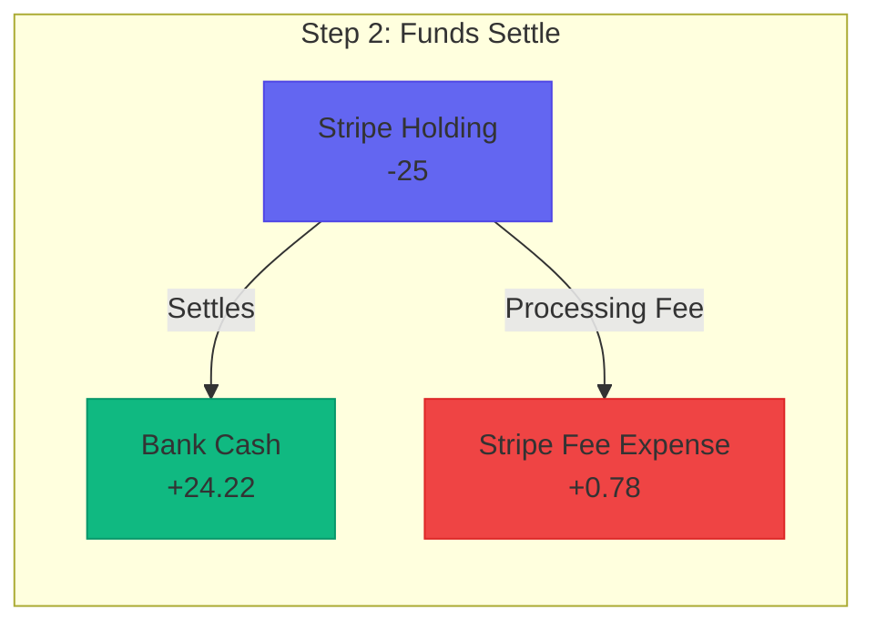
```mermaid
flowchart TB
    subgraph "Step 2: Funds Settle"
        direction TB
        Cash["Bank Cash<br/>+24.22"]
        Stripe["Stripe Holding<br/>-25"]
        Fee["Stripe Fee Expense<br/>+0.78"]
    end
    
    Stripe -->|Settles| Cash
    Stripe -->|Processing Fee| Fee
    
    style Cash fill:#10b981,stroke:#059669
    style Stripe fill:#6366f1,stroke:#4f46e5
    style Fee fill:#ef4444,stroke:#dc2626
```

Notice: The full $25 leaves Stripe Holding. Some becomes Cash, some becomes an Expense.

**Journal Entry for Step 2:**

| Account | Debit (+) | Credit (−) | Balance Impact |
|---------|-----------|------------|----------------|
| **Bank Cash** (Asset) | $24.22 | | +$24.22 |
| **Stripe Fee Expense** (Equity) | $0.78 | | −$0.78 |
| **Stripe Holding** (Asset) | | $25.00 | −$25.00 |
| **Total** | **$25.00** | **$25.00** | **✓ Balanced** |

**Running Balances After Step 2:**

| Account | Before | After Step 2 |
|---------|--------|--------------|
| Stripe Holding | $25.00 | **$0.00** (cleared) |
| Bank Cash | $0.00 | **$24.22** |
| Stripe Fee Expense | $0.00 | **$0.78** |
| Platform Revenue | $5.00 | **$5.00** (unchanged) |
| Driver Payable | $20.00 | **$20.00** (unchanged) |

---

### Step 3: Driver Payout

The driver requests their $20, and you send it via bank transfer:

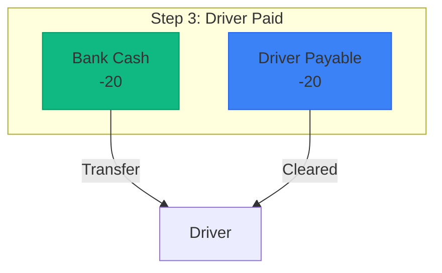
```mermaid
flowchart TB
    subgraph "Step 3: Driver Paid"
        direction TB
        Cash["Bank Cash<br/>-20"]
        Payable["Driver Payable<br/>-20"]
    end
    
    Cash -->|Transfer| Driver
    Payable -->|Cleared| Driver
    
    style Cash fill:#10b981,stroke:#059669
    style Payable fill:#3b82f6,stroke:#2563eb
```

**The Driver Payable liability is now zero**—you don't owe them anything.

**Journal Entry for Step 3:**

| Account | Debit (+) | Credit (−) | Balance Impact |
|---------|-----------|------------|----------------|
| **Driver Payable** (Liability) | $20.00 | | −$20.00 (cleared) |
| **Bank Cash** (Asset) | | $20.00 | −$20.00 |
| **Total** | **$20.00** | **$20.00** | **✓ Balanced** |

**Final Balances After All Steps:**

| Account | Step 1 | Step 2 | Step 3 | Final |
|---------|--------|--------|--------|-------|
| **Stripe Holding** | $25.00 | $0.00 | $0.00 | **$0.00** |
| **Bank Cash** | $0.00 | $24.22 | $4.22 | **$4.22** |
| **Platform Revenue** | $5.00 | $5.00 | $5.00 | **$5.00** |
| **Stripe Fee Expense** | $0.00 | $0.78 | $0.78 | **$0.78** |
| **Driver Payable** | $20.00 | $20.00 | $0.00 | **$0.00** |
| **Net Position** | **+$25.00** | **+$4.22** | **+$4.22** | **+$4.22** |

**Balance Sheet Check:**
- **Assets:** Bank Cash $4.22 = **$4.22**
- **Liabilities:** Driver Payable $0.00 = **$0.00**
- **Equity:** Revenue $5.00 − Expense $0.78 = **$4.22**
- **Accounting Equation:** $4.22 = $0.00 + $4.22 ✓

---

### Complete Transaction Flow

Here's the full sequence in one diagram:

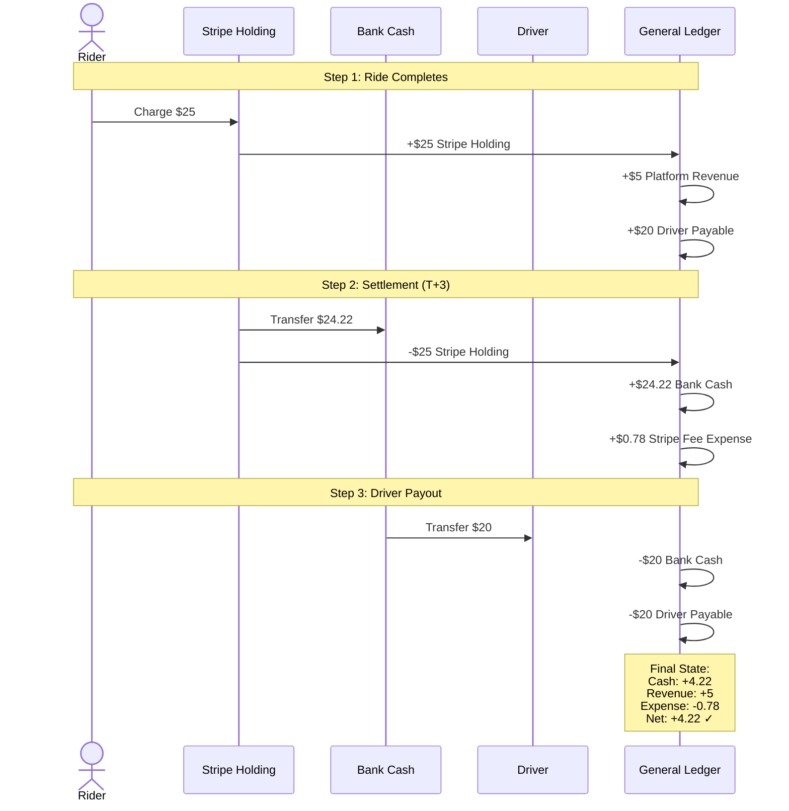
```mermaid
sequenceDiagram
    actor Rider
    participant Stripe as Stripe Holding
    participant Bank as Bank Cash
    participant Driver
    participant GL as General Ledger
    
    Note over Rider,GL: Step 1: Ride Completes
    Rider->>Stripe: Charge $25
    Stripe->>GL: +$25 Stripe Holding
    GL->>GL: +$5 Platform Revenue
    GL->>GL: +$20 Driver Payable
    
    Note over Rider,GL: Step 2: Settlement (T+3)
    Stripe->>Bank: Transfer $24.22
    Stripe->>GL: -$25 Stripe Holding
    GL->>GL: +$24.22 Bank Cash
    GL->>GL: +$0.78 Stripe Fee Expense
    
    Note over Rider,GL: Step 3: Driver Payout
    Bank->>Driver: Transfer $20
    GL->>GL: -$20 Bank Cash
    GL->>GL: -$20 Driver Payable
    
    Note over GL: Final State:<br/>Cash: +4.22<br/>Revenue: +5<br/>Expense: -0.78<br/>Net: +4.22 ✓
```

**What if the rider disputes the charge?** This is where double-entry shines. You'd create a Reversal transaction:

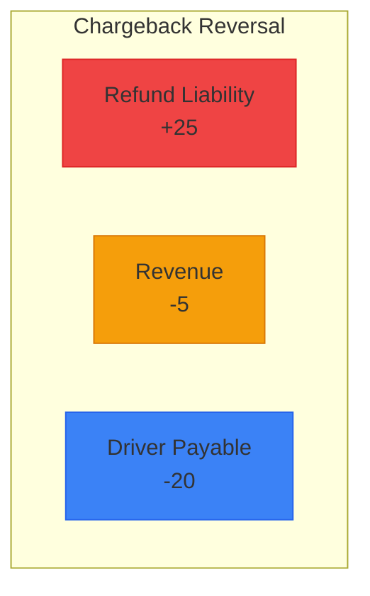
```mermaid
flowchart TB
    subgraph "Chargeback Reversal"
        Refund["Refund Liability<br/>+25"]
        Rev["Revenue<br/>-5"]
        Pay["Driver Payable<br/>-20"]
    end
    
    style Refund fill:#ef4444,stroke:#dc2626
    style Rev fill:#f59e0b,stroke:#d97706
    style Pay fill:#3b82f6,stroke:#2563eb
```

Notice we reduce Revenue (you didn't really earn it) and Driver Payable (you don't owe them anymore). If you already paid the driver, you'd create a Driver Receivable instead—they now owe you money back.

**Journal Entry for Chargeback Reversal (Scenario: Already Settled, Not Yet Paid Driver):**

| Account | Debit (+) | Credit (−) | Balance Impact |
|---------|-----------|------------|----------------|
| **Platform Revenue** (Equity) | $5.00 | | −$5.00 (reversed) |
| **Driver Payable** (Liability) | $20.00 | | −$20.00 (cleared) |
| **Stripe Holding** (Asset) | | $25.00 | −$25.00 (refund due) |
| **Total** | **$25.00** | **$25.00** | **✓ Balanced** |

**Net Effect of Reversal:**

| Account | Before Reversal | After Reversal | Change |
|---------|-----------------|------------------|--------|
| Platform Revenue | $5.00 | **$0.00** | −$5.00 |
| Driver Payable | $20.00 | **$0.00** | −$20.00 |
| Stripe Holding | $0.00 | **−$25.00** | −$25.00 |
| Bank Cash | $4.22 | **$4.22** | $0.00 |

**Note:** Stripe Holding becomes negative $25 because you now owe Stripe a refund. When you actually send the refund, you'll debit Stripe Holding and credit Bank Cash.

---

## Use Case 2: Payment Gateway

Payment gateways have an extra layer: merchant accounts, reserves, and rolling reserves. Let's trace a $1,000 transaction with a 2.9% + $0.30 fee.

### Step 1: Transaction Authorization

The customer's card is charged, but funds haven't moved yet:

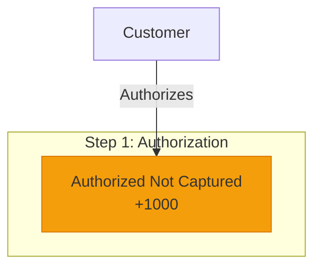
```mermaid
flowchart TB
    subgraph "Step 1: Authorization"
        Auth["Authorized Not Captured<br/>+1000"]
    end
    
    Customer -->|Authorizes| Auth
    
    style Auth fill:#f59e0b,stroke:#d97706
```

At this stage, you've verified the card has funds. No money has changed hands in your ledger yet.

**Journal Entry for Step 1:**

*No entry recorded* — Authorization alone doesn't change your books. The card hold exists in the payment processor's system, not in your ledger.

---

### Step 2: Capture and Settlement

The merchant confirms shipment, and you capture the funds:

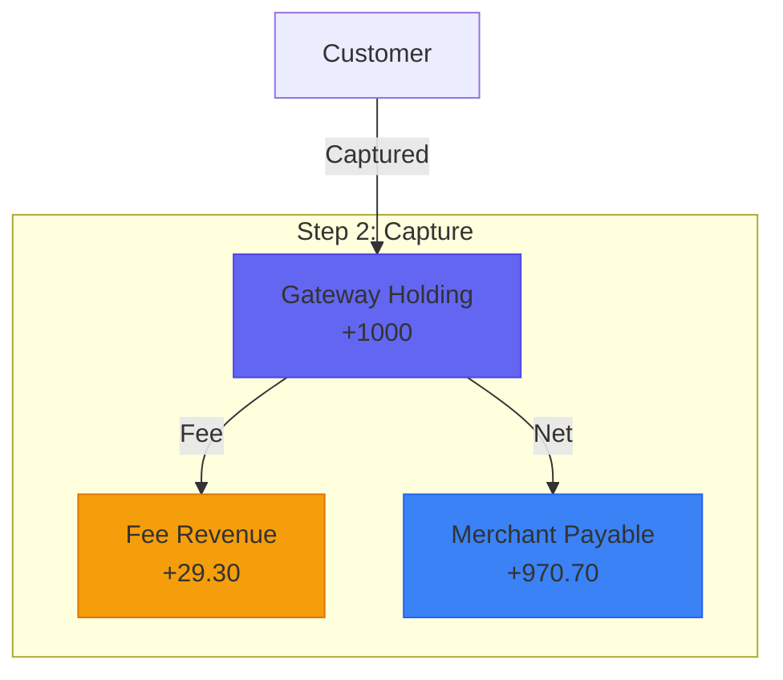
```mermaid
flowchart TB
    subgraph "Step 2: Capture"
        direction TB
        Gateway["Gateway Holding<br/>+1000"]
        Fee["Fee Revenue<br/>+29.30"]
        Net["Merchant Payable<br/>+970.70"]
    end
    
    Customer -->|Captured| Gateway
    Gateway -->|Fee| Fee
    Gateway -->|Net| Net
    
    style Gateway fill:#6366f1,stroke:#4f46e5
    style Fee fill:#f59e0b,stroke:#d97706
    style Net fill:#3b82f6,stroke:#2563eb
```

**Fee Revenue is $29.30** (2.9% of $1,000 + $0.30).

**Merchant Payable is $970.70**—what you'll actually transfer to the merchant.

**Journal Entry for Step 2:**

| Account | Debit (+) | Credit (−) | Balance Impact |
|---------|-----------|------------|----------------|
| **Gateway Holding** (Asset) | $1,000.00 | | +$1,000.00 |
| **Fee Revenue** (Equity) | | $29.30 | +$29.30 |
| **Merchant Payable** (Liability) | | $970.70 | +$970.70 |
| **Total** | **$1,000.00** | **$1,000.00** | **✓ Balanced** |

**Balances After Step 2:**

| Account | Type | Balance |
|---------|------|---------|
| **Gateway Holding** | Asset | **+$1,000.00** |
| **Fee Revenue** | Equity | **+$29.30** |
| **Merchant Payable** | Liability | **+$970.70** |
| **Net Position** | | **+$29.30** (your fee) |

---

### Step 3: Rolling Reserve

Payment gateways often hold a percentage (let's say 10%) for 90 days to cover potential chargebacks:

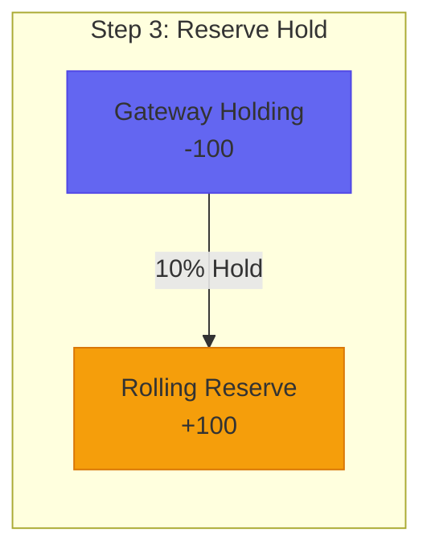
```mermaid
flowchart TB
    subgraph "Step 3: Reserve Hold"
        direction TB
        Gateway["Gateway Holding<br/>-100"]
        Reserve["Rolling Reserve<br/>+100"]
    end
    
    Gateway -->|10% Hold| Reserve
    
    style Gateway fill:#6366f1,stroke:#4f46e5
    style Reserve fill:#f59e0b,stroke:#d97706
```

The $100 moves from "available" to "held." It's still your liability to the merchant, but now it's segregated.

**Journal Entry for Step 3 (10% Reserve Hold):**

| Account | Debit (+) | Credit (−) | Balance Impact |
|---------|-----------|------------|----------------|
| **Rolling Reserve** (Liability) | | $100.00 | +$100.00 (segregated) |
| **Gateway Holding** (Asset) | $100.00 | | −$100.00 (reduced) |
| **Total** | **$100.00** | **$100.00** | **✓ Balanced** |

**This is an internal reclassification** — no money leaves the system. We're just moving $100 from "available" to "held" status:

| Account | Before Reserve | After Reserve | Change |
|---------|----------------|---------------|--------|
| **Gateway Holding** | $1,000.00 | **$900.00** | −$100.00 |
| **Rolling Reserve** | $0.00 | **$100.00** | +$100.00 |
| **Merchant Payable** | $970.70 | **$970.70** | $0.00 |
| **Available for Payout** | $970.70 | **$870.70** | −$100.00 |

---

### Step 4: Payout with Reserve Release

After the holding period, you pay the merchant the available $870.70 and release the reserve:

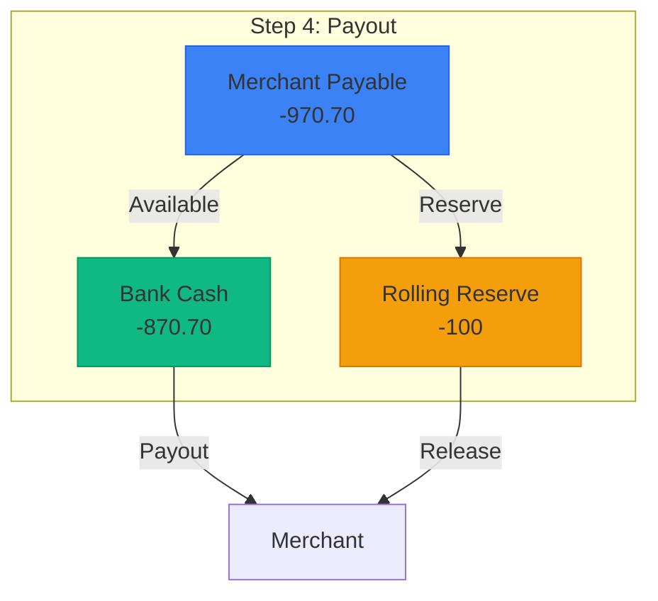
```mermaid
flowchart TB
    subgraph "Step 4: Payout"
        direction TB
        Payable["Merchant Payable<br/>-970.70"]
        Cash["Bank Cash<br/>-870.70"]
        Reserve["Rolling Reserve<br/>-100"]
    end
    
    Payable -->|Available| Cash
    Payable -->|Reserve| Reserve
    Cash -->|Payout| Merchant
    Reserve -->|Release| Merchant
    
    style Payable fill:#3b82f6,stroke:#2563eb
    style Cash fill:#10b981,stroke:#059669
    style Reserve fill:#f59e0b,stroke:#d97706
```

**Journal Entry for Step 4 (Payout T+2 and Reserve Release T+90):**

**Day 1 (T+2): Payout Available Funds**

| Account | Debit (+) | Credit (−) | Balance Impact |
|---------|-----------|------------|----------------|
| **Merchant Payable** (Liability) | $870.70 | | −$870.70 |
| **Bank Cash** (Asset) | | $870.70 | −$870.70 |
| **Total** | **$870.70** | **$870.70** | **✓ Balanced** |

**Day 90 (T+90): Release Reserve & Final Payout**

| Account | Debit (+) | Credit (−) | Balance Impact |
|---------|-----------|------------|----------------|
| **Merchant Payable** (Liability) | $100.00 | | −$100.00 |
| **Rolling Reserve** (Liability) | $100.00 | | −$100.00 (released) |
| **Bank Cash** (Asset) | | $100.00 | −$100.00 |
| **Total** | **$200.00** | **$200.00** | **✓ Balanced** |

**Final Balances After Complete Payout:**

| Account | Step 2 | Step 3 | After Payout | Final |
|---------|--------|--------|--------------|-------|
| **Gateway Holding** | $1,000.00 | $900.00 | $0.00 | **$0.00** |
| **Rolling Reserve** | $0.00 | $100.00 | $0.00 | **$0.00** |
| **Merchant Payable** | $970.70 | $970.70 | $0.00 | **$0.00** |
| **Fee Revenue** | $29.30 | $29.30 | $29.30 | **$29.30** |
| **Bank Cash** | $0.00 | $0.00 | −$970.70 | **−$970.70** |

**Your Net Position:** Fee Revenue $29.30 (your earnings as payment gateway)

---

### Complete Payment Gateway Flow

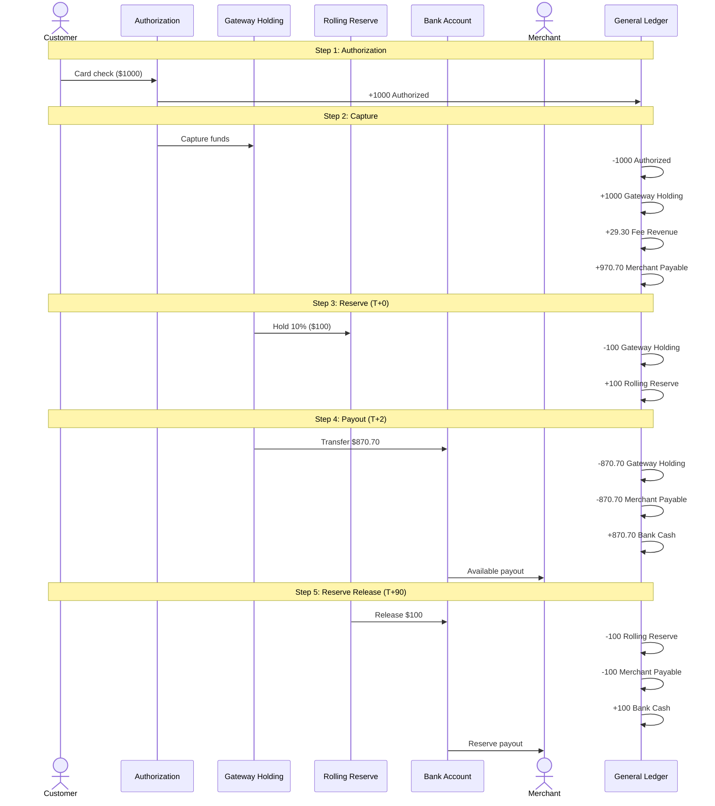
```mermaid
sequenceDiagram
    actor Customer
    participant Auth as Authorization
    participant Gateway as Gateway Holding
    participant Reserve as Rolling Reserve
    participant Bank as Bank Account
    actor Merchant
    participant GL as General Ledger
    
    Note over Customer,GL: Step 1: Authorization
    Customer->>Auth: Card check ($1000)
    Auth->>GL: +1000 Authorized
    
    Note over Customer,GL: Step 2: Capture
    Auth->>Gateway: Capture funds
    GL->>GL: -1000 Authorized
    GL->>GL: +1000 Gateway Holding
    GL->>GL: +29.30 Fee Revenue
    GL->>GL: +970.70 Merchant Payable
    
    Note over Customer,GL: Step 3: Reserve (T+0)
    Gateway->>Reserve: Hold 10% ($100)
    GL->>GL: -100 Gateway Holding
    GL->>GL: +100 Rolling Reserve
    
    Note over Customer,GL: Step 4: Payout (T+2)
    Gateway->>Bank: Transfer $870.70
    GL->>GL: -870.70 Gateway Holding
    GL->>GL: -870.70 Merchant Payable
    GL->>GL: +870.70 Bank Cash
    Bank->>Merchant: Available payout
    
    Note over Customer,GL: Step 5: Reserve Release (T+90)
    Reserve->>Bank: Release $100
    GL->>GL: -100 Rolling Reserve
    GL->>GL: -100 Merchant Payable
    GL->>GL: +100 Bank Cash
    Bank->>Merchant: Reserve payout
```

## What Happens When Things Go Wrong?

### Partial Refund

Customer gets a $200 refund on that $1,000 purchase:

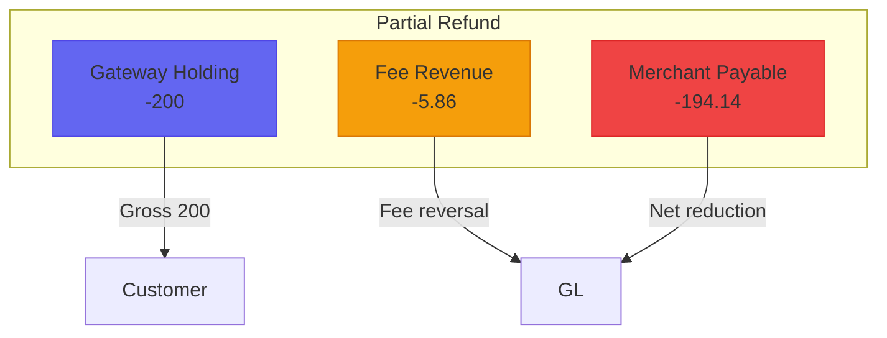
```mermaid
flowchart TB
    subgraph "Partial Refund"
        Gateway["Gateway Holding<br/>-200"]
        Rev["Fee Revenue<br/>-5.86"]
        Pay["Merchant Payable<br/>-194.14"]
    end
    
    Gateway -->|Gross 200| Customer
    Rev -->|Fee reversal| GL
    Pay -->|Net reduction| GL
    
    style Gateway fill:#6366f1,stroke:#4f46e5
    style Rev fill:#f59e0b,stroke:#d97706
    style Pay fill:#ef4444,stroke:#dc2626
```

You refund the gross amount but reduce the merchant's payable by the net amount (reversing their portion of the fee).

**Journal Entry for Partial Refund:**

| Account | Debit (+) | Credit (−) | Calculation |
|---------|-----------|------------|-------------|
| **Merchant Payable** (Liability) | $194.14 | | $200 − $5.86 (fee reversal) |
| **Fee Revenue** (Equity) | $5.86 | | 2.9% + $0.30 of $200 |
| **Gateway Holding** (Asset) | | $200.00 | Full refund amount |
| **Total** | **$200.00** | **$200.00** | **✓ Balanced** |

**The Logic:**
- Customer gets full $200 refund from Gateway Holding
- Merchant loses only their net portion: $200 − $5.86 fee = $194.14
- You (the gateway) reverse $5.86 of fee revenue because you're refunding the fee too

---

### Chargeback After Payout

If the customer disputes after you've already paid the merchant:

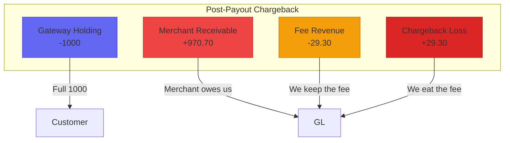
```mermaid
flowchart TB
    subgraph "Post-Payout Chargeback"
        Gateway["Gateway Holding<br/>-1000"]
        Rec["Merchant Receivable<br/>+970.70"]
        Fee["Fee Revenue<br/>-29.30"]
        Loss["Chargeback Loss<br/>+29.30"]
    end
    
    Gateway -->|Full 1000| Customer
    Rec -->|Merchant owes us| GL
    Fee -->|We keep the fee| GL
    Loss -->|We eat the fee| GL
    
    style Gateway fill:#6366f1,stroke:#4f46e5
    style Rec fill:#ef4444,stroke:#dc2626
    style Fee fill:#f59e0b,stroke:#d97706
    style Loss fill:#dc2626,stroke:#b91c1c
```

Now the merchant owes you money (Receivable), and you've recorded a loss for the fee you can't recover.

**Journal Entry for Post-Payout Chargeback:**

| Account | Debit (+) | Credit (−) | Explanation |
|---------|-----------|------------|-------------|
| **Merchant Receivable** (Asset) | $970.70 | | Merchant must repay us |
| **Chargeback Loss** (Expense) | $29.30 | | Fee we can't recover |
| **Gateway Holding** (Asset) | | $1,000.00 | Full refund to customer |
| **Total** | **$1,000.00** | **$1,000.00** | **✓ Balanced** |

**What This Means:**
- **Merchant Receivable ($970.70):** The merchant already received their payout, but now owes it back. This is money they must repay you.
- **Chargeback Loss ($29.30):** Your fee revenue from this transaction is now a loss. You've already paid the merchant their share, so you eat the fee.
- **Gateway Holding (−$1,000):** You sent $1,000 back to the customer

**Net Impact on Your Books:**

| Account | Before Chargeback | After Chargeback | Change |
|---------|-------------------|------------------|--------|
| **Gateway Holding** | $0.00 | **−$1,000.00** | −$1,000 |
| **Merchant Receivable** | $0.00 | **$970.70** | +$970.70 |
| **Chargeback Loss** | $0.00 | **$29.30** | +$29.30 |
| **Net Position** | | | **−$29.30** (your loss) |

**Why it's structured this way:**
- You must refund the customer the full $1,000
- The merchant received $970.70 and spent it, so now they owe it back (Receivable)
- Your $29.30 fee is now a loss because you paid it out but can't claw it back
- This preserves the accounting: every dollar refunded has a source (Merchant owes $970.70, you absorb $29.30)

---

## The Database Perspective

If you're implementing this, here's a simplified schema:

```sql
-- Accounts table
CREATE TABLE accounts (
    id UUID PRIMARY KEY,
    name VARCHAR(255) NOT NULL,
    type VARCHAR(50) CHECK (type IN ('asset', 'liability', 'equity', 'revenue', 'expense')),
    balance DECIMAL(15,2) DEFAULT 0,
    created_at TIMESTAMP DEFAULT NOW()
);

-- Transactions table
CREATE TABLE transactions (
    id UUID PRIMARY KEY,
    reference_id VARCHAR(255), -- External reference (Stripe ID, etc.)
    description TEXT,
    status VARCHAR(50) DEFAULT 'pending',
    created_at TIMESTAMP DEFAULT NOW()
);

-- Transaction entries (the double entries)
CREATE TABLE transaction_entries (
    id UUID PRIMARY KEY,
    transaction_id UUID REFERENCES transactions(id),
    account_id UUID REFERENCES accounts(id),
    entry_type VARCHAR(10) CHECK (entry_type IN ('debit', 'credit')),
    amount DECIMAL(15,2) NOT NULL,
    CHECK (amount > 0) -- Store amounts as positive, direction in entry_type
);
```

A critical constraint: **Every transaction must have entries that sum to zero.**

```sql
-- Validation trigger or application logic
SELECT SUM(CASE 
    WHEN entry_type = 'debit' THEN amount 
    ELSE -amount 
END) as balance
FROM transaction_entries 
WHERE transaction_id = 'txn-123';
-- Must return 0
```

## Clearing Accounts: The Reconciliation Buffer

Remember that Stripe Holding account we used? That's technically a **clearing account**—a temporary holding place for funds in transit.

Clearing accounts exist because money doesn't move instantly between systems. When you charge a customer:
1. Stripe confirms the charge instantly
2. But the actual bank transfer takes 2-7 business days
3. During that time, the money exists in a liminal state

**Without a clearing account:**
```
You record: Revenue +100, Cash +100
Reality: You don't actually have the cash yet
Problem: If Stripe declines the transfer later, your books are wrong
```

**With a clearing account:**
```
Step 1: Stripe Holding +100, Revenue +100
Step 2: Bank Cash +97, Stripe Fee Expense +3, Stripe Holding -100
```

The Stripe Holding account (clearing) starts at zero, goes up when the charge succeeds, then goes back to zero when the funds settle. At any point, if you see a balance in that account, you know money is in transit.

### How Clearing Account Journaling Works: A Complete Walkthrough

Let's trace a $100 charge through your books using the **journal entry table** format. This is what your actual ledger looks like:

#### Step 1: Customer Payment Authorized ($100)

When Stripe confirms the charge, you record it in your books:

| Date | Account | Debit | Credit | Description |
|------|---------|-------|--------|-------------|
| Day 1 | **Stripe Holding** (Asset) | $100.00 | | Customer charge authorized |
| Day 1 | **Revenue** (Equity) | | $100.00 | Sales revenue from customer |

**What's happening:**
- **Stripe Holding** (debit +$100): Your asset increases. You now have a claim to $100 that Stripe owes you.
- **Revenue** (credit +$100): You earned the revenue, which increases equity.
- **Balance check:** Assets ($100) = Liabilities ($0) + Equity ($100) ✓

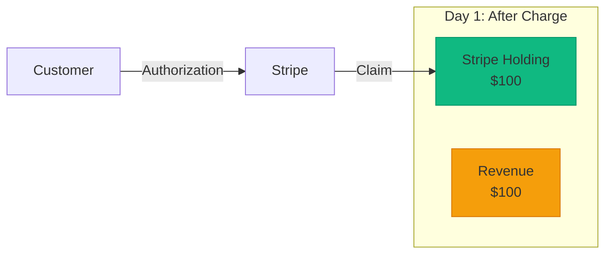
```mermaid
flowchart LR
    subgraph "Day 1: After Charge"
        A1[Stripe Holding<br/>$100]
        R1[Revenue<br/>$100]
    end
    
    Customer -->|Authorization| Stripe
    Stripe -->|Claim| A1
    
    style A1 fill:#10b981,stroke:#059669
    style R1 fill:#f59e0b,stroke:#d97706
```

At this point, **Stripe Holding has a $100 balance**. This tells you: "We have money coming, but it's not in our bank yet."

---

#### Step 2: Funds Settle to Your Bank ($97 net)

Three days later, Stripe transfers the money but keeps $3 as processing fees:

| Date | Account | Debit | Credit | Description |
|------|---------|-------|--------|-------------|
| Day 4 | **Bank Cash** (Asset) | $97.00 | | Funds received from Stripe |
| Day 4 | **Stripe Fee Expense** (Expense) | $3.00 | | Processing fees charged |
| Day 4 | **Stripe Holding** (Asset) | | $100.00 | Clearing account reduced |

**What's happening:**
- **Bank Cash** (debit +$97): Your actual bank account increases by the net amount.
- **Stripe Fee Expense** (debit +$3): Expenses reduce equity, so this is recorded as a debit.
- **Stripe Holding** (credit -$100): The clearing account goes back to zero because the money is no longer "in transit."

**Balance verification:**
- Total Debits: $97 + $3 = $100
- Total Credits: $100
- Net Change: $0 ✓

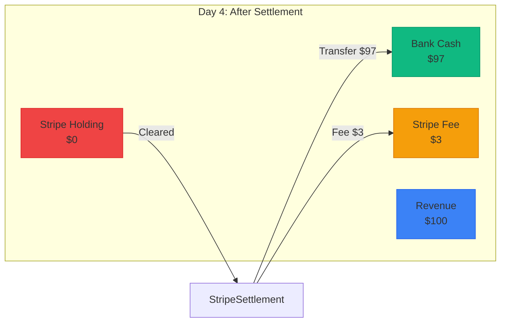
```mermaid
flowchart LR
    subgraph "Day 4: After Settlement"
        SH[Stripe Holding<br/>$0]
        BC[Bank Cash<br/>$97]
        SF[Stripe Fee<br/>$3]
        R[Revenue<br/>$100]
    end
    
    StripeSettlement -->|Transfer $97| BC
    StripeSettlement -->|Fee $3| SF
    SH -->|Cleared| StripeSettlement
    
    style SH fill:#ef4444,stroke:#dc2626
    style BC fill:#10b981,stroke:#059669
    style SF fill:#f59e0b,stroke:#d97706
    style R fill:#3b82f6,stroke:#2563eb
```

---

#### Account Balances Over Time

Here's how each account's balance changes:

| Account | Day 1 | Day 2-3 | Day 4 | Final |
|---------|-------|---------|-------|-------|
| Stripe Holding | **$100** | **$100** | **$0** | $0 |
| Revenue | **$100** | **$100** | **$100** | $100 |
| Stripe Fee Expense | $0 | $0 | **$3** | $3 |
| Bank Cash | $0 | $0 | **$97** | $97 |
| **Total Assets** | **$100** | **$100** | **$97** | **$97** |
| **Total Equity** | **$100** | **$100** | **$97** | **$97** |

**Why Stripe Holding went to zero:**
- Day 1: Money is in Stripe's custody, we record it as "Stripe Holding"
- Day 4: Money arrives in our bank, so we "clear" the holding account
- The clearing account acts like a **temporary bridge** between systems

---

#### The Journal Entry Chain

Think of it as a **chain of custody** for money:

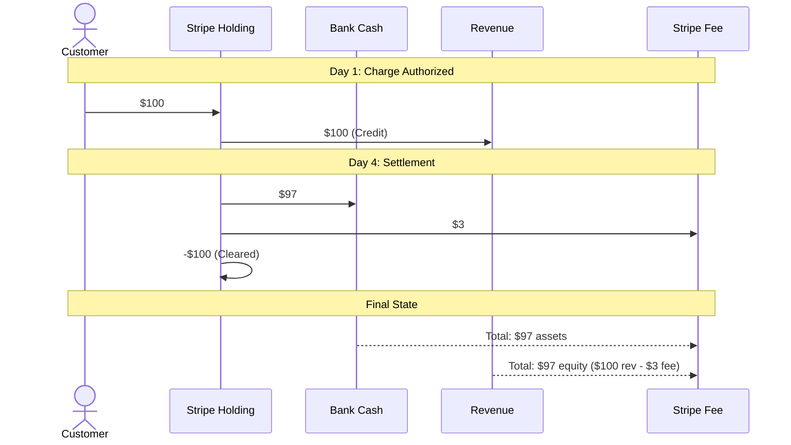
```mermaid
sequenceDiagram
    actor Customer
    participant SH as Stripe Holding
    participant Bank as Bank Cash
    participant Rev as Revenue
    participant Fee as Stripe Fee
    
    Note over Customer,Fee: Day 1: Charge Authorized
    Customer->>SH: $100
    SH->>Rev: $100 (Credit)
    
    Note over Customer,Fee: Day 4: Settlement
    SH->>Bank: $97
    SH->>Fee: $3
    SH->>SH: -$100 (Cleared)
    
    Note over Customer,Fee: Final State
    Bank-->>Fee: Total: $97 assets
    Rev-->>Fee: Total: $97 equity ($100 rev - $3 fee)
```

---

#### What If Settlement Never Comes?

Here's why clearing accounts matter. If Stripe declines the transfer on Day 4:

| Date | Account | Debit | Credit | Description |
|------|---------|-------|--------|-------------|
| Day 4 | **Revenue** (Reversal) | $100.00 | | Reverse unrecognized revenue |
| Day 4 | **Stripe Holding** (Asset) | | $100.00 | Clear the holding account |

**Result:**
- Revenue goes back to $0 (we never actually earned it)
- Stripe Holding goes to $0 (no money was received)
- Bank Cash stays at $0
- **Your books are still correct.**

Without the clearing account, you would have recorded $100 in Revenue and $100 in Bank Cash on Day 1. When the transfer failed, your books would be wrong by $100.

---

### Clearing Account vs. Revenue Recognition

**Key concept:** Revenue and cash settlement are separate events in double-entry bookkeeping.

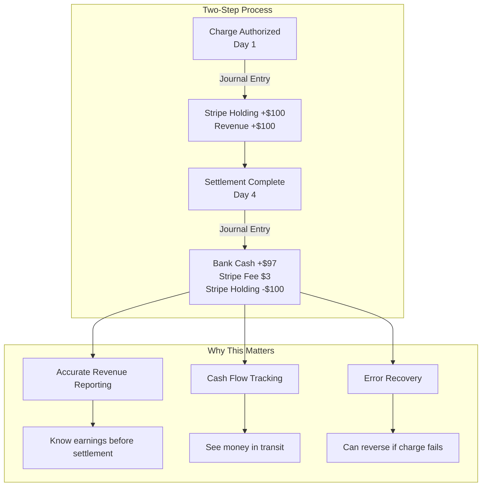
```mermaid
flowchart TB
    subgraph "Two-Step Process"
        A[Charge Authorized<br/>Day 1] -->|Journal Entry| B[Stripe Holding +$100<br/>Revenue +$100]
        B --> C[Settlement Complete<br/>Day 4] 
        C -->|Journal Entry| D[Bank Cash +$97<br/>Stripe Fee $3<br/>Stripe Holding -$100]
    end
    
    subgraph "Why This Matters"
        E[Accurate Revenue Reporting] --> F[Know earnings before settlement]
        G[Cash Flow Tracking] --> H[See money in transit]
        I[Error Recovery] --> J[Can reverse if charge fails]
    end
    
    D --> E
    D --> G
    D --> I
```

**Takeaway:** The clearing account lets you **recognize revenue when earned** (Day 1) while **tracking cash separately** (Day 4). This gives you accurate financial statements at any point in time.

### When You Need Clearing Accounts

| Scenario | Clearing Account Purpose |
|----------|-------------------------|
| **Payment processors** | Hold funds between charge and settlement |
| **Bank transfers** | Track ACH/wire transfers in flight |
| **Internal transfers** | Money moving between your own accounts |
| **Batch processing** | Daily settlement from multiple sources |
| **Reconciliation** | Temporary parking for unmatched transactions |

In our ride-hailing example, the Stripe Holding account acts as a clearing account. You can also have clearing accounts for internal transfers—like moving money from your operating account to your payroll account.

## Suspense Accounts: When You Don't Know Yet

While clearing accounts hold money you know about, **suspense accounts** hold money you *don't* fully understand yet.

Here's a real scenario: A $500 deposit hits your bank account with the description "TRANSFER 839201." You have no idea what it is. Could be a customer payment, could be a refund from a vendor, could be a mistaken deposit that needs to be returned.

**Without a suspense account:**
- You guess it's revenue and record it
- Turns out it was a return of a security deposit
- Now your revenue is overstated, and you have to do a complex correction

**With a suspense account:**
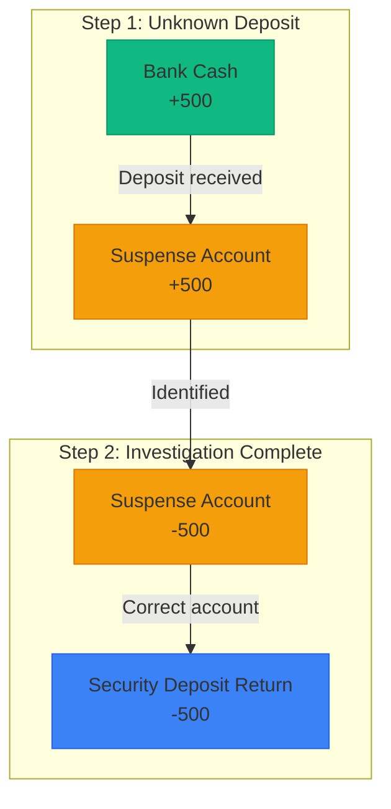
```mermaid
flowchart TB
    subgraph "Step 1: Unknown Deposit"
        Bank["Bank Cash<br/>+500"]
        Suspense["Suspense Account<br/>+500"]
    end
    
    subgraph "Step 2: Investigation Complete"
        Suspense2["Suspense Account<br/>-500"]
        Liability["Security Deposit Return<br/>-500"]
    end
    
    Bank -->|Deposit received| Suspense
    Suspense -->|Identified| Suspense2
    Suspense2 -->|Correct account| Liability
    
    style Bank fill:#10b981,stroke:#059669
    style Suspense fill:#f59e0b,stroke:#d97706
    style Suspense2 fill:#f59e0b,stroke:#d97706
    style Liability fill:#3b82f6,stroke:#2563eb
```

### Common Suspense Account Use Cases

1. **Failed payouts that need retry**

   You tried to pay a driver $50, but their bank account was closed. The transfer bounced back:
   
   ```mermaid
   flowchart TB
       subgraph "Bounced Payout"
           Cash["Bank Cash<br/>+50"]
           Suspense["Payout Suspense<br/>+50"]
           Payable["Driver Payable<br/>-50"]
       end
       
       Payable -->|Failed payout| Suspense
       Suspense -->|Bounced back| Cash
       
       style Cash fill:#10b981,stroke:#059669
       style Suspense fill:#f59e0b,stroke:#d97706
       style Payable fill:#ef4444,stroke:#dc2626
   ```
   
   Now you know you owe the driver $50, but you need their new bank details before you can try again. The suspense account holds this "we know we owe it, but we can't pay it yet" state.

2. **Batch deposits you need to break down**

   Stripe deposits $10,000 as a lump sum, but you need to attribute it to individual rides:
   
   ```
   Step 1: Bank Cash +10,000, Stripe Clearing Suspense +10,000
   Step 2 (per ride): Stripe Clearing Suspense -25, Revenue +5, Driver Payable +20
   ```
   
   The suspense account goes to zero once you've accounted for every ride in that batch.

3. **Disputed transactions pending resolution**

   A customer disputes a $200 charge. While it's being investigated:
   
   ```
   Step 1: Chargeback Suspense +200, Revenue -200, Receivable -160 (if merchant already paid)
   Step 2 (if you lose): Bank Cash -200, Chargeback Suspense -200
   Step 2 (if you win): Revenue +200, Chargeback Suspense -200
   ```

### The Rule of Suspense Accounts

**A suspense account should always return to zero.** It's not a permanent home—it's a waiting room. If you see a persistent balance in a suspense account, that's a red flag:

- Someone forgot to investigate an unknown deposit
- A payout keeps failing and no one's following up
- A batch wasn't fully reconciled
- You're missing documentation

Set up alerts for any suspense account balance older than 7 days. That's your signal to investigate.

### Clearing vs. Suspense: The Difference

| Feature | Clearing Account | Suspense Account |
|---------|------------------|------------------|
| **Purpose** | Known money in transit | Unknown/unallocated money |
| **Duration** | Hours to days | Until investigated |
| **Expected balance** | Often non-zero (normal) | Should be zero (investigate if not) |
| **Example** | Stripe Holding | Unknown Deposit Suspense |
| **Resolution** | Automatic when transfer completes | Requires manual investigation |

## Why This Matters

Without double-entry accounting:
- You lose track of money in transit
- Refunds become guesswork
- Chargebacks appear as unexplained losses
- Reconciling with Stripe/payment processors is painful
- Your accountant will not be happy at tax time

With it:
- Every dollar is traceable
- Your books always balance
- Financial reporting is straightforward
- Audits are manageable
- You can spot discrepancies immediately

The complexity isn't overhead—it's the difference between "we think we have about this much money" and "we know exactly where every dollar is."

## Key Takeaways

1. **Every transaction has at least two sides.** If you only record one, you're flying blind.

2. **Timing matters.** Money in Stripe holding isn't the same as money in your bank. Track the stages.

3. **Liabilities are your friend.** "Payable" accounts tell you what you owe. Without them, you'll overcommit funds.

4. **Reserves aren't optional.** In payment processing, holdbacks aren't just good practice—they're survival.

5. **Build for reversals.** Every transaction type needs a corresponding reversal. If you can't undo it, you can't handle disputes.

The next time someone asks "where's the money?" you'll be able to point to exactly which account it's sitting in—and why.
