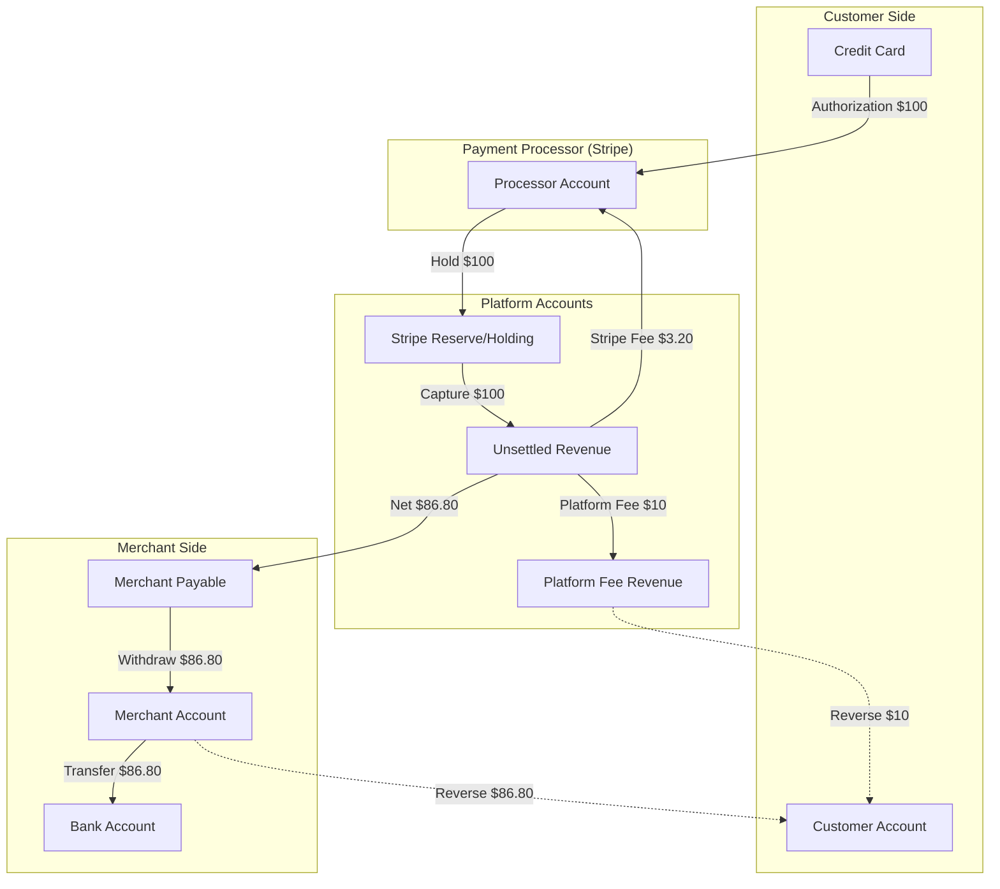
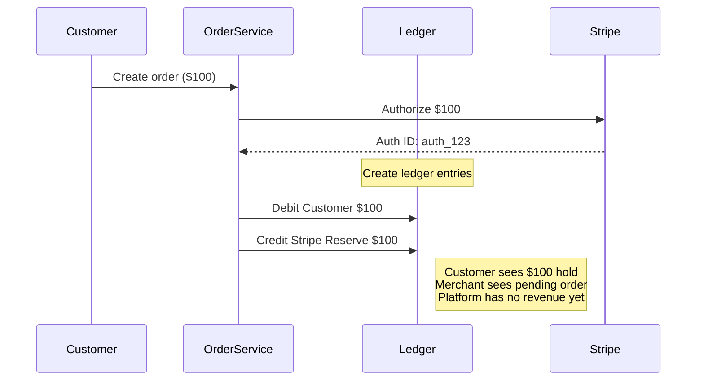
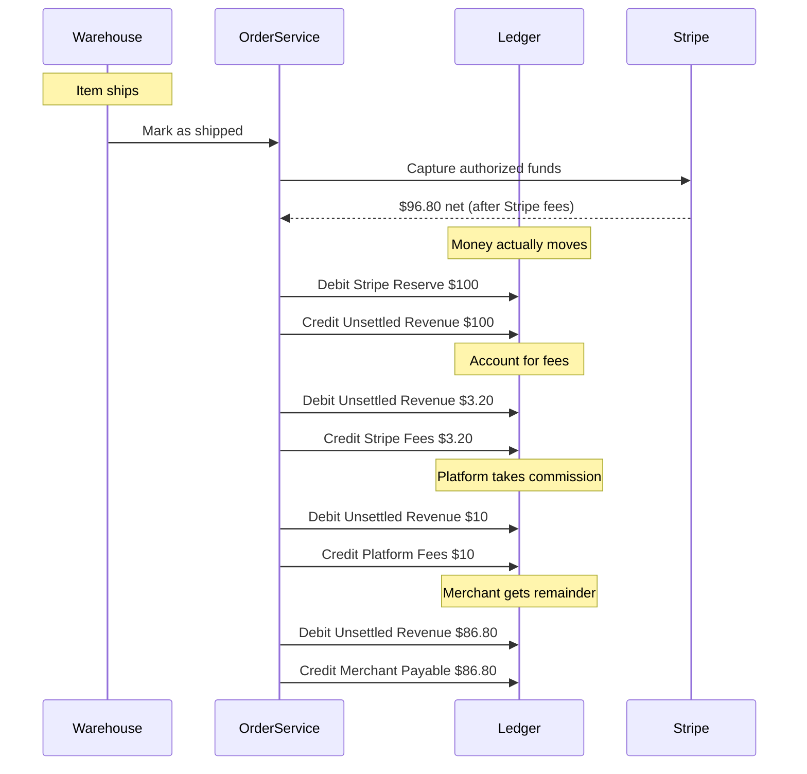
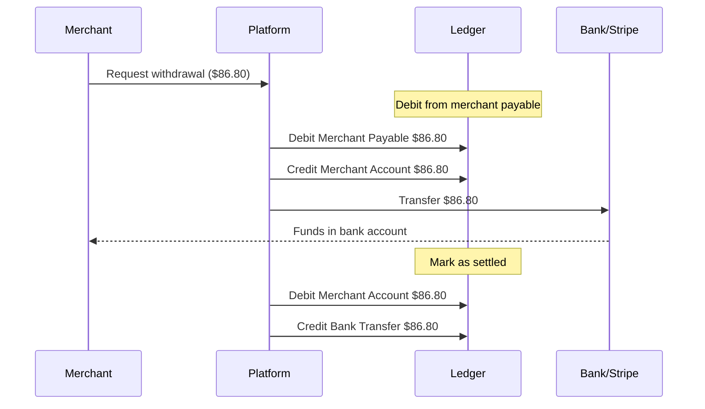
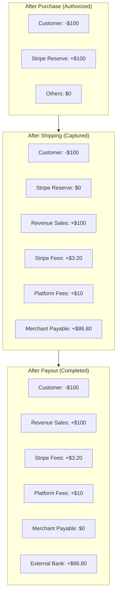

I was three months into building an e-commerce platform when our accountant asked a simple question that broke everything:

"When a customer pays $100, and we keep 10% as commission, and Stripe takes 2.9% + 30¢, how much does the merchant actually receive?"

I looked at my database schema and felt the familiar sinking feeling that I was missing something obvious.

The math was simple—$100 - $10 - $3.20 = $86.80—but the *tracking* wasn't. When did the merchant earn that money? When the customer paid? When the item shipped? When we transferred it? What if the customer refunded? What if the item was backordered for three weeks?

That's when I realized: e-commerce isn't about orders. It's about money movement.

## The Problem: Where's the Money?

Most e-commerce platforms start simple enough. Customer pays, order created, item ships, merchant gets paid. Done.

But the reality is messier. Customer pays—except that's just an authorization, not real money yet. Item ships—now the funds actually capture. Platform takes their cut—Stripe snags 2.9% plus thirty cents, you grab your 10%. Merchant gets the remainder—but not instantly, it sits in a payable account until they request it. And that's assuming the customer doesn't refund three weeks later because the size was wrong.

At every step, money is in motion. Without a ledger, you're basically guessing where it is.

## The E-commerce Ledger Architecture

Here's what the money flow actually looks like:



Money doesn't teleport from customer to merchant. It stops in holding accounts, gets split into fees, sits in payable buckets. Each hop needs its own account.

## Chart of Accounts for E-commerce

Before we write code, we need accounts. Here's what we're working with:

- `customer_{id}` - tracks what the customer owes (or is owed, if refunding)
- `merchant_{id}` - what we owe the merchant  
- `platform_fees` - your commission revenue
- `stripe_reserve` - authorized but not captured yet
- `unsettled_rev` - captured, not disbursed
- `stripe_fees` - payment processing cost
- `revenue_sales` - gross transaction value

That's seven accounts for one $100 order. Sounds like overkill until you're explaining to a merchant why their $86.80 payout doesn't match their $100 sale.

## Authorization: When the Customer Clicks "Buy"

When someone clicks buy, you don't charge them. You authorize. The hold appears on their card, but the money hasn't moved.



At this stage: customer sees a hold, merchant sees a pending order, platform has zero revenue. The ledger reflects this accurately—a $100 debit from customer, $100 credit to stripe reserve. Nobody's rich yet.

### Rails Implementation

```ruby
# app/models/account.rb
class Account < ApplicationRecord
  has_many :ledger_entries
  has_many :ledger_transactions, through: :ledger_entries
  
  validates :account_number, presence: true, uniqueness: true
  validates :account_type, inclusion: { in: %w[asset liability revenue expense equity] }
  
  def balance
    ledger_entries.sum do |entry|
      entry.direction == 'credit' ? entry.amount : -entry.amount
    end
  end
  
  def self.find_or_create_merchant_account(merchant)
    find_or_create_by!(account_number: "merchant_#{merchant.id}") do |account|
      account.account_type = 'liability'
      account.name = "Merchant Payable: #{merchant.name}"
      account.owner_type = 'Merchant'
      account.owner_id = merchant.id
    end
  end
  
  def self.stripe_reserve
    find_or_create_by!(account_number: 'stripe_reserve') do |account|
      account.account_type = 'liability'
      account.name = 'Stripe Reserve/Holding'
      account.description = 'Authorized but not yet captured funds'
    end
  end
  
  def self.platform_fees
    find_or_create_by!(account_number: 'platform_fees') do |account|
      account.account_type = 'revenue'
      account.name = 'Platform Commission Revenue'
      account.description = '10% platform commission'
    end
  end
end

# app/services/ecommerce/purchase_service.rb
module Ecommerce
  class PurchaseService
    PLATFORM_FEE_PERCENTAGE = 0.10 # 10%
    STRIPE_FEE_PERCENTAGE = 0.029  # 2.9%
    STRIPE_FEE_FIXED = 0.30        # $0.30
    
    def initialize
      @ledger_service = Ledger::TransactionService.new
    end
    
    def initiate_purchase(order_params)
      order = create_order(order_params)
      
      # Authorize payment with Stripe
      authorization = authorize_with_stripe(order)
      
      # Create authorization entries in ledger
      create_authorization_entries(order, authorization)
      
      {
        success: true,
        order: order,
        authorization_id: authorization.id,
        status: 'authorized'
      }
    rescue Stripe::CardError => e
      order.update!(status: 'payment_failed')
      { success: false, error: e.message }
    end
    
    private
    
    def create_order(params)
      Order.create!(
        customer_id: params[:customer_id],
        merchant_id: params[:merchant_id],
        items: params[:items],
        total_amount: params[:total_amount],
        currency: params[:currency] || 'USD',
        status: 'pending_payment'
      )
    end
    
    def authorize_with_stripe(order)
      Stripe::PaymentIntent.create({
        amount: (order.total_amount * 100).to_i,
        currency: order.currency.downcase,
        capture_method: 'manual',
        metadata: {
          order_id: order.id,
          merchant_id: order.merchant_id,
          customer_id: order.customer_id
        }
      })
    end
    
    def create_authorization_entries(order, authorization)
      customer_account = Account.find_or_create_by!(
        account_number: "customer_#{order.customer_id}",
        account_type: 'asset'
      )
      
      stripe_reserve = Account.stripe_reserve
      
      entries = [
        {
          account_id: customer_account.id,
          direction: 'debit',
          amount: order.total_amount,
          currency: order.currency,
          description: "Authorization for order #{order.id}"
        },
        {
          account_id: stripe_reserve.id,
          direction: 'credit',
          amount: order.total_amount,
          currency: order.currency,
          description: "Hold for order #{order.id}"
        }
      ]
      
      ledger_txn = @ledger_service.post_transaction(
        entries,
        external_ref: authorization.id,
        description: "Authorization: Order #{order.id}",
        metadata: {
          order_id: order.id,
          authorization_id: authorization.id,
          phase: 'authorization'
        }
      )
      
      order.update!(
        ledger_transaction_id: ledger_txn.id,
        authorization_id: authorization.id,
        status: 'authorized'
      )
      
      ledger_txn
    end
  end
end
```

## Capture: When the Item Ships

Most platforms get this wrong. They capture funds when the customer pays. Don't do that. You shouldn't recognize revenue until the item actually ships.



One shipping event triggers five separate ledger transactions. Stripe reserve gets debited, unsettled revenue gets credited, then fees get deducted, then merchant payable gets created. It's verbose but accurate—every dollar is traceable.

### Rails Implementation

```ruby
# app/services/ecommerce/shipping_service.rb
module Ecommerce
  class ShippingService
    def initialize
      @ledger_service = Ledger::TransactionService.new
    end
    
    def ship_order(order_id, tracking_number)
      order = Order.find(order_id)
      
      raise "Order must be authorized" unless order.authorized?
      raise "Order already captured" if order.captured?
      
      ActiveRecord::Base.transaction do
        capture = capture_payment(order)
        
        gross_amount = order.total_amount
        stripe_fee = calculate_stripe_fee(gross_amount)
        platform_fee = calculate_platform_fee(gross_amount)
        net_to_merchant = gross_amount - stripe_fee - platform_fee
        
        create_capture_entries(order, {
          gross: gross_amount,
          stripe_fee: stripe_fee,
          platform_fee: platform_fee,
          net: net_to_merchant
        })
        
        order.update!(
          status: 'shipped',
          shipped_at: Time.current,
          tracking_number: tracking_number,
          capture_id: capture.id,
          stripe_fee: stripe_fee,
          platform_fee: platform_fee,
          net_to_merchant: net_to_merchant
        )
        
        MerchantMailer.order_shipped(order).deliver_later
        
        {
          success: true,
          order: order,
          net_to_merchant: net_to_merchant
        }
      end
    rescue Stripe::StripeError => e
      { success: false, error: "Capture failed: #{e.message}" }
    end
    
    private
    
    def capture_payment(order)
      Stripe::PaymentIntent.capture(order.authorization_id)
    end
    
    def calculate_stripe_fee(amount)
      (amount * PurchaseService::STRIPE_FEE_PERCENTAGE + 
       PurchaseService::STRIPE_FEE_FIXED).round(2)
    end
    
    def calculate_platform_fee(amount)
      (amount * PurchaseService::PLATFORM_FEE_PERCENTAGE).round(2)
    end
    
    def create_capture_entries(order, amounts)
      stripe_reserve = Account.stripe_reserve
      unsettled = Account.find_or_create_by!(
        account_number: 'unsettled_revenue',
        account_type: 'liability'
      )
      stripe_fees = Account.find_or_create_by!(
        account_number: 'stripe_fees',
        account_type: 'expense'
      )
      platform_fees = Account.platform_fees
      merchant_payable = Account.find_or_create_merchant_account(order.merchant)
      revenue_sales = Account.find_or_create_by!(
        account_number: 'revenue_sales',
        account_type: 'revenue'
      )
      
      # Move from reserve to unsettled
      capture_entries = [
        {
          account: stripe_reserve,
          direction: 'debit',
          amount: amounts[:gross],
          description: "Release hold for order #{order.id}"
        },
        {
          account: unsettled,
          direction: 'credit',
          amount: amounts[:gross],
          description: "Capture for order #{order.id}"
        }
      ]
      
      capture_txn = @ledger_service.post_transaction(
        capture_entries,
        external_ref: "capture:#{order.capture_id}",
        description: "Capture: Order #{order.id}",
        metadata: {
          order_id: order.id,
          capture_id: order.capture_id,
          phase: 'capture'
        }
      )
      
      # Record revenue
      revenue_entries = [
        {
          account: unsettled,
          direction: 'debit',
          amount: amounts[:gross],
          description: "Gross revenue"
        },
        {
          account: revenue_sales,
          direction: 'credit',
          amount: amounts[:gross],
          description: "Gross sales for order #{order.id}"
        }
      ]
      
      @ledger_service.post_transaction(
        revenue_entries,
        parent_transaction: capture_txn,
        description: "Revenue recognition: Order #{order.id}"
      )
      
      # Stripe fees
      stripe_fee_entries = [
        {
          account: unsettled,
          direction: 'debit',
          amount: amounts[:stripe_fee],
          description: "Stripe processing fee"
        },
        {
          account: stripe_fees,
          direction: 'credit',
          amount: amounts[:stripe_fee],
          description: "Stripe fee for order #{order.id}"
        }
      ]
      
      @ledger_service.post_transaction(
        stripe_fee_entries,
        parent_transaction: capture_txn,
        description: "Stripe fees: Order #{order.id}"
      )
      
      # Platform fees
      platform_fee_entries = [
        {
          account: unsettled,
          direction: 'debit',
          amount: amounts[:platform_fee],
          description: "Platform commission"
        },
        {
          account: platform_fees,
          direction: 'credit',
          amount: amounts[:platform_fee],
          description: "Platform fee for order #{order.id}"
        }
      ]
      
      @ledger_service.post_transaction(
        platform_fee_entries,
        parent_transaction: capture_txn,
        description: "Platform fees: Order #{order.id}"
      )
      
      # Merchant payable
      merchant_entries = [
        {
          account: unsettled,
          direction: 'debit',
          amount: amounts[:net],
          description: "Net to merchant"
        },
        {
          account: merchant_payable,
          direction: 'credit',
          amount: amounts[:net],
          description: "Payable for order #{order.id}"
        }
      ]
      
      @ledger_service.post_transaction(
        merchant_entries,
        parent_transaction: capture_txn,
        description: "Merchant payable: Order #{order.id}"
      )
      
      capture_txn
    end
  end
end
```

## Payout: When the Merchant Gets Paid

Merchant wants their money. This moves funds from your platform to their bank account.



Three ledger transactions for one payout: request, processing, completion. The merchant account tracks money that's "theirs" but not yet in their bank. The bank transfer account tracks money in flight.

### Rails Implementation

```ruby
# app/services/ecommerce/payout_service.rb
module Ecommerce
  class PayoutService
    def initialize
      @ledger_service = Ledger::TransactionService.new
    end
    
    def request_payout(merchant_id, amount = nil)
      merchant = Merchant.find(merchant_id)
      
      available = calculate_available_balance(merchant)
      amount ||= available
      
      raise "Insufficient balance" if amount > available
      raise "Minimum payout is $10" if amount < 10
      
      ActiveRecord::Base.transaction do
        payout = Payout.create!(
          merchant: merchant,
          amount: amount,
          status: 'pending',
          currency: 'USD'
        )
        
        create_payout_entries(merchant, payout, amount)
        
        ProcessPayoutJob.perform_later(payout.id)
        
        {
          success: true,
          payout: payout,
          estimated_arrival: 2.business_days.from_now
        }
      end
    end
    
    def process_payout_transfer(payout_id)
      payout = Payout.find(payout_id)
      return unless payout.pending?
      
      transfer = create_transfer(payout)
      
      ActiveRecord::Base.transaction do
        payout.update!(
          status: 'processing',
          transfer_id: transfer.id,
          processed_at: Time.current
        )
        
        create_settlement_entries(payout)
      end
      
      {
        success: true,
        transfer_id: transfer.id
      }
    rescue => e
      payout.update!(status: 'failed', error_message: e.message)
      raise
    end
    
    def mark_payout_complete(payout_id)
      payout = Payout.find(payout_id)
      
      ActiveRecord::Base.transaction do
        payout.update!(
          status: 'completed',
          completed_at: Time.current
        )
        
        create_completion_entries(payout)
      end
    end
    
    private
    
    def calculate_available_balance(merchant)
      merchant_account = Account.find_or_create_merchant_account(merchant)
      merchant_account.balance
    end
    
    def create_payout_entries(merchant, payout, amount)
      merchant_payable = Account.find_or_create_merchant_account(merchant)
      merchant_account = Account.find_or_create_by!(
        account_number: "merchant_wallet_#{merchant.id}",
        account_type: 'asset'
      ) do |account|
        account.name = "Merchant Wallet: #{merchant.name}"
        account.owner_type = 'Merchant'
        account.owner_id = merchant.id
      end
      
      entries = [
        {
          account: merchant_payable,
          direction: 'debit',
          amount: amount,
          description: "Payout request ##{payout.id}"
        },
        {
          account: merchant_account,
          direction: 'credit',
          amount: amount,
          description: "Payout pending ##{payout.id}"
        }
      ]
      
      @ledger_service.post_transaction(
        entries,
        external_ref: "payout:#{payout.id}",
        description: "Payout request: #{merchant.name}",
        metadata: {
          payout_id: payout.id,
          merchant_id: merchant.id,
          phase: 'payout_request'
        }
      )
    end
    
    def create_transfer(payout)
      Stripe::Transfer.create({
        amount: (payout.amount * 100).to_i,
        currency: 'usd',
        destination: payout.merchant.stripe_account_id,
        transfer_group: "payout_#{payout.id}"
      })
    end
    
    def create_settlement_entries(payout)
      merchant_account = Account.find_by!(
        account_number: "merchant_wallet_#{payout.merchant_id}"
      )
      
      bank_transfer = Account.find_or_create_by!(
        account_number: 'bank_transfers',
        account_type: 'asset'
      ) do |account|
        account.name = 'Bank Transfers In Transit'
      end
      
      entries = [
        {
          account: merchant_account,
          direction: 'debit',
          amount: payout.amount,
          description: "Transfer initiated ##{payout.id}"
        },
        {
          account: bank_transfer,
          direction: 'credit',
          amount: payout.amount,
          description: "Payout ##{payout.id} to #{payout.merchant.name}"
        }
      ]
      
      @ledger_service.post_transaction(
        entries,
        external_ref: payout.transfer_id,
        description: "Transfer processing: Payout ##{payout.id}",
        metadata: {
          payout_id: payout.id,
          transfer_id: payout.transfer_id,
          phase: 'transfer_processing'
        }
      )
    end
    
    def create_completion_entries(payout)
      bank_transfer = Account.find_by!(account_number: 'bank_transfers')
      
      entries = [
        {
          account: bank_transfer,
          direction: 'debit',
          amount: payout.amount,
          description: "Transfer completed ##{payout.id}"
        },
        {
          account: Account.find_or_create_by!(
            account_number: 'external_bank',
            account_type: 'asset'
          ),
          direction: 'credit',
          amount: payout.amount,
          description: "Funds deposited to merchant bank"
        }
      ]
      
      @ledger_service.post_transaction(
        entries,
        description: "Payout completed: ##{payout.id}",
        metadata: {
          payout_id: payout.id,
          phase: 'payout_complete'
        }
      )
    end
  end
end

# app/jobs/process_payout_job.rb
class ProcessPayoutJob < ApplicationJob
  queue_as :payouts
  
  retry_on StandardError, wait: :exponentially_longer, attempts: 5
  
  def perform(payout_id)
    service = Ecommerce::PayoutService.new
    service.process_payout_transfer(payout_id)
  end
end
```

## How It All Adds Up

After a $100 order ships and the merchant requests payout, your accounts look like this:



The math checks out. Customer is down $100. Platform earned $10 commission. Stripe took $3.20. Merchant got $86.80. Every dollar is accounted for.

## Handling Refunds

Refunds are where most ledger implementations break. When a customer returns an item, you need to reverse everything proportionally.

```ruby
# app/services/ecommerce/refund_service.rb
module Ecommerce
  class RefundService
    def initialize
      @ledger_service = Ledger::TransactionService.new
    end
    
    def process_refund(order_id, amount = nil, reason: nil)
      order = Order.find(order_id)
      amount ||= order.total_amount
      
      raise "Order not eligible for refund" unless order.refundable?
      
      ActiveRecord::Base.transaction do
        refund = create_stripe_refund(order, amount)
        
        create_refund_entries(order, amount, reason)
        
        order.update!(
          status: 'refunded',
          refund_amount: amount,
          refund_reason: reason,
          refunded_at: Time.current
        )
        
        {
          success: true,
          refund_id: refund.id,
          amount_refunded: amount
        }
      end
    end
    
    private
    
    def create_stripe_refund(order, amount)
      Stripe::Refund.create({
        payment_intent: order.authorization_id,
        amount: (amount * 100).to_i
      })
    end
    
    def create_refund_entries(order, refund_amount, reason)
      ratio = refund_amount / order.total_amount
      
      stripe_fee_refund = (order.stripe_fee * ratio).round(2)
      platform_fee_refund = (order.platform_fee * ratio).round(2)
      net_merchant_refund = refund_amount - stripe_fee_refund - platform_fee_refund
      
      # Reverse revenue
      revenue_entries = [
        {
          account: Account.find_by!(account_number: 'revenue_sales'),
          direction: 'debit',
          amount: refund_amount,
          description: "Refund for order #{order.id}"
        },
        {
          account: Account.find_by!(account_number: "customer_#{order.customer_id}"),
          direction: 'credit',
          amount: refund_amount,
          description: "Refund: #{reason}"
        }
      ]
      
      @ledger_service.post_transaction(
        revenue_entries,
        description: "Refund: Order #{order.id}",
        metadata: {
          order_id: order.id,
          refund_amount: refund_amount,
          phase: 'refund'
        }
      )
      
      # If partial refund, adjust merchant payable
      if refund_amount < order.total_amount
        adjust_merchant_payable(order, net_merchant_refund)
      end
    end
    
    def adjust_merchant_payable(order, amount)
      merchant_payable = Account.find_or_create_merchant_account(order.merchant)
      
      entries = [
        {
          account: merchant_payable,
          direction: 'debit',
          amount: amount,
          description: "Adjustment for refund: Order #{order.id}"
        },
        {
          account: Account.find_by!(account_number: 'unsettled_revenue'),
          direction: 'credit',
          amount: amount,
          description: "Refund adjustment"
        }
      ]
      
      @ledger_service.post_transaction(
        entries,
        description: "Merchant payable adjustment: Order #{order.id}"
      )
    end
  end
end
```

## Dashboard Queries

Merchants want to see their money. Query the ledger like this:

```ruby
# app/services/merchant_dashboard_service.rb
class MerchantDashboardService
  def self.balance_summary(merchant_id)
    merchant = Merchant.find(merchant_id)
    payable_account = Account.find_or_create_merchant_account(merchant)
    
    {
      available_balance: payable_account.balance,
      pending_orders: pending_order_total(merchant),
      total_revenue_ytd: ytd_revenue(merchant),
      total_fees_ytd: ytd_fees(merchant),
      last_payout: last_payout_info(merchant)
    }
  end
  
  def self.transaction_history(merchant_id, start_date:, end_date:)
    merchant = Merchant.find(merchant_id)
    account = Account.find_or_create_merchant_account(merchant)
    
    LedgerEntry
      .joins(:ledger_transaction)
      .where(account: account)
      .where(ledger_transactions: { posted_at: start_date..end_date })
      .order('ledger_transactions.posted_at DESC')
      .map do |entry|
        {
          date: entry.ledger_transaction.posted_at,
          type: entry.direction == 'credit' ? 'earning' : 'payout',
          amount: entry.amount,
          description: entry.description,
          order_id: entry.ledger_transaction.metadata['order_id']
        }
      end
  end
  
  def self.pending_order_total(merchant)
    Order
      .where(merchant: merchant)
      .where(status: 'authorized')
      .sum(:total_amount)
  end
  
  def self.ytd_revenue(merchant)
    start_of_year = Date.today.beginning_of_year
    
    LedgerEntry
      .joins(:ledger_transaction)
      .where(account: Account.find_or_create_merchant_account(merchant))
      .where(direction: 'credit')
      .where(ledger_transactions: { posted_at: start_of_year..Date.today })
      .sum(:amount)
  end
  
  def self.ytd_fees(merchant)
    start_of_year = Date.today.beginning_of_year
    
    Order
      .where(merchant: merchant)
      .where(status: 'shipped')
      .where('shipped_at >= ?', start_of_year)
      .sum(:platform_fee)
  end
  
  def self.last_payout_info(merchant)
    payout = Payout
      .where(merchant: merchant)
      .completed
      .order(completed_at: :desc)
      .first
    
    return nil unless payout
    
    {
      amount: payout.amount,
      date: payout.completed_at,
      status: payout.status
    }
  end
end
```

## What I'd Do Differently

I ran this in production for two years. Here's what I learned the hard way:

Don't capture on purchase. Capture when the item ships. This is the mistake everyone makes. If you capture early, you're stuck holding the bag when customers refund before they even receive the product.

**Why this matters:**

Imagine a customer pays Monday morning, but the item doesn't ship until Friday afternoon. If you capture immediately on Monday, Stripe charges you a 2.9% + 30¢ fee. If the customer cancels Tuesday afternoon—before the item even leaves the warehouse—you have to issue a full refund. Stripe doesn't refund their fees. You just lost $3.20 on a transaction that never happened.

At 10,000 orders per month with a 5% cancellation rate, that's 500 cancelled orders. Early capture costs you $1,600 per month in unrecoverable Stripe fees. Ship-then-capture costs you zero.

From an accounting perspective, capturing early also creates messy ledger entries—you're recognizing revenue, then immediately reversing it, plus eating the processing fee. Ship-then-capture is cleaner: no revenue recognition until the item actually ships, and cancelled orders never hit your ledger at all.

Track every cent. That thirty cent Stripe fee? Track it. That two cent rounding difference? Track it. At scale, pennies become thousands of dollars.

Reconcile daily. Compare your ledger to Stripe's reports every single day. Small discrepancies become big problems if you let them fester.

Hold funds for refunds. When you ship an order, don't let merchants withdraw the full amount immediately. Hold ten percent for thirty days. Returns happen.

Test refunds thoroughly. The refund flow is where ledger bugs hide. Test partial refunds, full refunds, refunds after payout, refunds when the merchant already withdrew the money. Each scenario has different accounting implications.

## Why This Matters

E-commerce isn't about orders and inventory. It's about money in motion.

Your ledger is the single source of truth for every dollar that flows through your platform. From customer to authorization hold. From hold to captured revenue. From revenue to fees and merchant payable. From payable to merchant bank account.

Get this flow right, and your accounting is automatic. Get it wrong, and you'll spend every month-end reconciling discrepancies and explaining to merchants why their payouts don't match their sales.

A well-designed ledger makes the complex simple. Every transaction balances to zero. Every dollar is traceable. Every account tells a story.

That's not just good engineering. That's not lying awake at night wondering if the numbers add up.

---

**Related Posts:**

- [Building a Ledger System - Chapter 1: Foundations](/posts/ledger-system-chapter-1-foundations)
- [Building a Ledger System - Chapter 6: Displaying Balance and Mutations to Users](/posts/ledger-system-chapter-6-user-balance-display)
