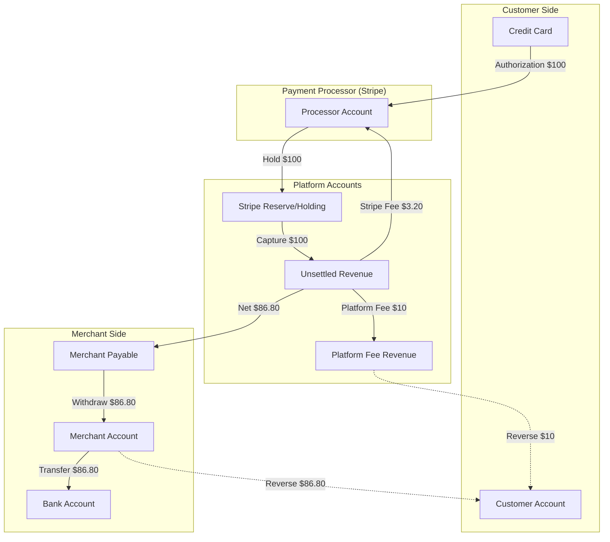
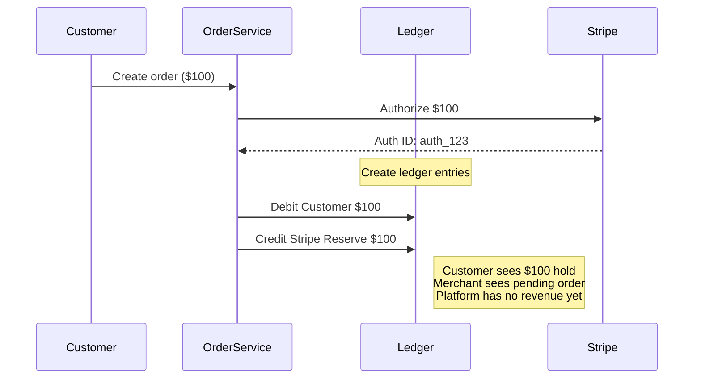
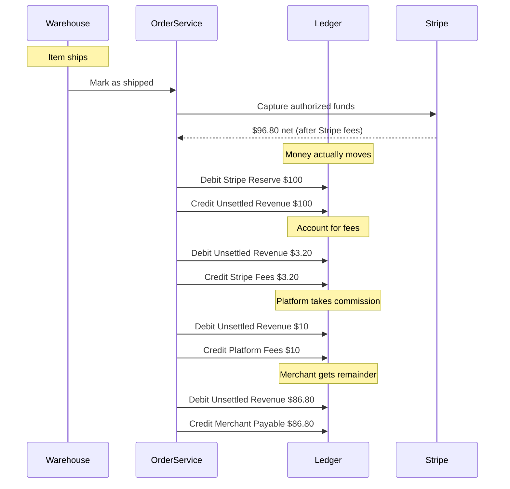
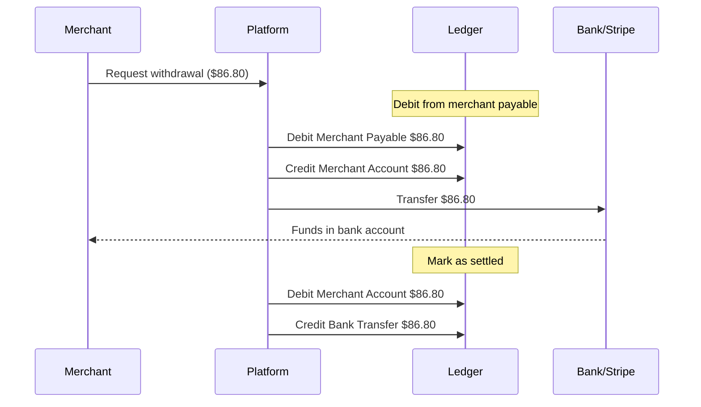
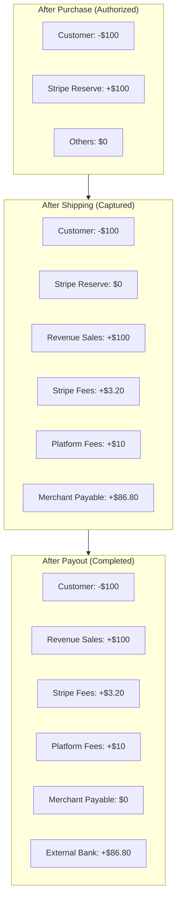
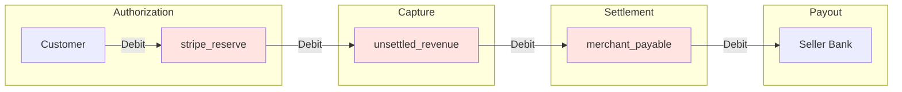
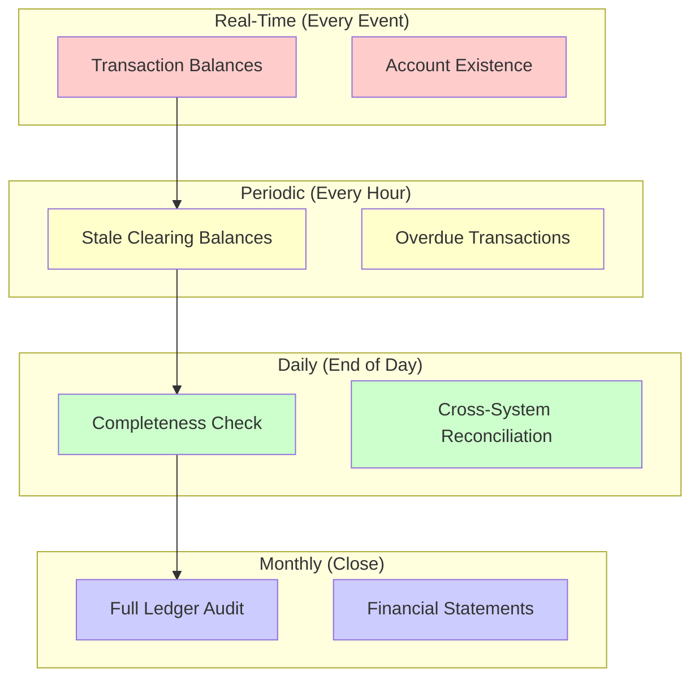

I was three months into building an e-commerce platform when our accountant asked a simple question that broke everything:

"When a customer pays $100, and we keep 10% as commission, and Stripe takes 2.9% + 30¢, how much does the merchant actually receive?"

I looked at my database schema and felt the familiar sinking feeling that I was missing something obvious.

The math was simple—$100 - $10 - $3.20 = $86.80—but the *tracking* wasn't. When did the merchant earn that money? When the customer paid? When the item shipped? When we transferred it? What if the customer refunded? What if the item was backordered for three weeks?

That's when I realized: e-commerce isn't about orders. It's about money movement.

## The Problem: Where's the Money?

Most e-commerce platforms start simple enough. Customer pays, order created, item ships, merchant gets paid. Done.

But the reality is messier. Customer pays—except that's just an authorization, not real money yet. Item ships—now the funds actually capture. Platform takes their cut—Stripe snags 2.9% plus thirty cents, you grab your 10%. Merchant gets the remainder—but not instantly, it sits in a payable account until they request it. And that's assuming the customer doesn't refund three weeks later because the size was wrong.

At every step, money is in motion. Without a ledger, you're basically guessing where it is.

## The E-commerce Ledger Architecture

Here's what the money flow actually looks like:



Money doesn't teleport from customer to merchant. It stops in holding accounts, gets split into fees, sits in payable buckets. Each hop needs its own account.

## Chart of Accounts for E-commerce

Before we write code, we need accounts. Here's what we're working with:

- `customer_{id}` - tracks what the customer owes (or is owed, if refunding)
- `merchant_{id}` - what we owe the merchant
- `platform_fees` - your commission revenue
- `stripe_reserve` - authorized but not captured yet
- `unsettled_rev` - captured, not disbursed
- `stripe_fees` - payment processing cost
- `revenue_sales` - gross transaction value

That's seven accounts for one $100 order. Sounds like overkill until you're explaining to a merchant why their $86.80 payout doesn't match their $100 sale.

## Authorization: When the Customer Clicks "Buy"

When someone clicks buy, you don't charge them. You authorize. The hold appears on their card, but the money hasn't moved.



At this stage: customer sees a hold, merchant sees a pending order, platform has zero revenue. The ledger reflects this accurately—a $100 debit from customer, $100 credit to stripe reserve. Nobody's rich yet.

### Rails Implementation

```ruby
# app/models/account.rb
class Account < ApplicationRecord
  has_many :ledger_entries
  has_many :ledger_transactions, through: :ledger_entries

  validates :account_number, presence: true, uniqueness: true
  validates :account_type, inclusion: { in: %w[asset liability revenue expense equity] }

  def balance
    ledger_entries.sum do |entry|
      entry.direction == 'credit' ? entry.amount : -entry.amount
    end
  end

  def self.find_or_create_merchant_account(merchant)
    find_or_create_by!(account_number: "merchant_#{merchant.id}") do |account|
      account.account_type = 'liability'
      account.name = "Merchant Payable: #{merchant.name}"
      account.owner_type = 'Merchant'
      account.owner_id = merchant.id
    end
  end

  def self.stripe_reserve
    find_or_create_by!(account_number: 'stripe_reserve') do |account|
      account.account_type = 'liability'
      account.name = 'Stripe Reserve/Holding'
      account.description = 'Authorized but not yet captured funds'
    end
  end

  def self.platform_fees
    find_or_create_by!(account_number: 'platform_fees') do |account|
      account.account_type = 'revenue'
      account.name = 'Platform Commission Revenue'
      account.description = '10% platform commission'
    end
  end
end

# app/services/ecommerce/purchase_service.rb
module Ecommerce
  class PurchaseService
    PLATFORM_FEE_PERCENTAGE = 0.10 # 10%
    STRIPE_FEE_PERCENTAGE = 0.029  # 2.9%
    STRIPE_FEE_FIXED = 0.30        # $0.30

    def initialize
      @ledger_service = Ledger::TransactionService.new
    end

    def initiate_purchase(order_params)
      order = create_order(order_params)

      # Authorize payment with Stripe
      authorization = authorize_with_stripe(order)

      # Create authorization entries in ledger
      create_authorization_entries(order, authorization)

      {
        success: true,
        order: order,
        authorization_id: authorization.id,
        status: 'authorized'
      }
    rescue Stripe::CardError => e
      order.update!(status: 'payment_failed')
      { success: false, error: e.message }
    end

    private

    def create_order(params)
      Order.create!(
        customer_id: params[:customer_id],
        merchant_id: params[:merchant_id],
        items: params[:items],
        total_amount: params[:total_amount],
        currency: params[:currency] || 'USD',
        status: 'pending_payment'
      )
    end

    def authorize_with_stripe(order)
      Stripe::PaymentIntent.create({
        amount: (order.total_amount * 100).to_i,
        currency: order.currency.downcase,
        capture_method: 'manual',
        metadata: {
          order_id: order.id,
          merchant_id: order.merchant_id,
          customer_id: order.customer_id
        }
      })
    end

    def create_authorization_entries(order, authorization)
      customer_account = Account.find_or_create_by!(
        account_number: "customer_#{order.customer_id}",
        account_type: 'asset'
      )

      stripe_reserve = Account.stripe_reserve

      entries = [
        {
          account_id: customer_account.id,
          direction: 'debit',
          amount: order.total_amount,
          currency: order.currency,
          description: "Authorization for order #{order.id}"
        },
        {
          account_id: stripe_reserve.id,
          direction: 'credit',
          amount: order.total_amount,
          currency: order.currency,
          description: "Hold for order #{order.id}"
        }
      ]

      ledger_txn = @ledger_service.post_transaction(
        entries,
        external_ref: authorization.id,
        description: "Authorization: Order #{order.id}",
        metadata: {
          order_id: order.id,
          authorization_id: authorization.id,
          phase: 'authorization'
        }
      )

      order.update!(
        ledger_transaction_id: ledger_txn.id,
        authorization_id: authorization.id,
        status: 'authorized'
      )

      ledger_txn
    end
  end
end
```

## Capture: When the Item Ships

Most platforms get this wrong. They capture funds when the customer pays. Don't do that. You shouldn't recognize revenue until the item actually ships.



One shipping event triggers five separate ledger transactions. Stripe reserve gets debited, unsettled revenue gets credited, then fees get deducted, then merchant payable gets created. It's verbose but accurate—every dollar is traceable.

### Rails Implementation

```ruby
# app/services/ecommerce/shipping_service.rb
module Ecommerce
  class ShippingService
    def initialize
      @ledger_service = Ledger::TransactionService.new
    end

    def ship_order(order_id, tracking_number)
      order = Order.find(order_id)

      raise "Order must be authorized" unless order.authorized?
      raise "Order already captured" if order.captured?

      ActiveRecord::Base.transaction do
        capture = capture_payment(order)

        gross_amount = order.total_amount
        stripe_fee = calculate_stripe_fee(gross_amount)
        platform_fee = calculate_platform_fee(gross_amount)
        net_to_merchant = gross_amount - stripe_fee - platform_fee

        create_capture_entries(order, {
          gross: gross_amount,
          stripe_fee: stripe_fee,
          platform_fee: platform_fee,
          net: net_to_merchant
        })

        order.update!(
          status: 'shipped',
          shipped_at: Time.current,
          tracking_number: tracking_number,
          capture_id: capture.id,
          stripe_fee: stripe_fee,
          platform_fee: platform_fee,
          net_to_merchant: net_to_merchant
        )

        MerchantMailer.order_shipped(order).deliver_later

        {
          success: true,
          order: order,
          net_to_merchant: net_to_merchant
        }
      end
    rescue Stripe::StripeError => e
      { success: false, error: "Capture failed: #{e.message}" }
    end

    private

    def capture_payment(order)
      Stripe::PaymentIntent.capture(order.authorization_id)
    end

    def calculate_stripe_fee(amount)
      (amount * PurchaseService::STRIPE_FEE_PERCENTAGE +
       PurchaseService::STRIPE_FEE_FIXED).round(2)
    end

    def calculate_platform_fee(amount)
      (amount * PurchaseService::PLATFORM_FEE_PERCENTAGE).round(2)
    end

    def create_capture_entries(order, amounts)
      stripe_reserve = Account.stripe_reserve
      unsettled = Account.find_or_create_by!(
        account_number: 'unsettled_revenue',
        account_type: 'liability'
      )
      stripe_fees = Account.find_or_create_by!(
        account_number: 'stripe_fees',
        account_type: 'expense'
      )
      platform_fees = Account.platform_fees
      merchant_payable = Account.find_or_create_merchant_account(order.merchant)
      revenue_sales = Account.find_or_create_by!(
        account_number: 'revenue_sales',
        account_type: 'revenue'
      )

      # Move from reserve to unsettled
      capture_entries = [
        {
          account: stripe_reserve,
          direction: 'debit',
          amount: amounts[:gross],
          description: "Release hold for order #{order.id}"
        },
        {
          account: unsettled,
          direction: 'credit',
          amount: amounts[:gross],
          description: "Capture for order #{order.id}"
        }
      ]

      capture_txn = @ledger_service.post_transaction(
        capture_entries,
        external_ref: "capture:#{order.capture_id}",
        description: "Capture: Order #{order.id}",
        metadata: {
          order_id: order.id,
          capture_id: order.capture_id,
          phase: 'capture'
        }
      )

      # Record revenue
      revenue_entries = [
        {
          account: unsettled,
          direction: 'debit',
          amount: amounts[:gross],
          description: "Gross revenue"
        },
        {
          account: revenue_sales,
          direction: 'credit',
          amount: amounts[:gross],
          description: "Gross sales for order #{order.id}"
        }
      ]

      @ledger_service.post_transaction(
        revenue_entries,
        parent_transaction: capture_txn,
        description: "Revenue recognition: Order #{order.id}"
      )

      # Stripe fees
      stripe_fee_entries = [
        {
          account: unsettled,
          direction: 'debit',
          amount: amounts[:stripe_fee],
          description: "Stripe processing fee"
        },
        {
          account: stripe_fees,
          direction: 'credit',
          amount: amounts[:stripe_fee],
          description: "Stripe fee for order #{order.id}"
        }
      ]

      @ledger_service.post_transaction(
        stripe_fee_entries,
        parent_transaction: capture_txn,
        description: "Stripe fees: Order #{order.id}"
      )

      # Platform fees
      platform_fee_entries = [
        {
          account: unsettled,
          direction: 'debit',
          amount: amounts[:platform_fee],
          description: "Platform commission"
        },
        {
          account: platform_fees,
          direction: 'credit',
          amount: amounts[:platform_fee],
          description: "Platform fee for order #{order.id}"
        }
      ]

      @ledger_service.post_transaction(
        platform_fee_entries,
        parent_transaction: capture_txn,
        description: "Platform fees: Order #{order.id}"
      )

      # Merchant payable
      merchant_entries = [
        {
          account: unsettled,
          direction: 'debit',
          amount: amounts[:net],
          description: "Net to merchant"
        },
        {
          account: merchant_payable,
          direction: 'credit',
          amount: amounts[:net],
          description: "Payable for order #{order.id}"
        }
      ]

      @ledger_service.post_transaction(
        merchant_entries,
        parent_transaction: capture_txn,
        description: "Merchant payable: Order #{order.id}"
      )

      capture_txn
    end
  end
end
```

## Payout: When the Merchant Gets Paid

Merchant wants their money. This moves funds from your platform to their bank account.



Three ledger transactions for one payout: request, processing, completion. The merchant account tracks money that's "theirs" but not yet in their bank. The bank transfer account tracks money in flight.

### Rails Implementation

```ruby
# app/services/ecommerce/payout_service.rb
module Ecommerce
  class PayoutService
    def initialize
      @ledger_service = Ledger::TransactionService.new
    end

    def request_payout(merchant_id, amount = nil)
      merchant = Merchant.find(merchant_id)

      available = calculate_available_balance(merchant)
      amount ||= available

      raise "Insufficient balance" if amount > available
      raise "Minimum payout is $10" if amount < 10

      ActiveRecord::Base.transaction do
        payout = Payout.create!(
          merchant: merchant,
          amount: amount,
          status: 'pending',
          currency: 'USD'
        )

        create_payout_entries(merchant, payout, amount)

        ProcessPayoutJob.perform_later(payout.id)

        {
          success: true,
          payout: payout,
          estimated_arrival: 2.business_days.from_now
        }
      end
    end

    def process_payout_transfer(payout_id)
      payout = Payout.find(payout_id)
      return unless payout.pending?

      transfer = create_transfer(payout)

      ActiveRecord::Base.transaction do
        payout.update!(
          status: 'processing',
          transfer_id: transfer.id,
          processed_at: Time.current
        )

        create_settlement_entries(payout)
      end

      {
        success: true,
        transfer_id: transfer.id
      }
    rescue => e
      payout.update!(status: 'failed', error_message: e.message)
      raise
    end

    def mark_payout_complete(payout_id)
      payout = Payout.find(payout_id)

      ActiveRecord::Base.transaction do
        payout.update!(
          status: 'completed',
          completed_at: Time.current
        )

        create_completion_entries(payout)
      end
    end

    private

    def calculate_available_balance(merchant)
      merchant_account = Account.find_or_create_merchant_account(merchant)
      merchant_account.balance
    end

    def create_payout_entries(merchant, payout, amount)
      merchant_payable = Account.find_or_create_merchant_account(merchant)
      merchant_account = Account.find_or_create_by!(
        account_number: "merchant_wallet_#{merchant.id}",
        account_type: 'asset'
      ) do |account|
        account.name = "Merchant Wallet: #{merchant.name}"
        account.owner_type = 'Merchant'
        account.owner_id = merchant.id
      end

      entries = [
        {
          account: merchant_payable,
          direction: 'debit',
          amount: amount,
          description: "Payout request ##{payout.id}"
        },
        {
          account: merchant_account,
          direction: 'credit',
          amount: amount,
          description: "Payout pending ##{payout.id}"
        }
      ]

      @ledger_service.post_transaction(
        entries,
        external_ref: "payout:#{payout.id}",
        description: "Payout request: #{merchant.name}",
        metadata: {
          payout_id: payout.id,
          merchant_id: merchant.id,
          phase: 'payout_request'
        }
      )
    end

    def create_transfer(payout)
      Stripe::Transfer.create({
        amount: (payout.amount * 100).to_i,
        currency: 'usd',
        destination: payout.merchant.stripe_account_id,
        transfer_group: "payout_#{payout.id}"
      })
    end

    def create_settlement_entries(payout)
      merchant_account = Account.find_by!(
        account_number: "merchant_wallet_#{payout.merchant_id}"
      )

      bank_transfer = Account.find_or_create_by!(
        account_number: 'bank_transfers',
        account_type: 'asset'
      ) do |account|
        account.name = 'Bank Transfers In Transit'
      end

      entries = [
        {
          account: merchant_account,
          direction: 'debit',
          amount: payout.amount,
          description: "Transfer initiated ##{payout.id}"
        },
        {
          account: bank_transfer,
          direction: 'credit',
          amount: payout.amount,
          description: "Payout ##{payout.id} to #{payout.merchant.name}"
        }
      ]

      @ledger_service.post_transaction(
        entries,
        external_ref: payout.transfer_id,
        description: "Transfer processing: Payout ##{payout.id}",
        metadata: {
          payout_id: payout.id,
          transfer_id: payout.transfer_id,
          phase: 'transfer_processing'
        }
      )
    end

    def create_completion_entries(payout)
      bank_transfer = Account.find_by!(account_number: 'bank_transfers')

      entries = [
        {
          account: bank_transfer,
          direction: 'debit',
          amount: payout.amount,
          description: "Transfer completed ##{payout.id}"
        },
        {
          account: Account.find_or_create_by!(
            account_number: 'external_bank',
            account_type: 'asset'
          ),
          direction: 'credit',
          amount: payout.amount,
          description: "Funds deposited to merchant bank"
        }
      ]

      @ledger_service.post_transaction(
        entries,
        description: "Payout completed: ##{payout.id}",
        metadata: {
          payout_id: payout.id,
          phase: 'payout_complete'
        }
      )
    end
  end
end

# app/jobs/process_payout_job.rb
class ProcessPayoutJob < ApplicationJob
  queue_as :payouts

  retry_on StandardError, wait: :exponentially_longer, attempts: 5

  def perform(payout_id)
    service = Ecommerce::PayoutService.new
    service.process_payout_transfer(payout_id)
  end
end
```

## How It All Adds Up

After a $100 order ships and the merchant requests payout, your accounts look like this:



The math checks out. Customer is down $100. Platform earned $10 commission. Stripe took $3.20. Merchant got $86.80. Every dollar is accounted for.

## Handling Refunds

Refunds are where most ledger implementations break. When a customer returns an item, you need to reverse everything proportionally.

```ruby
# app/services/ecommerce/refund_service.rb
module Ecommerce
  class RefundService
    def initialize
      @ledger_service = Ledger::TransactionService.new
    end

    def process_refund(order_id, amount = nil, reason: nil)
      order = Order.find(order_id)
      amount ||= order.total_amount

      raise "Order not eligible for refund" unless order.refundable?

      ActiveRecord::Base.transaction do
        refund = create_stripe_refund(order, amount)

        create_refund_entries(order, amount, reason)

        order.update!(
          status: 'refunded',
          refund_amount: amount,
          refund_reason: reason,
          refunded_at: Time.current
        )

        {
          success: true,
          refund_id: refund.id,
          amount_refunded: amount
        }
      end
    end

    private

    def create_stripe_refund(order, amount)
      Stripe::Refund.create({
        payment_intent: order.authorization_id,
        amount: (amount * 100).to_i
      })
    end

    def create_refund_entries(order, refund_amount, reason)
      ratio = refund_amount / order.total_amount

      stripe_fee_refund = (order.stripe_fee * ratio).round(2)
      platform_fee_refund = (order.platform_fee * ratio).round(2)
      net_merchant_refund = refund_amount - stripe_fee_refund - platform_fee_refund

      # Reverse revenue
      revenue_entries = [
        {
          account: Account.find_by!(account_number: 'revenue_sales'),
          direction: 'debit',
          amount: refund_amount,
          description: "Refund for order #{order.id}"
        },
        {
          account: Account.find_by!(account_number: "customer_#{order.customer_id}"),
          direction: 'credit',
          amount: refund_amount,
          description: "Refund: #{reason}"
        }
      ]

      @ledger_service.post_transaction(
        revenue_entries,
        description: "Refund: Order #{order.id}",
        metadata: {
          order_id: order.id,
          refund_amount: refund_amount,
          phase: 'refund'
        }
      )

      # If partial refund, adjust merchant payable
      if refund_amount < order.total_amount
        adjust_merchant_payable(order, net_merchant_refund)
      end
    end

    def adjust_merchant_payable(order, amount)
      merchant_payable = Account.find_or_create_merchant_account(order.merchant)

      entries = [
        {
          account: merchant_payable,
          direction: 'debit',
          amount: amount,
          description: "Adjustment for refund: Order #{order.id}"
        },
        {
          account: Account.find_by!(account_number: 'unsettled_revenue'),
          direction: 'credit',
          amount: amount,
          description: "Refund adjustment"
        }
      ]

      @ledger_service.post_transaction(
        entries,
        description: "Merchant payable adjustment: Order #{order.id}"
      )
    end
  end
end
```

## Detecting Anomalies: When the Ledger Saves You

Here's something I learned the hard way: your ecommerce service will have bugs. The ledger's job isn't to prevent them—it's to make them visible.

Stripe built an entire Data Quality Platform around this idea. At their scale, they process five billion events daily. You don't catch anomalies by hoping. You catch them by designing the ledger to prove correctness mathematically.

### The Three Validation Metrics

Your ledger should monitor three things continuously:

**1. Clearing: Did the money actually finish moving?**

Remember our fund flows? Money enters accounts, moves between them, and should eventually clear to zero in intermediate states. If `charge_pending` has a balance, something got stuck.

```ruby
# Run this hourly
class Ledger::ClearingValidation
  def self.validate
    # Find clearing accounts that should be empty but aren't
    uncleared = LedgerEntry
      .joins(:account)
      .where(accounts: { account_type: 'clearing' })
      .group('accounts.id, ledger_entries.external_ref')
      .having('SUM(CASE WHEN direction = \'credit\' THEN amount ELSE -amount END) != 0')
      .pluck('accounts.name', 'ledger_entries.external_ref',
             'SUM(CASE WHEN direction = \'credit\' THEN amount ELSE -amount END)')

    uncleared.each do |account_name, charge_id, balance|
      Alert.create!(
        severity: 'high',
        message: "#{account_name} has uncleared balance of #{balance} for charge #{charge_id}",
        charge_id: charge_id
      )
    end
  end
end
```

**This catches:** missing steps, orphaned transactions, stuck workflows.

**2. Timeliness: Did it arrive on time?**

Clearing catches persistent problems. But what if the `capture` event is just delayed?

```ruby
class Ledger::TimelinessValidation
  MAX_PROCESSING_WINDOW = 24.hours

  def self.validate
    # Find charges that should have cleared but haven't
    overdue = LedgerEntry
      .joins(:account)
      .where(accounts: { account_number: 'stripe_reserve' })
      .where('ledger_entries.created_at < ?', MAX_PROCESSING_WINDOW.ago)
      .where.not(external_ref: captured_charges)
      .distinct

    overdue.each do |entry|
      Alert.create!(
        severity: 'medium',
        message: "Charge #{entry.external_ref} is overdue for capture",
        charge_id: entry.external_ref
      )
    end
  end

  def self.captured_charges
    LedgerEntry
      .joins(:account)
      .where(accounts: { account_number: 'unsettled_revenue' })
      .pluck(:external_ref)
  end
end
```

**This catches:** delayed processing, timeout issues, network failures.

**3. Completeness: Did we get everything?**

The scariest bugs are the ones where events never arrive. Cross-reference your source systems:

```ruby
class Ledger::CompletenessValidation
  def self.validate
    # Every Stripe charge should have a corresponding ledger entry
    stripe_charges = fetch_stripe_charges(since: 1.day.ago)
    ledger_charges = LedgerEntry
      .where('created_at > ?', 1.day.ago)
      .pluck(:external_ref)

    missing = stripe_charges - ledger_charges

    missing.each do |charge_id|
      Alert.create!(
        severity: 'critical',
        message: "Stripe charge #{charge_id} missing from ledger",
        charge_id: charge_id
      )
    end
  end
end
```

**This catches:** ingestion failures, dropped messages, pipeline breaks.

### Detecting Invalid Flows

Here's how the ledger catches your specific nightmare scenarios:

**Double Refund Detection:**

When someone accidentally calls `refund` twice:

```ruby
class Ledger::RefundValidation
  def self.validate
    # Count refund entries per charge
    refund_counts = LedgerEntry
      .joins(:account)
      .where(accounts: { account_number: 'refund_pending' })
      .group(:external_ref)
      .having('COUNT(*) > 1')
      .count

    refund_counts.each do |charge_id, count|
      Alert.create!(
        severity: 'critical',
        message: "Charge #{charge_id} has #{count} refund attempts",
        charge_id: charge_id
      )
    end
  end
end
```

The ledger doesn't prevent the bug—it makes the double refund mathematically visible as a non-zero balance in `refund_pending`.

**Missing Step Detection:**

If your flow is `authorize → capture → transfer` but capture never happens:

```ruby
# The clearing validation catches this
# charge_pending (authorization) has balance
# unsettled_revenue (capture) has no corresponding entry
```

You trace the `charge_id` through the system and find the breakdown.

### The Architecture: Separate Services

The key insight from Stripe's design: your ecommerce service and ledger service should be separate.

```
┌─────────────────┐     ┌─────────────────┐
│  Ecommerce      │     │  Ledger         │
│  Service        │────▶│  Service        │
│                 │     │                 │
│ - Business      │     │ - Clearing      │
│   logic         │     │   checks        │
│ - State machine │     │ - Timeliness    │
│   validation    │     │   monitoring    │
│ - Auth/capture  │     │ - Completeness  │
│ - Payouts       │     │   validation    │
│                 │     │                 │
└─────────────────┘     └─────────────────┘
```

The ecommerce service publishes events. The ledger service validates them. Each catches different classes of errors:

- **Ecommerce logic** catches invalid intentions (e.g., "Can't refund an unshipped order")
- **Ledger validation** catches invalid outcomes (e.g., "This charge has two refunds but only one payment")

### What the Ledger Should NOT Validate

Here's where teams often get confused: the ledger validates **mathematical** correctness, not **business process** correctness.

The ledger should NOT know that:
- Physical goods must be shipped before capture
- Digital goods can be captured immediately
- Subscriptions have different flows than one-time purchases

These are business rules that belong in your ecommerce service. Different products have different state machines:

```ruby
# Ecommerce service - Product-specific state machines
class PhysicalOrderStateMachine
  STATES = %w[pending authorized shipped delivered]

  TRANSITIONS = {
    'pending' => ['authorized'],
    'authorized' => ['shipped', 'cancelled'],
    'shipped' => ['delivered', 'refunded'],
    'delivered' => ['refunded', 'complete']
  }
end

class DigitalOrderStateMachine
  STATES = %w[pending authorized delivered]

  TRANSITIONS = {
    'pending' => ['authorized'],
    'authorized' => ['delivered', 'cancelled'],
    'delivered' => ['refunded', 'complete']
  }
end
```

The ledger doesn't care about these rules. It only validates:
1. **If** an event arrives, does it obey the fund flow rules?
2. **When** all events are processed, do the accounts balance to zero?

This separation is crucial. Physical goods might take 3 days to ship. Digital goods deliver instantly. The ledger works the same way for both — it just tracks that money entered the system and eventually left.

### What the Ledger CAN Validate Across Products

While the ledger doesn't validate business state machines, it can enforce universal constraints:

**Universal Rule 1: Money can't appear from nowhere**

```ruby
# This catches events that create money without a source
class Ledger::FundFlowValidation
  def self.validate(event)
    # Every credit must have a corresponding debit
    if event.credit? && event.from_account.nil?
      raise InvalidFundFlow, "Event #{event.id} has no source account"
    end
  end
end
```

**Universal Rule 2: Charge IDs must be consistent**

```ruby
# This catches mismatched events
class Ledger::ConsistencyValidation
  def self.validate
    # A refund event must reference an existing charge
    orphaned_refunds = LedgerEntry
      .joins(:account)
      .where(accounts: { account_number: 'refund_pending' })
      .where.not(external_ref: charge_ids)

    orphaned_refunds.each do |refund|
      Alert.create!(
        severity: 'critical',
        message: "Refund for non-existent charge: #{refund.external_ref}"
      )
    end
  end
end
```

These rules work regardless of whether you're selling t-shirts or software licenses.

### Implementing Universal Ledger Validation

Here's how to actually build these validations into your ledger service:

#### 1. Money Conservation (Double-Entry Enforcement)

Every ledger transaction must balance. Sum of debits must equal sum of credits.

```ruby
# app/models/ledger_transaction.rb
class LedgerTransaction < ApplicationRecord
  has_many :ledger_entries

  validates :transaction_date, presence: true
  validates :reference_number, presence: true, uniqueness: true

  validate :must_balance
  validate :no_orphaned_entries

  def must_balance
    total_debits = ledger_entries.where(direction: 'debit').sum(:amount)
    total_credits = ledger_entries.where(direction: 'credit').sum(:amount)

    if total_debits != total_credits
      errors.add(:base, "Transaction must balance: debits #{total_debits} != credits #{total_credits}")
    end
  end

  def no_orphaned_entries
    ledger_entries.each do |entry|
      if entry.from_account.nil? && entry.direction == 'credit'
        errors.add(:base, "Credit entry #{entry.id} has no source account (money from nowhere)")
      end

      if entry.to_account.nil? && entry.direction == 'debit'
        errors.add(:base, "Debit entry #{entry.id} has no destination account (money to nowhere)")
      end
    end
  end
end

# Enforce at the service layer
class Ledger::TransactionService
  def post_transaction(entries, external_ref:, description:, metadata: {})
    ActiveRecord::Base.transaction do
      txn = LedgerTransaction.create!(
        reference_number: generate_reference,
        external_ref: external_ref,
        description: description,
        posted_at: Time.current,
        metadata: metadata
      )

      entries.each do |entry_data|
        LedgerEntry.create!(
          ledger_transaction: txn,
          account: entry_data[:account],
          direction: entry_data[:direction],
          amount: entry_data[:amount],
          currency: entry_data[:currency] || 'USD',
          description: entry_data[:description],
          external_ref: external_ref
        )
      end

      # Re-validate after creation (catches race conditions)
      txn.reload
      raise "Transaction imbalance detected" unless txn.balanced?

      txn
    end
  rescue ActiveRecord::RecordInvalid => e
    Alert.create!(
      severity: 'critical',
      message: "Ledger transaction failed validation: #{e.message}",
      metadata: { entries: entries }
    )
    raise
  end

  private

  def generate_reference
    "TXN-#{Time.current.to_i}-#{SecureRandom.hex(4).upcase}"
  end
end
```

#### 2. Charge ID Consistency (Referential Integrity)

Refunds must reference valid charges. You can't refund money that was never charged.

```ruby
# app/services/ledger/charge_validation.rb
class Ledger::ChargeValidation
  def self.validate_referential_integrity
    # Find refunds without corresponding charges
    orphaned_refunds = find_orphaned_refunds

    # Find captures without authorizations
    orphaned_captures = find_orphaned_captures

    # Find payouts for non-existent charges
    orphaned_payouts = find_orphaned_payouts

    violations = orphaned_refunds + orphaned_captures + orphaned_payouts

    violations.each do |violation|
      Alert.create!(
        severity: 'critical',
        message: violation[:message],
        charge_id: violation[:charge_id],
        entry_id: violation[:entry_id]
      )
    end

    violations
  end

  def self.find_orphaned_refunds
    # Get all charge IDs that entered the system
    charge_ids = LedgerEntry
      .joins(:account)
      .where(accounts: { account_number: 'stripe_reserve' })
      .pluck(:external_ref)
      .uniq

    # Find refunds for charges that never existed
    LedgerEntry
      .joins(:account)
      .where(accounts: { account_number: 'refund_pending' })
      .where.not(external_ref: charge_ids)
      .map do |entry|
        {
          entry_id: entry.id,
          charge_id: entry.external_ref,
          message: "Refund references non-existent charge #{entry.external_ref}",
          type: :orphaned_refund
        }
      end
  end

  def self.find_orphaned_captures
    # Captures should have authorizations
    authorization_ids = LedgerEntry
      .joins(:account)
      .where(accounts: { account_number: 'stripe_reserve' })
      .pluck(:external_ref)

    capture_ids = LedgerEntry
      .joins(:account)
      .where(accounts: { account_number: 'unsettled_revenue' })
      .pluck(:external_ref)

    orphaned = capture_ids - authorization_ids

    LedgerEntry
      .joins(:account)
      .where(accounts: { account_number: 'unsettled_revenue' })
      .where(external_ref: orphaned)
      .map do |entry|
        {
          entry_id: entry.id,
          charge_id: entry.external_ref,
          message: "Capture without authorization for #{entry.external_ref}",
          type: :orphaned_capture
        }
      end
  end

  def self.find_orphaned_payouts
    # Payouts should reference completed charges
    completed_charges = LedgerEntry
      .joins(:account)
      .where(accounts: { account_number: 'merchant_payable' })
      .where(direction: 'credit')
      .pluck(:external_ref)

    payout_ids = LedgerEntry
      .joins(:ledger_transaction)
      .where("ledger_transactions.metadata->>'phase' = 'payout_complete'")
      .pluck(:external_ref)

    # This is trickier - payouts aggregate multiple charges
    # For now, just check if payout reference exists at all
    orphaned = []

    orphaned
  end

  # Run this before accepting any event
  def self.validate_event_prerequisites(event_type:, charge_id:)
    case event_type
    when 'refund.created'
      unless charge_exists?(charge_id)
        raise InvalidEvent, "Cannot refund charge #{charge_id}: no authorization found"
      end

      if charge_already_refunded?(charge_id)
        Rails.logger.warn("Charge #{charge_id} is being refunded again - this may indicate a double refund")
      end
    when 'charge.captured'
      unless charge_exists?(charge_id)
        raise InvalidEvent, "Cannot capture charge #{charge_id}: no authorization found"
      end
    end

    true
  end

  def self.charge_exists?(charge_id)
    LedgerEntry.where(external_ref: charge_id).exists?
  end

  def self.charge_already_refunded?(charge_id)
    LedgerEntry
      .joins(:account)
      .where(accounts: { account_number: 'refund_pending' })
      .where(external_ref: charge_id)
      .exists?
  end
end
```

#### 3. Clearing (Intermediate Accounts Balance to Zero)

At steady state, intermediate accounts should be empty.

```ruby
# app/services/ledger/clearing_validation.rb
class Ledger::ClearingValidation
  CLEARING_ACCOUNTS = %w[
    stripe_reserve
    unsettled_revenue
    refund_pending
    charge_pending
    transfer_in_flight
  ]

  def self.validate
    uncleared_balances = []

    CLEARING_ACCOUNTS.each do |account_number|
      account = Account.find_by(account_number: account_number)
      next unless account

      # Group by charge_id and find non-zero balances
      uncleared = LedgerEntry
        .joins(:ledger_transaction)
        .where(account: account)
        .where('ledger_transactions.posted_at > ?', 30.days.ago)
        .group(:external_ref)
        .select([
          'external_ref as charge_id',
          'SUM(CASE WHEN direction = \'credit\' THEN amount ELSE -amount END) as balance',
          'MAX(ledger_transactions.posted_at) as last_activity'
        ])
        .having('ABS(SUM(CASE WHEN direction = \'credit\' THEN amount ELSE -amount END)) > 0.01')

      uncleared.each do |record|
        uncleared_balances << {
          account: account_number,
          charge_id: record.charge_id,
          balance: record.balance,
          last_activity: record.last_activity,
          age_in_hours: ((Time.current - record.last_activity) / 1.hour).round(2)
        }
      end
    end

    # Categorize by severity
    stale = uncleared_balances.select { |b| b[:age_in_hours] > 24 }
    critical = uncleared_balances.select { |b| b[:age_in_hours] > 72 }

    stale.each do |balance|
      Alert.create!(
        severity: 'medium',
        message: "#{balance[:account]} has uncleared balance of #{balance[:balance]} for #{balance[:charge_id]} (age: #{balance[:age_in_hours]}h)",
        charge_id: balance[:charge_id],
        account: balance[:account],
        balance: balance[:balance]
      )
    end

    critical.each do |balance|
      Alert.create!(
        severity: 'critical',
        message: "STALE: #{balance[:account]} uncleared for #{balance[:age_in_hours]}h - requires immediate attention",
        charge_id: balance[:charge_id],
        account: balance[:account],
        balance: balance[:balance]
      )
    end

    uncleared_balances
  end

  # Specific validation for common stuck scenarios
  def self.validate_stuck_scenarios
    stuck_scenarios = []

    # Scenario 1: Authorized but never captured
    authorized_not_captured = find_authorized_not_captured
    stuck_scenarios.concat(authorized_not_captured)

    # Scenario 2: Captured but never paid out
    captured_not_paid = find_captured_not_paid
    stuck_scenarios.concat(captured_not_paid)

    # Scenario 3: Refund stuck in pending
    stuck_refunds = find_stuck_refunds
    stuck_scenarios.concat(stuck_refunds)

    stuck_scenarios.each do |scenario|
      Alert.create!(
        severity: scenario[:severity],
        message: scenario[:message],
        charge_id: scenario[:charge_id],
        scenario: scenario[:type]
      )
    end

    stuck_scenarios
  end

  def self.find_authorized_not_captured
    # Has stripe_reserve entry but no unsettled_revenue entry
    authorized = LedgerEntry
      .joins(:account)
      .where(accounts: { account_number: 'stripe_reserve' })
      .pluck(:external_ref)

    captured = LedgerEntry
      .joins(:account)
      .where(accounts: { account_number: 'unsettled_revenue' })
      .pluck(:external_ref)

    stuck = authorized - captured

    stuck.map do |charge_id|
      entry = LedgerEntry.find_by(external_ref: charge_id)
      age = ((Time.current - entry.created_at) / 1.hour).round(2)

      {
        charge_id: charge_id,
        type: :authorized_not_captured,
        severity: age > 48 ? 'critical' : 'medium',
        message: "Charge #{charge_id} authorized #{age}h ago but never captured",
        age_hours: age
      }
    end
  end

  def self.find_captured_not_paid
    # Has unsettled_revenue entry but still has balance in merchant_payable
    captured = LedgerEntry
      .joins(:account)
      .where(accounts: { account_number: 'unsettled_revenue' })
      .where(direction: 'credit')
      .pluck(:external_ref)

    uncleared = LedgerEntry
      .joins(:account)
      .where(accounts: { account_number: 'merchant_payable' })
      .group(:external_ref)
      .having('SUM(CASE WHEN direction = \'credit\' THEN amount ELSE -amount END) > 0.01')
      .pluck(:external_ref)

    uncleared.map do |charge_id|
      {
        charge_id: charge_id,
        type: :captured_not_paid,
        severity: 'medium',
        message: "Charge #{charge_id} captured but still uncleared in merchant_payable"
      }
    end
  end

  def self.find_stuck_refunds
    # Refund was created but not completed
    LedgerEntry
      .joins(:account)
      .where(accounts: { account_number: 'refund_pending' })
      .group(:external_ref)
      .having('SUM(CASE WHEN direction = \'credit\' THEN 1 ELSE -1 END) > 0')
      .map do |record|
        charge_id = record.external_ref
        {
          charge_id: charge_id,
          type: :stuck_refund,
          severity: 'high',
          message: "Refund stuck in pending for charge #{charge_id}"
        }
      end
  end
end

# Run validations periodically
class LedgerValidationJob < ApplicationJob
  queue_as :ledger_validation

  def perform
    # Run all validations
    Ledger::ChargeValidation.validate_referential_integrity
    Ledger::ClearingValidation.validate
    Ledger::ClearingValidation.validate_stuck_scenarios

    # Schedule next run
    LedgerValidationJob.set(wait: 1.hour).perform_later
  end
end
```

#### Putting It All Together: The Ledger API

```ruby
# app/controllers/ledger/events_controller.rb
class Ledger::EventsController < ApplicationController
  def create
    event_type = params[:type]
    charge_id = params[:charge_id]
    entries = params[:entries]

    begin
      # 1. Validate prerequisites
      Ledger::ChargeValidation.validate_event_prerequisites(
        event_type: event_type,
        charge_id: charge_id
      )

      # 2. Create transaction (enforces money conservation)
      service = Ledger::TransactionService.new
      transaction = service.post_transaction(
        entries,
        external_ref: charge_id,
        description: "#{event_type}: #{charge_id}",
        metadata: {
          event_type: event_type,
          source: params[:source],
          timestamp: params[:timestamp]
        }
      )

      # 3. Trigger clearing validation
      Ledger::ClearingValidation.validate

      render json: {
        success: true,
        transaction_id: transaction.id,
        reference: transaction.reference_number
      }

    rescue Ledger::ChargeValidation::InvalidEvent => e
      render json: {
        success: false,
        error: e.message
      }, status: :unprocessable_entity

    rescue ActiveRecord::RecordInvalid => e
      render json: {
        success: false,
        error: "Ledger validation failed: #{e.message}"
      }, status: :unprocessable_entity
    end
  end
end
```

These three validations form the safety net. They catch:

- **Money conservation**: Bugs that create or destroy money
- **Charge ID consistency**: Refunds/captures for non-existent transactions
- **Clearing**: Stuck transactions, missing steps, orphaned money

Together they ensure that even if your ecommerce service has a bug, the ledger will flag it before it becomes a financial problem.

### Clearing Accounts Explained

A "clearing account" is an intermediate holding account where money temporarily sits during a transaction flow. These accounts should always balance to zero when the flow completes.

**What makes an account a "clearing" account:**
- It's a liability account type
- Money enters and must exit (temporary holding)
- At steady state, the balance should be zero
- Non-zero balances indicate incomplete flows

**Example clearing accounts in your system:**

```
stripe_reserve       (authorized but not captured)
unsettled_revenue    (captured but not disbursed)
refund_pending       (refund initiated but not processed)
merchant_payable     (owed to merchant but not paid)
transfer_in_flight   (money moving to bank)
```

**Accounts that are NOT clearing accounts:**

```
platform_fees        (revenue - money stays here)
stripe_fees          (expense - money stays here)
revenue_sales        (revenue - money stays here)
external_bank        (asset - money stays here)
```

The difference: clearing accounts are **transitory**; permanent accounts accumulate balances.

**When money moves from clearing to permanent accounts:**



**Key:** The pink boxes are clearing accounts. Money **must** pass through them and exit. At steady state (T4), all three should be empty.

**When should clearing accounts balance to zero?**

| Clearing Account | Balance Should Be Zero When | What Triggers Exit |
|-----------------|---------------------------|-------------------|
| `stripe_reserve` | Funds are captured | Item ships (physical) or payment confirmed (digital) |
| `unsettled_revenue` | Funds are allocated to fees and payable | Capture completed |
| `merchant_payable` | Merchant requests payout | Payout initiated |
| `refund_pending` | Refund processed to customer | Bank confirms refund |
| `transfer_in_flight` | Bank confirms deposit | Settlement received |

**The Rule:** After the full transaction flow completes, run:

```sql
-- All clearing accounts should return zero rows
SELECT account_number, external_ref, SUM(balance) as uncleared
FROM clearing_balances
GROUP BY account_number, external_ref
HAVING ABS(SUM(balance)) > 0.01
```

If this query returns results, money is stuck somewhere.

**Validation Timing: When to Check for Zero Balance**

Clearing validation runs at different frequencies depending on the business risk:



**Real-Time (Every Event Insertion):**
- Transaction must balance (debits = credits)
- Accounts must exist
- Charge IDs must be valid
- **Why:** Prevents corrupt data entering system
- **Response time:** < 50ms, blocks insertion

**Periodic (Every Hour):**
- Check clearing accounts older than 1 hour with non-zero balance
- Flag overdue captures (> 24h after authorization)
- Alert on stuck refunds (> 4h in pending)
- **Why:** Catches stuck flows early while tolerable
- **Response time:** Async, Slack alert

**Daily (End of Business Day):**
- Compare ledger to external systems (Stripe, banks)
- Validate all clearing accounts from previous day are zero
- Generate discrepancy reports
- **Why:** Ensures daily books close correctly
- **Response time:** Batch job, report by morning

**Monthly (Financial Close):**
- Full audit of all clearing account activity
- Reconcile against bank statements
- Generate financial statements
- **Why:** Regulatory compliance, investor reporting
- **Response time:** Manual review, 3-5 days

**Which Check Catches What:**

| Anomaly | Real-Time | Hourly | Daily | Monthly |
|---------|-----------|--------|-------|---------|
| Typos in amounts | ✅ | ✅ | ✅ | ✅ |
| Missing capture | ❌ | ✅ | ✅ | ✅ |
| Double refund | ✅ | ✅ | ✅ | ✅ |
| Bank API failure | ❌ | ✅ | ✅ | ✅ |
| Fraud pattern | ❌ | ❌ | ✅ | ✅ |
| Revenue recognition | ❌ | ❌ | ✅ | ✅ |
| Tax calculation error | ❌ | ❌ | ❌ | ✅ |

### Account Types for Multi-Party Systems

With buyer, seller, and company, you need **two account types** (liability and asset), not three:

```ruby
# Chart of Accounts for Three-Party System

# Asset Accounts (money we own)
cash_reserve               # Company's cash
escrow_holdings            # Money held in escrow

# Liability Accounts (money we owe others)
buyer_{id}                 # What buyer paid (owed back if refunded)
seller_{id}                # What we owe the seller
company_revenue            # Our cut
processing_fees            # Payment processor fees

# Clearing Accounts (transitory)
charge_pending             # Authorized not captured
refund_pending             # Refund in progress
settlement_pending         # Payout in progress
```

**Key insight:** You don't create an account type per party. You create accounts per party within shared types.

```ruby
# WRONG: Creating account types for each party
class AccountType
  BUYER = 'buyer'
  SELLER = 'seller'
  COMPANY = 'company'
end

# RIGHT: Using standard accounting types with party identifiers
class AccountType
  ASSET = 'asset'
  LIABILITY = 'liability'
  REVENUE = 'revenue'
  EXPENSE = 'expense'
end

# Create specific accounts per party
buyer_account = Account.create!(
  account_type: 'liability',  # We owe the buyer (can refund)
  account_number: "buyer_#{buyer_id}",
  owner_type: 'Buyer',
  owner_id: buyer_id
)

seller_account = Account.create!(
  account_type: 'liability',  # We owe the seller
  account_number: "seller_#{seller_id}",
  owner_type: 'Seller',
  owner_id: seller_id
)
```

### Real-Time Anomaly Detection

Yes, validations can run in real-time during event insertion. Here's how to implement it without killing performance:

```ruby
# app/services/ledger/event_processor.rb
class Ledger::EventProcessor
  def self.process(event)
    # Phase 1: Synchronous validation (must be fast)
    validate_synchronous!(event)

    # Phase 2: Create transaction
    transaction = create_transaction(event)

    # Phase 3: Async validation (can be slower)
    validate_asynchronous(transaction)

    transaction
  end

  private

  # Synchronous - blocks insertion, must be < 50ms
  def self.validate_synchronous!(event)
    # 1. Money conservation (sum of entries must balance)
    total = event.entries.sum { |e| e[:direction] == 'credit' ? e[:amount] : -e[:amount] }
    raise "Transaction imbalance" unless total.abs < 0.01

    # 2. Charge ID exists (for refunds/captures)
    if %w[refund created capture].include?(event.type)
      unless LedgerEntry.exists?(external_ref: event.charge_id)
        raise "Charge #{event.charge_id} not found"
      end
    end

    # 3. Basic account existence
    account_ids = event.entries.map { |e| e[:account_id] }
    existing = Account.where(id: account_ids).count
    raise "Invalid account" unless existing == account_ids.uniq.count
  end

  # Asynchronous - runs after insertion, can be thorough
  def self.validate_asynchronous(transaction)
    # Queue background job for deep validation
    LedgerDeepValidationJob.perform_later(transaction.id)
  end
end

# Background job for thorough validation
class LedgerDeepValidationJob < ApplicationJob
  def perform(transaction_id)
    transaction = LedgerTransaction.find(transaction_id)

    # These checks can take longer but don't block user

    # 1. Full clearing validation
    charge_ids = transaction.ledger_entries.pluck(:external_ref).uniq
    charge_ids.each do |charge_id|
      check_clearing_balance(charge_id)
    end

    # 2. Cross-system consistency
    check_external_system_consistency(transaction)

    # 3. Historical anomaly detection
    check_historical_patterns(transaction)
  end

  def check_clearing_balance(charge_id)
    clearing_accounts.each do |account|
      balance = calculate_balance(account, charge_id)

      if balance.abs > 0.01
        Alert.create!(
          severity: 'high',
          message: "Non-zero balance in #{account.account_number} for #{charge_id}: #{balance}",
          charge_id: charge_id,
          transaction_id: transaction_id
        )
      end
    end
  end

  def check_external_system_consistency(transaction)
    # Compare with Stripe, bank APIs, etc.
    # This can take seconds, runs in background
  end

  def check_historical_patterns(transaction)
    # ML-based anomaly detection
    # "This transaction is 5x larger than buyer's average"
  end
end
```

**Performance strategy:**

```
Request ──► Sync validation (5ms) ──► DB insert (10ms) ──► Response (15ms total)
                                                     │
                                                     └──► Async validation (500ms)
                                                          (runs in background)
```

**What runs synchronously vs asynchronously:**

| Validation | Timing | Reason |
|------------|--------|--------|
| Transaction balances | Sync | Prevents corrupt data entering system |
| Account existence | Sync | Data integrity |
| Charge ID exists | Sync | Prevents orphaned events |
| Clearing balances | Async | Requires querying multiple entries |
| Cross-system consistency | Async | External API calls |
| Historical patterns | Async | ML/statistical analysis |

**Real-time alerting:**

```ruby
# Immediate alerts for critical sync failures
rescue InvalidTransaction => e
  # Alert within 15ms of detection
  RealTimeAlert.notify(
    severity: 'critical',
    message: "Blocked invalid transaction: #{e.message}",
    timestamp: Time.current
  )
  raise
end

# Deferred alerts for async findings
class AnomalyDetectedWebhook
  def self.call(alert)
    # POST to Slack/PagerDuty
    # Can tolerate 100-500ms latency
  end
end
```

**Key trade-off:** Real-time detection catches issues immediately but limits throughput. Async detection has delay (seconds) but can be more thorough. Most production systems use both.

This separation is crucial. If the ecommerce service has a bug that corrupts its own database, the ledger remains intact. You can use it to reconstruct what *should* have happened.

### Immutability: Never Delete, Only Append

When you need to correct something, don't mutate. Publish a reversal event:

```ruby
# Wrong way
def fix_double_refund(charge_id)
  LedgerEntry.where(external_ref: charge_id, type: 'refund').last.destroy!
end

# Right way
def fix_double_refund(charge_id, duplicate_refund_id)
  # Publish a reversal
  @ledger_service.post_transaction([
    {
      account: Account.find_by!(account_number: 'refund_pending'),
      direction: 'debit',
      amount: duplicate_amount,
      description: "Reversal: Duplicate refund #{duplicate_refund_id}"
    },
    {
      account: merchant_payable,
      direction: 'credit',
      amount: duplicate_amount,
      description: "Reversal: Duplicate refund #{duplicate_refund_id}"
    }
  ])
end
```

This gives you the audit trail and the ability to reconstruct any past state. When something breaks — and it will — you want to know exactly where the money stopped flowing.

## Dashboard Queries

Merchants want to see their money. Query the ledger like this:

```ruby
# app/services/merchant_dashboard_service.rb
class MerchantDashboardService
  def self.balance_summary(merchant_id)
    merchant = Merchant.find(merchant_id)
    payable_account = Account.find_or_create_merchant_account(merchant)

    {
      available_balance: payable_account.balance,
      pending_orders: pending_order_total(merchant),
      total_revenue_ytd: ytd_revenue(merchant),
      total_fees_ytd: ytd_fees(merchant),
      last_payout: last_payout_info(merchant)
    }
  end

  def self.transaction_history(merchant_id, start_date:, end_date:)
    merchant = Merchant.find(merchant_id)
    account = Account.find_or_create_merchant_account(merchant)

    LedgerEntry
      .joins(:ledger_transaction)
      .where(account: account)
      .where(ledger_transactions: { posted_at: start_date..end_date })
      .order('ledger_transactions.posted_at DESC')
      .map do |entry|
        {
          date: entry.ledger_transaction.posted_at,
          type: entry.direction == 'credit' ? 'earning' : 'payout',
          amount: entry.amount,
          description: entry.description,
          order_id: entry.ledger_transaction.metadata['order_id']
        }
      end
  end

  def self.pending_order_total(merchant)
    Order
      .where(merchant: merchant)
      .where(status: 'authorized')
      .sum(:total_amount)
  end

  def self.ytd_revenue(merchant)
    start_of_year = Date.today.beginning_of_year

    LedgerEntry
      .joins(:ledger_transaction)
      .where(account: Account.find_or_create_merchant_account(merchant))
      .where(direction: 'credit')
      .where(ledger_transactions: { posted_at: start_of_year..Date.today })
      .sum(:amount)
  end

  def self.ytd_fees(merchant)
    start_of_year = Date.today.beginning_of_year

    Order
      .where(merchant: merchant)
      .where(status: 'shipped')
      .where('shipped_at >= ?', start_of_year)
      .sum(:platform_fee)
  end

  def self.last_payout_info(merchant)
    payout = Payout
      .where(merchant: merchant)
      .completed
      .order(completed_at: :desc)
      .first

    return nil unless payout

    {
      amount: payout.amount,
      date: payout.completed_at,
      status: payout.status
    }
  end
end
```

## What I'd Do Differently

I ran this in production for two years. Here's what I learned the hard way:

Don't capture on purchase. Capture when the item ships. This is the mistake everyone makes. If you capture early, you're stuck holding the bag when customers refund before they even receive the product.

**Why this matters:**

Imagine a customer pays Monday morning, but the item doesn't ship until Friday afternoon. If you capture immediately on Monday, Stripe charges you a 2.9% + 30¢ fee. If the customer cancels Tuesday afternoon—before the item even leaves the warehouse—you have to issue a full refund. Stripe doesn't refund their fees. You just lost $3.20 on a transaction that never happened.

At 10,000 orders per month with a 5% cancellation rate, that's 500 cancelled orders. Early capture costs you $1,600 per month in unrecoverable Stripe fees. Ship-then-capture costs you zero.

From an accounting perspective, capturing early also creates messy ledger entries—you're recognizing revenue, then immediately reversing it, plus eating the processing fee. Ship-then-capture is cleaner: no revenue recognition until the item actually ships, and cancelled orders never hit your ledger at all.

Track every cent. That thirty cent Stripe fee? Track it. That two cent rounding difference? Track it. At scale, pennies become thousands of dollars.

Reconcile daily. Compare your ledger to Stripe's reports every single day. Small discrepancies become big problems if you let them fester.

Hold funds for refunds. When you ship an order, don't let merchants withdraw the full amount immediately. Hold ten percent for thirty days. Returns happen.

Test refunds thoroughly. The refund flow is where ledger bugs hide. Test partial refunds, full refunds, refunds after payout, refunds when the merchant already withdrew the money. Each scenario has different accounting implications.

## Why This Matters

E-commerce isn't about orders and inventory. It's about money in motion.

Your ledger is the single source of truth for every dollar that flows through your platform. From customer to authorization hold. From hold to captured revenue. From revenue to fees and merchant payable. From payable to merchant bank account.

Get this flow right, and your accounting is automatic. Get it wrong, and you'll spend every month-end reconciling discrepancies and explaining to merchants why their payouts don't match their sales.

A well-designed ledger makes the complex simple. Every transaction balances to zero. Every dollar is traceable. Every account tells a story.

That's not just good engineering. That's not lying awake at night wondering if the numbers add up.

---

**Related Posts:**

- [Building a Ledger System - Chapter 1: Foundations](/posts/ledger-system-chapter-1-foundations)
- [Building a Ledger System - Chapter 6: Displaying Balance and Mutations to Users](/posts/ledger-system-chapter-6-user-balance-display)
