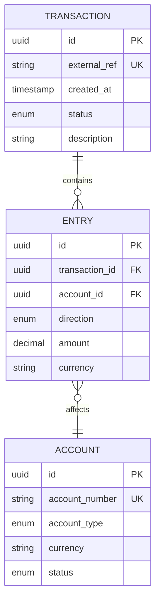

I stood there for a solid ten minutes, marker in hand, not knowing where to start.

My team needed to track money movement. Not just record transactions—we needed to validate them, reconcile them, and prove they actually happened the way we said they did. And if we got it wrong? Well, that's the kind of mistake that keeps people up at night.

The thing about financial systems is that they seem simple until they're not. A user sends money. You deduct from their account, add to someone else's. Easy, right? But then you need to handle failed transfers, partial settlements, multi-currency conversions, and that 2 AM page when the numbers don't add up.

This is the first chapter in a five-part series on building production-ready ledger systems. We'll start with the foundations: double-entry bookkeeping, data modeling, and transaction validation.

## The Simplest Version: Double-Entry Basics

At its core, every financial transaction follows one rule: **the books must balance**.

This isn't just accounting pedantry. It's how you catch bugs before they become incidents.

When money moves, it doesn't disappear—it transfers. Every transaction needs at least two entries:
- One account gets debited (money leaves)
- Another account gets credited (money arrives)
- The total always equals zero

```
Transfer $100 from Alice to Bob:
- Alice's Account: -$100 (debit)
- Bob's Account: +$100 (credit)
- Total: $0 ✓
```

This is double-entry bookkeeping, and it's been around since the 1400s because it works. When your system enforces this invariant, whole classes of bugs become impossible. You can't accidentally create money out of thin air. You can't lose track of a transfer. The math keeps you honest.

## Layer 1: The Data Model

Once you understand the principle, you need a schema that enforces it.

Here's the minimal viable model:



Key design decisions here:

**Transactions are immutable.** Once posted, they never change. If you need to reverse something, you create a new reversing transaction. This isn't just for audit trails—it eliminates an entire category of race conditions and sync issues.

**The external_ref is your friend.** It's an idempotency key. When a payment processor retries a webhook, or a user double-clicks the transfer button, you need to recognize: "I've seen this before." The external_ref lets you return the same result without double-spending.

**Entries don't exist without transactions.** An entry is always part of a transaction. This maintains your atomicity guarantee—either the whole transaction posts, or nothing does.

## Layer 2: Validation and Flow

Having the right schema is half the battle. You also need to validate before you commit.

Here's the validation flow:


The validation rules are straightforward but critical:

1. **Balance check**: Sum of all entries must equal zero
2. **Account validation**: All accounts must exist and be active  
3. **Currency consistency**: Either all entries in same currency, or explicit conversion recorded
4. **Funds availability**: For debit entries, verify sufficient balance
5. **Idempotency**: Check external_ref to prevent duplicates

Notice the order. You validate cheap things first (balance check is just math) before expensive things (database lookups for account validation). Fail fast.

### Real-World Rails Implementation

Let's build a concrete example: a payment processing system where users can transfer money between accounts. We'll implement the complete validation flow with proper error handling.

#### Step 1: Define Your Models

```ruby
# app/models/account.rb
class Account < ApplicationRecord
  has_many :ledger_entries
  has_many :ledger_transactions, through: :ledger_entries
  
  validates :account_number, presence: true, uniqueness: true
  validates :balance, numericality: { greater_than_or_equal_to: 0 }
  validates :currency, presence: true
  validates :status, inclusion: { in: %w[active suspended closed] }
  
  enum account_type: {
    asset: 'asset',
    liability: 'liability',
    equity: 'equity',
    income: 'income',
    expense: 'expense'
  }
  
  def sufficient_funds?(amount)
    balance >= amount
  end
end

# app/models/ledger_transaction.rb
class LedgerTransaction < ApplicationRecord
  has_many :ledger_entries, dependent: :destroy
  
  validates :external_ref, uniqueness: true, allow_nil: true
  validates :status, inclusion: { in: %w[pending validated reserved posted rejected reversed] }
  
  # Status transitions
  def valid_transitions
    {
      'pending' => %w[validated rejected],
      'validated' => %w[reserved rejected],
      'reserved' => %w[posted failed],
      'posted' => %w[reversed]
    }
  end
  
  def transition_to!(new_status)
    unless valid_transitions[status]&.include?(new_status)
      raise "Invalid transition from #{status} to #{new_status}"
    end
    update!(status: new_status)
  end
end

# app/models/ledger_entry.rb
class LedgerEntry < ApplicationRecord
  belongs_to :ledger_transaction
  belongs_to :account
  
  validates :direction, inclusion: { in: %w[debit credit] }
  validates :amount, numericality: { greater_than: 0 }
  validates :currency, presence: true
  
  # Helper methods for balance calculations
  def signed_amount
    direction == 'credit' ? amount : -amount
  end
end
```

#### Step 2: Create the Database Schema

```ruby
# db/migrate/xxx_create_ledger_tables.rb
class CreateLedgerTables < ActiveRecord::Migration[7.0]
  def change
    create_table :accounts do |t|
      t.string :account_number, null: false
      t.string :account_type, null: false
      t.string :currency, null: false
      t.decimal :balance, precision: 19, scale: 4, default: 0
      t.string :status, default: 'active'
      t.string :owner_type
      t.bigint :owner_id
      t.timestamps
      
      t.index :account_number, unique: true
      t.index [:owner_type, :owner_id]
      t.index [:status, :account_type]
    end
    
    create_table :ledger_transactions do |t|
      t.string :external_ref
      t.string :status, default: 'pending'
      t.string :description
      t.datetime :posted_at
      t.jsonb :metadata
      t.timestamps
      
      t.index :external_ref, unique: true
      t.index [:status, :posted_at]
    end
    
    create_table :ledger_entries do |t|
      t.references :ledger_transaction, null: false, foreign_key: true
      t.references :account, null: false, foreign_key: true
      t.string :direction, null: false
      t.decimal :amount, precision: 19, scale: 4, null: false
      t.string :currency, null: false
      t.text :description
      t.timestamps
      
      t.index [:account_id, :created_at], name: 'idx_entries_account_time'
      t.index [:ledger_transaction_id, :account_id]
    end
  end
end
```

#### Step 3: Build the Validation Service

```ruby
# app/services/ledger/transaction_validator.rb
module Ledger
  class TransactionValidator
    attr_reader :errors
    
    def initialize
      @errors = []
    end
    
    # Main validation method - follows the flow diagram
    def validate!(entries, external_ref: nil)
      @errors = []
      
      # Step 1: Validate structure
      validate_structure!(entries)
      
      # Step 2: Check entries balance to zero (cheap - just math)
      validate_balance!(entries)
      
      # Step 3: Validate accounts exist and are active (DB lookup)
      accounts = validate_accounts!(entries)
      
      # Step 4: Check currency consistency
      validate_currency!(entries, accounts)
      
      # Step 5: Check sufficient funds (DB lookup with lock)
      validate_funds!(entries, accounts)
      
      # Step 6: Check for duplicates (DB lookup)
      validate_idempotency!(external_ref)
      
      # Return validated accounts for later use
      accounts
    rescue ValidationError => e
      @errors << e.message
      raise
    end
    
    private
    
    def validate_structure!(entries)
      raise ValidationError, "Entries must be an array" unless entries.is_a?(Array)
      raise ValidationError, "Transaction must have at least 2 entries" if entries.size < 2
      
      entries.each_with_index do |entry, index|
        validate_entry_structure!(entry, index)
      end
    end
    
    def validate_entry_structure!(entry, index)
      unless entry[:account_id].present?
        raise ValidationError, "Entry #{index}: account_id is required"
      end
      
      unless %w[debit credit].include?(entry[:direction])
        raise ValidationError, "Entry #{index}: direction must be 'debit' or 'credit'"
      end
      
      unless entry[:amount].is_a?(Numeric) && entry[:amount] > 0
        raise ValidationError, "Entry #{index}: amount must be a positive number"
      end
      
      unless entry[:currency].present?
        raise ValidationError, "Entry #{index}: currency is required"
      end
    end
    
    def validate_balance!(entries)
      total = entries.sum do |entry|
        entry[:direction] == 'debit' ? entry[:amount] : -entry[:amount]
      end
      
      unless total.zero?
        raise ValidationError, "Transaction entries do not balance. Total: #{total}"
      end
    end
    
    def validate_accounts!(entries)
      account_ids = entries.map { |e| e[:account_id] }.uniq
      accounts = Account.where(id: account_ids).to_a
      
      # Check all accounts exist
      found_ids = accounts.map(&:id)
      missing_ids = account_ids - found_ids
      
      unless missing_ids.empty?
        raise ValidationError, "Accounts not found: #{missing_ids.join(', ')}"
      end
      
      # Check all accounts are active
      inactive = accounts.reject(&:active?)
      unless inactive.empty?
        raise ValidationError, "Inactive accounts: #{inactive.map(&:account_number).join(', ')}"
      end
      
      # Return as hash for easy lookup
      accounts.index_by(&:id)
    end
    
    def validate_currency!(entries, accounts)
      # Get unique currencies from entries
      entry_currencies = entries.map { |e| e[:currency] }.uniq
      
      # Check that account currencies match entry currencies
      entries.each do |entry|
        account = accounts[entry[:account_id]]
        
        unless account.currency == entry[:currency]
          raise ValidationError, 
            "Account #{account.account_number} currency (#{account.currency}) " \
            "does not match entry currency (#{entry[:currency]})"
        end
      end
      
      # For multi-currency transactions, you'd add additional validation here
      # For now, we require single currency per transaction
      if entry_currencies.size > 1
        raise ValidationError, "Multi-currency transactions require conversion entries"
      end
    end
    
    def validate_funds!(entries, accounts)
      entries.each do |entry|
        next unless entry[:direction] == 'debit'
        
        account = accounts[entry[:account_id]]
        
        # For asset accounts, check sufficient balance
        if account.asset? && !account.sufficient_funds?(entry[:amount])
          raise ValidationError, 
            "Insufficient funds in account #{account.account_number}. " \
            "Required: #{entry[:amount]}, Available: #{account.balance}"
        end
      end
    end
    
    def validate_idempotency!(external_ref)
      return if external_ref.blank?
      
      if LedgerTransaction.exists?(external_ref: external_ref)
        raise DuplicateTransactionError, 
          "Transaction with external_ref '#{external_ref}' already exists"
      end
    end
  end
  
  class ValidationError < StandardError; end
  class DuplicateTransactionError < StandardError; end
end
```

#### Step 4: Build the Transaction Service

```ruby
# app/services/ledger/transaction_service.rb
module Ledger
  class TransactionService
    def initialize
      @validator = TransactionValidator.new
    end
    
    # Main method to post a transaction
    def post_transaction(entries, external_ref: nil, description: nil, metadata: {})
      # Step 1: Validate (this will raise if invalid)
      accounts = @validator.validate!(entries, external_ref: external_ref)
      
      # Step 2: Execute within database transaction with locking
      ActiveRecord::Base.transaction do
        # Lock all affected accounts in consistent order (prevents deadlocks)
        locked_accounts = lock_accounts(accounts.values)
        
        # Re-validate funds after locking (balance may have changed)
        validate_funds_after_lock!(entries, locked_accounts)
        
        # Create the transaction
        txn = create_transaction!(external_ref, description, metadata)
        
        # Create entries and update balances
        create_entries!(txn, entries, locked_accounts)
        
        # Mark as posted
        txn.update!(status: 'posted', posted_at: Time.current)
        
        # Return the completed transaction
        txn
      end
    rescue DuplicateTransactionError => e
      # Return existing transaction instead of creating duplicate
      LedgerTransaction.find_by!(external_ref: external_ref)
    end
    
    private
    
    def lock_accounts(accounts)
      # Sort by ID to ensure consistent locking order
      sorted_ids = accounts.map(&:id).sort
      
      # Lock all accounts
      Account.where(id: sorted_ids)
             .order(:id)
             .lock
             .to_a
             .index_by(&:id)
    end
    
    def validate_funds_after_lock!(entries, locked_accounts)
      entries.each do |entry|
        next unless entry[:direction] == 'debit'
        
        account = locked_accounts[entry[:account_id]]
        
        if account.asset? && account.balance < entry[:amount]
          raise ValidationError, 
            "Insufficient funds after lock in account #{account.account_number}"
        end
      end
    end
    
    def create_transaction!(external_ref, description, metadata)
      LedgerTransaction.create!(
        external_ref: external_ref,
        description: description,
        status: 'validated',
        metadata: metadata
      )
    end
    
    def create_entries!(transaction, entries, accounts)
      entries.each do |entry_data|
        account = accounts[entry_data[:account_id]]
        
        # Create the ledger entry
        LedgerEntry.create!(
          ledger_transaction: transaction,
          account: account,
          direction: entry_data[:direction],
          amount: entry_data[:amount],
          currency: entry_data[:currency],
          description: entry_data[:description]
        )
        
        # Update account balance
        amount_change = entry_data[:direction] == 'credit' ? entry_data[:amount] : -entry_data[:amount]
        new_balance = account.balance + amount_change
        
        account.update!(balance: new_balance)
      end
    end
  end
end
```

#### Step 5: Usage Examples

```ruby
# Example 1: Simple transfer between user accounts
class PaymentsController < ApplicationController
  def transfer
    # Find accounts
    from_account = Account.find_by!(account_number: params[:from_account])
    to_account = Account.find_by!(account_number: params[:to_account])
    
    # Define entries
    entries = [
      {
        account_id: from_account.id,
        direction: 'debit',
        amount: params[:amount].to_d,
        currency: from_account.currency
      },
      {
        account_id: to_account.id,
        direction: 'credit',
        amount: params[:amount].to_d,
        currency: to_account.currency
      }
    ]
    
    # Generate idempotency key
    external_ref = "transfer:#{current_user.id}:#{params[:client_request_id]}"
    
    # Execute transaction
    service = Ledger::TransactionService.new
    transaction = service.post_transaction(
      entries,
      external_ref: external_ref,
      description: "Transfer from #{from_account.account_number} to #{to_account.account_number}",
      metadata: {
        initiated_by: current_user.id,
        ip_address: request.remote_ip
      }
    )
    
    render json: {
      transaction_id: transaction.id,
      status: transaction.status,
      posted_at: transaction.posted_at
    }
    
  rescue Ledger::ValidationError => e
    render json: { error: e.message }, status: 422
  rescue Ledger::DuplicateTransactionError
    # Return success - transaction already processed
    existing = LedgerTransaction.find_by(external_ref: external_ref)
    render json: {
      transaction_id: existing.id,
      status: existing.status,
      posted_at: existing.posted_at,
      message: "Transaction already processed"
    }
  end
end
```

### Key Takeaways

1. **Fail Fast**: Validate entries balance to zero before any database lookups. This catches 90% of bugs with zero DB queries.

2. **Lock Ordering**: Always acquire locks in consistent order (by account ID). This prevents deadlocks when two transactions affect overlapping accounts.

3. **Idempotency**: Use external_ref to prevent double-spending. Generate it from business context (user_id + request_id) so retries naturally deduplicate.

4. **Re-validate After Lock**: Account balances can change between validation and locking. Always check funds again after acquiring locks.

5. **Atomic Operations**: Database transactions ensure all-or-nothing. If entry creation fails, the entire transaction rolls back—no partial states.

---

**Next: [Chapter 2: Transaction Lifecycle →](/posts/ledger-system-chapter-2-lifecycle)**

In the next chapter, we'll explore transaction state management, async processing, and the complete lifecycle from pending to posted.
