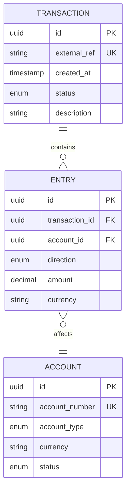
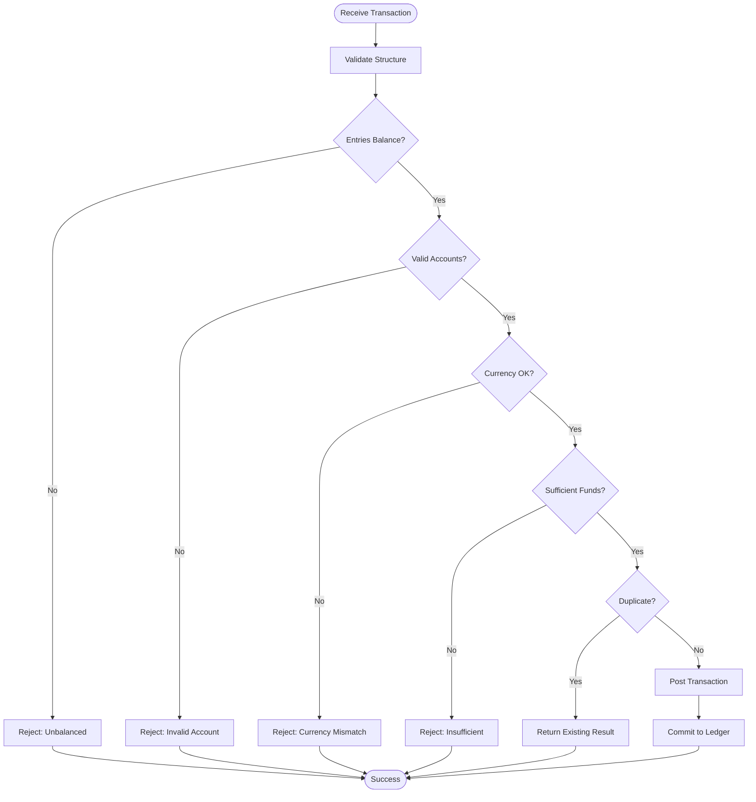
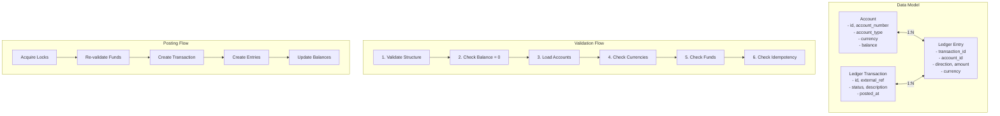

I stood there for a solid ten minutes, marker in hand, not knowing where to start.

My team needed to track money movement. Not just record transactions—we needed to validate them, reconcile them, and prove they actually happened the way we said they did. And if we got it wrong? Well, that's the kind of mistake that keeps people up at night.

The thing about financial systems is that they seem simple until they're not. A user sends money. You deduct from their account, add to someone else's. Easy, right? But then you need to handle failed transfers, partial settlements, multi-currency conversions, and that 2 AM page when the numbers don't add up.

This is the first chapter in a five-part series on building production-ready ledger systems. We'll start with the foundations: double-entry bookkeeping, data modeling, and transaction validation.

## The Simplest Version: Double-Entry Basics

At its core, every financial transaction follows one rule: **the books must balance**.

This isn't just accounting pedantry. It's how you catch bugs before they become incidents.

When money moves, it doesn't disappear—it transfers. Every transaction needs at least two entries:
- One account gets debited (money leaves)
- Another account gets credited (money arrives)
- The total always equals zero

```
Transfer $100 from Alice to Bob:
- Alice's Account: -$100 (debit)
- Bob's Account: +$100 (credit)
- Total: $0 ✓
```

This is double-entry bookkeeping, and it's been around since the 1400s because it works. When your system enforces this invariant, whole classes of bugs become impossible. You can't accidentally create money out of thin air. You can't lose track of a transfer. The math keeps you honest.

## Layer 1: The Data Model

Once you understand the principle, you need a schema that enforces it.

Here's the minimal viable model:



Key design decisions here:

**Transactions are immutable.** Once posted, they never change. If you need to reverse something, you create a new reversing transaction. This isn't just for audit trails—it eliminates an entire category of race conditions and sync issues.

**The external_ref is your friend.** It's an idempotency key. When a payment processor retries a webhook, or a user double-clicks the transfer button, you need to recognize: "I've seen this before." The external_ref lets you return the same result without double-spending.

**Entries don't exist without transactions.** An entry is always part of a transaction. This maintains your atomicity guarantee—either the whole transaction posts, or nothing does.

## Layer 2: Validation and Flow

Having the right schema is half the battle. You also need to validate before you commit.

Here's the validation flow:



The validation rules are straightforward but critical:

1. **Balance check**: Sum of all entries must equal zero
2. **Account validation**: All accounts must exist and be active  
3. **Currency consistency**: Either all entries in same currency, or explicit conversion recorded
4. **Funds availability**: For debit entries, verify sufficient balance
5. **Idempotency**: Check external_ref to prevent duplicates

Notice the order. You validate cheap things first (balance check is just math) before expensive things (database lookups for account validation). Fail fast.

### Implementation Overview

Let's walk through how to build a double-entry ledger system. Here's the architecture:



#### Data Model (Pseudocode)

```
// Accounts table
Table Account {
  id: UUID PK
  account_number: String UNIQUE
  account_type: Enum [asset, liability, equity, income, expense]
  currency: String
  balance: Decimal(19,4)
  status: Enum [active, suspended, closed]
  owner_type: String  // Polymorphic reference
  owner_id: UUID
}

// Transactions table  
Table LedgerTransaction {
  id: UUID PK
  external_ref: String UNIQUE  // Idempotency key
  status: Enum [pending, validated, reserved, posted, rejected, reversed]
  description: Text
  posted_at: Timestamp
  metadata: JSON
}

// Entries table - the double entries
Table LedgerEntry {
  id: UUID PK
  transaction_id: UUID FK -> LedgerTransaction
  account_id: UUID FK -> Account
  direction: Enum [debit, credit]
  amount: Decimal(19,4)
  currency: String
  description: Text
  created_at: Timestamp
  
  // Indexes for performance
  INDEX: (account_id, created_at)
  INDEX: (transaction_id, account_id)
}
```

#### Validation Algorithm

```pseudocode
function validateTransaction(entries, externalRef):
  // Step 1: Structure validation
  if entries.length < 2:
    throw ValidationError("Need at least 2 entries")
  
  for entry in entries:
    if entry.amount <= 0:
      throw ValidationError("Amount must be positive")
    if entry.direction not in ["debit", "credit"]:
      throw ValidationError("Invalid direction")
  
  // Step 2: Balance check (cheap - just math)
  total = 0
  for entry in entries:
    total += entry.direction == "debit" ? entry.amount : -entry.amount
  
  if total != 0:
    throw ValidationError("Entries must balance to zero")
  
  // Step 3: Load and validate accounts
  accountIds = entries.map(e => e.account_id).unique()
  accounts = loadAccounts(accountIds)  // DB query
  
  if accounts.length != accountIds.length:
    throw ValidationError("Some accounts not found")
  
  for account in accounts:
    if account.status != "active":
      throw ValidationError("Account #{account.id} is not active")
  
  // Step 4: Currency validation
  for entry in entries:
    account = accounts.find(a => a.id == entry.account_id)
    if account.currency != entry.currency:
      throw ValidationError("Currency mismatch")
  
  // Step 5: Funds check
  for entry in entries:
    if entry.direction == "debit":
      account = accounts.find(a => a.id == entry.account_id)
      if account.account_type == "asset" and account.balance < entry.amount:
        throw ValidationError("Insufficient funds")
  
  // Step 6: Idempotency check
  if externalRef and transactionExists(externalRef):
    throw DuplicateError("Transaction already exists")
  
  return accounts
```

#### Posting Algorithm

```pseudocode
function postTransaction(entries, externalRef, description, metadata):
  // First, validate everything
  accounts = validateTransaction(entries, externalRef)
  
  // Start database transaction
  begin DBTransaction:
    // Lock accounts in consistent order (prevents deadlocks)
    sortedAccountIds = accounts.map(a => a.id).sort()
    lockedAccounts = acquireLocks(sortedAccountIds)
    
    // Re-validate funds after locking
    for entry in entries:
      if entry.direction == "debit":
        account = lockedAccounts.find(a => a.id == entry.account_id)
        if account.account_type == "asset" and account.balance < entry.amount:
          throw ValidationError("Insufficient funds after lock")
    
    // Create the transaction record
    txn = createTransaction({
      external_ref: externalRef,
      description: description,
      status: "validated",
      metadata: metadata
    })
    
    // Create ledger entries and update balances
    for entry in entries:
      account = lockedAccounts.find(a => a.id == entry.account_id)
      
      createLedgerEntry({
        transaction_id: txn.id,
        account_id: account.id,
        direction: entry.direction,
        amount: entry.amount,
        currency: entry.currency
      })
      
      // Update account balance
      if entry.direction == "credit":
        account.balance += entry.amount
      else:
        account.balance -= entry.amount
      
      updateAccountBalance(account)
    
    // Mark transaction as posted
    txn.status = "posted"
    txn.posted_at = now()
    updateTransaction(txn)
    
    commit DBTransaction
    return txn
    
  catch DuplicateError:
    // Transaction already exists, return the existing one
    return findTransactionByExternalRef(externalRef)
```

#### Example: Transfer Between Accounts

```pseudocode
function transfer(fromAccountNumber, toAccountNumber, amount, clientRequestId):
  // Load accounts
  fromAccount = findAccountByNumber(fromAccountNumber)
  toAccount = findAccountByNumber(toAccountNumber)
  
  // Define the double entries
  entries = [
    {
      account_id: fromAccount.id,
      direction: "debit",
      amount: amount,
      currency: fromAccount.currency
    },
    {
      account_id: toAccount.id,
      direction: "credit", 
      amount: amount,
      currency: toAccount.currency
    }
  ]
  
  // Generate idempotency key from business context
  externalRef = "transfer:" + currentUser.id + ":" + clientRequestId
  
  // Execute the transaction
  txn = postTransaction(
    entries = entries,
    externalRef = externalRef,
    description = "Transfer from " + fromAccountNumber + " to " + toAccountNumber,
    metadata = {
      initiated_by: currentUser.id,
      ip_address: request.ip
    }
  )
  
  return {
    transaction_id: txn.id,
    status: txn.status,
    posted_at: txn.posted_at
  }
```

### Key Takeaways

1. **Fail Fast**: Validate entries balance to zero before any database lookups. This catches 90% of bugs with zero DB queries.

2. **Lock Ordering**: Always acquire locks in consistent order (by account ID). This prevents deadlocks when two transactions affect overlapping accounts.

3. **Idempotency**: Use external_ref to prevent double-spending. Generate it from business context (user_id + request_id) so retries naturally deduplicate.

4. **Re-validate After Lock**: Account balances can change between validation and locking. Always check funds again after acquiring locks.

5. **Atomic Operations**: Database transactions ensure all-or-nothing. If entry creation fails, the entire transaction rolls back—no partial states.

---

**Next: [Chapter 2: Transaction Lifecycle →](/posts/ledger-system-chapter-2-lifecycle)**

In the next chapter, we'll explore transaction state management, async processing, and the complete lifecycle from pending to posted.
