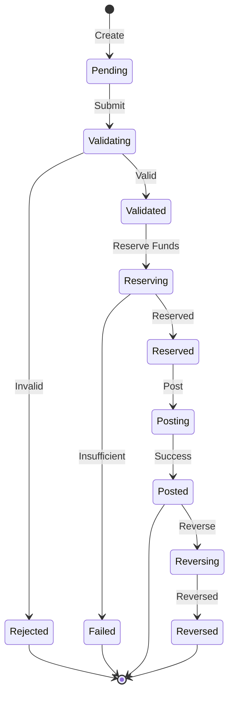
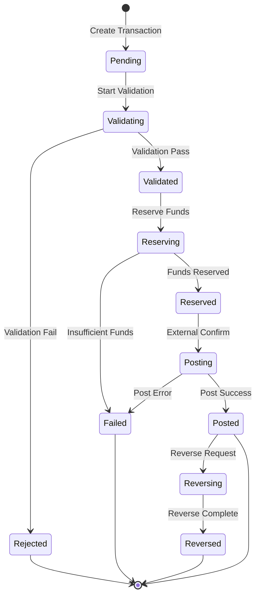
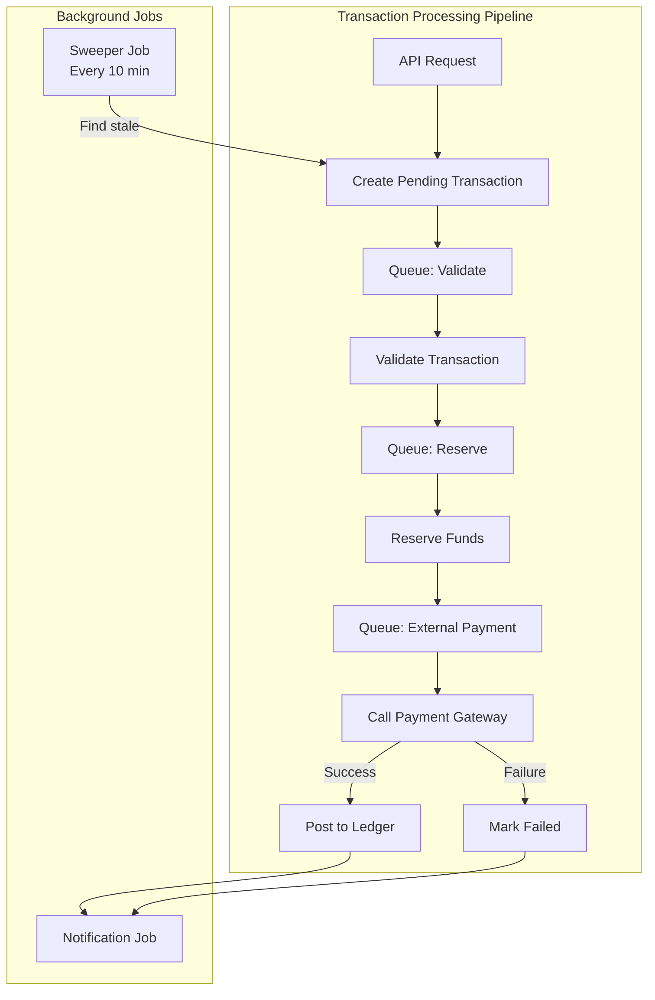
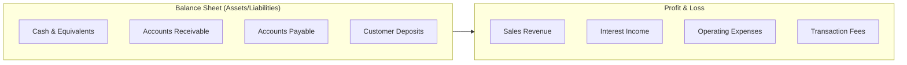
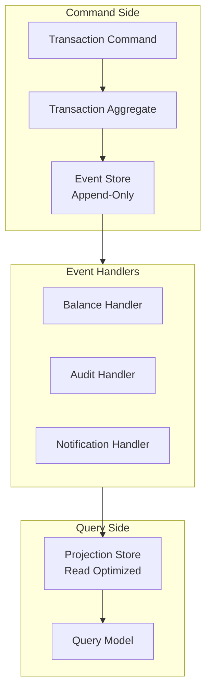

This is the second chapter in our five-part series on building production-ready ledger systems. In [Chapter 1](/posts/ledger-system-chapter-1-foundations), we covered double-entry bookkeeping, data modeling, and transaction validation. Now we'll explore transaction state management and async processing.

## Layer 3: Transaction Lifecycle

Real-world transactions aren't instantaneous. They go through states:



The **Pending → Validated → Reserved → Posted** flow matters because:

- **Pending**: Initial creation, no validation yet
- **Validated**: Passed all business rules, but not committed
- **Reserved**: Funds are held (prevents overspending)
- **Posted**: Permanently recorded in the ledger
- **Reversed**: Correction transaction created (never delete)

This state machine lets you handle async operations. When you call a payment processor, the transaction might sit in "Reserved" for seconds (or hours) while waiting for confirmation. Your ledger needs to handle that gracefully.

### Implementation Overview

Here's how to implement transaction lifecycle management with state machines and async processing.

#### State Machine Architecture



##### State Transition Rules

```pseudocode
// Define valid transitions as a state machine map
VALID_TRANSITIONS = {
  "pending":    ["validated", "rejected"],
  "validated":  ["reserved", "rejected"],
  "reserved":   ["posted", "failed"],
  "posted":     ["reversed"],
  "rejected":   [],
  "failed":     [],
  "reversed":   []
}

function canTransition(currentStatus, newStatus):
  allowed = VALID_TRANSITIONS[currentStatus]
  return newStatus in allowed

function transition(transaction, newStatus, metadata):
  if not canTransition(transaction.status, newStatus):
    throw InvalidTransitionError(
      "Cannot transition from ${transaction.status} to ${newStatus}"
    )
  
  oldStatus = transaction.status
  
  within DBTransaction:
    // Update transaction status
    transaction.status = newStatus
    transaction.status_changed_at = now()
    transaction.metadata = merge(transaction.metadata, metadata)
    updateTransaction(transaction)
    
    // Log the transition for audit trail
    createStateTransition({
      transaction_id: transaction.id,
      from_status: oldStatus,
      to_status: newStatus,
      metadata: metadata,
      created_at: now()
    })
  
  // Trigger side effects after commit
  triggerSideEffects(newStatus, transaction)
  
  return transaction

function triggerSideEffects(newStatus, transaction):
  switch newStatus:
    case "posted":
      publishEvent("transaction.posted", transaction)
      break
    case "failed":
    case "rejected":
      publishEvent("transaction.failed", transaction)
      break
    case "reserved":
      // Queue external payment call
      enqueueJob("process_payment", transaction.id)
      break
```

##### State Transition Audit Table

```
Table StateTransition {
  id: UUID PK
  transaction_id: UUID FK -> LedgerTransaction
  from_status: String
  to_status: String
  metadata: JSON
  created_at: Timestamp
  
  INDEX: (transaction_id, created_at)
}
```

#### Step 2: Transaction Lifecycle Service

```pseudocode
// Transaction Lifecycle Service
// Orchestrates transactions through the state machine

function processTransaction(transaction):
  log("Processing transaction ${transaction.id}, current state: ${transaction.status}")
  
  switch transaction.status:
    case "pending":
      return validateTransaction(transaction)
    case "validated":
      return reserveFunds(transaction)
    case "reserved":
      return postToLedger(transaction)
    default:
      log("Transaction ${transaction.id} in unexpected state: ${transaction.status}")
      return { success: false, error: "Unexpected state" }
  
  catch error:
    log("Error processing transaction ${transaction.id}: ${error.message}")
    return handleProcessingError(transaction, error)

// Step 1: Validate the transaction
function validateTransaction(transaction):
  log("Validating transaction ${transaction.id}")
  
  try:
    // Extract entries from transaction
    entries = transaction.entries.map(e => ({
      account_id: e.account_id,
      direction: e.direction,
      amount: e.amount,
      currency: e.currency
    }))
    
    // Run validation (from Chapter 1)
    accounts = validateTransaction(entries, transaction.external_ref)
    
    // Transition to validated state
    transition(transaction, "validated", { validated_at: now() })
    
    // Queue next step (reservation)
    enqueueJob("reserve_funds", transaction.id)
    
    return { success: true, status: "validated" }
    
  catch ValidationError:
    log("Validation failed: ${error.message}")
    transition(transaction, "rejected", { rejection_reason: error.message })
    notifyUser(transaction, "validation_failed")
    return { success: false, error: error.message }

// Step 2: Reserve funds (hold the money)
function reserveFunds(transaction):
  log("Reserving funds for transaction ${transaction.id}")
  
  within DBTransaction:
    // Lock all accounts involved (sorted to prevent deadlocks)
    accountIds = transaction.entries
      .map(e => e.account_id)
      .sort()
    
    accounts = acquireLocks(accountIds)
    accountsById = indexBy(accounts, "id")
    
    // Verify funds still available after lock
    for entry in transaction.entries:
      if entry.direction == "debit":
        account = accountsById[entry.account_id]
        if account.balance < entry.amount:
          throw InsufficientFundsError(
            "Insufficient funds in account ${account.account_number}"
          )
    
    // Create reservations - decrement available_balance
    // but keep balance unchanged until posting
    for entry in transaction.entries:
      if entry.direction == "debit":
        account = accountsById[entry.account_id]
        account.available_balance -= entry.amount
        updateAccount(account)
    
    // Mark transaction as reserved
    transition(transaction, "reserved", { reserved_at: now() })
  
  // Queue external payment processing
  enqueueJob("process_payment", transaction.id)
  
  return { success: true, status: "reserved" }
  
  catch InsufficientFundsError:
    log("Reservation failed: ${error.message}")
    transition(transaction, "failed", { failure_reason: error.message })
    return { success: false, error: error.message }
          
          Reservation.create!(
            account: account,
            ledger_transaction: @transaction,
            amount: entry.amount,
            expires_at: 30.minutes.from_now
          )
          
          # Decrement available balance
          account.update!(
            available_balance: account.available_balance - entry.amount
          )
        end
        
        @transaction.transition_to!('reserved', reserved_at: Time.current)
      end
      
      # Call payment processor
      process_with_payment_gateway
      
      { success: true, status: 'reserved' }
      
    rescue InsufficientFundsError => e
      Rails.logger.error "Insufficient funds for transaction #{@transaction.id}"
      @transaction.transition_to!('failed', failure_reason: e.message)
      
      # Release any partial reservations
      release_reservations
      
      { success: false, error: e.message }
    end
    
    # Step 3: Post to ledger (commit the transaction)
    def post_to_ledger
      Rails.logger.info "Posting transaction #{@transaction.id} to ledger"
      
      ActiveRecord::Base.transaction do
        # Get reservations
        reservations = Reservation.where(ledger_transaction: @transaction)
        
        # Update actual balances
        @transaction.ledger_entries.each do |entry|
          account = entry.account
          
          if entry.direction == 'debit'
            # Debit: subtract from balance
            account.update!(
              balance: account.balance - entry.amount,
              available_balance: account.available_balance
            )
          else
            # Credit: add to balance
            account.update!(
              balance: account.balance + entry.amount,
              available_balance: account.available_balance + entry.amount
            )
          end
        end
        
        # Clear reservations
        reservations.destroy_all
        
        # Mark as posted
        @transaction.transition_to!('posted', posted_at: Time.current)
        
        # Update reconciliation status
        @transaction.update!(reconciliation_status: 'unreconciled')
      end
      
      # Send success notification
      TransactionSuccessMailer.payment_completed(@transaction).deliver_later
      
      { success: true, status: 'posted' }
    end
    
    # Reverse a posted transaction (for refunds/chargebacks)
    def reverse_transaction(reason: nil)
      raise "Cannot reverse transaction in state: #{@transaction.status}" unless @transaction.posted?
      
      Rails.logger.info "Reversing transaction #{@transaction.id}"
      
      ActiveRecord::Base.transaction do
        # Create reversing entries
        reversing_entries = @transaction.ledger_entries.map do |entry|
          {
            account_id: entry.account_id,
            direction: entry.direction == 'debit' ? 'credit' : 'debit',
            amount: entry.amount,
            currency: entry.currency,
            description: "Reversal of transaction #{@transaction.id}"
          }
        end
        
        # Create new reversing transaction
        reversal = LedgerTransaction.create!(
          external_ref: "reversal:#{@transaction.external_ref}",
          status: 'pending',
          description: "Reversal: #{@transaction.description}",
          metadata: { original_transaction_id: @transaction.id, reversal_reason: reason }
        )
        
        # Post the reversal immediately (it goes through same validation)
        service = TransactionService.new
        service.post_transaction(
          reversing_entries,
          external_ref: reversal.external_ref
        )
        
        # Mark original as reversed
        @transaction.transition_to!('reversed', 
          reversed_at: Time.current,
          reversal_transaction_id: reversal.id,
          reversal_reason: reason
        )
      end
      
      { success: true, reversal_transaction_id: reversal.id }
    end
    
    # Handle async payment gateway processing
    def process_with_payment_gateway
      # This runs the Stripe charge asynchronously
      PaymentGatewayJob.perform_later(@transaction.id)
    end
    
    # Handle processing errors
    def handle_processing_error(error)
      # Don't change state if already terminal
      return if @transaction.terminal_state?
      
      # Transition to failed
      @transaction.transition_to!('failed', 
        failure_reason: error.message,
        error_class: error.class.name
      )
      
      # Release any held reservations
      release_reservations
      
      # Alert team for investigation
      ErrorNotifier.notify(error, transaction: @transaction)
    end
    
    private
    
    def release_reservations
      Reservation.where(ledger_transaction: @transaction).each do |reservation|
        account = reservation.account
        account.available_balance += reservation.amount
        updateAccount(account)
        deleteReservation(reservation)
      end
    end
  end
end

// Reservation Model Schema
Table Reservation {
  id: UUID PK
  account_id: UUID FK -> Account
  transaction_id: UUID FK -> LedgerTransaction
  amount: Decimal(15,2)
  expires_at: Timestamp
  created_at: Timestamp
  
  INDEX: (account_id, expires_at)
  INDEX: (transaction_id)
}
```

#### Step 3: Async Processing Architecture



```pseudocode
// Job Queue Definitions
enum JobType {
  PROCESS_TRANSACTION,      // Process through lifecycle
  PROCESS_PAYMENT_GATEWAY,  // External payment call
  SWEEP_STALE_TRANSACTIONS, // Cleanup job
  SEND_NOTIFICATION
}

// Process Transaction Job
function processTransactionJob(transactionId):
  transaction = loadTransaction(transactionId)
  
  // Skip if already in terminal state
  if isTerminalState(transaction.status):
    log("Skipping - already completed")
    return
  
  try:
    processTransaction(transaction)
  catch ValidationError:
    // Don't retry validation errors - they won't succeed
    log("Validation failed, not retrying")
    discardJob()
  catch TransientError:
    // Retry with exponential backoff
    retryJob(attempts: 5, backoff: exponential)

// Payment Gateway Job
function paymentGatewayJob(transactionId):
  transaction = loadTransaction(transactionId)
  
  // Only process if in reserved state
  if transaction.status != "reserved":
    return
  
  try:
    // Call external payment processor
    result = callPaymentGateway({
      amount: transaction.amount,
      currency: transaction.currency,
      token: transaction.metadata.payment_token,
      reference: transaction.external_ref
    })
    
    if result.status == "succeeded":
      postToLedger(transaction)
    else:
      transition(transaction, "failed", {
        failure_reason: result.failure_message
      })
      notifyUser(transaction, "payment_failed")
      
  catch CardDeclinedError:
    transition(transaction, "failed", {
      failure_reason: "Card declined"
    })
    notifyUser(transaction, "card_declined")
  catch PaymentGatewayError:
    // Retry for gateway issues
    retryJob(attempts: 10, wait: 5.minutes)

// Stale Transaction Sweeper
function staleTransactionSweeper(olderThan: 1.hour):
  // Find stale pending transactions
  stalePending = findTransactions({
    status: "pending",
    updated_at: < now() - olderThan
  })
  
  for txn in stalePending:
    log("Auto-rejecting stale pending: ${txn.id}")
    transition(txn, "rejected", {
      rejection_reason: "Transaction timed out"
    })
  
  // Find stale reserved transactions
  staleReserved = findTransactions({
    status: "reserved",
    updated_at: < now() - olderThan
  })
  
  for txn in staleReserved:
    log("Auto-failing stale reserved: ${txn.id}")
    handleProcessingError(txn, "Reservation expired")
  
  // Clean up expired reservations
  expiredReservations = findReservations({
    expires_at: < now()
  })
  
  for reservation in expiredReservations:
    account = loadAccount(reservation.account_id)
    account.available_balance += reservation.amount
    updateAccount(account)
    deleteReservation(reservation)
  
  log("Sweeper: ${stalePending.count} pending, ${staleReserved.count} reserved, ${expiredReservations.count} reservations cleaned")
```

#### Step 4: Usage Examples

```pseudocode
// Example 1: Creating and processing a payment
function createPayment(userId, accountId, amount, orderId, paymentToken):
  // Create transaction in pending state
  externalRef = "payment:${userId}:${generateId()}"
  
  transaction = createTransaction({
    external_ref: externalRef,
    status: "pending",
    description: "Payment for order ${orderId}",
    metadata: {
      payment_token: paymentToken,
      order_id: orderId,
      user_id: userId
    }
  })
  
  // Get accounts
  debitAccount = loadAccount(accountId)
  creditAccount = findAccountByNumber("revenue_sales")
  
  // Create double entries
  createLedgerEntry({
    transaction_id: transaction.id,
    account_id: debitAccount.id,
    direction: "debit",
    amount: amount,
    currency: "USD"
  })
  
  createLedgerEntry({
    transaction_id: transaction.id,
    account_id: creditAccount.id,
    direction: "credit",
    amount: amount,
    currency: "USD"
  })
  
  // Queue for processing
  enqueueJob(PROCESS_TRANSACTION, transaction.id)
  
  return {
    transaction_id: transaction.id,
    status: transaction.status,
    message: "Payment processing initiated"
  }

// Example 2: Get transaction status
function getTransactionStatus(transactionId):
  transaction = loadTransaction(transactionId)
  entries = loadEntriesForTransaction(transactionId)
  
  return {
    id: transaction.id,
    status: transaction.status,
    status_changed_at: transaction.status_changed_at,
    can_reverse: transaction.status == "posted",
    entries: entries.map(e => ({
      account: e.account.account_number,
      direction: e.direction,
      amount: e.amount
    }))
  }

// Example 3: Reverse a transaction
function reverseTransaction(transactionId, reason):
  transaction = loadTransaction(transactionId)
  
  if transaction.status != "posted":
    throw Error("Can only reverse posted transactions")
  
  service = new TransactionLifecycleService()
  result = service.reverseTransaction(transaction, reason)
  
  if result.success:
    return {
      message: "Transaction reversed successfully",
      reversal_transaction_id: result.reversal_transaction_id
    }
  else:
    throw Error(result.error)

// Example 4: Query status summary
function getStatusSummary(userId, startDate, endDate):
  transactions = findTransactions({
    "entries.account.owner_id": userId,
    created_at: [startDate, endDate]
  })
  
  byStatus = groupBy(transactions, "status")
  
  return {
    total: transactions.count,
    by_status: byStatus,
    pending: count(byStatus["pending"]),
    in_progress: count(byStatus["validated"]) + count(byStatus["reserved"]),
    completed: count(byStatus["posted"]),
    failed: count(byStatus["rejected"]) + count(byStatus["failed"]),
    reserved_amount: sum(
      where(transactions, { status: "reserved" }),
      "amount"
    )
  }

// Example 5: Webhook handler
function handlePaymentWebhook(event):
  // Verify webhook signature
  if not verifyWebhookSignature(event):
    return { status: "error", message: "Invalid signature" }
  
  switch event.type:
    case "charge.succeeded":
      return handleChargeSucceeded(event.data)
    case "charge.failed":
      return handleChargeFailed(event.data)
    case "charge.refunded":
      return handleChargeRefunded(event.data)
    default:
      return { status: "ok" }

function handleChargeSucceeded(charge):
  transaction = findTransactionByExternalRef(charge.id)
  if not transaction or transaction.status != "reserved":
    return { status: "ok" }
  
  postToLedger(transaction)
  return { status: "ok" }

function handleChargeFailed(charge):
  transaction = findTransactionByExternalRef(charge.id)
  if not transaction or isTerminalState(transaction.status):
    return { status: "ok" }
  
  transition(transaction, "failed", {
    failure_reason: "Gateway: ${charge.failure_message}"
  })
  return { status: "ok" }

function handleChargeRefunded(charge):
  transaction = findTransactionByExternalRef(charge.id)
  if not transaction or transaction.status != "posted":
    return { status: "ok" }
  
  service = new TransactionLifecycleService()
  service.reverseTransaction(transaction, "Refund initiated")
  return { status: "ok" }
```

#### Step 5: Scheduled Maintenance

```pseudocode
// Scheduled Job: Run every 10 minutes
function scheduleStaleTransactionSweep():
  // Configuration
  schedule = {
    interval: "10 minutes",
    task: sweepStaleTransactions,
    max_runtime: "5 minutes"
  }

function sweepStaleTransactions():
  staleTransactionSweeper(olderThan: 1.hour)

// Report stuck transactions
function reportStuckTransactions(olderThan: 30.minutes):
  stuck = findTransactions({
    status: ["pending", "validated", "reserved"],
    updated_at: < now() - olderThan
  })
  
  if stuck.count > 0:
    log("Found ${stuck.count} stuck transactions:")
    for txn in stuck:
      log("  - Transaction ${txn.id}: ${txn.status}")
    
    // Send alert
    sendAlert("${stuck.count} transactions stuck >30 minutes", channel: "#payments-alerts")
  else:
    log("No stuck transactions found")
```

### Key Takeaways

1. **State Machine Enforcement**: Use a hash to define valid transitions. Never allow invalid state changes.

2. **Reservation Pattern**: Hold funds by decrementing `available_balance` while keeping `balance` unchanged. This prevents overspending without posting.

3. **Async by Default**: Every state transition that involves external systems (payment gateways) should be async. Use jobs and webhooks.

4. **Sweeper Jobs**: Transactions can get stuck. Schedule jobs to auto-reject stale pending transactions and fail stale reserved ones.

5. **Reversals Are New Transactions**: Never delete or modify posted transactions. Create a reversal transaction that goes through the same lifecycle.

6. **Audit Everything**: Log every state transition with timestamps. You'll need this for debugging and compliance.

## Layer 4: Account Structure

Not all accounts are created equal. You need a chart of accounts that reflects your business:



**Balance sheet accounts** track what you own (assets) and owe (liabilities). Their balance carries forward indefinitely.

**P&L accounts** track income and expenses. They reset to zero at period boundaries (monthly, yearly), and their net flows become retained earnings.

When a customer deposits money:
- Debit: Customer Deposits (liability increases—you owe them money)
- Credit: Cash (asset increases—you received money)

When you charge a fee:
- Debit: Customer Deposits (reduce their balance)
- Credit: Fee Revenue (P&L income)

The distinction matters for reconciliation and reporting. Balance sheet accounts reconcile to bank statements. P&L accounts track profitability.

## The Full Picture: Event Sourcing

For a production system, I recommend event sourcing. Instead of storing current state, store every change:



Here's why this works:

**The event store is your source of truth.** Every transaction, every entry, every state change becomes an immutable event. You can replay the entire history to reconstruct any state.

**Projections are disposable.** Your read models (current balances, transaction lists, audit reports) are built from events. If you need a new view, build a new projection. The events don't change.

**Audit is free.** Every change is recorded with timestamps, user IDs, and context. Regulators love this. Future-you debugging at 2 AM loves this.

**Consistency where it matters.** The event store is append-only and ordered. You get strong consistency on writes. Projections can be eventually consistent on reads. This is the right trade-off for most fintech workloads.


---

**Next: [Chapter 3: Advanced Topics →](/posts/ledger-system-chapter-3-advanced)**

In the next chapter, we'll explore multi-currency handling, reconciliation systems, and database locking strategies.
