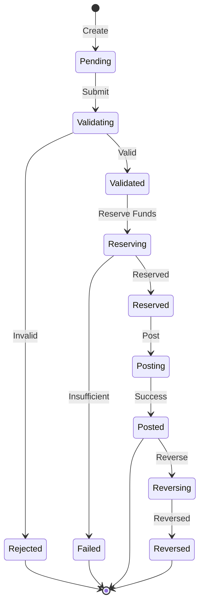
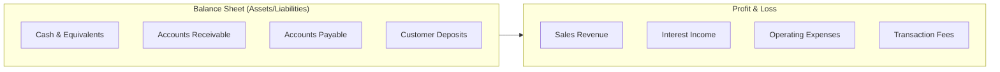
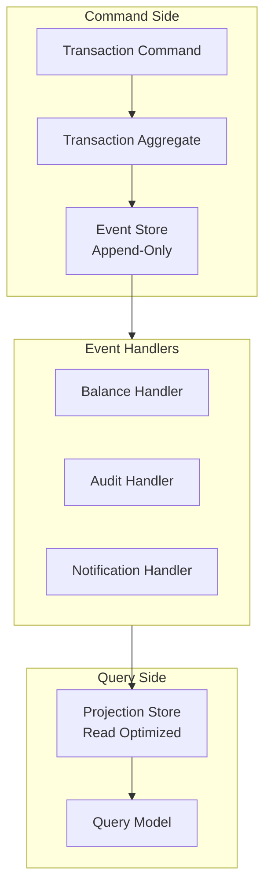

This is the second chapter in our five-part series on building production-ready ledger systems. In [Chapter 1](/posts/ledger-system-chapter-1-foundations), we covered double-entry bookkeeping, data modeling, and transaction validation. Now we'll explore transaction state management and async processing.

## Layer 3: Transaction Lifecycle

Real-world transactions aren't instantaneous. They go through states:



The **Pending → Validated → Reserved → Posted** flow matters because:

- **Pending**: Initial creation, no validation yet
- **Validated**: Passed all business rules, but not committed
- **Reserved**: Funds are held (prevents overspending)
- **Posted**: Permanently recorded in the ledger
- **Reversed**: Correction transaction created (never delete)

This state machine lets you handle async operations. When you call a payment processor, the transaction might sit in "Reserved" for seconds (or hours) while waiting for confirmation. Your ledger needs to handle that gracefully.

### Real-World Rails Implementation

Here's a complete implementation of the transaction lifecycle using Rails and Sidekiq for async processing. This example handles payments through Stripe.

#### Step 1: Enhanced Transaction Model with State Machine

```ruby
# app/models/ledger_transaction.rb
class LedgerTransaction < ApplicationRecord
  has_many :ledger_entries, dependent: :destroy
  has_many :accounts, through: :ledger_entries
  
  validates :external_ref, uniqueness: true, allow_nil: true
  validates :status, inclusion: { in: %w[pending validated reserved posted rejected reversed failed] }
  
  # State transitions - defines valid paths
  VALID_TRANSITIONS = {
    'pending' => %w[validated rejected],
    'validated' => %w[reserved rejected],
    'reserved' => %w[posted failed],
    'posted' => %w[reversed],
    'rejected' => [],
    'failed' => [],
    'reversed' => []
  }.freeze
  
  # Scope for finding stale transactions
  scope :stale, ->(older_than: 1.hour) { where('updated_at < ?', older_than.ago) }
  scope :in_progress, -> { where(status: %w[pending validated reserved]) }
  scope :completed, -> { where(status: %w[posted rejected reversed]) }
  
  # Transition to new state with validation
  def transition_to!(new_status, metadata = {})
    unless can_transition_to?(new_status)
      raise InvalidStateTransition, "Cannot transition from #{status} to #{new_status}"
    end
    
    old_status = status
    
    ActiveRecord::Base.transaction do
      update!(
        status: new_status,
        status_changed_at: Time.current,
        metadata: (self.metadata || {}).merge(metadata)
      )
      
      # Log the transition
      StateTransition.create!(
        ledger_transaction: self,
        from_status: old_status,
        to_status: new_status,
        metadata: metadata
      )
    end
    
    # Trigger side effects based on new state
    trigger_state_side_effects(new_status, old_status)
  end
  
  def can_transition_to?(new_status)
    VALID_TRANSITIONS[status]&.include?(new_status)
  end
  
  def terminal_state?
    %w[posted rejected reversed failed].include?(status)
  end
  
  def in_progress?
    %w[pending validated reserved].include?(status)
  end
  
  private
  
  def trigger_state_side_effects(new_status, old_status)
    case new_status
    when 'posted'
      LedgerTransactionPostedEvent.publish(self)
    when 'failed', 'rejected'
      LedgerTransactionFailedEvent.publish(self)
    end
  end
end

# Migration for state transitions audit trail
class CreateStateTransitions < ActiveRecord::Migration[7.0]
  def change
    create_table :state_transitions do |t|
      t.references :ledger_transaction, null: false, foreign_key: true
      t.string :from_status, null: false
      t.string :to_status, null: false
      t.jsonb :metadata
      t.timestamps
      
      t.index [:ledger_transaction_id, :created_at]
    end
    
    add_column :ledger_transactions, :status_changed_at, :datetime
    add_index :ledger_transactions, [:status, :status_changed_at]
  end
end
```

#### Step 2: Transaction Lifecycle Service

```ruby
# app/services/ledger/transaction_lifecycle_service.rb
module Ledger
  class TransactionLifecycleService
    def initialize(transaction)
      @transaction = transaction
      @stripe = Stripe::Client.new
    end
    
    # Main entry point - processes transaction through lifecycle
    def process
      Rails.logger.info "Processing transaction #{@transaction.id} (current state: #{@transaction.status})"
      
      case @transaction.status
      when 'pending'
        validate_transaction
      when 'validated'
        reserve_funds
      when 'reserved'
        post_to_ledger
      else
        Rails.logger.warn "Transaction #{@transaction.id} in unexpected state: #{@transaction.status}"
      end
    rescue StandardError => e
      Rails.logger.error "Error processing transaction #{@transaction.id}: #{e.message}"
      handle_processing_error(e)
    end
    
    # Step 1: Validate the transaction
    def validate_transaction
      Rails.logger.info "Validating transaction #{@transaction.id}"
      
      validator = TransactionValidator.new
      accounts = validator.validate!(
        @transaction.ledger_entries.map { |e| 
          { 
            account_id: e.account_id, 
            direction: e.direction, 
            amount: e.amount, 
            currency: e.currency 
          } 
        },
        external_ref: @transaction.external_ref
      )
      
      @transaction.transition_to!('validated', validated_at: Time.current)
      
      # Queue next step
      ProcessTransactionJob.perform_later(@transaction.id)
      
      { success: true, status: 'validated' }
      
    rescue ValidationError => e
      Rails.logger.error "Validation failed for transaction #{@transaction.id}: #{e.message}"
      @transaction.transition_to!('rejected', rejection_reason: e.message)
      
      # Notify user
      TransactionFailedMailer.validation_failed(@transaction).deliver_later
      
      { success: false, error: e.message }
    end
    
    # Step 2: Reserve funds (hold the money)
    def reserve_funds
      Rails.logger.info "Reserving funds for transaction #{@transaction.id}"
      
      ActiveRecord::Base.transaction do
        # Lock all accounts involved
        account_ids = @transaction.ledger_entries.pluck(:account_id).sort
        accounts = Account.where(id: account_ids).order(:id).lock.to_a
        
        accounts_by_id = accounts.index_by(&:id)
        
        # Verify funds still available after lock
        @transaction.ledger_entries.each do |entry|
          next unless entry.direction == 'debit'
          
          account = accounts_by_id[entry.account_id]
          if account.balance < entry.amount
            raise InsufficientFundsError, 
              "Insufficient funds in account #{account.account_number}"
          end
        end
        
        # Create reservations (decrement available balance)
        @transaction.ledger_entries.each do |entry|
          next unless entry.direction == 'debit'
          
          account = accounts_by_id[entry.account_id]
          
          Reservation.create!(
            account: account,
            ledger_transaction: @transaction,
            amount: entry.amount,
            expires_at: 30.minutes.from_now
          )
          
          # Decrement available balance
          account.update!(
            available_balance: account.available_balance - entry.amount
          )
        end
        
        @transaction.transition_to!('reserved', reserved_at: Time.current)
      end
      
      # Call payment processor
      process_with_payment_gateway
      
      { success: true, status: 'reserved' }
      
    rescue InsufficientFundsError => e
      Rails.logger.error "Insufficient funds for transaction #{@transaction.id}"
      @transaction.transition_to!('failed', failure_reason: e.message)
      
      # Release any partial reservations
      release_reservations
      
      { success: false, error: e.message }
    end
    
    # Step 3: Post to ledger (commit the transaction)
    def post_to_ledger
      Rails.logger.info "Posting transaction #{@transaction.id} to ledger"
      
      ActiveRecord::Base.transaction do
        # Get reservations
        reservations = Reservation.where(ledger_transaction: @transaction)
        
        # Update actual balances
        @transaction.ledger_entries.each do |entry|
          account = entry.account
          
          if entry.direction == 'debit'
            # Debit: subtract from balance
            account.update!(
              balance: account.balance - entry.amount,
              available_balance: account.available_balance
            )
          else
            # Credit: add to balance
            account.update!(
              balance: account.balance + entry.amount,
              available_balance: account.available_balance + entry.amount
            )
          end
        end
        
        # Clear reservations
        reservations.destroy_all
        
        # Mark as posted
        @transaction.transition_to!('posted', posted_at: Time.current)
        
        # Update reconciliation status
        @transaction.update!(reconciliation_status: 'unreconciled')
      end
      
      # Send success notification
      TransactionSuccessMailer.payment_completed(@transaction).deliver_later
      
      { success: true, status: 'posted' }
    end
    
    # Reverse a posted transaction (for refunds/chargebacks)
    def reverse_transaction(reason: nil)
      raise "Cannot reverse transaction in state: #{@transaction.status}" unless @transaction.posted?
      
      Rails.logger.info "Reversing transaction #{@transaction.id}"
      
      ActiveRecord::Base.transaction do
        # Create reversing entries
        reversing_entries = @transaction.ledger_entries.map do |entry|
          {
            account_id: entry.account_id,
            direction: entry.direction == 'debit' ? 'credit' : 'debit',
            amount: entry.amount,
            currency: entry.currency,
            description: "Reversal of transaction #{@transaction.id}"
          }
        end
        
        # Create new reversing transaction
        reversal = LedgerTransaction.create!(
          external_ref: "reversal:#{@transaction.external_ref}",
          status: 'pending',
          description: "Reversal: #{@transaction.description}",
          metadata: { original_transaction_id: @transaction.id, reversal_reason: reason }
        )
        
        # Post the reversal immediately (it goes through same validation)
        service = TransactionService.new
        service.post_transaction(
          reversing_entries,
          external_ref: reversal.external_ref
        )
        
        # Mark original as reversed
        @transaction.transition_to!('reversed', 
          reversed_at: Time.current,
          reversal_transaction_id: reversal.id,
          reversal_reason: reason
        )
      end
      
      { success: true, reversal_transaction_id: reversal.id }
    end
    
    # Handle async payment gateway processing
    def process_with_payment_gateway
      # This runs the Stripe charge asynchronously
      PaymentGatewayJob.perform_later(@transaction.id)
    end
    
    # Handle processing errors
    def handle_processing_error(error)
      # Don't change state if already terminal
      return if @transaction.terminal_state?
      
      # Transition to failed
      @transaction.transition_to!('failed', 
        failure_reason: error.message,
        error_class: error.class.name
      )
      
      # Release any held reservations
      release_reservations
      
      # Alert team for investigation
      ErrorNotifier.notify(error, transaction: @transaction)
    end
    
    private
    
    def release_reservations
      Reservation.where(ledger_transaction: @transaction).each do |reservation|
        account = reservation.account
        account.update!(
          available_balance: account.available_balance + reservation.amount
        )
        reservation.destroy
      end
    end
  end
end

# app/models/reservation.rb
class Reservation < ApplicationRecord
  belongs_to :account
  belongs_to :ledger_transaction
  
  validates :amount, numericality: { greater_than: 0 }
  validates :expires_at, presence: true
  
  scope :expired, -> { where('expires_at < ?', Time.current) }
  scope :active, -> { where('expires_at >= ?', Time.current) }
  
  def expired?
    expires_at < Time.current
  end
end
```

#### Step 3: Background Jobs for Async Processing

```ruby
# app/jobs/ledger/process_transaction_job.rb
module Ledger
  class ProcessTransactionJob < ApplicationJob
    queue_as :ledger_transactions
    
    # Retry with exponential backoff for transient failures
    retry_on StandardError, wait: :polynomially_longer, attempts: 5
    
    # Don't retry validation errors
    discard_on Ledger::ValidationError
    
    def perform(transaction_id)
      transaction = LedgerTransaction.find(transaction_id)
      
      # Skip if already completed
      return if transaction.terminal_state?
      
      service = TransactionLifecycleService.new(transaction)
      service.process
    end
  end
end

# app/jobs/ledger/payment_gateway_job.rb
module Ledger
  class PaymentGatewayJob < ApplicationJob
    queue_as :payment_gateway
    
    # Longer retry for payment gateway issues
    retry_on Stripe::APIError, wait: 5.minutes, attempts: 10
    
    def perform(transaction_id)
      transaction = LedgerTransaction.find(transaction_id)
      
      # Only process if in reserved state
      return unless transaction.reserved?
      
      begin
        # Call Stripe to process payment
        stripe_charge = create_stripe_charge(transaction)
        
        if stripe_charge.status == 'succeeded'
          # Payment succeeded - post to ledger
          service = TransactionLifecycleService.new(transaction)
          service.post_to_ledger
        else
          # Payment failed
          transaction.transition_to!('failed', 
            failure_reason: "Stripe charge failed: #{stripe_charge.failure_message}"
          )
        end
        
      rescue Stripe::CardError => e
        # Card declined - fail the transaction
        transaction.transition_to!('failed', 
          failure_reason: "Card declined: #{e.message}"
        )
        
        # Notify user
        TransactionFailedMailer.card_declined(transaction, e.message).deliver_later
      end
    end
    
    private
    
    def create_stripe_charge(transaction)
      # Find the debit entry to get amount
      debit_entry = transaction.ledger_entries.find_by(direction: 'debit')
      
      Stripe::Charge.create({
        amount: (debit_entry.amount * 100).to_i, # Convert to cents
        currency: debit_entry.currency.downcase,
        source: transaction.metadata['stripe_token'],
        description: transaction.description,
        metadata: {
          transaction_id: transaction.id,
          external_ref: transaction.external_ref
        }
      })
    end
  end
end

# app/jobs/ledger/stale_transaction_sweeper_job.rb
module Ledger
  # Sweeps old pending/reserved transactions that got stuck
  class StaleTransactionSweeperJob < ApplicationJob
    queue_as :maintenance
    
    def perform(older_than: 1.hour)
      # Find stale pending transactions
      stale_pending = LedgerTransaction
        .where(status: 'pending')
        .stale(older_than: older_than)
      
      stale_pending.each do |txn|
        Rails.logger.info "Auto-rejecting stale pending transaction #{txn.id}"
        txn.transition_to!('rejected', 
          rejection_reason: 'Transaction timed out - no action taken within time limit'
        )
      end
      
      # Find stale reserved transactions
      stale_reserved = LedgerTransaction
        .where(status: 'reserved')
        .stale(older_than: older_than)
      
      stale_reserved.each do |txn|
        Rails.logger.info "Auto-failing stale reserved transaction #{txn.id}"
        
        service = TransactionLifecycleService.new(txn)
        service.handle_processing_error(
          StandardError.new('Transaction reservation expired')
        )
      end
      
      # Clean up expired reservations
      expired_reservations = Reservation.expired
      count = expired_reservations.count
      
      expired_reservations.each do |reservation|
        account = reservation.account
        account.update!(
          available_balance: account.available_balance + reservation.amount
        )
        reservation.destroy
      end
      
      Rails.logger.info "Sweeper completed: #{stale_pending.count} pending, #{stale_reserved.count} reserved auto-closed, #{count} reservations released"
    end
  end
end
```

#### Step 4: Usage Examples

```ruby
# Example 1: Processing a payment through the full lifecycle
class PaymentsController < ApplicationController
  def create
    # Create transaction in pending state
    transaction = LedgerTransaction.create!(
      external_ref: "payment:#{current_user.id}:#{SecureRandom.hex(8)}",
      status: 'pending',
      description: "Payment for order #{params[:order_id]}",
      metadata: {
        stripe_token: params[:stripe_token],
        order_id: params[:order_id],
        user_id: current_user.id
      }
    )
    
    # Create entries
    debit_account = current_user.accounts.find(params[:account_id])
    credit_account = Account.find_by!(account_number: 'revenue_sales')
    
    LedgerEntry.create!(
      ledger_transaction: transaction,
      account: debit_account,
      direction: 'debit',
      amount: params[:amount],
      currency: 'USD'
    )
    
    LedgerEntry.create!(
      ledger_transaction: transaction,
      account: credit_account,
      direction: 'credit',
      amount: params[:amount],
      currency: 'USD'
    )
    
    # Kick off lifecycle processing
    Ledger::ProcessTransactionJob.perform_later(transaction.id)
    
    render json: {
      transaction_id: transaction.id,
      status: transaction.status,
      message: 'Payment processing initiated'
    }
  end
  
  def show
    transaction = LedgerTransaction.find(params[:id])
    
    render json: {
      id: transaction.id,
      status: transaction.status,
      status_changed_at: transaction.status_changed_at,
      can_reverse: transaction.posted?,
      entries: transaction.ledger_entries.map { |e| 
        { 
          account: e.account.account_number,
          direction: e.direction,
          amount: e.amount 
        } 
      }
    }
  end
  
  def reverse
    transaction = LedgerTransaction.find(params[:id])
    
    unless transaction.posted?
      return render json: { error: 'Can only reverse posted transactions' }, status: 422
    end
    
    service = Ledger::TransactionLifecycleService.new(transaction)
    result = service.reverse_transaction(reason: params[:reason])
    
    if result[:success]
      render json: {
        message: 'Transaction reversed successfully',
        reversal_transaction_id: result[:reversal_transaction_id]
      }
    else
      render json: { error: result[:error] }, status: 422
    end
  end
end

# Example 2: Querying transaction status
class TransactionStatusService
  def self.status_summary(user_id, start_date:, end_date:)
    transactions = LedgerTransaction
      .joins(ledger_entries: :account)
      .where(accounts: { owner_id: user_id })
      .where(created_at: start_date..end_date)
      .distinct
    
    {
      total: transactions.count,
      by_status: transactions.group(:status).count,
      pending: transactions.where(status: 'pending').count,
      in_progress: transactions.where(status: %w[validated reserved]).count,
      completed: transactions.where(status: 'posted').count,
      failed: transactions.where(status: %w[rejected failed]).count,
      pending_amount: transactions.where(status: 'reserved').sum('ledger_entries.amount')
    }
  end
  
  def self.find_stuck_transactions(older_than: 30.minutes)
    LedgerTransaction
      .where(status: %w[pending validated reserved])
      .where('updated_at < ?', older_than.ago)
      .includes(:ledger_entries)
  end
end

# Example 3: Webhook handler for async payment updates
class StripeWebhooksController < ApplicationController
  skip_before_action :verify_authenticity_token
  
  def handle
    event = Stripe::Webhook.construct_event(
      request.body.read,
      request.headers['Stripe-Signature'],
      ENV['STRIPE_WEBHOOK_SECRET']
    )
    
    case event.type
    when 'charge.succeeded'
      handle_charge_succeeded(event.data.object)
    when 'charge.failed'
      handle_charge_failed(event.data.object)
    when 'charge.refunded'
      handle_charge_refunded(event.data.object)
    end
    
    head :ok
  rescue JSON::ParserError, Stripe::SignatureVerificationError => e
    head :bad_request
  end
  
  private
  
  def handle_charge_succeeded(charge)
    # Find transaction by external_ref
    transaction = LedgerTransaction.find_by(external_ref: charge.id)
    return unless transaction
    
    # Only process if currently reserved
    return unless transaction.reserved?
    
    # Complete the transaction
    service = Ledger::TransactionLifecycleService.new(transaction)
    service.post_to_ledger
  end
  
  def handle_charge_failed(charge)
    transaction = LedgerTransaction.find_by(external_ref: charge.id)
    return unless transaction
    return if transaction.terminal_state?
    
    transaction.transition_to!('failed',
      failure_reason: "Stripe: #{charge.failure_message}",
      stripe_failure_code: charge.failure_code
    )
  end
  
  def handle_charge_refunded(charge)
    transaction = LedgerTransaction.find_by(external_ref: charge.id)
    return unless transaction
    return unless transaction.posted?
    
    # Reverse the transaction
    service = Ledger::TransactionLifecycleService.new(transaction)
    service.reverse_transaction(reason: 'Stripe refund initiated')
  end
end
```

#### Step 5: Schedule Maintenance Jobs

```ruby
# config/schedule.rb
every 10.minutes do
  rake 'ledger:sweep_stale_transactions'
end

# lib/tasks/ledger.rake
namespace :ledger do
  desc 'Sweep stale transactions and release expired reservations'
  task sweep_stale_transactions: :environment do
    Ledger::StaleTransactionSweeperJob.perform_now(older_than: 1.hour)
  end
  
  desc 'Report on stuck transactions for manual review'
  task report_stuck_transactions: :environment do
    stuck = TransactionStatusService.find_stuck_transactions(older_than: 30.minutes)
    
    if stuck.any?
      puts "Found #{stuck.count} stuck transactions:"
      stuck.each do |txn|
        puts "  - Transaction #{txn.id}: #{txn.status} (updated #{time_ago_in_words(txn.updated_at)} ago)"
      end
      
      # Send alert to team
      SlackNotifier.notify("⚠️ #{stuck.count} transactions stuck for >30 minutes", channel: '#payments-alerts')
    else
      puts "No stuck transactions found"
    end
  end
end
```

### Key Takeaways

1. **State Machine Enforcement**: Use a hash to define valid transitions. Never allow invalid state changes.

2. **Reservation Pattern**: Hold funds by decrementing `available_balance` while keeping `balance` unchanged. This prevents overspending without posting.

3. **Async by Default**: Every state transition that involves external systems (payment gateways) should be async. Use jobs and webhooks.

4. **Sweeper Jobs**: Transactions can get stuck. Schedule jobs to auto-reject stale pending transactions and fail stale reserved ones.

5. **Reversals Are New Transactions**: Never delete or modify posted transactions. Create a reversal transaction that goes through the same lifecycle.

6. **Audit Everything**: Log every state transition with timestamps. You'll need this for debugging and compliance.

## Layer 4: Account Structure

Not all accounts are created equal. You need a chart of accounts that reflects your business:



**Balance sheet accounts** track what you own (assets) and owe (liabilities). Their balance carries forward indefinitely.

**P&L accounts** track income and expenses. They reset to zero at period boundaries (monthly, yearly), and their net flows become retained earnings.

When a customer deposits money:
- Debit: Customer Deposits (liability increases—you owe them money)
- Credit: Cash (asset increases—you received money)

When you charge a fee:
- Debit: Customer Deposits (reduce their balance)
- Credit: Fee Revenue (P&L income)

The distinction matters for reconciliation and reporting. Balance sheet accounts reconcile to bank statements. P&L accounts track profitability.

## The Full Picture: Event Sourcing

For a production system, I recommend event sourcing. Instead of storing current state, store every change:



Here's why this works:

**The event store is your source of truth.** Every transaction, every entry, every state change becomes an immutable event. You can replay the entire history to reconstruct any state.

**Projections are disposable.** Your read models (current balances, transaction lists, audit reports) are built from events. If you need a new view, build a new projection. The events don't change.

**Audit is free.** Every change is recorded with timestamps, user IDs, and context. Regulators love this. Future-you debugging at 2 AM loves this.

**Consistency where it matters.** The event store is append-only and ordered. You get strong consistency on writes. Projections can be eventually consistent on reads. This is the right trade-off for most fintech workloads.


---

**Next: [Chapter 3: Advanced Topics →](/posts/ledger-system-chapter-3-advanced)**

In the next chapter, we'll explore multi-currency handling, reconciliation systems, and database locking strategies.
