This is the third chapter in our five-part series on building production-ready ledger systems. In [Chapter 2](/posts/ledger-system-chapter-2-lifecycle), we covered transaction state management and async processing. Now we'll explore advanced topics: multi-currency support, reconciliation systems, and preventing race conditions.

## Multi-Currency Handling

If you're dealing with multiple currencies, things get interesting:


The key insight: currency conversion is just another account. When converting USD to EUR:

1. Debit user's USD account
2. Credit USD FX account (your FX desk received USD)
3. Debit EUR FX account (your FX desk provided EUR)  
4. Credit user's EUR account

The FX accounts should net to zero if your rates are accurate. If they're not, you've discovered your spread—or a bug.

## Reconciliation

Finally, you need to reconcile. Your ledger must match external systems (banks, payment processors, blockchains).

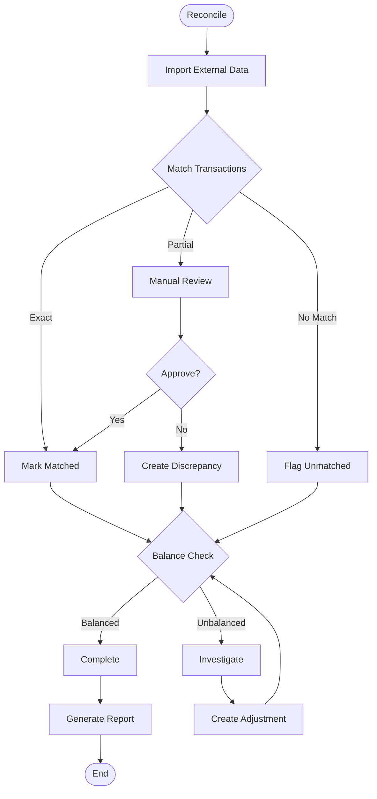

Reconciliation catches:
- Network timeouts that left transactions in limbo
- External system errors
- Fraud
- Your own bugs

Run it daily. Automate the easy matches (exact amount + timestamp within seconds). Flag the rest for human review.

### Real-World Implementation

Here's a complete reconciliation system for a payment processor integrating with Stripe.

#### Step 1: Database Schema for Reconciliation

**Table: external_transactions**
```sql
CREATE TABLE external_transactions (
    id BIGINT PRIMARY KEY AUTO_INCREMENT,
    source_system VARCHAR(255) NOT NULL,  -- 'stripe', 'bank_of_america', etc.
    external_id VARCHAR(255) NOT NULL,    -- ID from external system
    transaction_type VARCHAR(255),        -- 'charge', 'refund', 'transfer'
    amount DECIMAL(19, 4),
    currency VARCHAR(10),
    status VARCHAR(50),                   -- 'pending', 'completed', 'failed'
    occurred_at TIMESTAMP,
    raw_data JSON,                        -- Full payload from external system
    created_at TIMESTAMP DEFAULT CURRENT_TIMESTAMP,
    updated_at TIMESTAMP DEFAULT CURRENT_TIMESTAMP ON UPDATE CURRENT_TIMESTAMP,
    
    UNIQUE KEY unique_external (source_system, external_id),
    INDEX idx_source_status_date (source_system, status, occurred_at)
);
```

**Table: reconciliation_matches**
```sql
CREATE TABLE reconciliation_matches (
    id BIGINT PRIMARY KEY AUTO_INCREMENT,
    ledger_transaction_id BIGINT NOT NULL,
    external_transaction_id BIGINT NOT NULL,
    match_type VARCHAR(50),               -- 'exact', 'partial', 'manual'
    matched_amount DECIMAL(19, 4),
    status VARCHAR(50),                   -- 'matched', 'discrepancy', 'unmatched'
    notes TEXT,
    matched_by_id BIGINT,                 -- User who approved manual match
    created_at TIMESTAMP DEFAULT CURRENT_TIMESTAMP,
    updated_at TIMESTAMP DEFAULT CURRENT_TIMESTAMP ON UPDATE CURRENT_TIMESTAMP,
    
    FOREIGN KEY (ledger_transaction_id) REFERENCES ledger_transactions(id),
    FOREIGN KEY (external_transaction_id) REFERENCES external_transactions(id),
    UNIQUE KEY unique_match (ledger_transaction_id, external_transaction_id)
);
```

**Table: reconciliation_runs**
```sql
CREATE TABLE reconciliation_runs (
    id BIGINT PRIMARY KEY AUTO_INCREMENT,
    source_system VARCHAR(255) NOT NULL,
    date DATE NOT NULL,
    started_at TIMESTAMP,
    completed_at TIMESTAMP,
    total_external_count INTEGER,
    total_internal_count INTEGER,
    auto_matched_count INTEGER,
    manual_review_count INTEGER,
    discrepancy_count INTEGER,
    internal_total DECIMAL(19, 4),
    external_total DECIMAL(19, 4),
    status VARCHAR(50),                   -- 'running', 'completed', 'failed'
    error_message TEXT,
    created_at TIMESTAMP DEFAULT CURRENT_TIMESTAMP,
    updated_at TIMESTAMP DEFAULT CURRENT_TIMESTAMP ON UPDATE CURRENT_TIMESTAMP,
    
    UNIQUE KEY unique_run (source_system, date)
);
```

**Table: reconciliation_discrepancies**
```sql
CREATE TABLE reconciliation_discrepancies (
    id BIGINT PRIMARY KEY AUTO_INCREMENT,
    reconciliation_run_id BIGINT NOT NULL,
    ledger_transaction_id BIGINT,
    external_transaction_id BIGINT,
    discrepancy_type VARCHAR(255),        -- 'amount_mismatch', 'missing_internal', 
                                          -- 'missing_external', 'duplicate'
    internal_amount DECIMAL(19, 4),
    external_amount DECIMAL(19, 4),
    status VARCHAR(50),                   -- 'open', 'investigating', 'resolved', 'ignored'
    description TEXT,
    resolution_notes TEXT,
    resolved_by_id BIGINT,
    resolved_at TIMESTAMP,
    created_at TIMESTAMP DEFAULT CURRENT_TIMESTAMP,
    updated_at TIMESTAMP DEFAULT CURRENT_TIMESTAMP ON UPDATE CURRENT_TIMESTAMP,
    
    FOREIGN KEY (reconciliation_run_id) REFERENCES reconciliation_runs(id),
    FOREIGN KEY (ledger_transaction_id) REFERENCES ledger_transactions(id),
    FOREIGN KEY (external_transaction_id) REFERENCES external_transactions(id),
    INDEX idx_status_date (status, created_at),
    INDEX idx_run (reconciliation_run_id)
);
```

**Add columns to existing ledger_transactions table:**
```sql
ALTER TABLE ledger_transactions 
ADD COLUMN reconciliation_status VARCHAR(50) DEFAULT 'unreconciled',
ADD COLUMN reconciled_at TIMESTAMP,
ADD INDEX idx_recon_status (reconciliation_status, posted_at);
```

#### Step 2: Data Models

```pseudocode
// External Transaction Model
class ExternalTransaction
    properties:
        source_system: String (required)
        external_id: String (required)
        transaction_type: String
        amount: Decimal (required, non-zero)
        currency: String
        status: Enum ['pending', 'completed', 'failed', 'refunded']
        occurred_at: Timestamp
        raw_data: JSON
        created_at: Timestamp
        updated_at: Timestamp
    
    relationships:
        has_one: ReconciliationMatch
        has_one: LedgerTransaction (via reconciliation_match)
        has_one: ReconciliationDiscrepancy
    
    validations:
        source_system must be present
        external_id must be unique per source_system
        amount must be non-zero
    
    functions:
        isMatched(): Boolean
            return reconciliation_match is not null
        
        getUnmatchedTransactions(): Array
            return query all external_transactions 
                   left join reconciliation_matches
                   where reconciliation_matches.id is null
        
        getForDateRange(startDate, endDate): Array
            return query where occurred_at between startDate and endDate
```

```pseudocode
// Reconciliation Match Model
class ReconciliationMatch
    properties:
        ledger_transaction_id: BigInt (required)
        external_transaction_id: BigInt (required)
        match_type: Enum ['exact', 'partial', 'manual']
        matched_amount: Decimal
        status: Enum ['matched', 'discrepancy', 'unmatched']
        notes: Text
        matched_by_id: BigInt (optional)
        created_at: Timestamp
        updated_at: Timestamp
    
    relationships:
        belongs_to: LedgerTransaction
        belongs_to: ExternalTransaction
        belongs_to: MatchedBy (User, optional)
    
    validations:
        match_type must be one of: exact, partial, manual
        status must be one of: matched, discrepancy, unmatched
```

```pseudocode
// Reconciliation Run Model
class ReconciliationRun
    properties:
        source_system: String (required)
        date: Date (required)
        started_at: Timestamp
        completed_at: Timestamp
        total_external_count: Integer
        total_internal_count: Integer
        auto_matched_count: Integer
        manual_review_count: Integer
        discrepancy_count: Integer
        internal_total: Decimal
        external_total: Decimal
        status: Enum ['running', 'completed', 'failed']
        error_message: Text
        created_at: Timestamp
        updated_at: Timestamp
    
    relationships:
        has_many: ReconciliationDiscrepancies
    
    validations:
        source_system must be present
        date must be present
        status must be one of: running, completed, failed
    
    functions:
        getDuration(): Duration or null
            if completed_at and started_at exist
                return completed_at - started_at
            return null
        
        isSuccess(): Boolean
            return status == 'completed' AND discrepancy_count == 0
```

```pseudocode
// Reconciliation Discrepancy Model
class ReconciliationDiscrepancy
    properties:
        reconciliation_run_id: BigInt (required)
        ledger_transaction_id: BigInt (optional)
        external_transaction_id: BigInt (optional)
        discrepancy_type: Enum ['amount_mismatch', 'missing_internal', 
                               'missing_external', 'duplicate', 'timing_mismatch']
        internal_amount: Decimal
        external_amount: Decimal
        status: Enum ['open', 'investigating', 'resolved', 'ignored']
        description: Text
        resolution_notes: Text
        resolved_by_id: BigInt
        resolved_at: Timestamp
        created_at: Timestamp
        updated_at: Timestamp
    
    relationships:
        belongs_to: ReconciliationRun
        belongs_to: LedgerTransaction (optional)
        belongs_to: ExternalTransaction (optional)
        belongs_to: ResolvedBy (User, optional)
    
    validations:
        discrepancy_type must be valid enum value
        status must be valid enum value
    
    functions:
        getAmountDifference(): Decimal or null
            if internal_amount and external_amount exist
                return absolute_value(internal_amount - external_amount)
            return null
        
        getOpenDiscrepancies(): Array
            return query where status IN ('open', 'investigating')
```

#### Step 3: External Data Import Service

```mseudocode
// Stripe Importer Service
class StripeImporter
    properties:
        stripeClient: StripeAPIClient
    
    constructor(stripeClient = null)
        this.stripeClient = stripeClient OR new StripeClient()
    
    // Import transactions from Stripe for a specific date
    function importForDate(date)
        startTime = date.beginningOfDay().toTimestamp()
        endTime = date.endOfDay().toTimestamp()
        
        logInfo("Importing Stripe transactions for " + date)
        
        // Import charges
        importCharges(startTime, endTime)
        
        // Import refunds
        importRefunds(startTime, endTime)
        
        // Import transfers
        importTransfers(startTime, endTime)
        
        logInfo("Import completed for " + date)
    
    private function importCharges(startTime, endTime)
        charges = stripeClient.charges.list(
            created: { gte: startTime, lte: endTime },
            limit: 100
        )
        
        for each charge in charges.autoPaging()
            ExternalTransaction.findOrCreate(
                source_system: 'stripe',
                external_id: charge.id
            ) do |txn|
                txn.transaction_type = 'charge'
                txn.amount = charge.amount / 100.0  // Stripe uses cents
                txn.currency = charge.currency.toUpperCase()
                txn.status = (charge.status == 'succeeded') ? 'completed' : 'failed'
                txn.occurred_at = timestampFromUnix(charge.created)
                txn.raw_data = jsonEncode(charge)
            end
        end
    
    private function importRefunds(startTime, endTime)
        refunds = stripeClient.refunds.list(
            created: { gte: startTime, lte: endTime },
            limit: 100
        )
        
        for each refund in refunds.autoPaging()
            ExternalTransaction.findOrCreate(
                source_system: 'stripe',
                external_id: refund.id
            ) do |txn|
                txn.transaction_type = 'refund'
                txn.amount = -(refund.amount / 100.0)  // Negative for refunds
                txn.currency = refund.currency.toUpperCase()
                txn.status = (refund.status == 'succeeded') ? 'completed' : 'failed'
                txn.occurred_at = timestampFromUnix(refund.created)
                txn.raw_data = jsonEncode(refund)
            end
        end
    
    private function importTransfers(startTime, endTime)
        transfers = stripeClient.transfers.list(
            created: { gte: startTime, lte: endTime },
            limit: 100
        )
        
        for each transfer in transfers.autoPaging()
            ExternalTransaction.findOrCreate(
                source_system: 'stripe',
                external_id: transfer.id
            ) do |txn|
                txn.transaction_type = 'transfer'
                txn.amount = -(transfer.amount / 100.0)
                txn.currency = transfer.currency.toUpperCase()
                txn.status = 'completed'
                txn.occurred_at = timestampFromUnix(transfer.created)
                txn.raw_data = jsonEncode(transfer)
            end
        end
```

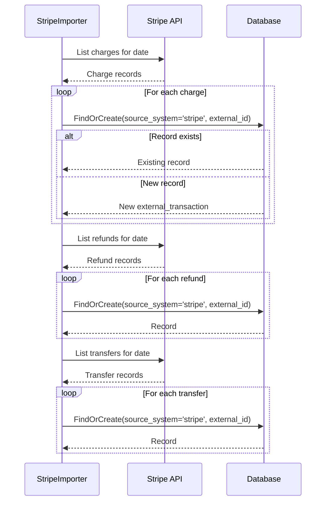

#### Step 4: Matching Service

```pseudocode
// Matching Service
class MatchingService
    constants:
        AUTO_MATCH_THRESHOLD = 5 minutes  // Time window for exact matches
        PARTIAL_MATCH_THRESHOLD = 1 hour  // Time window for partial matches
    
    properties:
        run: ReconciliationRun
        autoMatched: Integer = 0
        manualReview: Integer = 0
        discrepancies: Integer = 0
    
    constructor(run)
        this.run = run
    
    function perform()
        logInfo("Starting reconciliation matching for " + run.source_system + " on " + run.date)
        
        run.update(status: 'running', started_at: currentTimestamp())
        
        // Get all unmatched external transactions for the date
        externalTxns = ExternalTransaction
            .where(source_system: run.source_system)
            .forDateRange(run.date, run.date)
            .getUnmatchedTransactions()
            .toArray()
        
        // Get all unreconciled internal transactions for the date
        internalTxns = LedgerTransaction
            .where(reconciliation_status: 'unreconciled')
            .where(posted_at: between(run.date.beginningOfDay, run.date.endOfDay))
            .with('ledger_entries')
            .toArray()
        
        logInfo("Found " + externalTxns.size + " external and " + internalTxns.size + " internal transactions")
        
        // Try to match each external transaction
        for each externalTxn in externalTxns
            matchTransaction(externalTxn, internalTxns)
        end
        
        // Create discrepancies for unmatched transactions
        createMissingInternalDiscrepancies(externalTxns)
        createMissingExternalDiscrepancies(internalTxns)
        
        // Update run stats
        run.update(
            completed_at: currentTimestamp(),
            status: 'completed',
            total_external_count: externalTxns.size,
            total_internal_count: internalTxns.size,
            auto_matched_count: autoMatched,
            manual_review_count: manualReview,
            discrepancy_count: discrepancies
        )
        
        logInfo("Reconciliation completed. Auto-matched: " + autoMatched + 
                ", Review needed: " + manualReview + ", Discrepancies: " + discrepancies)
        
        return run
    
    rescue Error as e
        run.update(status: 'failed', error_message: e.message)
        raise e
    
    private function matchTransaction(externalTxn, internalTxns)
        // Strategy 1: Exact match by external_ref
        if matchByExternalRef(externalTxn, internalTxns)
            return
        end
        
        // Strategy 2: Exact match by amount + timestamp (within threshold)
        if matchByAmountAndTime(externalTxn, internalTxns)
            return
        end
        
        // Strategy 3: Partial match (same amount, different time)
        if partialMatch(externalTxn, internalTxns)
            return
        end
        
        // No match found - will be flagged as missing internal
    
    private function matchByExternalRef(externalTxn, internalTxns)
        // Look for internal transaction with matching external_ref
        match = internalTxns.find(txn => txn.external_ref == externalTxn.external_id)
        
        if not match
            return false
        end
        
        // Verify amounts match
        internalAmount = match.ledger_entries.sum(entry => entry.signed_amount)
        
        if internalAmount == externalTxn.amount
            createMatch(externalTxn, match, 'exact')
            autoMatched += 1
            internalTxns.delete(match)  // Remove from pool
            return true
        else
            // Amount mismatch - create discrepancy
            createAmountMismatchDiscrepancy(externalTxn, match, internalAmount)
            discrepancies += 1
            return true
        end
    
    private function matchByAmountAndTime(externalTxn, internalTxns)
        timeWindow = AUTO_MATCH_THRESHOLD
        
        candidates = internalTxns.filter(txn => 
            absoluteValue(txn.posted_at - externalTxn.occurred_at) <= timeWindow
        )
        
        // Find exact amount match
        for each candidate in candidates
            internalAmount = candidate.ledger_entries.sum(entry => entry.signed_amount)
            
            if internalAmount == externalTxn.amount
                createMatch(externalTxn, candidate, 'exact')
                autoMatched += 1
                internalTxns.delete(candidate)
                return true
            end
        end
        
        return false
    
    private function partialMatch(externalTxn, internalTxns)
        timeWindow = PARTIAL_MATCH_THRESHOLD
        
        candidates = internalTxns.filter(txn => 
            absoluteValue(txn.posted_at - externalTxn.occurred_at) <= timeWindow
        )
        
        for each candidate in candidates
            internalAmount = candidate.ledger_entries.sum(entry => entry.signed_amount)
            
            if internalAmount == externalTxn.amount
                // Same amount but outside auto-match window
                createMatch(externalTxn, candidate, 'partial')
                manualReview += 1
                internalTxns.delete(candidate)
                return true
            end
        end
        
        return false
    
    private function createMatch(externalTxn, internalTxn, matchType)
        ReconciliationMatch.create(
            external_transaction_id: externalTxn.id,
            ledger_transaction_id: internalTxn.id,
            match_type: matchType,
            matched_amount: externalTxn.amount,
            status: 'matched'
        )
        
        internalTxn.update(
            reconciliation_status: 'reconciled',
            reconciled_at: currentTimestamp()
        )
    
    private function createAmountMismatchDiscrepancy(externalTxn, internalTxn, internalAmount)
        ReconciliationDiscrepancy.create(
            reconciliation_run_id: run.id,
            ledger_transaction_id: internalTxn.id,
            external_transaction_id: externalTxn.id,
            discrepancy_type: 'amount_mismatch',
            internal_amount: internalAmount,
            external_amount: externalTxn.amount,
            status: 'open',
            description: "Amount mismatch: Internal " + internalAmount + " vs External " + externalTxn.amount
        )
    
    private function createMissingInternalDiscrepancies(externalTxns)
        unmatchedExternal = externalTxns.reject(txn => txn.isMatched())
        
        for each externalTxn in unmatchedExternal
            ReconciliationDiscrepancy.create(
                reconciliation_run_id: run.id,
                external_transaction_id: externalTxn.id,
                discrepancy_type: 'missing_internal',
                external_amount: externalTxn.amount,
                status: 'open',
                description: "External transaction " + externalTxn.external_id + " has no matching internal transaction"
            )
            discrepancies += 1
        end
    
    private function createMissingExternalDiscrepancies(internalTxns)
        for each internalTxn in internalTxns
            internalAmount = internalTxn.ledger_entries.sum(entry => entry.signed_amount)
            
            ReconciliationDiscrepancy.create(
                reconciliation_run_id: run.id,
                ledger_transaction_id: internalTxn.id,
                discrepancy_type: 'missing_external',
                internal_amount: internalAmount,
                status: 'open',
                description: "Internal transaction " + internalTxn.id + " has no matching external transaction"
            )
            discrepancies += 1
        end
```

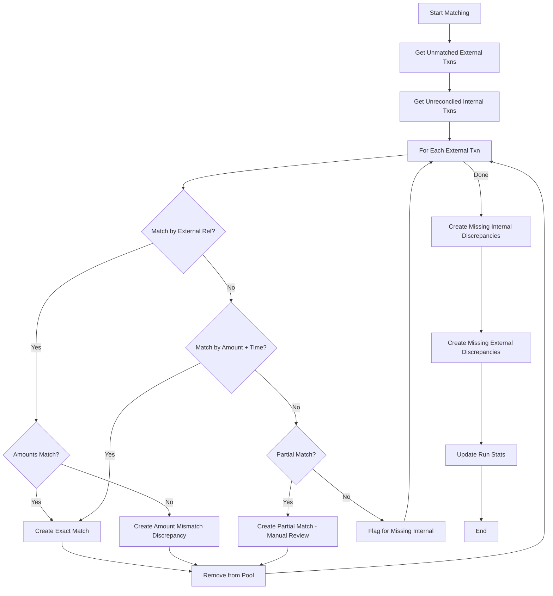

#### Step 5: Background Job

```pseudocode
// Daily Reconciliation Job
class DailyReconciliationJob
    constants:
        MAX_RETRY_ATTEMPTS = 3
        RETRY_DELAY_STRATEGY = 'exponential_backoff'
    
    properties:
        queue: 'reconciliation'
    
    function perform(date: Date, sourceSystem: String)
        default date = yesterday()
        default sourceSystem = 'stripe'
        
        logInfo("Starting daily reconciliation for " + sourceSystem + " on " + date)
        
        // Step 1: Import external data
        importExternalData(date, sourceSystem)
        
        // Step 2: Create or find reconciliation run
        run = ReconciliationRun.findOrCreate(
            source_system: sourceSystem,
            date: date
        )
        
        // Don't re-run if already completed today
        if run.completed_at && run.completed_at > 6.hours.ago()
            logInfo("Reconciliation already completed recently, skipping")
            return
        end
        
        // Step 3: Perform matching
        MatchingService.new(run: run).perform()
        
        // Step 4: Send notifications
        sendNotifications(run)
        
        // Step 5: Alert if discrepancies found
        if run.discrepancy_count > 0
            alertTeam(run)
        end
        
        logInfo("Daily reconciliation completed: " + run.auto_matched_count + 
                " matched, " + run.discrepancy_count + " discrepancies")
    
    // Retry logic for failures
    onError(error)
        if retryCount < MAX_RETRY_ATTEMPTS
            scheduleRetry(delay: calculateBackoff(retryCount))
        else
            raise error
    
    private function importExternalData(date, sourceSystem)
        switch sourceSystem
            case 'stripe':
                StripeImporter.new().importForDate(date)
            case 'bank_of_america':
                BankImporter.new().importForDate(date)
            default:
                throw Error("Unknown source system: " + sourceSystem)
        end
    
    private function sendNotifications(run)
        // Email finance team with summary
        EmailService.sendLater(
            template: 'reconciliation_daily_summary',
            data: run
        )
    
    private function alertTeam(run)
        // Slack/PagerDuty alert for discrepancies
        message = "🚨 Reconciliation Alert: " + run.discrepancy_count + 
                  " discrepancies found for " + run.source_system + " on " + run.date
        SlackNotifier.notify(message, channel: '#finance-ops')
```

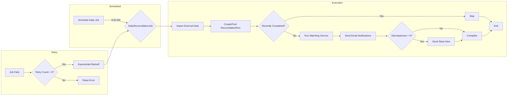

#### Step 6: API Controller for Manual Review

```pseudocode
// Reconciliation Controller
class ReconciliationController
    middleware:
        - authenticateUser
        - requireFinanceRole
    
    // GET /admin/reconciliation
    function index()
        runs = ReconciliationRun
            .orderBy('date', 'desc')
            .limit(30)
            .get()
        
        openDiscrepancies = ReconciliationDiscrepancy
            .getOpenDiscrepancies()
            .count()
        
        return view('admin/reconciliation/index', {
            runs: runs,
            openDiscrepancies: openDiscrepancies
        })
    
    // GET /admin/reconciliation/discrepancies
    function discrepancies()
        page = request.input('page', 1)
        
        discrepancies = ReconciliationDiscrepancy
            .getOpenDiscrepancies()
            .with(['ledgerTransaction', 'externalTransaction', 'reconciliationRun'])
            .orderBy('created_at', 'desc')
            .paginate(page: page, perPage: 20)
        
        return view('admin/reconciliation/discrepancies', {
            discrepancies: discrepancies
        })
    
    // POST /admin/reconciliation/:id/resolve
    function resolve(discrepancyId)
        discrepancy = ReconciliationDiscrepancy.find(discrepancyId)
        action = request.input('resolution_action')
        
        switch action
            case 'match':
                ledgerTransactionId = request.input('ledger_transaction_id')
                matchDiscrepancy(discrepancy, ledgerTransactionId)
            case 'create_missing':
                createMissingTransaction(discrepancy)
            case 'ignore':
                ignoreDiscrepancy(discrepancy)
            default:
                return response.json({ error: 'Unknown action' }, status: 400)
        end
        
        return response.json({ 
            success: true, 
            discrepancy: discrepancy.reload() 
        })
    
    // POST /admin/reconciliation/manual_match
    function manualMatch()
        externalTransactionId = request.input('external_transaction_id')
        ledgerTransactionId = request.input('ledger_transaction_id')
        
        externalTxn = ExternalTransaction.find(externalTransactionId)
        internalTxn = LedgerTransaction.find(ledgerTransactionId)
        
        database.transaction() do
            ReconciliationMatch.create(
                external_transaction_id: externalTxn.id,
                ledger_transaction_id: internalTxn.id,
                match_type: 'manual',
                matched_amount: externalTxn.amount,
                status: 'matched',
                matched_by_id: currentUser.id
            )
            
            internalTxn.update(
                reconciliation_status: 'reconciled',
                reconciled_at: currentTimestamp()
            )
        end
        
        return response.json({ success: true })
    
    private function matchDiscrepancy(discrepancy, ledgerTransactionId)
        internalTxn = LedgerTransaction.find(ledgerTransactionId)
        
        database.transaction() do
            ReconciliationMatch.create(
                external_transaction_id: discrepancy.external_transaction_id,
                ledger_transaction_id: internalTxn.id,
                match_type: 'manual',
                matched_amount: discrepancy.external_amount,
                status: 'matched',
                matched_by_id: currentUser.id
            )
            
            internalTxn.update(
                reconciliation_status: 'reconciled',
                reconciled_at: currentTimestamp()
            )
            
            discrepancy.update(
                status: 'resolved',
                resolution_notes: request.input('notes'),
                resolved_by_id: currentUser.id,
                resolved_at: currentTimestamp()
            )
        end
    
    private function createMissingTransaction(discrepancy)
        // Create the missing internal transaction for an external one
        // This handles cases where webhook failed to create our record
        ext = discrepancy.externalTransaction
        
        database.transaction() do
            // Create transaction based on external data
            service = new LedgerTransactionService()
            entries = buildEntriesFromExternal(ext)
            
            txn = service.postTransaction(
                entries: entries,
                external_ref: ext.external_id,
                description: "Reconciliation auto-created: " + ext.transaction_type
            )
            
            // Auto-match it
            ReconciliationMatch.create(
                external_transaction_id: ext.id,
                ledger_transaction_id: txn.id,
                match_type: 'manual',
                matched_amount: ext.amount,
                status: 'matched',
                matched_by_id: currentUser.id
            )
            
            discrepancy.update(
                status: 'resolved',
                resolution_notes: 'Created missing internal transaction',
                resolved_by_id: currentUser.id,
                resolved_at: currentTimestamp()
            )
        end
    
    private function ignoreDiscrepancy(discrepancy)
        discrepancy.update(
            status: 'ignored',
            resolution_notes: request.input('notes'),
            resolved_by_id: currentUser.id,
            resolved_at: currentTimestamp()
        )
    
    private function requireFinanceRole()
        if not (currentUser.hasRole('finance') OR currentUser.hasRole('admin'))
            return redirect('/').with('alert', 'Access denied')
```

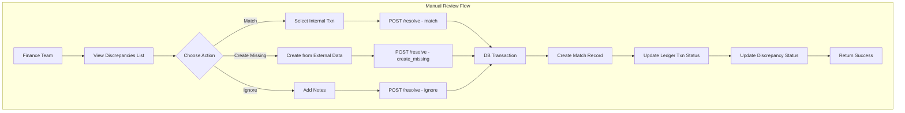

#### Step 7: Schedule the Job

```pseudocode
// Job Scheduler Configuration (e.g., cron, task scheduler, job queue)

// Schedule: Daily at 6:00 AM
scheduleTask(
    name: 'daily_reconciliation',
    cron: '0 6 * * *',  // Every day at 6:00 AM
    command: 'reconciliation:daily'
)

// Task Implementation
function reconciliationDailyTask()
    date = yesterday()
    sourceSystems = ['stripe', 'bank_of_america']
    
    for each sourceSystem in sourceSystems
        JobQueue.push(
            job: DailyReconciliationJob,
            data: {
                date: date,
                source_system: sourceSystem
            }
        )
    end
```

```mermaid
gantt
    title Daily Reconciliation Schedule
    dateFormat  HH:mm
    axisFormat %H:%M
    
    section Morning
    Reconciliation Job Queue    :06:00, 5m
    Stripe Import               :06:00, 10m
    Stripe Matching             :after Stripe Import, 5m
    Bank Import                 :06:00, 15m
    Bank Matching               :after Bank Import, 5m
    Notifications & Alerts      :after Stripe Matching, 2m
```

### Key Takeaways

1. **Separate Concerns**: Import, matching, and resolution are separate steps. If one fails, others can continue.

2. **Idempotent Imports**: Use `findOrCreate` with external IDs so re-running doesn't create duplicates.

3. **Multiple Match Strategies**: Start with exact matches (external_ref), then fuzzy matches (amount + time), then manual review.

4. **Track Everything**: Every match, every discrepancy, every resolution is logged. Audit trail is automatic.

5. **Automate the Easy Cases**: 90% of transactions should match automatically. Focus human attention on the 10% that need review.

6. **Alert on Discrepancies**: Don't let issues fester. Alert the team immediately when reconciliation fails or discrepancies are found.

## Database Locking: Preventing Race Conditions

Here's where things get real. When two users try to spend from the same account simultaneously, you need to prevent double-spending. Database locking is your friend—and your enemy if you get it wrong.

### The Problem

Consider this scenario:

```
User A balance: $100
User B balance: $50

Time 0:00 - User A tries to transfer $80 to User B
Time 0:01 - User B tries to transfer $40 to User A (before User A's transaction completes)

Without locking, both transactions might read the same initial balances.
Result: User A ends up with $60 (should be $20), User B ends up with $90 (should be $130)
Money appeared out of nowhere. Bad.
```

### Locking Strategies

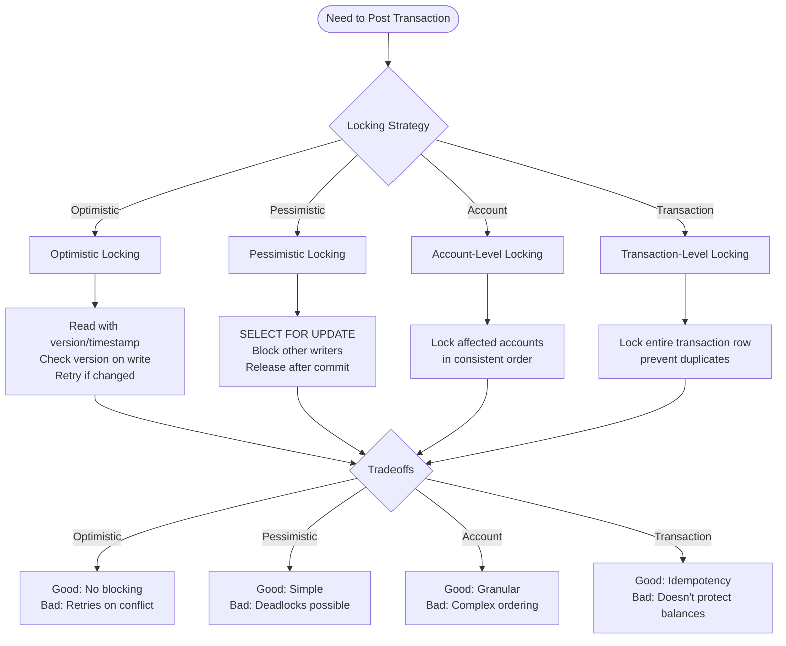

### Pessimistic Locking (Recommended for Ledgers)

For financial systems, I recommend pessimistic locking at the account level. It's simpler and prevents the complexity of retry logic.

```pseudocode
// Transaction Service with Pessimistic Locking
class TransactionService
    function postTransaction(entries, externalRef: String = null)
        // Sort account IDs to prevent deadlocks
        // Always lock in the same order
        accountIds = entries
            .map(entry => entry.account_id)
            .sort()
        
        return database.transaction() do
            // Lock all affected accounts in consistent order
            accounts = Account
                .whereIn('id', accountIds)
                .orderBy('id', 'asc')
                .lockForUpdate()
                .get()
            
            // Check idempotency
            if externalRef is not null
                existing = LedgerTransaction.findByExternalRef(externalRef)
                if existing
                    return existing
                end
            end
            
            // Validate entries balance
            total = entries.sum(entry => 
                entry.direction == 'debit' ? entry.amount : -entry.amount
            )
            
            if total != 0
                throw new ValidationError("Unbalanced transaction")
            end
            
            // Check sufficient funds for debits
            for each entry in entries
                if entry.direction == 'debit'
                    account = accounts.find(a => a.id == entry.account_id)
                    newBalance = account.balance - entry.amount
                    
                    if newBalance < 0
                        throw new InsufficientFundsError("Account " + account.id + " has insufficient funds")
                    end
                end
            end
            
            // Create transaction and entries atomically
            txn = LedgerTransaction.create(
                external_ref: externalRef,
                status: 'posted',
                posted_at: currentTimestamp()
            )
            
            for each entry in entries
                account = accounts.find(a => a.id == entry.account_id)
                
                LedgerEntry.create(
                    transaction_id: txn.id,
                    account_id: account.id,
                    direction: entry.direction,
                    amount: entry.amount,
                    currency: entry.currency
                )
                
                // Update balance
                amountChange = entry.direction == 'debit' 
                    ? -entry.amount 
                    : entry.amount
                account.update(balance: account.balance + amountChange)
            end
            
            // Emit event for projections
            EventStore.publish(new TransactionPostedEvent(txn))
            
            return txn
        end
```

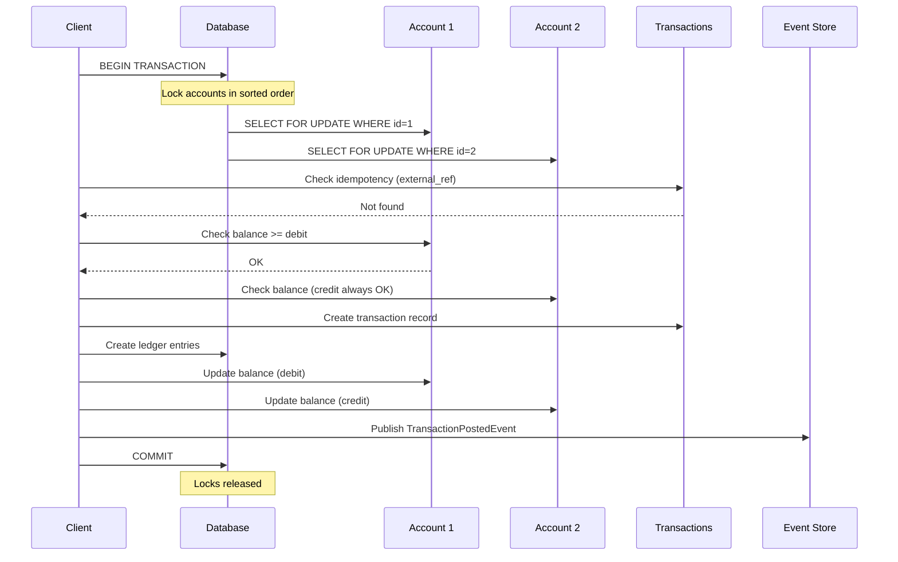

### Optimistic Locking (Alternative)

If you expect low contention, optimistic locking avoids blocking:

```pseudocode
// Account Model with Optimistic Locking
class Account
    properties:
        id: BigInt
        balance: Decimal
        lock_version: Integer  // Tracks version for optimistic locking
        created_at: Timestamp
        updated_at: Timestamp

// Optimistic Transaction Service
class OptimisticTransactionService
    MAX_RETRIES = 3
    
    function postTransaction(entries, externalRef: String = null)
        retryCount = 0
        
        while true
            try
                return database.transaction() do
                    // Read current balances
                    accountIds = entries.map(entry => entry.account_id)
                    accounts = Account.whereIn('id', accountIds).get()
                    
                    // ... validation logic ...
                    
                    // Update will fail if lock_version changed
                    for each account in accounts
                        newBalance = calculateNewBalance(account, entries)
                        
                        // This throws StaleObjectError if version changed
                        account.update(
                            balance: newBalance,
                            lock_version: account.lock_version + 1
                        )
                    end
                    
                    // Create transaction
                    return LedgerTransaction.create(...)
                end
                
            catch StaleObjectError
                retryCount += 1
                
                if retryCount >= MAX_RETRIES
                    throw new TransactionConflictError("Transaction conflict, please retry")
                end
                
                // Wait before retry (exponential backoff)
                sleep(calculateBackoff(retryCount))
            end
        end
```

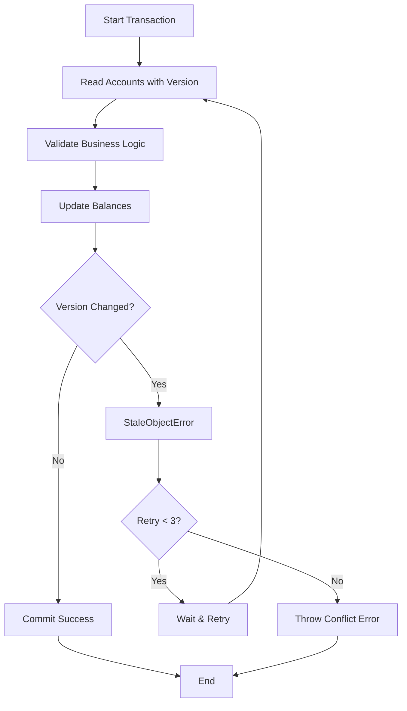

### Deadlock Prevention

The key insight: **always acquire locks in the same order**. If Transaction A locks Account 1 then Account 2, and Transaction B locks Account 2 then Account 1, you'll get deadlocks.

Always sort your account IDs before locking:

```pseudocode
// Good - consistent ordering prevents deadlocks
accountIds = entries
    .map(entry => entry.account_id)
    .sort()

accounts = Account
    .whereIn('id', accountIds)
    .orderBy('id', 'asc')
    .lockForUpdate()
    .get()

// Bad - ordering depends on input, leads to deadlocks
accountIds = entries.map(entry => entry.account_id)

accounts = Account
    .whereIn('id', accountIds)
    .lockForUpdate()  // No ORDER BY!
    .get()
```

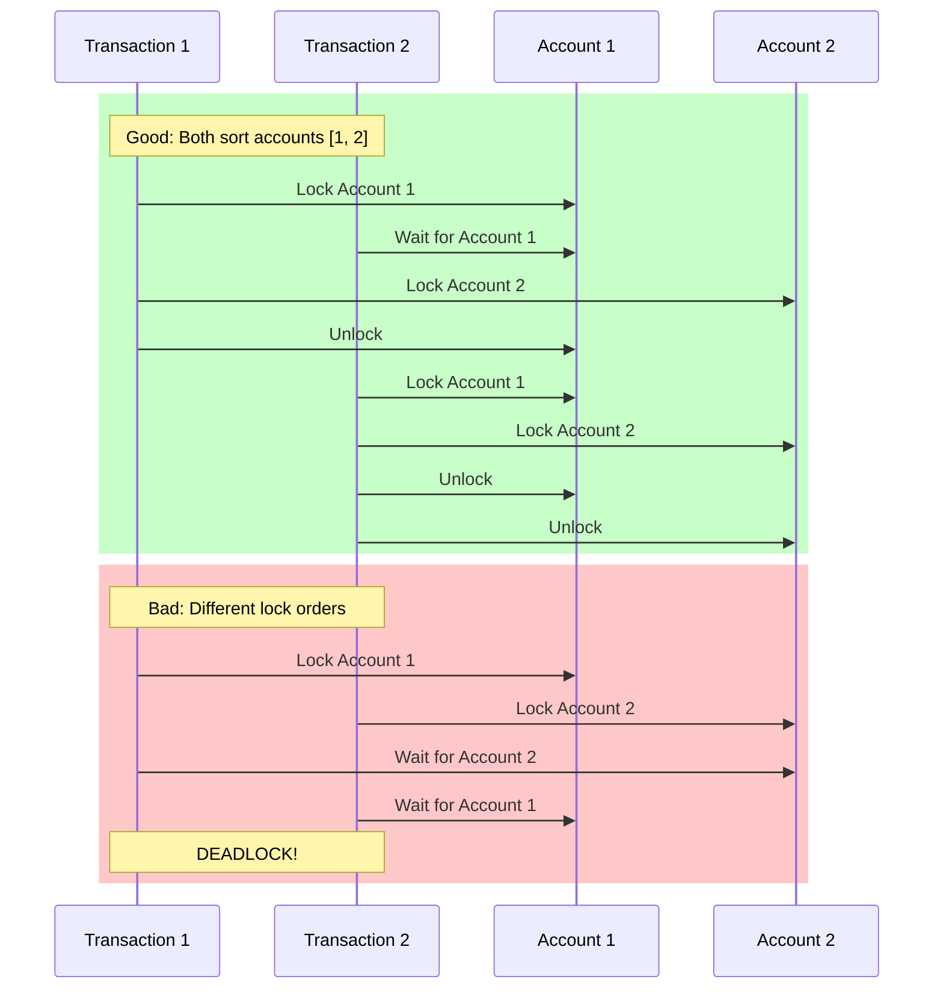

### Distributed Locks

If you're running multiple application servers, database locks alone aren't enough. You need distributed locking to prevent the same external_ref from being processed twice:

```pseudocode
// Distributed Transaction Service
class DistributedTransactionService
    function postTransaction(entries, externalRef: String)
        // Generate unique lock key
        lockKey = "ledger:txn:" + externalRef
        
        // Try to acquire distributed lock (e.g., using Redis, DynamoDB, or Zookeeper)
        lockAcquired = DistributedLock.acquire(
            key: lockKey,
            expireAfter: 30 seconds,  // Auto-release if process crashes
            timeout: 5 seconds        // Max time to wait for lock
        )
        
        if not lockAcquired
            throw new LockTimeoutError("Could not acquire lock, transaction may be in progress")
        end
        
        try
            // Check if already processed (defense in depth)
            if LedgerTransaction.exists(externalRef: externalRef)
                return  // Already processed
            end
            
            // Proceed with database transaction
            return database.transaction() do
                // ... pessimistic locking logic ...
                // ... post transaction ...
            end
            
        finally
            // Always release the lock
            DistributedLock.release(lockKey)
        end
```

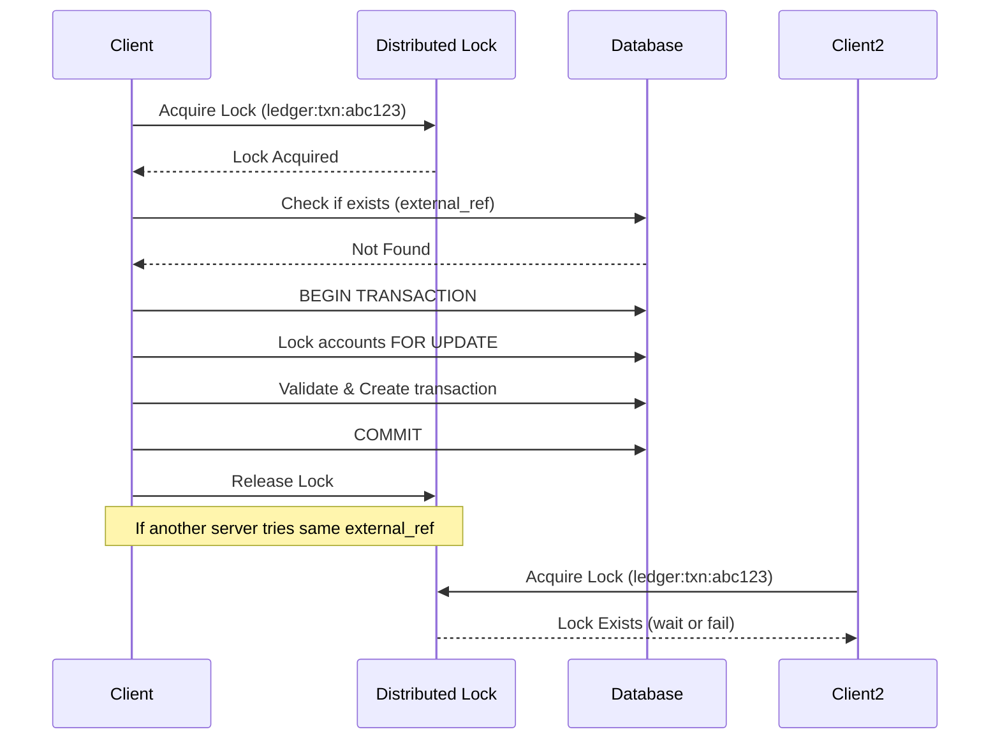


---

**Next: [Chapter 4: Production Operations →](/posts/ledger-system-chapter-4-production)**

In the next chapter, we'll cover audit trail queries, balance snapshots, and settlement tracking for production systems.
