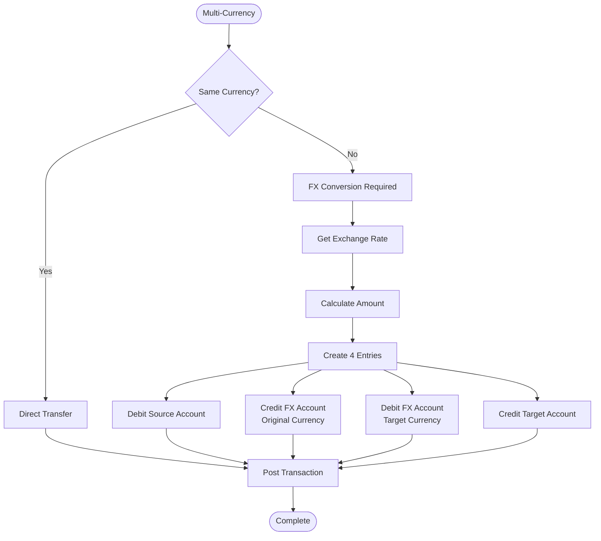

This is the third chapter in our five-part series on building production-ready ledger systems. In [Chapter 2](/posts/ledger-system-chapter-2-lifecycle), we covered transaction state management and async processing. Now we'll explore advanced topics: multi-currency support, reconciliation systems, and preventing race conditions.

## Multi-Currency Handling

If you're dealing with multiple currencies, things get interesting:



The key insight: currency conversion is just another account. When converting USD to EUR:

1. Debit user's USD account
2. Credit USD FX account (your FX desk received USD)
3. Debit EUR FX account (your FX desk provided EUR)  
4. Credit user's EUR account

The FX accounts should net to zero if your rates are accurate. If they're not, you've discovered your spread—or a bug.

## Reconciliation

Finally, you need to reconcile. Your ledger must match external systems (banks, payment processors, blockchains).


Reconciliation catches:
- Network timeouts that left transactions in limbo
- External system errors
- Fraud
- Your own bugs

Run it daily. Automate the easy matches (exact amount + timestamp within seconds). Flag the rest for human review.

### Real-World Rails Implementation

Here's a complete reconciliation system for a payment processor integrating with Stripe.

#### Step 1: Database Schema for Reconciliation

```ruby
# db/migrate/xxx_create_reconciliation_tables.rb
class CreateReconciliationTables < ActiveRecord::Migration[7.0]
  def change
    # External transactions from payment processors, banks, etc.
    create_table :external_transactions do |t|
      t.string :source_system, null: false  # 'stripe', 'bank_of_america', etc.
      t.string :external_id, null: false    # ID from external system
      t.string :transaction_type            # 'charge', 'refund', 'transfer'
      t.decimal :amount, precision: 19, scale: 4
      t.string :currency
      t.string :status                      # 'pending', 'completed', 'failed'
      t.datetime :occurred_at
      t.jsonb :raw_data                     # Full payload from external system
      t.timestamps
      
      t.index [:source_system, :external_id], unique: true
      t.index [:source_system, :status, :occurred_at]
    end
    
    # Links between internal and external transactions
    create_table :reconciliation_matches do |t|
      t.references :ledger_transaction, null: false, foreign_key: true
      t.references :external_transaction, null: false, foreign_key: true
      t.string :match_type                  # 'exact', 'partial', 'manual'
      t.decimal :matched_amount
      t.string :status                      # 'matched', 'discrepancy', 'unmatched'
      t.text :notes
      t.bigint :matched_by_id               # User who approved manual match
      t.timestamps
      
      t.index [:ledger_transaction_id, :external_transaction_id], 
              unique: true, 
              name: 'idx_unique_match'
    end
    
    # Reconciliation runs (daily batches)
    create_table :reconciliation_runs do |t|
      t.string :source_system, null: false
      t.date :date, null: false
      t.datetime :started_at
      t.datetime :completed_at
      t.integer :total_external_count
      t.integer :total_internal_count
      t.integer :auto_matched_count
      t.integer :manual_review_count
      t.integer :discrepancy_count
      t.decimal :internal_total
      t.decimal :external_total
      t.string :status                      # 'running', 'completed', 'failed'
      t.text :error_message
      t.timestamps
      
      t.index [:source_system, :date], unique: true
    end
    
    # Discrepancies requiring investigation
    create_table :reconciliation_discrepancies do |t|
      t.references :reconciliation_run, null: false, foreign_key: true
      t.references :ledger_transaction, foreign_key: true
      t.references :external_transaction, foreign_key: true
      t.string :discrepancy_type            # 'amount_mismatch', 'missing_internal', 
                                            # 'missing_external', 'duplicate'
      t.decimal :internal_amount
      t.decimal :external_amount
      t.string :status                      # 'open', 'investigating', 'resolved', 'ignored'
      t.text :description
      t.text :resolution_notes
      t.bigint :resolved_by_id
      t.datetime :resolved_at
      t.timestamps
      
      t.index [:status, :created_at]
      t.index :reconciliation_run_id
    end
    
    # Add reconciliation tracking to existing tables
    add_column :ledger_transactions, :reconciliation_status, :string, default: 'unreconciled'
    add_column :ledger_transactions, :reconciled_at, :datetime
    add_index :ledger_transactions, [:reconciliation_status, :posted_at]
  end
end
```

#### Step 2: Models

```ruby
# app/models/external_transaction.rb
class ExternalTransaction < ApplicationRecord
  has_one :reconciliation_match
  has_one :ledger_transaction, through: :reconciliation_match
  has_one :reconciliation_discrepancy
  
  validates :source_system, presence: true
  validates :external_id, presence: true, uniqueness: { scope: :source_system }
  validates :amount, numericality: { other_than: 0 }
  
  enum status: {
    pending: 'pending',
    completed: 'completed',
    failed: 'failed',
    refunded: 'refunded'
  }
  
  scope :unmatched, -> { left_outer_joins(:reconciliation_match).where(reconciliation_matches: { id: nil }) }
  scope :for_date_range, ->(start_date, end_date) { where(occurred_at: start_date.beginning_of_day..end_date.end_of_day) }
  
  def matched?
    reconciliation_match.present?
  end
end

# app/models/reconciliation_match.rb
class ReconciliationMatch < ApplicationRecord
  belongs_to :ledger_transaction
  belongs_to :external_transaction
  belongs_to :matched_by, class_name: 'User', optional: true
  
  validates :match_type, inclusion: { in: %w[exact partial manual] }
  validates :status, inclusion: { in: %w[matched discrepancy unmatched] }
  
  enum match_type: {
    exact: 'exact',
    partial: 'partial',
    manual: 'manual'
  }
end

# app/models/reconciliation_run.rb
class ReconciliationRun < ApplicationRecord
  has_many :reconciliation_discrepancies
  
  validates :source_system, presence: true
  validates :date, presence: true
  validates :status, inclusion: { in: %w[running completed failed] }
  
  def duration
    return nil unless completed_at && started_at
    completed_at - started_at
  end
  
  def success?
    status == 'completed' && discrepancy_count == 0
  end
end

# app/models/reconciliation_discrepancy.rb
class ReconciliationDiscrepancy < ApplicationRecord
  belongs_to :reconciliation_run
  belongs_to :ledger_transaction, optional: true
  belongs_to :external_transaction, optional: true
  belongs_to :resolved_by, class_name: 'User', optional: true
  
  validates :discrepancy_type, inclusion: { in: %w[amount_mismatch missing_internal missing_external duplicate timing_mismatch] }
  validates :status, inclusion: { in: %w[open investigating resolved ignored] }
  
  enum status: {
    open: 'open',
    investigating: 'investigating',
    resolved: 'resolved',
    ignored: 'ignored'
  }
  
  scope :open_discrepancies, -> { where(status: %w[open investigating]) }
  
  def amount_difference
    return nil unless internal_amount && external_amount
    (internal_amount - external_amount).abs
  end
end
```

#### Step 3: External Data Import Service

```ruby
# app/services/reconciliation/stripe_importer.rb
module Reconciliation
  class StripeImporter
    def initialize(stripe_client: nil)
      @stripe = stripe_client || Stripe::Client.new
    end
    
    # Import transactions from Stripe for a specific date
    def import_for_date(date)
      start_time = date.beginning_of_day.to_i
      end_time = date.end_of_day.to_i
      
      Rails.logger.info "Importing Stripe transactions for #{date}"
      
      # Import charges
      import_charges(start_time, end_time)
      
      # Import refunds
      import_refunds(start_time, end_time)
      
      # Import transfers
      import_transfers(start_time, end_time)
      
      Rails.logger.info "Import completed for #{date}"
    end
    
    private
    
    def import_charges(start_time, end_time)
      charges = @stripe.charges.list(
        created: { gte: start_time, lte: end_time },
        limit: 100
      )
      
      charges.auto_paging_each do |charge|
        ExternalTransaction.find_or_create_by!(
          source_system: 'stripe',
          external_id: charge.id
        ) do |txn|
          txn.transaction_type = 'charge'
          txn.amount = charge.amount / 100.0  # Stripe uses cents
          txn.currency = charge.currency.upcase
          txn.status = charge.status == 'succeeded' ? 'completed' : 'failed'
          txn.occurred_at = Time.at(charge.created)
          txn.raw_data = charge.to_json
        end
      end
    end
    
    def import_refunds(start_time, end_time)
      refunds = @stripe.refunds.list(
        created: { gte: start_time, lte: end_time },
        limit: 100
      )
      
      refunds.auto_paging_each do |refund|
        ExternalTransaction.find_or_create_by!(
          source_system: 'stripe',
          external_id: refund.id
        ) do |txn|
          txn.transaction_type = 'refund'
          txn.amount = -(refund.amount / 100.0)  # Negative for refunds
          txn.currency = refund.currency.upcase
          txn.status = refund.status == 'succeeded' ? 'completed' : 'failed'
          txn.occurred_at = Time.at(refund.created)
          txn.raw_data = refund.to_json
        end
      end
    end
    
    def import_transfers(start_time, end_time)
      transfers = @stripe.transfers.list(
        created: { gte: start_time, lte: end_time },
        limit: 100
      )
      
      transfers.auto_paging_each do |transfer|
        ExternalTransaction.find_or_create_by!(
          source_system: 'stripe',
          external_id: transfer.id
        ) do |txn|
          txn.transaction_type = 'transfer'
          txn.amount = -(transfer.amount / 100.0)
          txn.currency = transfer.currency.upcase
          txn.status = 'completed'
          txn.occurred_at = Time.at(transfer.created)
          txn.raw_data = transfer.to_json
        end
      end
    end
  end
end
```

#### Step 4: Matching Service

```ruby
# app/services/reconciliation/matching_service.rb
module Reconciliation
  class MatchingService
    AUTO_MATCH_THRESHOLD = 5.minutes  # Time window for exact matches
    PARTIAL_MATCH_THRESHOLD = 1.hour  # Time window for partial matches
    
    def initialize(run:)
      @run = run
      @auto_matched = 0
      @manual_review = 0
      @discrepancies = 0
    end
    
    def perform
      Rails.logger.info "Starting reconciliation matching for #{@run.source_system} on #{@run.date}"
      
      @run.update!(status: 'running', started_at: Time.current)
      
      # Get all unmatched external transactions for the date
      external_txns = ExternalTransaction
        .where(source_system: @run.source_system)
        .for_date_range(@run.date, @run.date)
        .unmatched
        .to_a
      
      # Get all unreconciled internal transactions for the date
      internal_txns = LedgerTransaction
        .where(reconciliation_status: 'unreconciled')
        .where(posted_at: @run.date.beginning_of_day..@run.date.end_of_day)
        .includes(:ledger_entries)
        .to_a
      
      Rails.logger.info "Found #{external_txns.size} external and #{internal_txns.size} internal transactions"
      
      # Try to match each external transaction
      external_txns.each do |external_txn|
        match_transaction(external_txn, internal_txns)
      end
      
      # Create discrepancies for unmatched transactions
      create_missing_internal_discrepancies(external_txns)
      create_missing_external_discrepancies(internal_txns)
      
      # Update run stats
      @run.update!(
        completed_at: Time.current,
        status: 'completed',
        total_external_count: external_txns.size,
        total_internal_count: internal_txns.size,
        auto_matched_count: @auto_matched,
        manual_review_count: @manual_review,
        discrepancy_count: @discrepancies
      )
      
      Rails.logger.info "Reconciliation completed. Auto-matched: #{@auto_matched}, Review needed: #{@manual_review}, Discrepancies: #{@discrepancies}"
      
      @run
    rescue StandardError => e
      @run.update!(status: 'failed', error_message: e.message)
      raise
    end
    
    private
    
    def match_transaction(external_txn, internal_txns)
      # Strategy 1: Exact match by external_ref
      if match_by_external_ref(external_txn, internal_txns)
        return
      end
      
      # Strategy 2: Exact match by amount + timestamp (within threshold)
      if match_by_amount_and_time(external_txn, internal_txns)
        return
      end
      
      # Strategy 3: Partial match (same amount, different time)
      if partial_match(external_txn, internal_txns)
        return
      end
      
      # No match found - will be flagged as missing internal
    end
    
    def match_by_external_ref(external_txn, internal_txns)
      # Look for internal transaction with matching external_ref
      match = internal_txns.find { |txn| txn.external_ref == external_txn.external_id }
      
      return false unless match
      
      # Verify amounts match
      internal_amount = match.ledger_entries.sum { |e| e.signed_amount }
      
      if internal_amount == external_txn.amount
        create_match!(external_txn, match, 'exact')
        @auto_matched += 1
        internal_txns.delete(match)  # Remove from pool
        true
      else
        # Amount mismatch - create discrepancy
        create_amount_mismatch_discrepancy(external_txn, match, internal_amount)
        @discrepancies += 1
        true
      end
    end
    
    def match_by_amount_and_time(external_txn, internal_txns)
      time_window = AUTO_MATCH_THRESHOLD
      
      candidates = internal_txns.select do |txn|
        time_diff = (txn.posted_at - external_txn.occurred_at).abs
        time_diff <= time_window
      end
      
      # Find exact amount match
      candidates.each do |candidate|
        internal_amount = candidate.ledger_entries.sum { |e| e.signed_amount }
        
        if internal_amount == external_txn.amount
          create_match!(external_txn, candidate, 'exact')
          @auto_matched += 1
          internal_txns.delete(candidate)
          return true
        end
      end
      
      false
    end
    
    def partial_match(external_txn, internal_txns)
      time_window = PARTIAL_MATCH_THRESHOLD
      
      candidates = internal_txns.select do |txn|
        time_diff = (txn.posted_at - external_txn.occurred_at).abs
        time_diff <= time_window
      end
      
      candidates.each do |candidate|
        internal_amount = candidate.ledger_entries.sum { |e| e.signed_amount }
        
        if internal_amount == external_txn.amount
          # Same amount but outside auto-match window
          create_match!(external_txn, candidate, 'partial')
          @manual_review += 1
          internal_txns.delete(candidate)
          return true
        end
      end
      
      false
    end
    
    def create_match!(external_txn, internal_txn, match_type)
      ReconciliationMatch.create!(
        external_transaction: external_txn,
        ledger_transaction: internal_txn,
        match_type: match_type,
        matched_amount: external_txn.amount,
        status: 'matched'
      )
      
      internal_txn.update!(
        reconciliation_status: 'reconciled',
        reconciled_at: Time.current
      )
    end
    
    def create_amount_mismatch_discrepancy(external_txn, internal_txn, internal_amount)
      ReconciliationDiscrepancy.create!(
        reconciliation_run: @run,
        ledger_transaction: internal_txn,
        external_transaction: external_txn,
        discrepancy_type: 'amount_mismatch',
        internal_amount: internal_amount,
        external_amount: external_txn.amount,
        status: 'open',
        description: "Amount mismatch: Internal #{internal_amount} vs External #{external_txn.amount}"
      )
    end
    
    def create_missing_internal_discrepancies(external_txns)
      unmatched_external = external_txns.reject(&:matched?)
      
      unmatched_external.each do |external_txn|
        ReconciliationDiscrepancy.create!(
          reconciliation_run: @run,
          external_transaction: external_txn,
          discrepancy_type: 'missing_internal',
          external_amount: external_txn.amount,
          status: 'open',
          description: "External transaction #{external_txn.external_id} has no matching internal transaction"
        )
        @discrepancies += 1
      end
    end
    
    def create_missing_external_discrepancies(internal_txns)
      internal_txns.each do |internal_txn|
        ReconciliationDiscrepancy.create!(
          reconciliation_run: @run,
          ledger_transaction: internal_txn,
          discrepancy_type: 'missing_external',
          internal_amount: internal_txn.ledger_entries.sum { |e| e.signed_amount },
          status: 'open',
          description: "Internal transaction #{internal_txn.id} has no matching external transaction"
        )
        @discrepancies += 1
      end
    end
  end
end
```

#### Step 5: Background Job

```ruby
# app/jobs/reconciliation/daily_reconciliation_job.rb
module Reconciliation
  class DailyReconciliationJob < ApplicationJob
    queue_as :reconciliation
    
    retry_on StandardError, wait: :exponentially_longer, attempts: 3
    
    def perform(date: Date.yesterday, source_system: 'stripe')
      Rails.logger.info "Starting daily reconciliation for #{source_system} on #{date}"
      
      # Step 1: Import external data
      import_external_data(date, source_system)
      
      # Step 2: Create or find reconciliation run
      run = ReconciliationRun.find_or_create_by!(
        source_system: source_system,
        date: date
      )
      
      # Don't re-run if already completed today
      if run.completed_at&.after?(6.hours.ago)
        Rails.logger.info "Reconciliation already completed recently, skipping"
        return
      end
      
      # Step 3: Perform matching
      Reconciliation::MatchingService.new(run: run).perform
      
      # Step 4: Send notifications
      send_notifications(run)
      
      # Step 5: Alert if discrepancies found
      if run.discrepancy_count > 0
        alert_team(run)
      end
      
      Rails.logger.info "Daily reconciliation completed: #{run.auto_matched_count} matched, #{run.discrepancy_count} discrepancies"
    end
    
    private
    
    def import_external_data(date, source_system)
      case source_system
      when 'stripe'
        Reconciliation::StripeImporter.new.import_for_date(date)
      when 'bank_of_america'
        Reconciliation::BankImporter.new.import_for_date(date)
      else
        raise "Unknown source system: #{source_system}"
      end
    end
    
    def send_notifications(run)
      # Email finance team with summary
      ReconciliationMailer.daily_summary(run).deliver_later
    end
    
    def alert_team(run)
      # Slack/PagerDuty alert for discrepancies
      message = "🚨 Reconciliation Alert: #{run.discrepancy_count} discrepancies found for #{run.source_system} on #{run.date}"
      SlackNotifier.notify(message, channel: '#finance-ops')
    end
  end
end
```

#### Step 6: Controller and Views for Manual Review

```ruby
# app/controllers/admin/reconciliation_controller.rb
module Admin
  class ReconciliationController < ApplicationController
    before_action :authenticate_user!
    before_action :require_finance_role
    
    def index
      @runs = ReconciliationRun.order(date: :desc).limit(30)
      @open_discrepancies = ReconciliationDiscrepancy.open_discrepancies.count
    end
    
    def discrepancies
      @discrepancies = ReconciliationDiscrepancy
        .open_discrepancies
        .includes(:ledger_transaction, :external_transaction, :reconciliation_run)
        .order(created_at: :desc)
        .page(params[:page])
    end
    
    def resolve
      @discrepancy = ReconciliationDiscrepancy.find(params[:id])
      
      case params[:resolution_action]
      when 'match'
        match_discrepancy(@discrepancy, params[:ledger_transaction_id])
      when 'create_missing'
        create_missing_transaction(@discrepancy)
      when 'ignore'
        ignore_discrepancy(@discrepancy)
      else
        render json: { error: 'Unknown action' }, status: 400
        return
      end
      
      render json: { success: true, discrepancy: @discrepancy.reload }
    end
    
    def manual_match
      # Allow manual matching of external to internal transactions
      external_txn = ExternalTransaction.find(params[:external_transaction_id])
      internal_txn = LedgerTransaction.find(params[:ledger_transaction_id])
      
      ActiveRecord::Base.transaction do
        ReconciliationMatch.create!(
          external_transaction: external_txn,
          ledger_transaction: internal_txn,
          match_type: 'manual',
          matched_amount: external_txn.amount,
          status: 'matched',
          matched_by: current_user
        )
        
        internal_txn.update!(
          reconciliation_status: 'reconciled',
          reconciled_at: Time.current
        )
      end
      
      render json: { success: true }
    end
    
    private
    
    def match_discrepancy(discrepancy, ledger_transaction_id)
      internal_txn = LedgerTransaction.find(ledger_transaction_id)
      
      ActiveRecord::Base.transaction do
        ReconciliationMatch.create!(
          external_transaction: discrepancy.external_transaction,
          ledger_transaction: internal_txn,
          match_type: 'manual',
          matched_amount: discrepancy.external_amount,
          status: 'matched',
          matched_by: current_user
        )
        
        internal_txn.update!(
          reconciliation_status: 'reconciled',
          reconciled_at: Time.current
        )
        
        discrepancy.update!(
          status: 'resolved',
          resolution_notes: params[:notes],
          resolved_by: current_user,
          resolved_at: Time.current
        )
      end
    end
    
    def create_missing_transaction(discrepancy)
      # Create the missing internal transaction for an external one
      # This handles cases where webhook failed to create our record
      ext = discrepancy.external_transaction
      
      ActiveRecord::Base.transaction do
        # Create transaction based on external data
        service = Ledger::TransactionService.new
        entries = build_entries_from_external(ext)
        
        txn = service.post_transaction(
          entries,
          external_ref: ext.external_id,
          description: "Reconciliation auto-created: #{ext.transaction_type}"
        )
        
        # Auto-match it
        ReconciliationMatch.create!(
          external_transaction: ext,
          ledger_transaction: txn,
          match_type: 'manual',
          matched_amount: ext.amount,
          status: 'matched',
          matched_by: current_user
        )
        
        discrepancy.update!(
          status: 'resolved',
          resolution_notes: 'Created missing internal transaction',
          resolved_by: current_user,
          resolved_at: Time.current
        )
      end
    end
    
    def ignore_discrepancy(discrepancy)
      discrepancy.update!(
        status: 'ignored',
        resolution_notes: params[:notes],
        resolved_by: current_user,
        resolved_at: Time.current
      )
    end
    
    def require_finance_role
      unless current_user.has_role?(:finance) || current_user.has_role?(:admin)
        redirect_to root_path, alert: 'Access denied'
      end
    end
  end
end
```

#### Step 7: Schedule the Job

```ruby
# config/schedule.rb (using whenever gem)
every 1.day, at: '6:00 am' do
  rake 'reconciliation:daily'
end

# lib/tasks/reconciliation.rake
namespace :reconciliation do
  desc 'Run daily reconciliation for all source systems'
  task daily: :environment do
    date = Date.yesterday
    
    ['stripe', 'bank_of_america'].each do |source_system|
      Reconciliation::DailyReconciliationJob.perform_later(
        date: date,
        source_system: source_system
      )
    end
  end
end
```

### Key Takeaways

1. **Separate Concerns**: Import, matching, and resolution are separate steps. If one fails, others can continue.

2. **Idempotent Imports**: Use `find_or_create_by` with external IDs so re-running doesn't create duplicates.

3. **Multiple Match Strategies**: Start with exact matches (external_ref), then fuzzy matches (amount + time), then manual review.

4. **Track Everything**: Every match, every discrepancy, every resolution is logged. Audit trail is automatic.

5. **Automate the Easy Cases**: 90% of transactions should match automatically. Focus human attention on the 10% that need review.

6. **Alert on Discrepancies**: Don't let issues fester. Alert the team immediately when reconciliation fails or discrepancies are found.

## Database Locking: Preventing Race Conditions

Here's where things get real. When two users try to spend from the same account simultaneously, you need to prevent double-spending. Database locking is your friend—and your enemy if you get it wrong.

### The Problem

Consider this scenario:

```
User A balance: $100
User B balance: $50

Time 0:00 - User A tries to transfer $80 to User B
Time 0:01 - User B tries to transfer $40 to User A (before User A's transaction completes)

Without locking, both transactions might read the same initial balances.
Result: User A ends up with $60 (should be $20), User B ends up with $90 (should be $130)
Money appeared out of nowhere. Bad.
```

### Locking Strategies


### Pessimistic Locking (Recommended for Ledgers)

For financial systems, I recommend pessimistic locking at the account level. It's simpler and prevents the complexity of retry logic.

Here's how to implement it in Rails:

```ruby
class TransactionService
  def self.post_transaction(entries, external_ref: nil)
    # Sort account IDs to prevent deadlocks
    # Always lock in the same order
    account_ids = entries.map { |e| e[:account_id] }.sort
    
    ActiveRecord::Base.transaction do
      # Lock all affected accounts in consistent order
      accounts = Account.where(id: account_ids)
                       .order(:id)
                       .lock
                       .to_a
      
      # Check idempotency
      if external_ref.present?
        existing = LedgerTransaction.find_by(external_ref: external_ref)
        return existing if existing
      end
      
      # Validate entries balance
      total = entries.sum { |e| e[:direction] == 'debit' ? e[:amount] : -e[:amount] }
      raise "Unbalanced transaction" unless total.zero?
      
      # Check sufficient funds for debits
      entries.each do |entry|
        if entry[:direction] == 'debit'
          account = accounts.find { |a| a.id == entry[:account_id] }
          new_balance = account.balance - entry[:amount]
          raise InsufficientFundsError if new_balance < 0
        end
      end
      
      # Create transaction and entries atomically
      txn = LedgerTransaction.create!(
        external_ref: external_ref,
        status: 'posted',
        posted_at: Time.current
      )
      
      entries.each do |entry|
        account = accounts.find { |a| a.id == entry[:account_id] }
        
        LedgerEntry.create!(
          transaction: txn,
          account: account,
          direction: entry[:direction],
          amount: entry[:amount],
          currency: entry[:currency]
        )
        
        # Update balance (or use trigger/database computed)
        amount_change = entry[:direction] == 'debit' ? -entry[:amount] : entry[:amount]
        account.update!(balance: account.balance + amount_change)
      end
      
      # Emit event for projections
      EventStore.publish(TransactionPostedEvent.new(txn))
      
      txn
    end
  end
end
```

### Optimistic Locking (Alternative)

If you expect low contention, optimistic locking avoids blocking:

```ruby
class Account < ApplicationRecord
  # Add lock_version column to accounts table
  # Rails handles this automatically
end

class OptimisticTransactionService
  def self.post_transaction(entries, external_ref: nil, max_retries: 3)
    retries = 0
    
    begin
      ActiveRecord::Base.transaction do
        # Read current balances
        account_ids = entries.map { |e| e[:account_id] }
        accounts = Account.where(id: account_ids).to_a
        
        # ... validation logic ...
        
        # Update will fail if lock_version changed
        accounts.each do |account|
          account.update!(balance: calculate_new_balance(account, entries))
        end
        
        # Create transaction
        LedgerTransaction.create!(...)
      end
    rescue ActiveRecord::StaleObjectError
      retries += 1
      retry if retries < max_retries
      raise "Transaction conflict, please retry"
    end
  end
end
```

### Deadlock Prevention

The key insight: **always acquire locks in the same order**. If Transaction A locks Account 1 then Account 2, and Transaction B locks Account 2 then Account 1, you'll get deadlocks.

Always sort your account IDs before locking:

```ruby
# Good - consistent ordering prevents deadlocks
account_ids = entries.map { |e| e[:account_id] }.sort
accounts = Account.where(id: account_ids).order(:id).lock.to_a

# Bad - ordering depends on input, leads to deadlocks
account_ids = entries.map { |e| e[:account_id] }
accounts = Account.where(id: account_ids).lock.to_a
```

### Distributed Locks

If you're running multiple application servers, database locks alone aren't enough. You need distributed locking to prevent the same external_ref from being processed twice:

```ruby
class DistributedTransactionService
  def self.post_transaction(entries, external_ref:)
    # Redis distributed lock
    lock_key = "ledger:txn:#{external_ref}"
    
    Redis.current.lock(lock_key, expire: 30, timeout: 5) do
      # Check if already processed (defense in depth)
      return if LedgerTransaction.exists?(external_ref: external_ref)
      
      # Proceed with database transaction
      ActiveRecord::Base.transaction do
        # ... post transaction ...
      end
    end
  rescue Redis::Lock::LockTimeout
    raise "Could not acquire lock, transaction may be in progress"
  end
end
```


---

**Next: [Chapter 4: Production Operations →](/posts/ledger-system-chapter-4-production)**

In the next chapter, we'll cover audit trail queries, balance snapshots, and settlement tracking for production systems.
