This is the fourth chapter in our five-part series on building production-ready ledger systems. In [Chapter 3](/posts/ledger-system-chapter-3-advanced), we covered multi-currency handling, reconciliation, and database locking. Now we'll focus on production operations: audit trails, balance snapshots, and settlement tracking.

## Audit Trail Queries: Finding the Truth

Event sourcing gives you an immutable history, but you need to query it effectively. Here's how to build audit trails that actually help.

### Event Store Schema

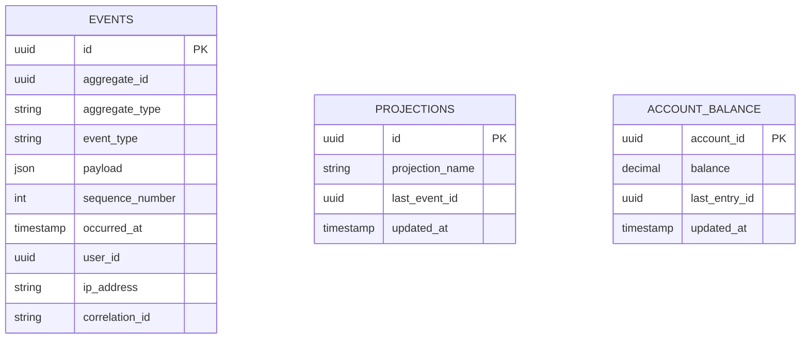

### Query Patterns

**1. Reconstruct Account History**

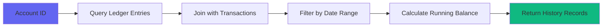

```pseudocode
FUNCTION get_account_history(account_id, from_date, to_date):
    // Query all entries for this account in date range
    entries = QUERY ledger_entries
        JOIN ledger_transactions ON ledger_entries.transaction_id = ledger_transactions.id
        WHERE account_id = account_id
        AND ledger_transactions.posted_at BETWEEN from_date AND to_date
        ORDER BY ledger_transactions.posted_at ASC, ledger_entries.created_at ASC
    
    history = []
    running_balance = 0
    
    FOR EACH entry IN entries:
        IF entry.direction == 'credit':
            running_balance = running_balance + entry.amount
        ELSE:
            running_balance = running_balance - entry.amount
        
        APPEND history WITH {
            date: entry.transaction.posted_at,
            transaction_id: entry.transaction_id,
            external_ref: entry.transaction.external_ref,
            direction: entry.direction,
            amount: entry.amount,
            currency: entry.currency,
            running_balance: running_balance
        }
    
    RETURN history
END FUNCTION

FUNCTION get_balance_at_time(account_id, timestamp):
    total = QUERY SUM(
        CASE 
            WHEN direction = 'credit' THEN amount 
            ELSE -amount 
        END
    ) FROM ledger_entries
        JOIN ledger_transactions ON ledger_entries.transaction_id = ledger_transactions.id
        WHERE account_id = account_id
        AND ledger_transactions.posted_at <= timestamp
    
    RETURN total
END FUNCTION

FUNCTION get_transactions_for_account(account_id, start_time, end_time):
    RETURN QUERY ledger_transactions
        JOIN ledger_entries ON ledger_transactions.id = ledger_entries.transaction_id
        WHERE ledger_entries.account_id = account_id
        AND ledger_transactions.posted_at BETWEEN start_time AND end_time
        DISTINCT
        ORDER BY posted_at DESC
END FUNCTION
```

**2. Trace Money Flow**

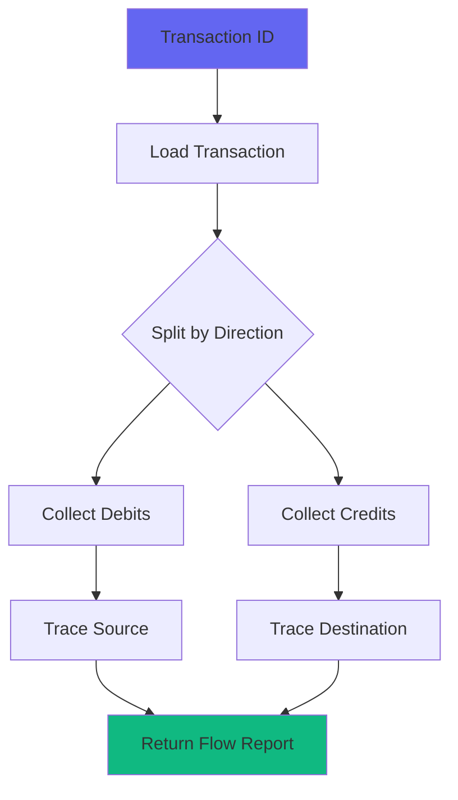

```pseudocode
FUNCTION trace_transaction(transaction_id):
    txn = GET ledger_transactions WHERE id = transaction_id
    
    debits = FILTER txn.entries WHERE direction = 'debit'
    credits = FILTER txn.entries WHERE direction = 'credit'
    
    RETURN {
        transaction: txn,
        debits: debits,
        credits: credits,
        source_accounts: EXTRACT unique account_id FROM debits,
        destination_accounts: EXTRACT unique account_id FROM credits
    }
END FUNCTION

FUNCTION trace_balance_composition(account_id, timestamp):
    entries = QUERY ledger_entries
        JOIN ledger_transactions ON ledger_entries.transaction_id = ledger_transactions.id
        WHERE account_id = account_id
        AND ledger_transactions.posted_at <= timestamp
        ORDER BY ledger_transactions.posted_at DESC
    
    balance = 0
    composition = []
    
    FOR EACH entry IN entries:
        IF entry.direction == 'credit':
            change = entry.amount
        ELSE:
            change = -entry.amount
        
        balance = balance + change
        
        PREPEND composition WITH {
            transaction_id: entry.transaction_id,
            source: entry.transaction.external_ref,
            amount: change,
            running_total: balance,
            timestamp: entry.transaction.posted_at
        }
    
    RETURN composition
END FUNCTION
```

**3. Detect Anomalies**

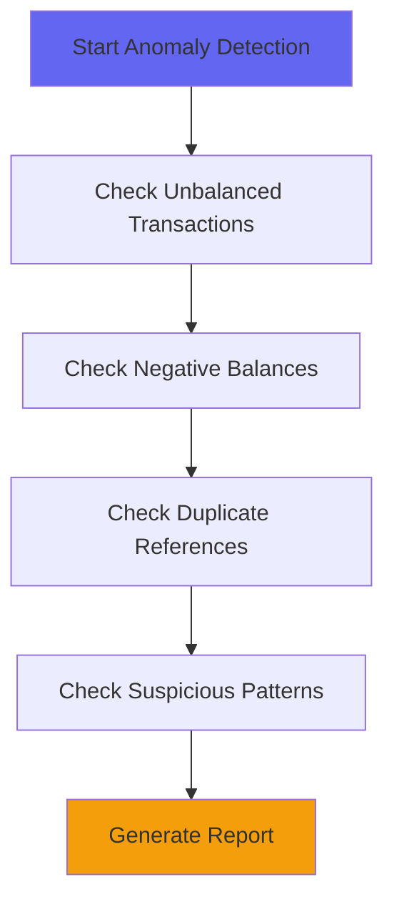

```pseudocode
FUNCTION find_unbalanced_transactions(start_time, end_time):
    RETURN QUERY ledger_transactions
        JOIN ledger_entries ON ledger_transactions.id = ledger_entries.transaction_id
        WHERE posted_at BETWEEN start_time AND end_time
        GROUP BY ledger_transactions.id
        HAVING SUM(
            CASE 
                WHEN ledger_entries.direction = 'debit' THEN ledger_entries.amount
                ELSE -ledger_entries.amount
            END
        ) != 0
END FUNCTION

FUNCTION find_negative_balances():
    RETURN QUERY accounts
        WHERE balance < 0
        AND account_type != 'liability'
END FUNCTION

FUNCTION find_duplicate_external_refs():
    RETURN QUERY ledger_transactions
        WHERE external_ref IS NOT NULL
        GROUP BY external_ref
        HAVING COUNT(*) > 1
END FUNCTION

FUNCTION generate_suspicious_activity_report(account_id, time_window_hours):
    cutoff_time = NOW() - time_window_hours hours
    
    transactions = QUERY ledger_transactions
        JOIN ledger_entries ON ledger_transactions.id = ledger_entries.transaction_id
        WHERE ledger_entries.account_id = account_id
        AND posted_at > cutoff_time
    
    total_volume = SUM ledger_entries.amount FROM transactions
    transaction_count = COUNT transactions
    round_number_count = COUNT transactions WHERE amount % 100 = 0
    
    RETURN {
        total_volume: total_volume,
        transaction_count: transaction_count,
        round_number_transactions: round_number_count,
        velocity_flag: transaction_count > 10
    }
END FUNCTION
```

**4. Event Replay for Projections**

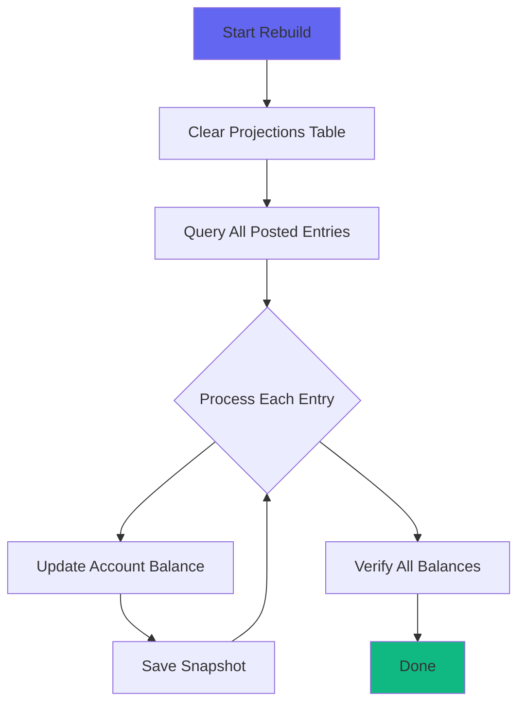

```pseudocode
FUNCTION rebuild_account_balances():
    // Clear existing projections
    DELETE ALL FROM account_balances
    
    // Query all posted entries in chronological order
    entries = QUERY ledger_entries
        JOIN ledger_transactions ON ledger_entries.transaction_id = ledger_transactions.id
        WHERE ledger_transactions.status = 'posted'
        ORDER BY ledger_transactions.posted_at ASC, ledger_entries.created_at ASC
    
    // Replay all events
    FOR EACH entry IN entries:
        account_balance = GET account_balances WHERE account_id = entry.account_id
        
        IF account_balance IS NULL:
            account_balance = CREATE account_balances {
                account_id: entry.account_id,
                balance: 0,
                last_entry_id: NULL
            }
        
        IF entry.direction == 'credit':
            change = entry.amount
        ELSE:
            change = -entry.amount
        
        account_balance.balance = account_balance.balance + change
        account_balance.last_entry_id = entry.id
        account_balance.updated_at = entry.transaction.posted_at
        
        SAVE account_balance
    
    RETURN COUNT entries
END FUNCTION

FUNCTION verify_balance_projections():
    discrepancies = []
    
    FOR EACH account IN accounts:
        // Calculate from source of truth
        computed = QUERY SUM(
            CASE 
                WHEN direction = 'credit' THEN amount 
                ELSE -amount 
            END
        ) FROM ledger_entries
            JOIN ledger_transactions ON ledger_entries.transaction_id = ledger_transactions.id
            WHERE account_id = account.id
            AND ledger_transactions.status = 'posted'
        
        // Get projected value
        projection = GET account_balances WHERE account_id = account.id
        projected = IF projection THEN projection.balance ELSE 0
        
        IF computed != projected:
            APPEND discrepancies WITH {
                account_id: account.id,
                computed: computed,
                projected: projected,
                difference: computed - projected
            }
    
    RETURN discrepancies
END FUNCTION
```

### Audit Trail Best Practices

**Always include context:**

```mseudocode
FUNCTION capture_audit_context(transaction):
    transaction.ip_address = GET current request IP address
    transaction.user_agent = GET current request user agent
    transaction.correlation_id = GET request header 'X-Request-ID' OR generate UUID
    
    RETURN transaction
END FUNCTION

// In request middleware/interceptor
SET thread context audit_ip = request.remote_ip
SET thread context correlation_id = request.headers['X-Request-ID'] OR generate UUID
```

**Use read replicas for heavy queries:**

```pseudocode
FUNCTION execute_on_read_replica(query_function):
    SWITCH database connection TO read_replica
    result = EXECUTE query_function()
    SWITCH database connection BACK TO primary
    RETURN result
END FUNCTION
```

**Index strategically:**

```sql
-- Table: ledger_entries
CREATE TABLE ledger_entries (
    id UUID PRIMARY KEY,
    transaction_id UUID NOT NULL REFERENCES ledger_transactions(id),
    account_id UUID NOT NULL REFERENCES accounts(id),
    direction VARCHAR(10) NOT NULL, -- 'debit' or 'credit'
    amount DECIMAL(19,4) NOT NULL,
    currency VARCHAR(3) NOT NULL,
    created_at TIMESTAMP NOT NULL
);

-- Critical indexes for audit queries
CREATE INDEX idx_entries_account_time 
    ON ledger_entries(account_id, created_at);

CREATE INDEX idx_entries_txn_account 
    ON ledger_entries(transaction_id, account_id);

-- For balance calculations
CREATE INDEX idx_txn_status_time 
    ON ledger_transactions(status, posted_at);
```

## Improvements: Balance Snapshots

One critical gap in our implementation is **point-in-time balance tracking**. When regulators or auditors ask "What was the balance on March 15th at 2 PM?", you need a definitive answer—not a calculation based on replaying thousands of transactions.

### Why Balance Snapshots Matter

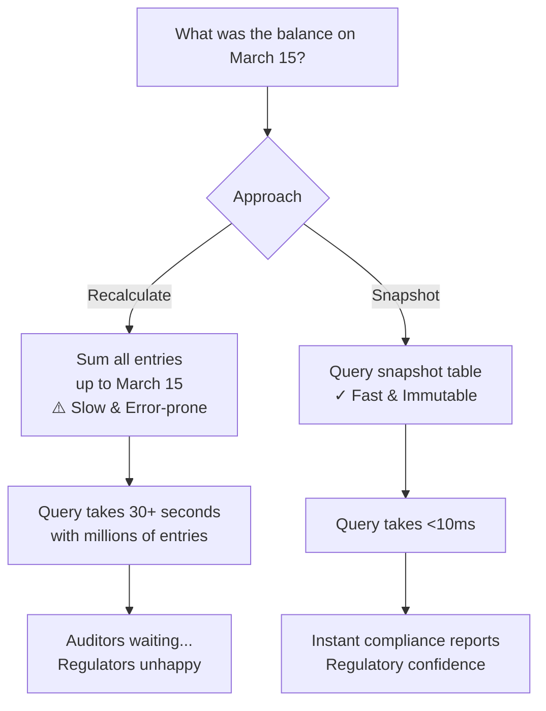

**Balance snapshots provide:**
- **Immutable audit records**: Prove balance at any historical point
- **Performance**: Sub-10ms queries vs. 30+ second recalculations  
- **Compliance**: Regulatory requirements often mandate snapshots
- **Debugging**: Quickly identify when balances diverged
- **Reconciliation**: Validate calculations haven't drifted

### Implementation

#### Step 1: Database Schema

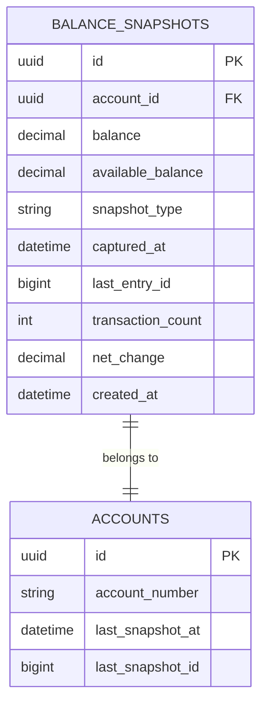

```sql
-- Table: balance_snapshots
CREATE TABLE balance_snapshots (
    id UUID PRIMARY KEY,
    account_id UUID NOT NULL REFERENCES accounts(id),
    balance DECIMAL(19,4) NOT NULL,
    available_balance DECIMAL(19,4) NOT NULL,
    snapshot_type VARCHAR(20) NOT NULL, -- 'hourly', 'daily', 'end_of_day', 'manual'
    captured_at TIMESTAMP NOT NULL,
    last_entry_id BIGINT,
    transaction_count INTEGER,
    net_change DECIMAL(19,4),
    created_at TIMESTAMP NOT NULL
);

-- Critical indexes for fast lookups
CREATE INDEX idx_snapshots_account_time 
    ON balance_snapshots(account_id, captured_at);

CREATE INDEX idx_snapshots_type_time 
    ON balance_snapshots(snapshot_type, captured_at);

CREATE INDEX idx_snapshots_time 
    ON balance_snapshots(captured_at);

-- Add tracking columns to accounts
ALTER TABLE accounts 
    ADD COLUMN last_snapshot_at TIMESTAMP,
    ADD COLUMN last_snapshot_id BIGINT;

CREATE INDEX idx_accounts_last_snapshot 
    ON accounts(last_snapshot_at);
```

#### Step 2: Snapshot Model

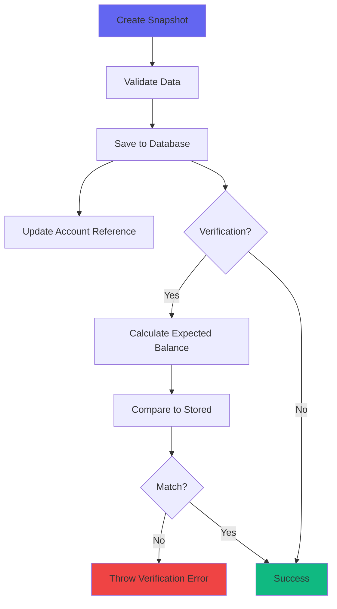

```pseudocode
STRUCT BalanceSnapshot:
    id: UUID
    account_id: UUID
    balance: DECIMAL
    available_balance: DECIMAL
    snapshot_type: STRING -- 'hourly', 'daily', 'end_of_day', 'manual'
    captured_at: TIMESTAMP
    last_entry_id: BIGINT
    transaction_count: INT
    net_change: DECIMAL
    created_at: TIMESTAMP

FUNCTION validate_snapshot(snapshot):
    IF snapshot.balance IS NULL:
        RAISE error "Balance is required"
    
    IF snapshot.available_balance IS NULL:
        RAISE error "Available balance is required"
    
    IF snapshot.captured_at IS NULL:
        RAISE error "Capture time is required"
    
    IF snapshot.snapshot_type NOT IN ('hourly', 'daily', 'end_of_day', 'manual'):
        RAISE error "Invalid snapshot type"
    
    RETURN true
END FUNCTION

FUNCTION get_latest_snapshot(account_id):
    RETURN QUERY balance_snapshots
        WHERE account_id = account_id
        ORDER BY captured_at DESC
        LIMIT 1
END FUNCTION

FUNCTION get_snapshot_at_time(account_id, time):
    RETURN QUERY balance_snapshots
        WHERE account_id = account_id
        AND captured_at <= time
        ORDER BY captured_at DESC
        LIMIT 1
END FUNCTION

FUNCTION verify_snapshot(snapshot):
    // Calculate expected balance from ledger entries
    calculated = QUERY SUM(
        CASE 
            WHEN direction = 'credit' THEN amount 
            ELSE -amount 
        END
    ) FROM ledger_entries
        JOIN ledger_transactions ON ledger_entries.transaction_id = ledger_transactions.id
        WHERE account_id = snapshot.account_id
        AND ledger_transactions.posted_at <= snapshot.captured_at
    
    IF calculated != snapshot.balance:
        RAISE error "Verification failed for account " + snapshot.account_id + 
                    " at " + snapshot.captured_at + 
                    ". Expected: " + calculated + 
                    ", Stored: " + snapshot.balance
    
    RETURN true
END FUNCTION
```

#### Step 3: Snapshot Service

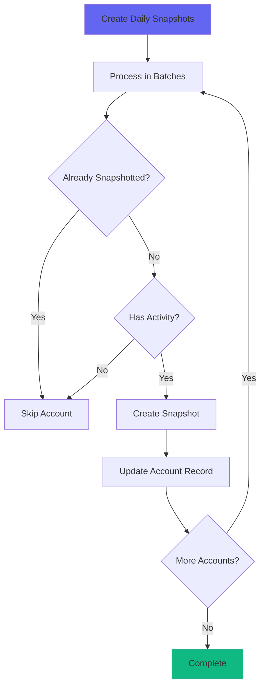

```pseudocode
CONST BATCH_SIZE = 1000

FUNCTION create_daily_snapshots(date):
    LOG "Creating daily balance snapshots for " + date
    
    end_of_day = GET end of day for date
    snapshot_count = 0
    
    // Process accounts in batches
    accounts = GET ALL accounts
    
    FOR EACH account IN accounts:
        // Skip if already snapshotted for this date
        IF already_snapshotted(account, date, 'daily'):
            CONTINUE
        
        // Skip if no activity since last snapshot
        IF NOT has_activity_since(account, account.last_snapshot_at):
            CONTINUE
        
        CREATE snapshot FOR account AT end_of_day WITH TYPE 'daily'
        snapshot_count = snapshot_count + 1
    
    LOG "Created " + snapshot_count + " daily snapshots"
    RETURN snapshot_count
END FUNCTION

FUNCTION create_snapshot_for_account(account, timestamp, snapshot_type):
    // Get last entry ID before this timestamp
    last_entry = QUERY ledger_entries
        JOIN ledger_transactions ON ledger_entries.transaction_id = ledger_transactions.id
        WHERE account_id = account.id
        AND ledger_transactions.posted_at <= timestamp
        ORDER BY ledger_transactions.posted_at DESC, ledger_entries.created_at DESC
        LIMIT 1
    
    last_entry_id = IF last_entry THEN last_entry.id ELSE NULL
    
    // Calculate balance at this point
    balance = QUERY SUM(
        CASE 
            WHEN direction = 'credit' THEN amount 
            ELSE -amount 
        END
    ) FROM ledger_entries
        JOIN ledger_transactions ON ledger_entries.transaction_id = ledger_transactions.id
        WHERE account_id = account.id
        AND ledger_transactions.posted_at <= timestamp
    
    // Calculate available balance
    reservations = QUERY SUM(amount) FROM reservations
        WHERE account_id = account.id
        AND created_at <= timestamp
        AND expires_at > timestamp
    
    available_balance = balance - reservations
    
    // Calculate change from previous snapshot
    previous_snapshot = get_latest_snapshot_before(account.id, timestamp)
    
    IF previous_snapshot:
        net_change = balance - previous_snapshot.balance
    ELSE:
        net_change = balance
    
    // Count transactions since last snapshot
    IF previous_snapshot:
        transaction_count = QUERY COUNT DISTINCT ledger_transactions.id
            FROM ledger_transactions
            JOIN ledger_entries ON ledger_transactions.id = ledger_entries.transaction_id
            WHERE ledger_entries.account_id = account.id
            AND ledger_transactions.posted_at > previous_snapshot.captured_at
            AND ledger_transactions.posted_at <= timestamp
    ELSE:
        transaction_count = QUERY COUNT DISTINCT ledger_transactions.id
            FROM ledger_transactions
            JOIN ledger_entries ON ledger_transactions.id = ledger_entries.transaction_id
            WHERE ledger_entries.account_id = account.id
            AND ledger_transactions.posted_at <= timestamp
    
    // Create snapshot
    snapshot = CREATE balance_snapshots {
        account_id: account.id,
        balance: balance,
        available_balance: available_balance,
        snapshot_type: snapshot_type,
        captured_at: timestamp,
        last_entry_id: last_entry_id,
        transaction_count: transaction_count,
        net_change: net_change
    }
    
    // Update account's last snapshot reference
    UPDATE accounts SET
        last_snapshot_at = timestamp,
        last_snapshot_id = snapshot.id
    WHERE id = account.id
    
    RETURN snapshot
END FUNCTION

FUNCTION get_balance_at_time(account_id, timestamp):
    // Find the most recent snapshot before this time
    snapshot = QUERY balance_snapshots
        WHERE account_id = account_id
        AND captured_at <= timestamp
        ORDER BY captured_at DESC
        LIMIT 1
    
    IF snapshot:
        // Apply entries since snapshot
        change_since_snapshot = QUERY SUM(
            CASE 
                WHEN direction = 'credit' THEN amount 
                ELSE -amount 
            END
        ) FROM ledger_entries
            JOIN ledger_transactions ON ledger_entries.transaction_id = ledger_transactions.id
            WHERE account_id = account_id
            AND ledger_transactions.posted_at > snapshot.captured_at
            AND ledger_transactions.posted_at <= timestamp
        
        RETURN snapshot.balance + change_since_snapshot
    ELSE:
        // No snapshot exists, calculate from scratch (slow path)
        RETURN QUERY SUM(
            CASE 
                WHEN direction = 'credit' THEN amount 
                ELSE -amount 
            END
        ) FROM ledger_entries
            JOIN ledger_transactions ON ledger_entries.transaction_id = ledger_transactions.id
            WHERE account_id = account_id
            AND ledger_transactions.posted_at <= timestamp
END FUNCTION

FUNCTION verify_snapshots(date):
    LOG "Verifying balance snapshots for " + date
    
    discrepancies = []
    
    snapshots = QUERY balance_snapshots
        WHERE snapshot_type = 'end_of_day'
        AND captured_at >= start of date
        AND captured_at <= end of date
    
    FOR EACH snapshot IN snapshots:
        TRY:
            verify_snapshot(snapshot)
        CATCH verification_error:
            APPEND discrepancies WITH {
                snapshot_id: snapshot.id,
                account_id: snapshot.account_id,
                error: verification_error.message
            }
            LOG error verification_error.message
    
    IF LENGTH discrepancies > 0:
        CALL alert_service.notify_balance_drift(discrepancies)
    
    RETURN discrepancies
END FUNCTION

// Helper functions
FUNCTION already_snapshotted(account, date, snapshot_type):
    RETURN EXISTS QUERY balance_snapshots
        WHERE account_id = account.id
        AND snapshot_type = snapshot_type
        AND captured_at >= start of date
        AND captured_at <= end of date
END FUNCTION

FUNCTION has_activity_since(account, since_time):
    IF since_time IS NULL:
        RETURN true
    
    RETURN EXISTS QUERY ledger_entries
        JOIN ledger_transactions ON ledger_entries.transaction_id = ledger_transactions.id
        WHERE account_id = account.id
        AND ledger_transactions.posted_at > since_time
END FUNCTION

FUNCTION get_latest_snapshot_before(account_id, timestamp):
    RETURN QUERY balance_snapshots
        WHERE account_id = account_id
        AND captured_at < timestamp
        ORDER BY captured_at DESC
        LIMIT 1
END FUNCTION
```

#### Step 4: Background Job

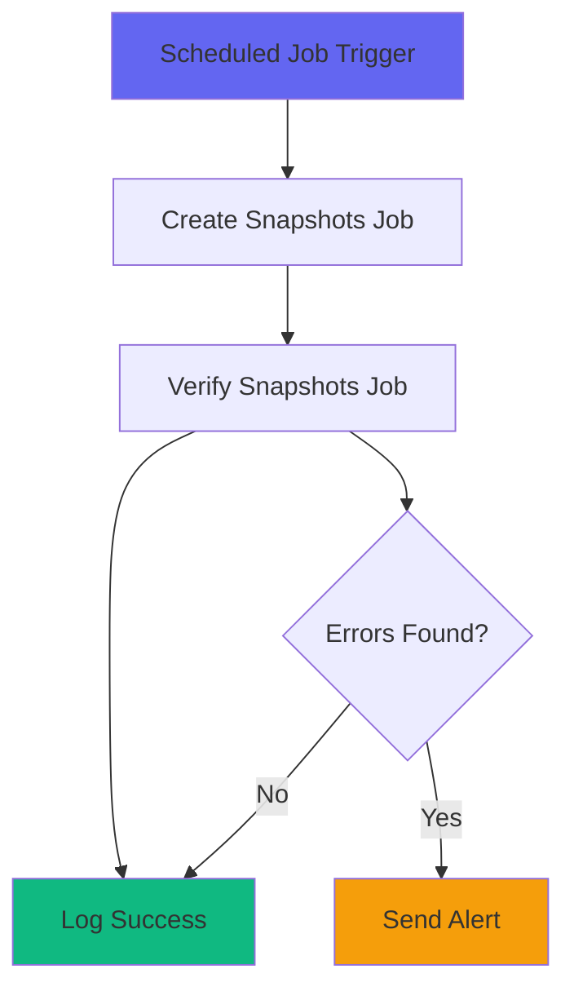

```pseudocode
JOB CreateBalanceSnapshotsJob:
    queue: maintenance
    
    FUNCTION execute(date, snapshot_type):
        LOG "Creating " + snapshot_type + " balance snapshots for " + date
        
        IF snapshot_type == 'daily':
            CALL create_daily_snapshots(date)
        ELSE IF snapshot_type == 'end_of_day':
            CALL create_end_of_day_snapshots(date)
        ELSE:
            RAISE error "Unknown snapshot type: " + snapshot_type
    END FUNCTION
END JOB

JOB VerifyBalanceSnapshotsJob:
    queue: maintenance
    max_retries: 3
    
    FUNCTION execute(date):
        discrepancies = CALL verify_snapshots(date)
        
        IF LENGTH discrepancies > 0:
            LOG error "Found " + LENGTH discrepancies + " balance snapshot discrepancies!"
            CALL send_alert_email(discrepancies)
        ELSE:
            LOG "All balance snapshots verified successfully"
    END FUNCTION
END JOB
```

#### Step 5: Usage Examples

```pseudocode
// Example 1: Get balance at a specific time (fast with snapshots)
SERVICE BalanceLookupService:
    FUNCTION get_balance_at(account_id, timestamp):
        RETURN CALL get_balance_at_time(account_id, timestamp)
    END FUNCTION
    
    FUNCTION get_balance_on_date(account_id, date):
        end_of_day = GET end of day for date
        RETURN CALL get_balance_at(account_id, end_of_day)
    END FUNCTION
    
    FUNCTION get_balance_change(account_id, start_time, end_time):
        start_balance = CALL get_balance_at(account_id, start_time)
        end_balance = CALL get_balance_at(account_id, end_time)
        
        RETURN {
            start_balance: start_balance,
            end_balance: end_balance,
            change: end_balance - start_balance
        }
    END FUNCTION
END SERVICE

// Example 2: Generate compliance report
SERVICE ComplianceReportService:
    FUNCTION generate_end_of_day_balances(date):
        // Get all EOD snapshots for the date
        snapshots = QUERY balance_snapshots
            WHERE snapshot_type = 'end_of_day'
            AND captured_at >= start of date
            AND captured_at <= end of date
            JOIN accounts ON balance_snapshots.account_id = accounts.id
        
        total_assets = SUM balance FROM snapshots WHERE account.type = 'asset'
        total_liabilities = SUM balance FROM snapshots WHERE account.type = 'liability'
        
        RETURN {
            date: date,
            snapshot_count: COUNT snapshots,
            total_assets: total_assets,
            total_liabilities: total_liabilities,
            net_position: total_assets - total_liabilities,
            generated_at: NOW()
        }
    END FUNCTION
END SERVICE

// Example 3: API Controller for audit queries
CONTROLLER BalanceSnapshotsController:
    authentication: required
    authorization: auditor OR admin
    
    FUNCTION show(account_id, timestamp):
        account = GET accounts WHERE id = account_id
        parsed_time = PARSE timestamp AS datetime
        
        balance = CALL BalanceLookupService.get_balance_at(account.id, parsed_time)
        snapshot = CALL get_snapshot_at_time(account.id, parsed_time)
        
        RETURN {
            account_id: account.id,
            account_number: account.account_number,
            timestamp: parsed_time,
            balance: balance,
            based_on_snapshot: snapshot IS NOT NULL,
            snapshot_captured_at: IF snapshot THEN snapshot.captured_at ELSE NULL,
            entries_since_snapshot: IF snapshot THEN 
                CALL count_entries_since(account.id, snapshot.captured_at, parsed_time)
            ELSE NULL
        }
    END FUNCTION
    
    FUNCTION history(account_id, start_date, end_date):
        account = GET accounts WHERE id = account_id
        start = PARSE start_date AS date
        end = PARSE end_date AS date
        
        snapshots = QUERY balance_snapshots
            WHERE account_id = account.id
            AND captured_at >= start of start_date
            AND captured_at <= end of end_date
            ORDER BY captured_at ASC
        
        RETURN {
            account_id: account.id,
            snapshots: MAP snapshots TO {
                captured_at: snapshot.captured_at,
                balance: snapshot.balance,
                available_balance: snapshot.available_balance,
                net_change: snapshot.net_change,
                transaction_count: snapshot.transaction_count
            }
        }
    END FUNCTION
END CONTROLLER

FUNCTION count_entries_since(account_id, since_time, until_time):
    RETURN QUERY COUNT ledger_entries
        JOIN ledger_transactions ON ledger_entries.transaction_id = ledger_transactions.id
        WHERE account_id = account_id
        AND ledger_transactions.posted_at > since_time
        AND ledger_transactions.posted_at <= until_time
END FUNCTION
```

#### Step 6: Schedule Snapshots

```pseudocode
SCHEDULE DailySnapshotJob:
    run_at: "01:00"
    action: CALL create_daily_snapshots(YESTERDAY)
END SCHEDULE

SCHEDULE EndOfDaySnapshotJob:
    run_at: "02:00"
    action: CALL create_end_of_day_snapshots(YESTERDAY)
END SCHEDULE

SCHEDULE VerifySnapshotsJob:
    run_at: "03:00"
    action: CALL verify_snapshots(YESTERDAY)
END SCHEDULE

// CLI Task: Create daily snapshots
TASK create_daily_snapshots:
    date = YESTERDAY
    CALL CreateBalanceSnapshotsJob.execute(date, 'daily')
    OUTPUT "Created daily snapshots for " + date
END TASK

// CLI Task: Create end-of-day snapshots
TASK create_eod_snapshots:
    date = YESTERDAY
    CALL CreateBalanceSnapshotsJob.execute(date, 'end_of_day')
    OUTPUT "Created EOD snapshots for " + date
END TASK

// CLI Task: Verify snapshots
TASK verify_snapshots:
    date = YESTERDAY
    CALL VerifyBalanceSnapshotsJob.execute(date)
END TASK

// CLI Task: Backfill snapshots (use with caution)
TASK backfill_snapshots(start_date, end_date):
    start = PARSE start_date AS date
    end = PARSE end_date AS date
    
    FOR EACH date IN RANGE start TO end:
        OUTPUT "Creating snapshots for " + date + "..."
        CALL create_end_of_day_snapshots(date)
    
    OUTPUT "Backfill complete!"
END TASK
```

### Key Takeaways

1. **Snapshots are Immutable Records**: Once created, they never change. They serve as proof of balance at a point in time.

2. **Hybrid Approach**: Use snapshots for the bulk of historical data, then apply recent entries on top. This gives you both speed and accuracy.

3. **Verify Regularly**: Run verification jobs to detect drift. If your calculated balance doesn't match the snapshot, you have a data integrity issue.

4. **Multiple Snapshot Types**: 
   - **Daily**: For trending and analytics
   - **End-of-Day**: For regulatory compliance
   - **Manual**: For audit investigations

5. **Don't Snapshot Everything**: Only snapshot accounts with activity. Empty accounts don't need daily snapshots.

6. **Compression Strategy**: For high-volume accounts, consider hourly snapshots during business hours and daily otherwise.

## Improvements: Settlement Tracking (Authorization vs Settlement)

Credit card payments have a critical two-phase flow that's often overlooked:

1. **Authorization**: Funds are held (reserved) immediately
2. **Settlement**: Funds actually move 1-3 days later

Your ledger needs to track both phases separately, or you'll have a nightmare reconciling with your payment processor.

### The Problem

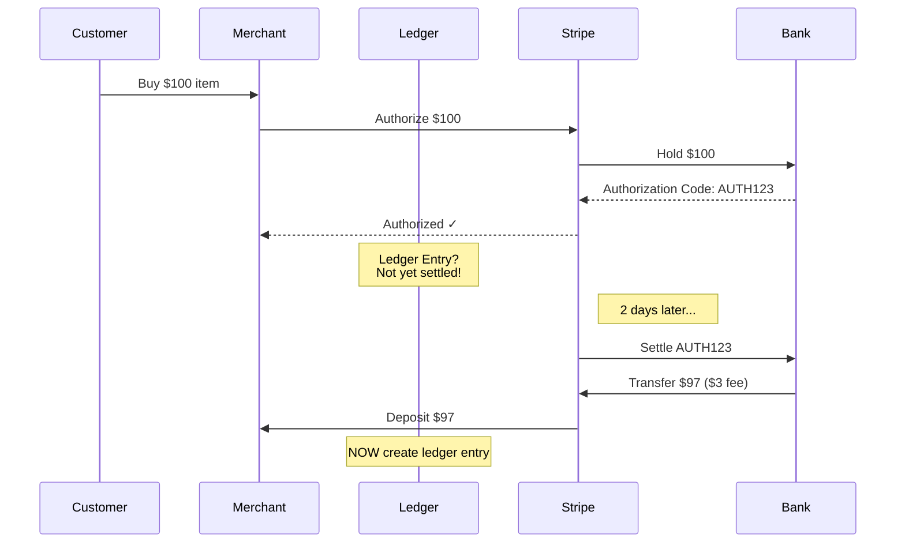

**If you post to ledger on authorization:**
- Customer sees charge immediately (confusing)
- Reconciliation fails (authorized amount ≠ settled amount)
- Refunds become complex (void vs refund)

**If you wait for settlement:**
- Merchants can't see pending revenue
- Inventory management breaks
- Customer experience suffers

**Solution: Track both phases explicitly.**

### Implementation

#### Step 1: Enhanced Transaction Model with Settlement Tracking

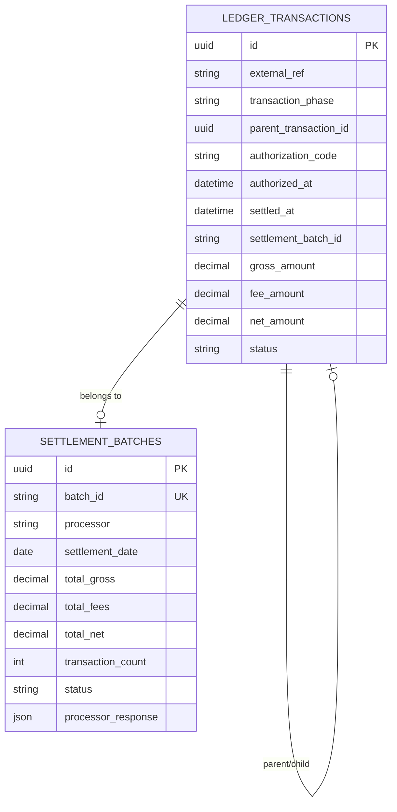

```sql
-- Add settlement tracking to ledger_transactions
ALTER TABLE ledger_transactions 
    ADD COLUMN transaction_phase VARCHAR(20) DEFAULT 'single',
    ADD COLUMN parent_transaction_id UUID REFERENCES ledger_transactions(id),
    ADD COLUMN authorization_code VARCHAR(255),
    ADD COLUMN authorized_at TIMESTAMP,
    ADD COLUMN settled_at TIMESTAMP,
    ADD COLUMN settlement_batch_id VARCHAR(255),
    ADD COLUMN gross_amount DECIMAL(19,4),
    ADD COLUMN fee_amount DECIMAL(19,4),
    ADD COLUMN net_amount DECIMAL(19,4);

-- Indexes for settlement queries
CREATE INDEX idx_txn_phase_status ON ledger_transactions(transaction_phase, status);
CREATE INDEX idx_txn_parent ON ledger_transactions(parent_transaction_id);
CREATE INDEX idx_txn_auth_code ON ledger_transactions(authorization_code);
CREATE INDEX idx_txn_batch ON ledger_transactions(settlement_batch_id);

-- Create settlement_batches table
CREATE TABLE settlement_batches (
    id UUID PRIMARY KEY,
    batch_id VARCHAR(255) NOT NULL UNIQUE,
    processor VARCHAR(50) NOT NULL,
    settlement_date DATE,
    total_gross DECIMAL(19,4),
    total_fees DECIMAL(19,4),
    total_net DECIMAL(19,4),
    transaction_count INTEGER,
    status VARCHAR(20), -- 'pending', 'processing', 'completed', 'failed'
    processor_response JSON,
    created_at TIMESTAMP NOT NULL,
    updated_at TIMESTAMP NOT NULL
);

CREATE INDEX idx_batch_processor_date ON settlement_batches(processor, settlement_date);
```

```pseudocode
STRUCT SettlementBatch:
    id: UUID
    batch_id: STRING
    processor: STRING
    settlement_date: DATE
    total_gross: DECIMAL
    total_fees: DECIMAL
    total_net: DECIMAL
    transaction_count: INT
    status: STRING
    processor_response: JSON
    created_at: TIMESTAMP
    updated_at: TIMESTAMP

FUNCTION recalculate_batch_totals(batch):
    batch.total_gross = SUM gross_amount FROM ledger_transactions 
        WHERE settlement_batch_id = batch.batch_id
    
    batch.total_fees = SUM fee_amount FROM ledger_transactions 
        WHERE settlement_batch_id = batch.batch_id
    
    batch.total_net = SUM net_amount FROM ledger_transactions 
        WHERE settlement_batch_id = batch.batch_id
    
    batch.transaction_count = COUNT ledger_transactions 
        WHERE settlement_batch_id = batch.batch_id
    
    SAVE batch
END FUNCTION
```

#### Step 2: Authorization Service

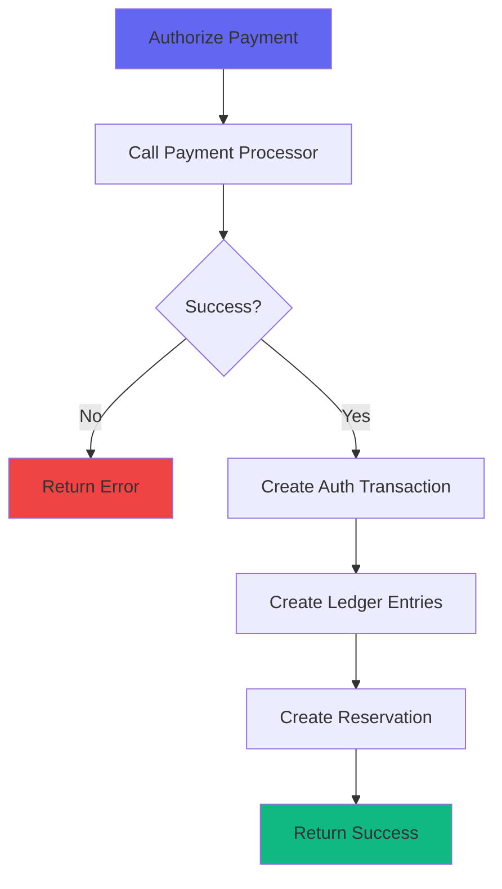

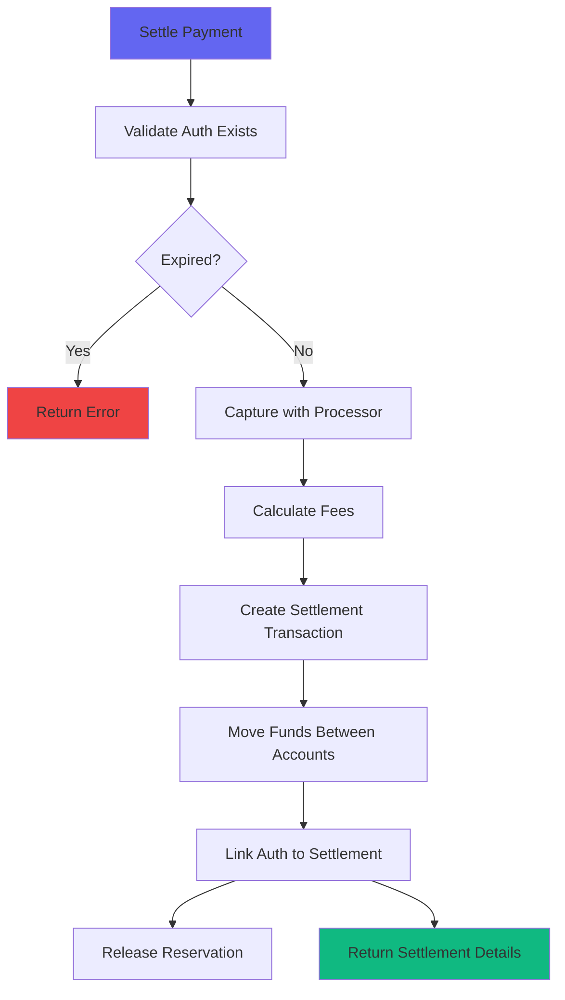

```pseudocode
SERVICE AuthorizationService:
    payment_processor: PaymentProcessor
    
    // Phase 1: Authorize the payment (hold funds)
    FUNCTION authorize_payment(
        amount, 
        currency, 
        payment_method, 
        merchant_account_id,
        customer_account_id,
        description,
        metadata
    ):
        BEGIN TRANSACTION
            
            // 1. Call payment processor to authorize
            authorization = CALL payment_processor.authorize(
                amount: amount,
                currency: currency,
                payment_method: payment_method,
                capture: false
            )
            
            IF authorization.status != 'succeeded':
                ROLLBACK TRANSACTION
                RETURN { success: false, error: authorization.failure_message }
            
            // 2. Create authorization transaction in ledger
            auth_transaction = CREATE ledger_transactions {
                external_ref: "auth:" + authorization.id,
                transaction_phase: 'authorization',
                authorization_code: authorization.id,
                authorized_at: NOW(),
                status: 'posted',
                description: "Authorization: " + description,
                gross_amount: amount,
                fee_amount: 0,
                net_amount: 0,
                metadata: MERGE metadata WITH {
                    authorization_id: authorization.id,
                    payment_method: payment_method
                }
            }
            
            // 3. Create entries (debit customer, credit holding account)
            CREATE ledger_entry {
                transaction_id: auth_transaction.id,
                account_id: customer_account_id,
                direction: 'debit',
                amount: amount,
                currency: currency,
                description: "Authorization hold"
            }
            
            holding_account = GET accounts 
                WHERE account_number = "holding_" + LOWER(currency)
            
            CREATE ledger_entry {
                transaction_id: auth_transaction.id,
                account_id: holding_account.id,
                direction: 'credit',
                amount: amount,
                currency: currency,
                description: "Authorization hold for " + authorization.id
            }
            
            // 4. Create reservation to track the hold
            CREATE reservations {
                account_id: customer_account_id,
                transaction_id: auth_transaction.id,
                amount: amount,
                reservation_type: 'authorization',
                expires_at: NOW() + 7 days,
                metadata: { authorization_id: authorization.id }
            }
            
        COMMIT TRANSACTION
        
        RETURN {
            success: true,
            authorization_id: authorization.id,
            transaction_id: auth_transaction.id,
            status: 'authorized'
        }
    END FUNCTION
    
    // Phase 2: Capture/Settle the authorized payment
    FUNCTION settle_payment(authorization_id, final_amount):
        auth_transaction = GET ledger_transactions
            WHERE authorization_code = authorization_id
            AND transaction_phase = 'authorization'
        
        IF auth_transaction.settled_at IS NOT NULL:
            RAISE error "Authorization already settled"
        
        IF auth_transaction.reservation.expired:
            RAISE error "Authorization expired"
        
        IF final_amount IS NULL:
            final_amount = auth_transaction.gross_amount
        
        BEGIN TRANSACTION
            
            // 1. Capture the payment with processor
            capture = CALL payment_processor.capture(
                authorization_id,
                amount: final_amount
            )
            
            // 2. Calculate fees
            fee_amount = CALL calculate_fees(final_amount, capture)
            net_amount = final_amount - fee_amount
            
            // 3. Create settlement transaction
            currency = auth_transaction.ledger_entries[0].currency
            
            settlement_transaction = CREATE ledger_transactions {
                external_ref: "capture:" + capture.id,
                transaction_phase: 'settlement',
                parent_transaction_id: auth_transaction.id,
                authorization_code: authorization_id,
                authorized_at: auth_transaction.authorized_at,
                settled_at: NOW(),
                status: 'posted',
                description: "Settlement for authorization " + authorization_id,
                gross_amount: final_amount,
                fee_amount: fee_amount,
                net_amount: net_amount,
                metadata: {
                    capture_id: capture.id,
                    original_authorization_id: authorization_id,
                    fee_breakdown: capture.fee_details
                }
            }
            
            // 4. Move funds from holding to actual accounts
            holding_account = GET accounts 
                WHERE account_number = "holding_" + LOWER(currency)
            merchant_account = GET accounts 
                WHERE account_number = "revenue_sales"
            fee_account = GET accounts 
                WHERE account_number = "expense_processor_fees"
            
            // Debit holding account (release the hold)
            CREATE ledger_entry {
                transaction_id: settlement_transaction.id,
                account_id: holding_account.id,
                direction: 'debit',
                amount: final_amount,
                currency: currency,
                description: "Release authorization hold"
            }
            
            // Credit merchant revenue (net amount)
            CREATE ledger_entry {
                transaction_id: settlement_transaction.id,
                account_id: merchant_account.id,
                direction: 'credit',
                amount: net_amount,
                currency: currency,
                description: "Revenue from settlement"
            }
            
            // Credit fee expense account
            CREATE ledger_entry {
                transaction_id: settlement_transaction.id,
                account_id: fee_account.id,
                direction: 'credit',
                amount: fee_amount,
                currency: currency,
                description: "Processing fee"
            }
            
            // 5. Link authorization to settlement
            UPDATE ledger_transactions SET
                settled_at = NOW(),
                net_amount = net_amount,
                fee_amount = fee_amount
            WHERE id = auth_transaction.id
            
            // 6. Release the reservation
            DELETE reservations WHERE transaction_id = auth_transaction.id
            
        COMMIT TRANSACTION
        
        RETURN {
            success: true,
            settlement_transaction_id: settlement_transaction.id,
            gross_amount: final_amount,
            fee_amount: fee_amount,
            net_amount: net_amount
        }
    END FUNCTION
    
    // Void an authorization (cancel before settlement)
    FUNCTION void_authorization(authorization_id, reason):
        auth_transaction = GET ledger_transactions
            WHERE authorization_code = authorization_id
            AND transaction_phase = 'authorization'
        
        IF auth_transaction.settled_at IS NOT NULL:
            RAISE error "Authorization already settled"
        
        BEGIN TRANSACTION
            
            // 1. Void with processor
            CALL payment_processor.void(authorization_id)
            
            // 2. Reverse the authorization transaction
            CALL reverse_transaction(auth_transaction, "Void: " + reason)
            
            // 3. Release reservation
            DELETE reservations WHERE transaction_id = auth_transaction.id
            
            // 4. Mark as voided
            UPDATE ledger_transactions SET
                status = 'reversed',
                metadata = MERGE metadata WITH {
                    voided_at: NOW(),
                    void_reason: reason
                }
            WHERE id = auth_transaction.id
            
        COMMIT TRANSACTION
        
        RETURN { success: true, message: "Authorization voided" }
    END FUNCTION
    
    // Process a batch settlement (end of day)
    FUNCTION process_settlement_batch(settlement_date):
        LOG "Processing settlement batch for " + settlement_date
        
        // 1. Get settlement batch from processor
        batch_data = CALL payment_processor.get_settlement_batch(settlement_date)
        
        // 2. Create or update settlement batch record
        batch = GET settlement_batches WHERE batch_id = batch_data.id
        
        IF batch IS NULL:
            batch = CREATE settlement_batches {
                batch_id: batch_data.id,
                processor: 'stripe',
                settlement_date: settlement_date,
                status: 'processing',
                processor_response: batch_data
            }
        
        // 3. Process each transaction in batch
        FOR EACH processor_txn IN batch_data.transactions:
            CALL process_batch_transaction(processor_txn, batch)
        
        // 4. Recalculate totals
        CALL recalculate_batch_totals(batch)
        UPDATE settlement_batches SET status = 'completed' WHERE id = batch.id
        
        LOG "Settlement batch processed: " + batch.transaction_count + 
            " transactions, " + batch.total_net + " net"
        
        RETURN batch
    END FUNCTION
    
    // Private helper functions
    FUNCTION calculate_fees(amount, capture_response):
        // Implement your fee structure
        // This is simplified - real implementations need complex fee logic
        RETURN ROUND(amount * 0.029 + 0.30, 2) // 2.9% + 30c
    END FUNCTION
    
    FUNCTION process_batch_transaction(processor_txn, batch):
        // Find the authorization
        auth_transaction = GET ledger_transactions
            WHERE authorization_code = processor_txn.authorization_id
        
        IF auth_transaction IS NULL:
            LOG error "Authorization not found for batch transaction: " + processor_txn.id
            RETURN
        
        // Create settlement
        result = CALL settle_payment(
            auth_transaction.authorization_code,
            final_amount: processor_txn.amount
        )
        
        IF result.success:
            UPDATE ledger_transactions SET
                settlement_batch_id = batch.batch_id
            WHERE id = result.settlement_transaction_id
    END FUNCTION
END SERVICE
```

#### Step 3: Controllers and API

```pseudocode
CONTROLLER AuthorizationsController:
    authentication: required
    
    FUNCTION authorize_payment(request):
        service = CREATE AuthorizationService()
        
        result = CALL service.authorize_payment(
            amount: PARSE request.amount AS decimal,
            currency: request.currency,
            payment_method: request.payment_method_id,
            merchant_account_id: current_user.merchant_account_id,
            customer_account_id: request.account_id,
            description: request.description,
            metadata: { order_id: request.order_id }
        )
        
        IF result.success:
            RETURN {
                authorization_id: result.authorization_id,
                status: 'authorized',
                transaction_id: result.transaction_id
            }
        ELSE:
            RETURN { error: result.error } WITH STATUS 422
    END FUNCTION
    
    FUNCTION capture_payment(request):
        service = CREATE AuthorizationService()
        
        result = CALL service.settle_payment(
            request.authorization_id,
            final_amount: IF request.final_amount THEN PARSE request.final_amount AS decimal ELSE NULL
        )
        
        IF result.success:
            RETURN {
                settlement_id: result.settlement_transaction_id,
                status: 'settled',
                gross_amount: result.gross_amount,
                fee_amount: result.fee_amount,
                net_amount: result.net_amount
            }
        ELSE:
            RETURN { error: result.error } WITH STATUS 422
    END FUNCTION
    
    FUNCTION void_authorization(request):
        service = CREATE AuthorizationService()
        
        result = CALL service.void_authorization(
            request.authorization_id,
            reason: request.reason
        )
        
        IF result.success:
            RETURN { status: 'voided' }
        ELSE:
            RETURN { error: result.error } WITH STATUS 422
    END FUNCTION
    
    FUNCTION list_pending_authorizations():
        authorizations = QUERY ledger_transactions
            WHERE transaction_phase = 'authorization'
            AND settled_at IS NULL
            AND status != 'reversed'
            JOIN ledger_entries ON ledger_transactions.id = ledger_entries.transaction_id
            ORDER BY authorized_at DESC
        
        RETURN MAP authorizations TO {
            id: auth.id,
            authorization_code: auth.authorization_code,
            amount: auth.gross_amount,
            currency: auth.ledger_entries[0].currency,
            authorized_at: auth.authorized_at,
            expires_at: auth.reservation.expires_at,
            status: IF auth.settled_at THEN 'settled' ELSE 'pending'
        }
    END FUNCTION
END CONTROLLER
```

#### Step 4: Reporting and Reconciliation

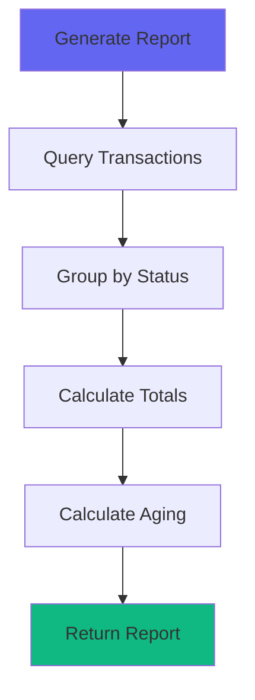

```pseudocode
SERVICE SettlementReportingService:
    // Report on authorizations pending settlement
    FUNCTION generate_pending_settlements_report(start_date, end_date):
        pending = QUERY ledger_transactions
            WHERE transaction_phase = 'authorization'
            AND settled_at IS NULL
            AND status != 'reversed'
            AND authorized_at BETWEEN start_date AND end_date
            JOIN ledger_entries ON ledger_transactions.id = ledger_entries.transaction_id
        
        RETURN {
            count: COUNT pending,
            total_amount: SUM pending.gross_amount,
            by_currency: GROUP SUM pending.gross_amount BY ledger_entries.currency,
            aging: {
                '0-1_days': COUNT pending WHERE authorized_at > NOW() - 1 day,
                '1-3_days': COUNT pending WHERE authorized_at BETWEEN NOW() - 3 days AND NOW() - 1 day,
                '3-7_days': COUNT pending WHERE authorized_at BETWEEN NOW() - 7 days AND NOW() - 3 days,
                '7+_days': COUNT pending WHERE authorized_at < NOW() - 7 days
            }
        }
    END FUNCTION
    
    // Daily settlement reconciliation
    FUNCTION reconcile_daily_settlements(date):
        // Get all settlements for the date
        settlements = QUERY ledger_transactions
            WHERE transaction_phase = 'settlement'
            AND settled_at BETWEEN start of date AND end of date
        
        // Group by batch
        by_batch = GROUP settlements BY settlement_batch_id
        batch_summary = MAP by_batch TO {
            batch_id: batch,
            count: COUNT transactions,
            gross: SUM gross_amount,
            fees: SUM fee_amount,
            net: SUM net_amount
        }
        
        RETURN {
            date: date,
            total_settlements: COUNT settlements,
            total_gross: SUM settlements.gross_amount,
            total_fees: SUM settlements.fee_amount,
            total_net: SUM settlements.net_amount,
            by_batch: batch_summary,
            unmatched_authorizations: CALL count_unmatched_authorizations(date)
        }
    END FUNCTION
    
    // Find authorizations that should have settled but didn't
    FUNCTION count_unmatched_authorizations(date):
        RETURN QUERY COUNT ledger_transactions
            WHERE transaction_phase = 'authorization'
            AND settled_at IS NULL
            AND authorized_at < date - 3 days
            AND status != 'reversed'
    END FUNCTION
    
    // Fee analysis
    FUNCTION analyze_fees(start_date, end_date):
        settlements = QUERY ledger_transactions
            WHERE transaction_phase = 'settlement'
            AND settled_at BETWEEN start_date AND end_date
        
        total_gross = SUM settlements.gross_amount
        total_fees = SUM settlements.fee_amount
        
        RETURN {
            period: start_date + " to " + end_date,
            total_volume: total_gross,
            total_fees: total_fees,
            effective_rate: IF total_gross > 0 THEN ROUND(total_fees / total_gross * 100, 2) ELSE 0,
            average_transaction: IF COUNT settlements > 0 THEN ROUND(total_gross / COUNT settlements, 2) ELSE 0,
            by_processor: GROUP SUM settlements.fee_amount BY metadata.processor
        }
    END FUNCTION
END SERVICE
```

#### Step 5: Schedule Settlement Processing

```pseudocode
SCHEDULE DailySettlementBatchJob:
    run_at: "04:00"
    action: 
        date = YESTERDAY
        service = CREATE AuthorizationService()
        CALL service.process_settlement_batch(date)
        OUTPUT "Processed settlement batch for " + date
END SCHEDULE

SCHEDULE PendingSettlementsReportJob:
    run_at: "09:00"
    action:
        report = CALL SettlementReportingService.generate_pending_settlements_report(
            start_date: NOW() - 7 days,
            end_date: TODAY
        )
        
        OUTPUT "Pending Settlements Report"
        OUTPUT "Total Pending: " + report.count
        OUTPUT "Total Amount: $" + report.total_amount
        OUTPUT "Aging:"
        FOR EACH bucket, count IN report.aging:
            OUTPUT "  " + bucket + ": " + count
        
        // Alert if old pending exists
        IF report.aging['7+_days'] > 0:
            CALL alert_service.notify_old_pending_settlements(report.aging['7+_days'])
END SCHEDULE

// CLI Task: Process daily settlement batch
TASK process_daily_settlement_batch:
    date = YESTERDAY
    service = CREATE AuthorizationService()
    CALL service.process_settlement_batch(date)
    OUTPUT "Processed settlement batch for " + date
END TASK

// CLI Task: Report on pending authorizations
TASK report_pending_authorizations:
    report = CALL SettlementReportingService.generate_pending_settlements_report(
        start_date: NOW() - 7 days,
        end_date: TODAY
    )
    
    OUTPUT "Pending Settlements Report"
    OUTPUT "=" * 50
    OUTPUT "Total Pending: " + report.count
    OUTPUT "Total Amount: $" + report.total_amount
    OUTPUT "\nAging:"
    FOR EACH bucket, count IN report.aging:
        OUTPUT "  " + bucket + ": " + count
    
    IF report.aging['7+_days'] > 0:
        CALL alert_service.notify_old_pending_settlements(report.aging['7+_days'])
END TASK

// CLI Task: Reconcile yesterday's settlements
TASK reconcile_settlements:
    reconciliation = CALL SettlementReportingService.reconcile_daily_settlements(YESTERDAY)
    
    OUTPUT "Settlement Reconciliation for " + reconciliation.date
    OUTPUT "=" * 50
    OUTPUT "Settlements: " + reconciliation.total_settlements
    OUTPUT "Gross: $" + reconciliation.total_gross
    OUTPUT "Fees: $" + reconciliation.total_fees
    OUTPUT "Net: $" + reconciliation.total_net
    OUTPUT "\nUnmatched Authorizations: " + reconciliation.unmatched_authorizations
END TASK
```

### Key Takeaways

1. **Always Separate Authorization from Settlement**: They are distinct business events with different accounting implications.

2. **Use Holding Accounts**: Don't credit revenue on authorization. Hold funds in a liability account until settlement completes.

3. **Track Fees Explicitly**: Processor fees are taken at settlement, not authorization. Record them separately for accurate reporting.

4. **Handle Partial Captures**: Some processors allow capturing less than the authorized amount. Your ledger needs to support this.

5. **Watch for Expirations**: Authorizations typically expire after 7 days. Build alerts for old pending authorizations.

6. **Batch Processing**: Process settlements in batches matching your processor's settlement cycles. This makes reconciliation much easier.


---

**Next: [Chapter 5: Data Quality & Best Practices →](/posts/ledger-system-chapter-5-data-quality)**

In the final chapter, we'll explore continuous data quality checks, holding accounts for unsettled funds, and production best practices.
