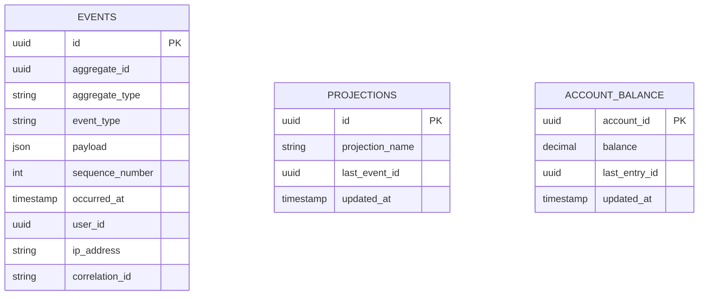
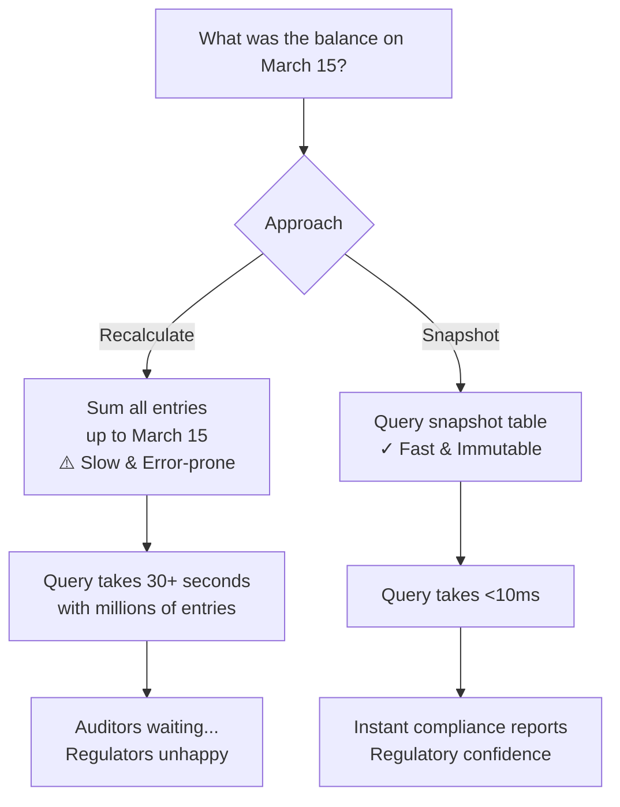
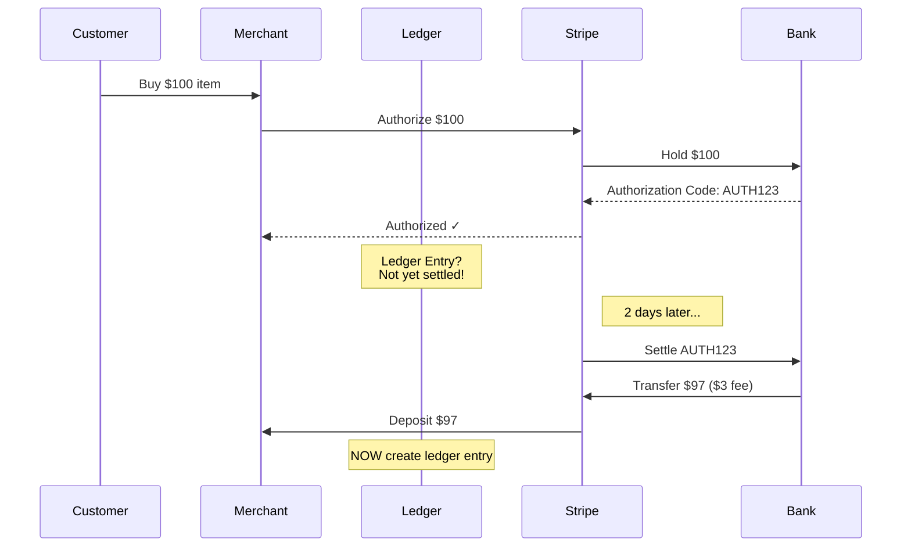

This is the fourth chapter in our five-part series on building production-ready ledger systems. In [Chapter 3](/posts/ledger-system-chapter-3-advanced), we covered multi-currency handling, reconciliation, and database locking. Now we'll focus on production operations: audit trails, balance snapshots, and settlement tracking.

## Audit Trail Queries: Finding the Truth

Event sourcing gives you an immutable history, but you need to query it effectively. Here's how to build audit trails that actually help.

### Event Store Schema



### Query Patterns

**1. Reconstruct Account History**

```ruby
class AuditQueryService
  # Get complete history of an account
  def self.account_history(account_id, from_date: nil, to_date: nil)
    LedgerEntry
      .joins(:transaction)
      .where(account_id: account_id)
      .where('ledger_transactions.posted_at BETWEEN ? AND ?', from_date, to_date)
      .order('ledger_transactions.posted_at ASC, ledger_entries.created_at ASC')
      .includes(:transaction)
      .map do |entry|
        {
          date: entry.transaction.posted_at,
          transaction_id: entry.transaction_id,
          external_ref: entry.transaction.external_ref,
          direction: entry.direction,
          amount: entry.amount,
          currency: entry.currency,
          running_balance: calculate_running_balance(account_id, entry)
        }
      end
  end
  
  # Calculate running balance at any point
  def self.balance_at(account_id, timestamp)
    LedgerEntry
      .joins(:transaction)
      .where(account_id: account_id)
      .where('ledger_transactions.posted_at <= ?', timestamp)
      .sum("CASE WHEN direction = 'credit' THEN amount ELSE -amount END")
  end
  
  # Find all transactions affecting an account in a time range
  def self.transactions_for_account(account_id, start_time:, end_time:)
    LedgerTransaction
      .joins(:entries)
      .where(ledger_entries: { account_id: account_id })
      .where(posted_at: start_time..end_time)
      .distinct
      .order(posted_at: :desc)
  end
end
```

**2. Trace Money Flow**

```ruby
class MoneyFlowTracer
  # Given a transaction, trace where the money came from and went
  def self.trace_transaction(transaction_id)
    txn = LedgerTransaction.find(transaction_id)
    
    {
      transaction: txn,
      debits: txn.entries.select { |e| e.direction == 'debit' },
      credits: txn.entries.select { |e| e.direction == 'credit' },
      source: trace_source(txn),
      destination: trace_destination(txn)
    }
  end
  
  # Find all transactions that contributed to a specific balance
  def self.trace_balance_composition(account_id, timestamp)
    entries = LedgerEntry
      .joins(:transaction)
      .where(account_id: account_id)
      .where('ledger_transactions.posted_at <= ?', timestamp)
      .order('ledger_transactions.posted_at DESC')
    
    balance = 0
    composition = []
    
    entries.each do |entry|
      change = entry.direction == 'credit' ? entry.amount : -entry.amount
      balance += change
      
      composition << {
        transaction_id: entry.transaction_id,
        source: entry.transaction.external_ref,
        amount: change,
        running_total: balance,
        timestamp: entry.transaction.posted_at
      }
    end
    
    composition.reverse # Chronological order
  end
end
```

**3. Detect Anomalies**

```ruby
class AnomalyDetector
  # Find transactions that don't balance
  def self.find_unbalanced_transactions(start_time:, end_time:)
    LedgerTransaction
      .where(posted_at: start_time..end_time)
      .select('ledger_transactions.*, SUM(CASE WHEN ledger_entries.direction = \'debit\' THEN ledger_entries.amount ELSE -ledger_entries.amount END) as balance')
      .joins(:entries)
      .group('ledger_transactions.id')
      .having('SUM(CASE WHEN ledger_entries.direction = \'debit\' THEN ledger_entries.amount ELSE -ledger_entries.amount END) != 0')
  end
  
  # Find accounts with negative balances (if not allowed)
  def self.find_negative_balances
    Account
      .where('balance < 0')
      .where.not(account_type: 'liability') # Liabilities can be negative
  end
  
  # Find duplicate external_refs (should never happen)
  def self.find_duplicate_refs
    LedgerTransaction
      .group(:external_ref)
      .having('COUNT(*) > 1')
      .where.not(external_ref: nil)
  end
  
  # Detect suspicious patterns (e.g., round numbers, velocity checks)
  def self.suspicious_activity_report(account_id:, time_window: 24.hours)
    transactions = LedgerTransaction
      .joins(:entries)
      .where(ledger_entries: { account_id: account_id })
      .where('posted_at > ?', time_window.ago)
    
    {
      total_volume: transactions.sum('ledger_entries.amount'),
      transaction_count: transactions.count,
      round_number_txns: transactions.where('ledger_entries.amount % 100 = 0').count,
      velocity_flag: transactions.count > 10 # Configurable threshold
    }
  end
end
```

**4. Event Replay for Projections**

```ruby
class ProjectionRebuilder
  # Rebuild a projection from events (useful for fixing bugs)
  def self.rebuild_account_balances
    # Clear existing projections
    AccountBalance.delete_all
    
    # Replay all events in order
    LedgerEntry
      .joins(:transaction)
      .where(ledger_transactions: { status: 'posted' })
      .order('ledger_transactions.posted_at ASC, ledger_entries.created_at ASC')
      .find_each do |entry|
        account_balance = AccountBalance.find_or_initialize_by(account_id: entry.account_id)
        
        change = entry.direction == 'credit' ? entry.amount : -entry.amount
        account_balance.balance = (account_balance.balance || 0) + change
        account_balance.last_entry_id = entry.id
        account_balance.updated_at = entry.transaction.posted_at
        account_balance.save!
      end
  end
  
  # Verify projections match source of truth
  def self.verify_balances
    discrepancies = []
    
    Account.find_each do |account|
      computed = LedgerEntry
        .joins(:transaction)
        .where(account_id: account.id, ledger_transactions: { status: 'posted' })
        .sum("CASE WHEN direction = 'credit' THEN amount ELSE -amount END")
      
      projected = AccountBalance.find_by(account_id: account.id)&.balance || 0
      
      if computed != projected
        discrepancies << {
          account_id: account.id,
          computed: computed,
          projected: projected,
          diff: computed - projected
        }
      end
    end
    
    discrepancies
  end
end
```

### Audit Trail Best Practices

**Always include context:**

```ruby
class LedgerTransaction < ApplicationRecord
  # Store audit context
  before_create :capture_audit_context
  
  private
  
  def capture_audit_context
    self.ip_address = Thread.current[:audit_ip]
    self.user_agent = Thread.current[:audit_user_agent]
    self.correlation_id = Thread.current[:correlation_id]
  end
end

# In your controller/middleware
Thread.current[:audit_ip] = request.remote_ip
Thread.current[:correlation_id] = request.headers['X-Request-ID'] || SecureRandom.uuid
```

**Use read replicas for heavy queries:**

```ruby
class AuditQueryService
  # Route heavy queries to read replica
  def self.expensive_report
    ActiveRecord::Base.connected_to(role: :reading) do
      # Complex aggregation queries here
    end
  end
end
```

**Index strategically:**

```ruby
class CreateLedgerEntries < ActiveRecord::Migration[7.0]
  def change
    create_table :ledger_entries do |t|
      t.references :transaction, null: false, foreign_key: true
      t.references :account, null: false, foreign_key: true
      t.string :direction, null: false
      t.decimal :amount, precision: 19, scale: 4, null: false
      t.string :currency, null: false
      t.timestamps
    end
    
    # Critical indexes for audit queries
    add_index :ledger_entries, [:account_id, :created_at], 
              name: 'idx_entries_account_time'
    add_index :ledger_entries, [:transaction_id, :account_id], 
              name: 'idx_entries_txn_account'
    
    # For balance calculations
    add_index :ledger_transactions, [:status, :posted_at], 
              name: 'idx_txn_status_time'
  end
end
```

## Improvements: Balance Snapshots

One critical gap in our implementation is **point-in-time balance tracking**. When regulators or auditors ask "What was the balance on March 15th at 2 PM?", you need a definitive answer—not a calculation based on replaying thousands of transactions.

### Why Balance Snapshots Matter



**Balance snapshots provide:**
- **Immutable audit records**: Prove balance at any historical point
- **Performance**: Sub-10ms queries vs. 30+ second recalculations  
- **Compliance**: Regulatory requirements often mandate snapshots
- **Debugging**: Quickly identify when balances diverged
- **Reconciliation**: Validate calculations haven't drifted

### Rails Implementation

#### Step 1: Migration

```ruby
# db/migrate/xxx_create_balance_snapshots.rb
class CreateBalanceSnapshots < ActiveRecord::Migration[7.0]
  def change
    create_table :balance_snapshots do |t|
      t.references :account, null: false, foreign_key: true
      t.decimal :balance, precision: 19, scale: 4, null: false
      t.decimal :available_balance, precision: 19, scale: 4, null: false
      t.string :snapshot_type, null: false # 'hourly', 'daily', 'end_of_day'
      t.datetime :captured_at, null: false
      t.bigint :last_entry_id # Last entry included in this snapshot
      t.bigint :transaction_count # Number of transactions since last snapshot
      t.decimal :net_change, precision: 19, scale: 4 # Change from previous snapshot
      t.timestamps
      
      # Critical indexes for fast lookups
      t.index [:account_id, :captured_at], 
              name: 'idx_snapshots_account_time'
      t.index [:snapshot_type, :captured_at],
              name: 'idx_snapshots_type_time'
      t.index :captured_at, 
              name: 'idx_snapshots_time'
    end
    
    # Add foreign key tracking to accounts
    add_column :accounts, :last_snapshot_at, :datetime
    add_column :accounts, :last_snapshot_id, :bigint
    add_index :accounts, :last_snapshot_at
  end
end
```

#### Step 2: Model

```ruby
# app/models/balance_snapshot.rb
class BalanceSnapshot < ApplicationRecord
  belongs_to :account
  
  validates :balance, numericality: true
  validates :available_balance, numericality: true
  validates :captured_at, presence: true
  validates :snapshot_type, inclusion: { in: %w[hourly daily end_of_day manual] }
  
  # Scopes for common queries
  scope :for_account, ->(account_id) { where(account_id: account_id) }
  scope :daily, -> { where(snapshot_type: 'daily') }
  scope :end_of_day, -> { where(snapshot_type: 'end_of_day') }
  scope :before, ->(time) { where('captured_at <= ?', time) }
  scope :after, ->(time) { where('captured_at >= ?', time) }
  
  # Get the most recent snapshot for an account
  def self.latest_for(account_id)
    for_account(account_id).order(captured_at: :desc).first
  end
  
  # Get snapshot at or before a specific time
  def self.at_time(account_id, time)
    for_account(account_id)
      .before(time)
      .order(captured_at: :desc)
      .first
  end
  
  # Verify this snapshot matches calculated balance
  def verify!
    calculated = calculate_current_balance
    
    if calculated != balance
      raise SnapshotVerificationError,
        "Snapshot verification failed for account #{account_id} at #{captured_at}. " \
        "Snapshot: #{balance}, Calculated: #{calculated}, Diff: #{calculated - balance}"
    end
    
    true
  end
  
  private
  
  def calculate_current_balance
    LedgerEntry
      .joins(:ledger_transaction)
      .where(account_id: account_id)
      .where('ledger_transactions.posted_at <= ?', captured_at)
      .sum("CASE WHEN direction = 'credit' THEN amount ELSE -amount END")
  end
end

class SnapshotVerificationError < StandardError; end
```

#### Step 3: Snapshot Service

```ruby
# app/services/ledger/balance_snapshot_service.rb
module Ledger
  class BalanceSnapshotService
    BATCH_SIZE = 1000 # Process accounts in batches
    
    # Create daily snapshots for all accounts
    def self.create_daily_snapshots(date: Date.yesterday)
      Rails.logger.info "Creating daily balance snapshots for #{date}"
      
      end_of_day = date.end_of_day
      snapshot_count = 0
      
      # Find all accounts with activity since last snapshot
      Account.find_each(batch_size: BATCH_SIZE) do |account|
        # Skip if already snapshotted for this date
        next if already_snapshotted?(account, date, 'daily')
        
        # Skip if no activity
        next unless account_activity_since?(account, account.last_snapshot_at)
        
        create_snapshot_for_account(account, end_of_day, 'daily')
        snapshot_count += 1
      end
      
      Rails.logger.info "Created #{snapshot_count} daily snapshots"
      snapshot_count
    end
    
    # Create end-of-day snapshots (for regulatory compliance)
    def self.create_end_of_day_snapshots(date: Date.yesterday)
      Rails.logger.info "Creating end-of-day balance snapshots for #{date}"
      
      # Use market close time or midnight UTC
      end_of_day = date.to_time.end_of_day.utc
      
      Account.find_each(batch_size: BATCH_SIZE) do |account|
        create_snapshot_for_account(account, end_of_day, 'end_of_day')
      end
    end
    
    # Create snapshot for a specific account at a specific time
    def self.create_snapshot_for_account(account, timestamp, snapshot_type)
      # Get last entry ID before this timestamp
      last_entry = LedgerEntry
        .joins(:ledger_transaction)
        .where(account_id: account.id)
        .where('ledger_transactions.posted_at <= ?', timestamp)
        .order('ledger_transactions.posted_at DESC, ledger_entries.created_at DESC')
        .first
      
      last_entry_id = last_entry&.id
      
      # Calculate balance at this point
      balance = LedgerEntry
        .joins(:ledger_transaction)
        .where(account_id: account.id)
        .where('ledger_transactions.posted_at <= ?', timestamp)
        .sum("CASE WHEN direction = 'credit' THEN amount ELSE -amount END")
      
      # Calculate available balance
      reservations = Reservation
        .where(account_id: account.id)
        .where('created_at <= ?', timestamp)
        .where('expires_at > ?', timestamp)
        .sum(:amount)
      
      available_balance = balance - reservations
      
      # Calculate change from previous snapshot
      previous_snapshot = BalanceSnapshot
        .for_account(account.id)
        .before(timestamp)
        .order(captured_at: :desc)
        .first
      
      net_change = previous_snapshot ? balance - previous_snapshot.balance : balance
      
      # Count transactions since last snapshot
      transaction_count = if previous_snapshot
        LedgerTransaction
          .joins(:ledger_entries)
          .where(ledger_entries: { account_id: account.id })
          .where('ledger_transactions.posted_at > ?', previous_snapshot.captured_at)
          .where('ledger_transactions.posted_at <= ?', timestamp)
          .distinct
          .count
      else
        LedgerTransaction
          .joins(:ledger_entries)
          .where(ledger_entries: { account_id: account.id })
          .where('ledger_transactions.posted_at <= ?', timestamp)
          .distinct
          .count
      end
      
      # Create snapshot
      snapshot = BalanceSnapshot.create!(
        account: account,
        balance: balance,
        available_balance: available_balance,
        snapshot_type: snapshot_type,
        captured_at: timestamp,
        last_entry_id: last_entry_id,
        transaction_count: transaction_count,
        net_change: net_change
      )
      
      # Update account's last snapshot reference
      account.update!(
        last_snapshot_at: timestamp,
        last_snapshot_id: snapshot.id
      )
      
      snapshot
    end
    
    # Get balance at a specific point in time (uses snapshots for performance)
    def self.balance_at_time(account_id, timestamp)
      # Find the most recent snapshot before this time
      snapshot = BalanceSnapshot
        .for_account(account_id)
        .before(timestamp)
        .order(captured_at: :desc)
        .first
      
      if snapshot
        # Apply entries since snapshot
        entries_since_snapshot = LedgerEntry
          .joins(:ledger_transaction)
          .where(account_id: account_id)
          .where('ledger_transactions.posted_at > ?', snapshot.captured_at)
          .where('ledger_transactions.posted_at <= ?', timestamp)
        
        change_since_snapshot = entries_since_snapshot
          .sum("CASE WHEN direction = 'credit' THEN amount ELSE -amount END")
        
        snapshot.balance + change_since_snapshot
      else
        # No snapshot exists, calculate from scratch (slow path)
        LedgerEntry
          .joins(:ledger_transaction)
          .where(account_id: account_id)
          .where('ledger_transactions.posted_at <= ?', timestamp)
          .sum("CASE WHEN direction = 'credit' THEN amount ELSE -amount END")
      end
    end
    
    # Verify all snapshots are correct (detect drift)
    def self.verify_snapshots(date: Date.yesterday)
      Rails.logger.info "Verifying balance snapshots for #{date}"
      
      discrepancies = []
      
      BalanceSnapshot
        .where(snapshot_type: 'end_of_day')
        .where('captured_at >= ?', date.beginning_of_day)
        .where('captured_at <= ?', date.end_of_day)
        .find_each do |snapshot|
          begin
            snapshot.verify!
          rescue SnapshotVerificationError => e
            discrepancies << {
              snapshot_id: snapshot.id,
              account_id: snapshot.account_id,
              error: e.message
            }
            Rails.logger.error e.message
          end
        end
      
      if discrepancies.any?
        AlertService.notify_balance_drift(discrepancies)
      end
      
      discrepancies
    end
    
    private
    
    def self.already_snapshotted?(account, date, snapshot_type)
      BalanceSnapshot
        .for_account(account.id)
        .where(snapshot_type: snapshot_type)
        .where('captured_at >= ?', date.beginning_of_day)
        .where('captured_at <= ?', date.end_of_day)
        .exists?
    end
    
    def self.account_activity_since?(account, since_time)
      return true if since_time.nil?
      
      LedgerEntry
        .joins(:ledger_transaction)
        .where(account_id: account.id)
        .where('ledger_transactions.posted_at > ?', since_time)
        .exists?
    end
  end
end
```

#### Step 4: Background Job

```ruby
# app/jobs/ledger/create_balance_snapshots_job.rb
module Ledger
  class CreateBalanceSnapshotsJob < ApplicationJob
    queue_as :maintenance
    
    def perform(date: Date.yesterday, snapshot_type: 'daily')
      Rails.logger.info "Creating #{snapshot_type} balance snapshots for #{date}"
      
      case snapshot_type
      when 'daily'
        BalanceSnapshotService.create_daily_snapshots(date: date)
      when 'end_of_day'
        BalanceSnapshotService.create_end_of_day_snapshots(date: date)
      else
        raise ArgumentError, "Unknown snapshot type: #{snapshot_type}"
      end
    end
  end
end

# app/jobs/ledger/verify_balance_snapshots_job.rb
module Ledger
  class VerifyBalanceSnapshotsJob < ApplicationJob
    queue_as :maintenance
    
    retry_on StandardError, attempts: 3
    
    def perform(date: Date.yesterday)
      discrepancies = BalanceSnapshotService.verify_snapshots(date: date)
      
      if discrepancies.any?
        Rails.logger.error "Found #{discrepancies.count} balance snapshot discrepancies!"
        # Alert the team
        BalanceDriftMailer.alert(discrepancies).deliver_now
      else
        Rails.logger.info "All balance snapshots verified successfully"
      end
    end
  end
end
```

#### Step 5: Usage Examples

```ruby
# Example 1: Get balance at a specific time (fast with snapshots)
class BalanceLookupService
  def self.balance_at(account_id, timestamp)
    Ledger::BalanceSnapshotService.balance_at_time(account_id, timestamp)
  end
  
  def self.balance_on_date(account_id, date)
    end_of_day = date.to_time.end_of_day
    balance_at(account_id, end_of_day)
  end
  
  def self.balance_change_during(account_id, start_time, end_time)
    start_balance = balance_at(account_id, start_time)
    end_balance = balance_at(account_id, end_time)
    
    {
      start_balance: start_balance,
      end_balance: end_balance,
      change: end_balance - start_balance
    }
  end
end

# Example 2: Generate compliance report
class ComplianceReportService
  def self.end_of_day_balances(date: Date.yesterday)
    # Get all EOD snapshots for the date
    snapshots = BalanceSnapshot
      .end_of_day
      .where('captured_at >= ?', date.beginning_of_day)
      .where('captured_at <= ?', date.end_of_day)
      .includes(:account)
    
    total_assets = snapshots
      .select { |s| s.account.asset? }
      .sum(&:balance)
    
    total_liabilities = snapshots
      .select { |s| s.account.liability? }
      .sum(&:balance)
    
    {
      date: date,
      snapshot_count: snapshots.count,
      total_assets: total_assets,
      total_liabilities: total_liabilities,
      net_position: total_assets - total_liabilities,
      generated_at: Time.current
    }
  end
end

# Example 3: Controller for audit queries
class Api::BalanceSnapshotsController < ApplicationController
  before_action :authenticate_user!
  before_action :require_auditor_role
  
  def show
    account = Account.find(params[:account_id])
    timestamp = Time.parse(params[:timestamp])
    
    balance = BalanceLookupService.balance_at(account.id, timestamp)
    snapshot = BalanceSnapshot.at_time(account.id, timestamp)
    
    render json: {
      account_id: account.id,
      account_number: account.account_number,
      timestamp: timestamp,
      balance: balance,
      based_on_snapshot: snapshot.present?,
      snapshot_captured_at: snapshot&.captured_at,
      entries_since_snapshot: snapshot ? 
        count_entries_since(account.id, snapshot.captured_at, timestamp) : nil
    }
  end
  
  def history
    account = Account.find(params[:account_id])
    start_date = Date.parse(params[:start_date])
    end_date = Date.parse(params[:end_date])
    
    snapshots = BalanceSnapshot
      .for_account(account.id)
      .where('captured_at >= ?', start_date.beginning_of_day)
      .where('captured_at <= ?', end_date.end_of_day)
      .order(captured_at: :asc)
    
    render json: {
      account_id: account.id,
      snapshots: snapshots.map do |s|
        {
          captured_at: s.captured_at,
          balance: s.balance,
          available_balance: s.available_balance,
          net_change: s.net_change,
          transaction_count: s.transaction_count
        }
      end
    }
  end
  
  private
  
  def count_entries_since(account_id, since_time, until_time)
    LedgerEntry
      .joins(:ledger_transaction)
      .where(account_id: account_id)
      .where('ledger_transactions.posted_at > ?', since_time)
      .where('ledger_transactions.posted_at <= ?', until_time)
      .count
  end
  
  def require_auditor_role
    unless current_user.has_role?(:auditor) || current_user.has_role?(:admin)
      render json: { error: 'Access denied' }, status: 403
    end
  end
end
```

#### Step 6: Schedule Snapshots

```ruby
# config/schedule.rb
every 1.day, at: '1:00 am' do
  rake 'ledger:create_daily_snapshots'
end

every 1.day, at: '2:00 am' do
  rake 'ledger:create_eod_snapshots'
end

every 1.day, at: '3:00 am' do
  rake 'ledger:verify_snapshots'
end

# lib/tasks/ledger_snapshots.rake
namespace :ledger do
  desc 'Create daily balance snapshots'
  task create_daily_snapshots: :environment do
    date = Date.yesterday
    Ledger::CreateBalanceSnapshotsJob.perform_now(date: date, snapshot_type: 'daily')
  end
  
  desc 'Create end-of-day balance snapshots'
  task create_eod_snapshots: :environment do
    date = Date.yesterday
    Ledger::CreateBalanceSnapshotsJob.perform_now(date: date, snapshot_type: 'end_of_day')
  end
  
  desc 'Verify balance snapshots for drift'
  task verify_snapshots: :environment do
    date = Date.yesterday
    Ledger::VerifyBalanceSnapshotsJob.perform_now(date: date)
  end
  
  desc 'Backfill snapshots for date range (use with caution)'
  task :backfill_snapshots, [:start_date, :end_date] => :environment do |t, args|
    start_date = Date.parse(args[:start_date])
    end_date = Date.parse(args[:end_date])
    
    (start_date..end_date).each do |date|
      puts "Creating snapshots for #{date}..."
      Ledger::BalanceSnapshotService.create_end_of_day_snapshots(date: date)
    end
    
    puts "Backfill complete!"
  end
end
```

### Key Takeaways

1. **Snapshots are Immutable Records**: Once created, they never change. They serve as proof of balance at a point in time.

2. **Hybrid Approach**: Use snapshots for the bulk of historical data, then apply recent entries on top. This gives you both speed and accuracy.

3. **Verify Regularly**: Run verification jobs to detect drift. If your calculated balance doesn't match the snapshot, you have a data integrity issue.

4. **Multiple Snapshot Types**: 
   - **Daily**: For trending and analytics
   - **End-of-Day**: For regulatory compliance
   - **Manual**: For audit investigations

5. **Don't Snapshot Everything**: Only snapshot accounts with activity. Empty accounts don't need daily snapshots.

6. **Compression Strategy**: For high-volume accounts, consider hourly snapshots during business hours and daily otherwise.

## Improvements: Settlement Tracking (Authorization vs Settlement)

Credit card payments have a critical two-phase flow that's often overlooked:

1. **Authorization**: Funds are held (reserved) immediately
2. **Settlement**: Funds actually move 1-3 days later

Your ledger needs to track both phases separately, or you'll have a nightmare reconciling with your payment processor.

### The Problem



**If you post to ledger on authorization:**
- Customer sees charge immediately (confusing)
- Reconciliation fails (authorized amount ≠ settled amount)
- Refunds become complex (void vs refund)

**If you wait for settlement:**
- Merchants can't see pending revenue
- Inventory management breaks
- Customer experience suffers

**Solution: Track both phases explicitly.**

### Rails Implementation

#### Step 1: Enhanced Transaction Model with Settlement Tracking

```ruby
# db/migrate/xxx_add_settlement_tracking.rb
class AddSettlementTracking < ActiveRecord::Migration[7.0]
  def change
    # Track authorization vs settlement
    add_column :ledger_transactions, :transaction_phase, :string, default: 'single'
    add_column :ledger_transactions, :parent_transaction_id, :bigint
    add_column :ledger_transactions, :authorization_code, :string
    add_column :ledger_transactions, :authorized_at, :datetime
    add_column :ledger_transactions, :settled_at, :datetime
    add_column :ledger_transactions, :settlement_batch_id, :string
    
    # Track fee breakdown (important for reconciliation)
    add_column :ledger_transactions, :gross_amount, :decimal, precision: 19, scale: 4
    add_column :ledger_transactions, :fee_amount, :decimal, precision: 19, scale: 4
    add_column :ledger_transactions, :net_amount, :decimal, precision: 19, scale: 4
    
    # Indexes for settlement queries
    add_index :ledger_transactions, [:transaction_phase, :status]
    add_index :ledger_transactions, :parent_transaction_id
    add_index :ledger_transactions, :authorization_code
    add_index :ledger_transactions, :settlement_batch_id
    
    # Create settlement batches table
    create_table :settlement_batches do |t|
      t.string :batch_id, null: false
      t.string :processor, null: false # 'stripe', 'adyen', etc.
      t.date :settlement_date
      t.decimal :total_gross, precision: 19, scale: 4
      t.decimal :total_fees, precision: 19, scale: 4
      t.decimal :total_net, precision: 19, scale: 4
      t.integer :transaction_count
      t.string :status # 'pending', 'processing', 'completed', 'failed'
      t.jsonb :processor_response
      t.timestamps
      
      t.index :batch_id, unique: true
      t.index [:processor, :settlement_date]
    end
  end
end

# app/models/settlement_batch.rb
class SettlementBatch < ApplicationRecord
  has_many :ledger_transactions, foreign_key: 'settlement_batch_id', primary_key: 'batch_id'
  
  validates :batch_id, presence: true, uniqueness: true
  validates :processor, presence: true
  validates :status, inclusion: { in: %w[pending processing completed failed] }
  
  # Calculate totals from transactions
  def recalculate_totals!
    self.total_gross = ledger_transactions.sum(:gross_amount)
    self.total_fees = ledger_transactions.sum(:fee_amount)
    self.total_net = ledger_transactions.sum(:net_amount)
    self.transaction_count = ledger_transactions.count
    save!
  end
end
```

#### Step 2: Authorization Service

```ruby
# app/services/ledger/authorization_service.rb
module Ledger
  class AuthorizationService
    def initialize(payment_processor: nil)
      @processor = payment_processor || Stripe::Client.new
    end
    
    # Phase 1: Authorize the payment (hold funds)
    def authorize_payment(
      amount:, 
      currency:, 
      payment_method:, 
      merchant_account_id:,
      customer_account_id:,
      description: nil,
      metadata: {}
    )
      ActiveRecord::Base.transaction do
        # 1. Call payment processor to authorize
        authorization = @processor.authorize(
          amount: (amount * 100).to_i, # cents
          currency: currency.downcase,
          payment_method: payment_method,
          capture: false # Don't settle yet!
        )
        
        unless authorization.status == 'succeeded'
          raise AuthorizationFailedError, "Authorization failed: #{authorization.failure_message}"
        end
        
        # 2. Create authorization transaction in ledger
        # This reserves funds but doesn't move them
        auth_transaction = LedgerTransaction.create!(
          external_ref: "auth:#{authorization.id}",
          transaction_phase: 'authorization',
          authorization_code: authorization.id,
          authorized_at: Time.current,
          status: 'posted', # Authorizations post immediately
          description: "Authorization: #{description}",
          gross_amount: amount,
          fee_amount: 0, # No fees on authorization
          net_amount: 0,
          metadata: metadata.merge(
            authorization_id: authorization.id,
            payment_method: payment_method
          )
        )
        
        # 3. Create entries (debit customer, credit pending/holding account)
        # Debit customer account (hold their funds)
        LedgerEntry.create!(
          ledger_transaction: auth_transaction,
          account_id: customer_account_id,
          direction: 'debit',
          amount: amount,
          currency: currency,
          description: "Authorization hold"
        )
        
        # Credit holding account (funds are held, not yet merchant's)
        holding_account = Account.find_by!(account_number: "holding_#{currency.downcase}")
        LedgerEntry.create!(
          ledger_transaction: auth_transaction,
          account_id: holding_account.id,
          direction: 'credit',
          amount: amount,
          currency: currency,
          description: "Authorization hold for #{authorization.id}"
        )
        
        # 4. Create reservation to track the hold
        Reservation.create!(
          account_id: customer_account_id,
          ledger_transaction: auth_transaction,
          amount: amount,
          reservation_type: 'authorization',
          expires_at: 7.days.from_now, # Authorizations typically expire
          metadata: { authorization_id: authorization.id }
        )
        
        {
          success: true,
          authorization_id: authorization.id,
          transaction_id: auth_transaction.id,
          status: 'authorized'
        }
      end
    rescue AuthorizationFailedError => e
      {
        success: false,
        error: e.message
      }
    end
    
    # Phase 2: Capture/Settle the authorized payment
    def settle_payment(authorization_id, final_amount: nil)
      auth_transaction = LedgerTransaction.find_by!(
        authorization_code: authorization_id,
        transaction_phase: 'authorization'
      )
      
      raise "Authorization already settled" if auth_transaction.settled_at.present?
      raise "Authorization expired" if auth_transaction.reservation&.expired?
      
      # Use original amount if not specified
      final_amount ||= auth_transaction.gross_amount
      
      ActiveRecord::Base.transaction do
        # 1. Capture the payment with processor
        capture = @processor.capture(
          authorization_id,
          amount: (final_amount * 100).to_i
        )
        
        # 2. Calculate fees (processor fees are taken at settlement)
        fee_amount = calculate_fees(final_amount, capture)
        net_amount = final_amount - fee_amount
        
        # 3. Create settlement transaction
        settlement_transaction = LedgerTransaction.create!(
          external_ref: "capture:#{capture.id}",
          transaction_phase: 'settlement',
          parent_transaction_id: auth_transaction.id,
          authorization_code: authorization_id,
          authorized_at: auth_transaction.authorized_at,
          settled_at: Time.current,
          status: 'posted',
          description: "Settlement for authorization #{authorization_id}",
          gross_amount: final_amount,
          fee_amount: fee_amount,
          net_amount: net_amount,
          metadata: {
            capture_id: capture.id,
            original_authorization_id: authorization_id,
            fee_breakdown: capture.fee_details
          }
        )
        
        # 4. Move funds from holding to actual accounts
        holding_account = Account.find_by!(account_number: "holding_#{auth_transaction.ledger_entries.first.currency.downcase}")
        merchant_account = Account.find_by!(account_number: "revenue_sales")
        fee_account = Account.find_by!(account_number: "expense_processor_fees")
        
        # Debit holding account (release the hold)
        LedgerEntry.create!(
          ledger_transaction: settlement_transaction,
          account_id: holding_account.id,
          direction: 'debit',
          amount: final_amount,
          currency: auth_transaction.ledger_entries.first.currency,
          description: "Release authorization hold"
        )
        
        # Credit merchant revenue (net amount)
        merchant_revenue_account = Account.find(merchant_account_id)
        LedgerEntry.create!(
          ledger_transaction: settlement_transaction,
          account_id: merchant_revenue_account.id,
          direction: 'credit',
          amount: net_amount,
          currency: auth_transaction.ledger_entries.first.currency,
          description: "Revenue from settlement"
        )
        
        # Credit fee expense account
        LedgerEntry.create!(
          ledger_transaction: settlement_transaction,
          account_id: fee_account.id,
          direction: 'credit',
          amount: fee_amount,
          currency: auth_transaction.ledger_entries.first.currency,
          description: "Processing fee"
        )
        
        # 5. Link authorization to settlement
        auth_transaction.update!(
          settled_at: Time.current,
          net_amount: net_amount,
          fee_amount: fee_amount
        )
        
        # 6. Release the reservation
        auth_transaction.reservation&.destroy
        
        {
          success: true,
          settlement_transaction_id: settlement_transaction.id,
          gross_amount: final_amount,
          fee_amount: fee_amount,
          net_amount: net_amount
        }
      end
    end
    
    # Void an authorization (cancel before settlement)
    def void_authorization(authorization_id, reason: nil)
      auth_transaction = LedgerTransaction.find_by!(
        authorization_code: authorization_id,
        transaction_phase: 'authorization'
      )
      
      raise "Authorization already settled" if auth_transaction.settled_at.present?
      
      ActiveRecord::Base.transaction do
        # 1. Void with processor
        @processor.void(authorization_id)
        
        # 2. Reverse the authorization transaction
        reversal_service = TransactionLifecycleService.new(auth_transaction)
        reversal_service.reverse_transaction(reason: "Void: #{reason}")
        
        # 3. Release reservation
        auth_transaction.reservation&.destroy
        
        # 4. Mark as voided
        auth_transaction.update!(
          status: 'reversed',
          metadata: auth_transaction.metadata.merge(voided_at: Time.current, void_reason: reason)
        )
        
        { success: true, message: "Authorization voided" }
      end
    end
    
    # Process a batch settlement (end of day)
    def process_settlement_batch(settlement_date: Date.yesterday)
      Rails.logger.info "Processing settlement batch for #{settlement_date}"
      
      # 1. Get settlement batch from processor
      batch_data = @processor.get_settlement_batch(settlement_date)
      
      # 2. Create or update settlement batch record
      batch = SettlementBatch.find_or_create_by!(batch_id: batch_data.id) do |b|
        b.processor = 'stripe'
        b.settlement_date = settlement_date
        b.status = 'processing'
        b.processor_response = batch_data.to_json
      end
      
      # 3. Process each transaction in batch
      batch_data.transactions.each do |processor_txn|
        process_batch_transaction(processor_txn, batch)
      end
      
      # 4. Recalculate totals
      batch.recalculate_totals!
      batch.update!(status: 'completed')
      
      Rails.logger.info "Settlement batch processed: #{batch.transaction_count} transactions, #{batch.total_net} net"
      
      batch
    end
    
    private
    
    def calculate_fees(amount, capture_response)
      # Implement your fee structure
      # This is simplified - real implementations need complex fee logic
      (amount * 0.029 + 0.30).round(2) # 2.9% + 30c
    end
    
    def process_batch_transaction(processor_txn, batch)
      # Find the authorization
      auth_transaction = LedgerTransaction.find_by(
        authorization_code: processor_txn.authorization_id
      )
      
      unless auth_transaction
        Rails.logger.error "Authorization not found for batch transaction: #{processor_txn.id}"
        return
      end
      
      # Create settlement
      result = settle_payment(
        auth_transaction.authorization_code,
        final_amount: processor_txn.amount / 100.0
      )
      
      if result[:success]
        # Link to batch
        LedgerTransaction.find(result[:settlement_transaction_id])
          .update!(settlement_batch_id: batch.batch_id)
      end
    end
  end
  
  class AuthorizationFailedError < StandardError; end
end
```

#### Step 3: Controllers and API

```ruby
# app/controllers/api/authorizations_controller.rb
module Api
  class AuthorizationsController < ApplicationController
    before_action :authenticate_user!
    
    def create
      service = Ledger::AuthorizationService.new
      
      result = service.authorize_payment(
        amount: params[:amount].to_d,
        currency: params[:currency],
        payment_method: params[:payment_method_id],
        merchant_account_id: current_user.merchant_account_id,
        customer_account_id: params[:account_id],
        description: params[:description],
        metadata: { order_id: params[:order_id] }
      )
      
      if result[:success]
        render json: {
          authorization_id: result[:authorization_id],
          status: 'authorized',
          transaction_id: result[:transaction_id]
        }
      else
        render json: { error: result[:error] }, status: 422
      end
    end
    
    def capture
      service = Ledger::AuthorizationService.new
      
      result = service.settle_payment(
        params[:authorization_id],
        final_amount: params[:final_amount]&.to_d
      )
      
      if result[:success]
        render json: {
          settlement_id: result[:settlement_transaction_id],
          status: 'settled',
          gross_amount: result[:gross_amount],
          fee_amount: result[:fee_amount],
          net_amount: result[:net_amount]
        }
      else
        render json: { error: result[:error] }, status: 422
      end
    end
    
    def void
      service = Ledger::AuthorizationService.new
      
      result = service.void_authorization(
        params[:authorization_id],
        reason: params[:reason]
      )
      
      if result[:success]
        render json: { status: 'voided' }
      else
        render json: { error: result[:error] }, status: 422
      end
    end
    
    def index
      # Show pending authorizations
      authorizations = LedgerTransaction
        .where(transaction_phase: 'authorization')
        .where(settled_at: nil)
        .where.not(status: 'reversed')
        .includes(:ledger_entries)
        .order(authorized_at: :desc)
      
      render json: authorizations.map { |auth|
        {
          id: auth.id,
          authorization_code: auth.authorization_code,
          amount: auth.gross_amount,
          currency: auth.ledger_entries.first&.currency,
          authorized_at: auth.authorized_at,
          expires_at: auth.reservation&.expires_at,
          status: auth.settled_at ? 'settled' : 'pending'
        }
      }
    end
  end
end
```

#### Step 4: Reporting and Reconciliation

```ruby
# app/services/settlement_reporting_service.rb
class SettlementReportingService
  # Report on authorizations pending settlement
  def self.pending_settlements_report(start_date:, end_date:)
    pending = LedgerTransaction
      .where(transaction_phase: 'authorization')
      .where(settled_at: nil)
      .where.not(status: 'reversed')
      .where(authorized_at: start_date.beginning_of_day..end_date.end_of_day)
      .includes(:ledger_entries)
    
    {
      count: pending.count,
      total_amount: pending.sum(:gross_amount),
      by_currency: pending.group('ledger_entries.currency').sum(:gross_amount),
      aging: {
        '0-1_days': pending.where('authorized_at > ?', 1.day.ago).count,
        '1-3_days': pending.where(authorized_at: 3.days.ago..1.day.ago).count,
        '3-7_days': pending.where(authorized_at: 7.days.ago..3.days.ago).count,
        '7+_days': pending.where('authorized_at < ?', 7.days.ago).count
      }
    }
  end
  
  # Daily settlement reconciliation
  def self.daily_settlement_reconciliation(date: Date.yesterday)
    # Get all settlements for the date
    settlements = LedgerTransaction
      .where(transaction_phase: 'settlement')
      .where(settled_at: date.beginning_of_day..date.end_of_day)
    
    # Group by batch
    by_batch = settlements.group_by(&:settlement_batch_id).transform_values do |txns|
      {
        count: txns.count,
        gross: txns.sum(:gross_amount),
        fees: txns.sum(:fee_amount),
        net: txns.sum(:net_amount)
      }
    end
    
    # Calculate totals
    {
      date: date,
      total_settlements: settlements.count,
      total_gross: settlements.sum(:gross_amount),
      total_fees: settlements.sum(:fee_amount),
      total_net: settlements.sum(:net_amount),
      by_batch: by_batch,
      unmatched_authorizations: unmatched_authorizations_count(date)
    }
  end
  
  # Find authorizations that should have settled but didn't
  def self.unmatched_authorizations_count(date)
    LedgerTransaction
      .where(transaction_phase: 'authorization')
      .where(settled_at: nil)
      .where('authorized_at < ?', date.end_of_day - 3.days) # Older than 3 days
      .where.not(status: 'reversed')
      .count
  end
  
  # Fee analysis
  def self.fee_analysis(start_date:, end_date:)
    settlements = LedgerTransaction
      .where(transaction_phase: 'settlement')
      .where(settled_at: start_date.beginning_of_day..end_date.end_of_day)
    
    total_gross = settlements.sum(:gross_amount)
    total_fees = settlements.sum(:fee_amount)
    
    {
      period: "#{start_date} to #{end_date}",
      total_volume: total_gross,
      total_fees: total_fees,
      effective_rate: total_gross > 0 ? (total_fees / total_gross * 100).round(2) : 0,
      average_transaction: settlements.count > 0 ? (total_gross / settlements.count).round(2) : 0,
      by_processor: settlements.group(:metadata['processor']).sum(:fee_amount)
    }
  end
end
```

#### Step 5: Schedule Settlement Processing

```ruby
# config/schedule.rb
every 1.day, at: '4:00 am' do
  rake 'settlements:process_daily_batch'
end

every 1.day, at: '9:00 am' do
  rake 'settlements:report_pending'
end

# lib/tasks/settlements.rake
namespace :settlements do
  desc 'Process daily settlement batch'
  task process_daily_batch: :environment do
    date = Date.yesterday
    
    service = Ledger::AuthorizationService.new
    service.process_settlement_batch(settlement_date: date)
    
    puts "Processed settlement batch for #{date}"
  end
  
  desc 'Report on pending authorizations'
  task report_pending: :environment do
    report = SettlementReportingService.pending_settlements_report(
      start_date: 7.days.ago.to_date,
      end_date: Date.today
    )
    
    puts "Pending Settlements Report"
    puts "=" * 50
    puts "Total Pending: #{report[:count]}"
    puts "Total Amount: $#{report[:total_amount]}"
    puts "\nAging:"
    report[:aging].each do |bucket, count|
      puts "  #{bucket}: #{count}"
    end
    
    # Alert if old pending exists
    if report[:aging]['7+_days'] > 0
      AlertService.notify_old_pending_settlements(report[:aging]['7+_days'])
    end
  end
  
  desc 'Reconcile yesterday\'s settlements'
  task reconcile: :environment do
    reconciliation = SettlementReportingService.daily_settlement_reconciliation
    
    puts "Settlement Reconciliation for #{reconciliation[:date]}"
    puts "=" * 50
    puts "Settlements: #{reconciliation[:total_settlements]}"
    puts "Gross: $#{reconciliation[:total_gross]}"
    puts "Fees: $#{reconciliation[:total_fees]}"
    puts "Net: $#{reconciliation[:total_net]}"
    puts "\nUnmatched Authorizations: #{reconciliation[:unmatched_authorizations]}"
  end
end
```

### Key Takeaways

1. **Always Separate Authorization from Settlement**: They are distinct business events with different accounting implications.

2. **Use Holding Accounts**: Don't credit revenue on authorization. Hold funds in a liability account until settlement completes.

3. **Track Fees Explicitly**: Processor fees are taken at settlement, not authorization. Record them separately for accurate reporting.

4. **Handle Partial Captures**: Some processors allow capturing less than the authorized amount. Your ledger needs to support this.

5. **Watch for Expirations**: Authorizations typically expire after 7 days. Build alerts for old pending authorizations.

6. **Batch Processing**: Process settlements in batches matching your processor's settlement cycles. This makes reconciliation much easier.


---

**Next: [Chapter 5: Data Quality & Best Practices →](/posts/ledger-system-chapter-5-data-quality)**

In the final chapter, we'll explore continuous data quality checks, holding accounts for unsettled funds, and production best practices.
