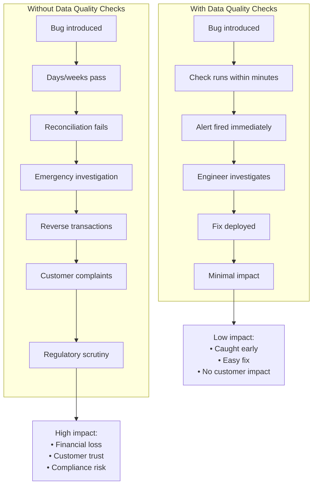
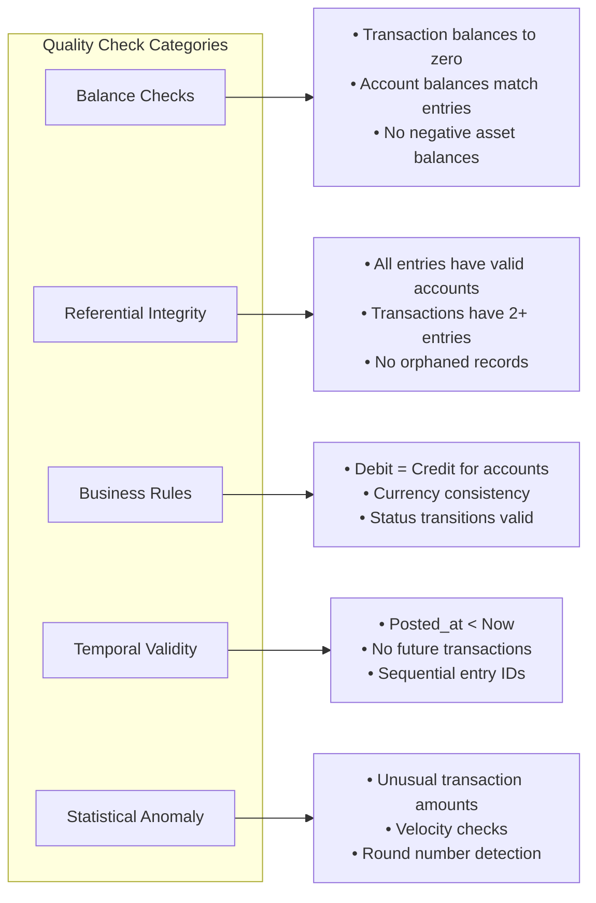
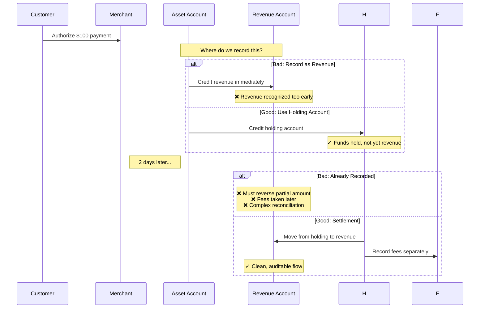
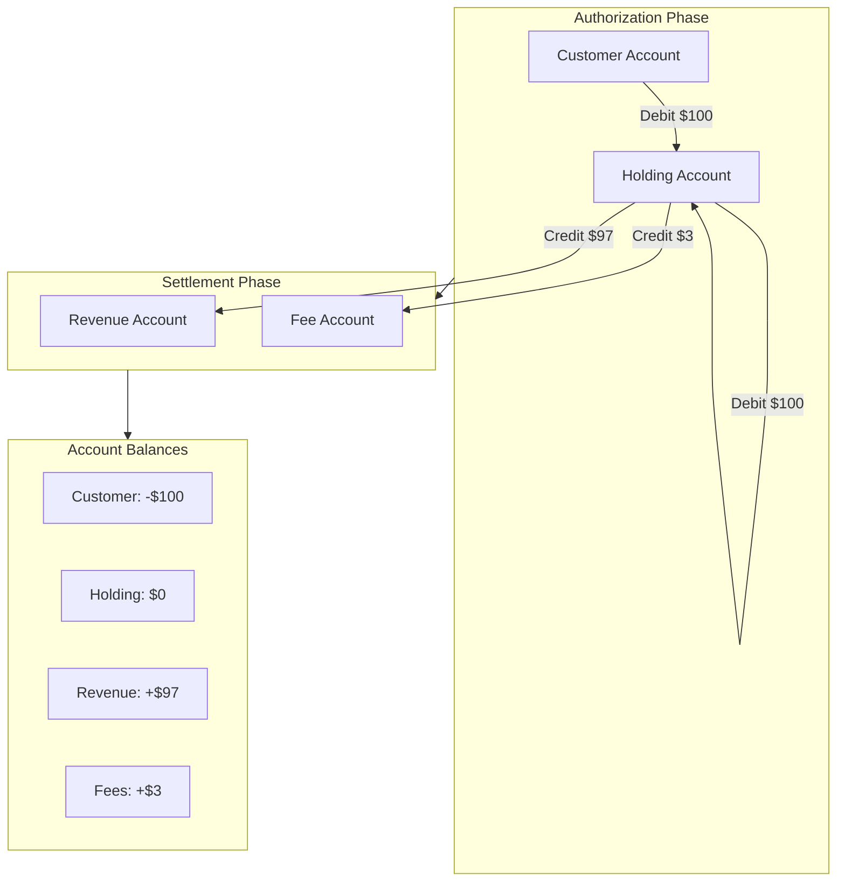
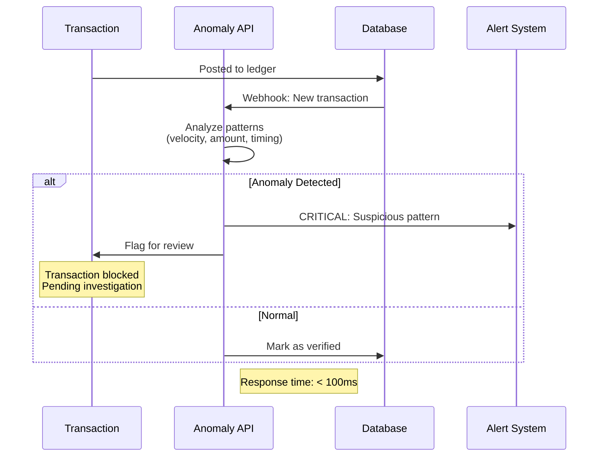
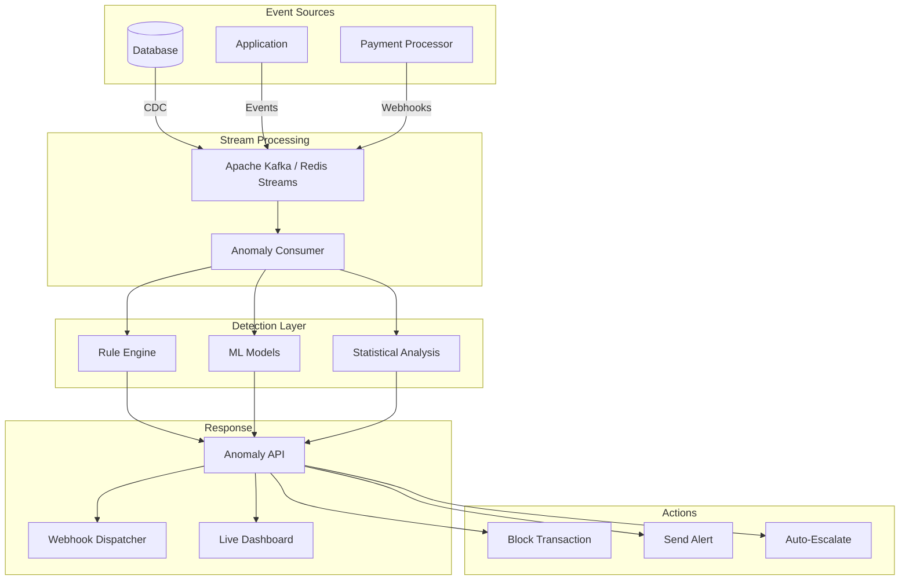

This is the final chapter in our five-part series on building production-ready ledger systems. In the previous chapters, we covered foundations, transaction lifecycles, advanced topics, and production operations. Now we'll focus on keeping your ledger healthy with continuous data quality checks and handling unsettled funds with holding accounts.

## Improvements: Continuous Data Quality Checks

The worst time to discover a ledger bug is when your accountant asks why the trial balance doesn't match. Data quality checks catch problems before they become disasters.

### Why Continuous Validation Matters



### Types of Data Quality Checks



[Continue with the data quality checks implementation from the original file...]

## Improvements: Holding Accounts for Unsettled Funds

One of the most important patterns in financial systems is the **holding account** (also called a float, suspense, or clearing account). When money is in flight—authorized but not yet settled—you need a place to track it.

### The Problem

Without holding accounts, your accounting gets messy:



**Why holding accounts matter:**
- **Revenue Recognition**: Don't count money as revenue until it's actually settled
- **Fee Transparency**: Processors take fees at settlement, not authorization
- **Reconciliation**: Makes matching with processor reports straightforward
- **Audit Trail**: Clear paper trail of where money sits at each stage
- **Error Handling**: If settlement fails, money is still tracked

### Real-World Example: The $50,000 Clearing Nightmare

Let me tell you about a real problem I encountered at a fintech startup. We processed $2M in payments on Black Friday. By Monday, our books were $50,000 off, and nobody knew why.

#### The Problem: No Holding Accounts

Here's what happened:

**Friday (Authorization Day):**

```
Pseudocode: WRONG approach - recording revenue immediately

FUNCTION process_payment(amount, customer_id):
    // Authorize with payment processor
    authorization = payment_processor.authorize(
        amount: amount,
        currency: 'usd',
        capture: false  // Just authorize, don't settle yet
    )
    
    // ❌ WRONG: Recorded as revenue immediately
    transaction = create_transaction(
        from_account: customer_id,
        to_account: 'revenue',  // Revenue credited immediately!
        amount: amount,
        status: 'completed'
    )
    
    // Customer sees charge on their card
    // Company sees revenue in books
    // Everyone thinks transaction is done
    RETURN transaction
END FUNCTION
```

**Monday Morning (The Disaster):**
```
Finance: "Our Stripe dashboard shows $1,950,000 in settlements, 
          but our ledger shows $2,000,000 in revenue. 
          Where's the missing $50,000?"

Engineering: "Let me check..."

Found the issues:
1. 23 transactions failed settlement (card expired, insufficient funds)
   Total: $4,200 - We recorded revenue, customer never paid

2. 156 transactions had fees deducted 
   Total: $45,800 - We recorded gross, Stripe settled net

3. 3 transactions were duplicate authorizations
   Total: $1,500 - Recorded twice, settled once

Total discrepancy: $51,500
```

**The Cleanup (2 weeks of hell):**

```
Pseudocode: Manual fixes required

// 1. Reverse 23 failed transactions
FOR EACH failed_transaction IN failed_transactions:
    create_reversal_entry(failed_transaction, reason: "Settlement failed")
END FOR

// 2. Adjust 156 transactions for fees
FOR EACH fee_transaction IN fees_transactions:
    // Create fee expense entries
    create_adjustment_entry(fee_transaction, fee_amount: calculate_fee(fee_transaction))
END FOR

// 3. Find and reverse 3 duplicates
FOR EACH duplicate IN duplicates:
    create_reversal_entry(duplicate, reason: "Duplicate authorization")
END FOR

// 4. Reconcile with Stripe (took 3 days)
// 5. Explain to auditors why revenue numbers changed
// 6. Restate financials for November
```

**Root Cause:** We treated authorizations like completed payments. They're not.

#### The Solution: Implementing Holding Accounts

Here's how we fixed it:

**Step 1: Database Schema Update**

```sql
-- Create holding account
INSERT INTO accounts (
    account_number,
    account_type,
    name,
    description
) VALUES (
    'holding_usd',
    'liability',
    'USD Holding Account',
    'Unsettled payment authorizations'
);

-- Track authorization state
ALTER TABLE transactions ADD COLUMN authorization_id VARCHAR;
ALTER TABLE transactions ADD COLUMN settled_at TIMESTAMP;
CREATE INDEX idx_transactions_authorization_id ON transactions(authorization_id);
```

**Step 2: Fixed Payment Service**

```
Pseudocode: Payment Service with Holding Accounts

CONSTANTS:
    HOLDING_ACCOUNT = 'holding_usd'
    REVENUE_ACCOUNT = 'revenue_sales'
    FEE_ACCOUNT = 'expense_processor_fees'

FUNCTION process_payment(amount, customer_id):
    // Step 1: Authorize with payment processor
    authorization = payment_processor.authorize(
        amount: amount,
        currency: 'usd',
        capture: false
    )
    
    BEGIN TRANSACTION
        // ✓ CORRECT: Record authorization (funds held, not revenue)
        auth_txn = create_ledger_transaction(
            external_ref: authorization.id,
            status: 'posted',
            transaction_type: 'authorization',
            description: "Authorization: " + authorization.id
        )
        
        // Debit customer (hold their funds)
        create_ledger_entry(
            transaction: auth_txn,
            account_id: customer_id,
            direction: 'debit',
            amount: amount,
            description: "Authorization hold"
        )
        
        // Credit holding account (not revenue!)
        create_ledger_entry(
            transaction: auth_txn,
            account_number: HOLDING_ACCOUNT,
            direction: 'credit',
            amount: amount,
            description: "Funds held for " + authorization.id
        )
    COMMIT TRANSACTION
    
    RETURN { success: true, authorization_id: authorization.id }
END FUNCTION

FUNCTION settle_payment(authorization_id):
    // Step 2: Actually charge the card (settlement)
    charge = payment_processor.capture(authorization_id)
    
    // Calculate actual amounts
    gross_amount = charge.amount
    fee_amount = calculate_processor_fee(gross_amount)
    net_amount = gross_amount - fee_amount
    
    BEGIN TRANSACTION
        // Create settlement transaction
        settlement_txn = create_ledger_transaction(
            external_ref: "settlement:" + charge.id,
            status: 'posted',
            transaction_type: 'settlement',
            description: "Settlement for auth " + authorization_id
        )
        
        holding_account = get_account(HOLDING_ACCOUNT)
        
        // 1. Debit holding (release the hold)
        create_ledger_entry(
            transaction: settlement_txn,
            account: holding_account,
            direction: 'debit',
            amount: gross_amount
        )
        
        // 2. Credit revenue (net amount only)
        create_ledger_entry(
            transaction: settlement_txn,
            account_number: REVENUE_ACCOUNT,
            direction: 'credit',
            amount: net_amount
        )
        
        // 3. Credit fee expense
        create_ledger_entry(
            transaction: settlement_txn,
            account_number: FEE_ACCOUNT,
            direction: 'credit',
            amount: fee_amount
        )
        
        // Mark authorization as settled
        auth_txn = get_transaction_by_external_ref(authorization_id)
        update_transaction(auth_txn, settled_at: current_time())
    COMMIT TRANSACTION
    
    RETURN { 
        success: true, 
        gross: gross_amount,
        fees: fee_amount,
        net: net_amount
    }
END FUNCTION

FUNCTION void_authorization(authorization_id, reason):
    // Step 3: Handle failed/expired authorizations
    payment_processor.void(authorization_id)
    
    auth_txn = get_transaction_by_external_ref(authorization_id)
    
    BEGIN TRANSACTION
        // Return funds to customer
        reversal_txn = create_ledger_transaction(
            external_ref: "void:" + authorization_id,
            status: 'posted',
            transaction_type: 'void',
            description: "Void: " + reason
        )
        
        holding_account = get_account(HOLDING_ACCOUNT)
        
        // Debit holding
        create_ledger_entry(
            transaction: reversal_txn,
            account: holding_account,
            direction: 'debit',
            amount: auth_txn.amount
        )
        
        // Credit customer
        create_ledger_entry(
            transaction: reversal_txn,
            account_id: auth_txn.source_account_id,
            direction: 'credit',
            amount: auth_txn.amount
        )
    COMMIT TRANSACTION
END FUNCTION

FUNCTION calculate_processor_fee(amount):
    RETURN ROUND(amount * 0.029 + 0.30, 2)
END FUNCTION
```

**Step 3: Daily Reconciliation Report**

```
Pseudocode: Daily Reconciliation Report

FUNCTION generate_daily_reconciliation_report(date):
    holding_account = get_account('holding_usd')
    
    // Authorizations from date
    authorizations = SUM(
        SELECT amount FROM transactions
        WHERE transaction_type = 'authorization'
        AND created_at BETWEEN date.start AND date.end
    )
    
    // Settlements from date
    settlements = SUM(
        SELECT amount FROM transactions
        WHERE transaction_type = 'settlement'
        AND created_at BETWEEN date.start AND date.end
    )
    
    // Voids from date
    voids = SUM(
        SELECT amount FROM transactions
        WHERE transaction_type = 'void'
        AND created_at BETWEEN date.start AND date.end
    )
    
    // Outstanding (should match holding account balance)
    outstanding = authorizations - settlements - voids
    holding_balance = holding_account.balance
    
    report = {
        date: date,
        authorizations: authorizations,
        settlements: settlements,
        voids: voids,
        outstanding: outstanding,
        holding_balance: holding_balance,
        discrepancy: outstanding - holding_balance
    }
    
    // Alert if discrepancy
    IF report.discrepancy != 0:
        send_alert(
            message: "Holding account discrepancy: $" + report.discrepancy,
            level: 'critical'
        )
    END IF
    
    RETURN report
END FUNCTION

// Example output:
// {
//   date: 2024-11-29,
//   authorizations: 2000000.00,  // $2M authorized
//   settlements: 1950000.00,      // $1.95M settled
//   voids: 4200.00,               // $4,200 voided
//   outstanding: 45800.00,        // $45,800 still pending
//   holding_balance: 45800.00,    // ✓ Matches!
//   discrepancy: 0.00             // ✓ No issues
// }
```

#### The Results

After implementing holding accounts:

1. **Zero reconciliation discrepancies** - Authorizations, settlements, and voids always balance
2. **Instant fee tracking** - Fees recorded at settlement time, not guessed
3. **Clear audit trail** - Every dollar traceable from customer → holding → revenue
4. **No more restatements** - Financial reports are accurate from day one
5. **Happy auditors** - Clean, defensible accounting

**The holding account balance should always equal:**
```
Total Authorizations - Total Settlements - Total Voids = Holding Account Balance
```

If it doesn't, you have a bug. Fix it immediately.

### The Holding Account Pattern



### Implementation

#### Step 1: Schema and Models

```sql
-- Add holding account type to accounts
ALTER TABLE accounts ADD COLUMN is_holding_account BOOLEAN DEFAULT false;
CREATE INDEX idx_accounts_holding ON accounts(is_holding_account);

-- Track fund movements
CREATE TABLE fund_movements (
    id BIGINT PRIMARY KEY,
    source_account_id BIGINT NOT NULL REFERENCES accounts(id),
    destination_account_id BIGINT NOT NULL REFERENCES accounts(id),
    ledger_transaction_id BIGINT NOT NULL REFERENCES transactions(id),
    amount DECIMAL(19,4) NOT NULL,
    movement_type VARCHAR NOT NULL, -- 'authorization', 'settlement', 'refund', 'chargeback'
    status VARCHAR DEFAULT 'pending', -- 'pending', 'completed', 'failed', 'reversed'
    occurred_at TIMESTAMP,
    metadata JSON,
    created_at TIMESTAMP,
    updated_at TIMESTAMP
);

CREATE INDEX idx_fund_movements_type_status ON fund_movements(movement_type, status);
CREATE INDEX idx_fund_movements_transaction ON fund_movements(ledger_transaction_id, movement_type);

-- Add settlement tracking to transactions
ALTER TABLE transactions ADD COLUMN holding_account_id BIGINT REFERENCES accounts(id);
CREATE INDEX idx_transactions_holding ON transactions(holding_account_id);
```

```
Pseudocode: Fund Movement Model

MODEL FundMovement:
    FIELDS:
        source_account: Reference to Account
        destination_account: Reference to Account
        ledger_transaction: Reference to Transaction
        amount: Decimal (must be > 0)
        movement_type: Enum ['authorization', 'settlement', 'refund', 'chargeback', 'adjustment']
        status: Enum ['pending', 'completed', 'failed', 'reversed']
    
    VALIDATIONS:
        amount must be greater than 0
        movement_type must be valid enum value
        status must be valid enum value
    
    QUERY SCOPES:
        pending() -> Filter by status = 'pending'
        completed() -> Filter by status = 'completed'
        for_holding_account(account_id) -> Filter where source or destination is account_id
END MODEL
```

#### Step 2: Holding Account Service

```
Pseudocode: Holding Account Service

SERVICE HoldingAccountService:
    CONSTANT HOLDING_ACCOUNT_PREFIX = 'holding_'
    
    // Get or create holding account for a currency
    FUNCTION get_holding_account(currency):
        account_number = HOLDING_ACCOUNT_PREFIX + LOWERCASE(currency)
        
        account = FIND account WHERE account_number = account_number
        
        IF account NOT EXISTS:
            account = CREATE account(
                account_number: account_number,
                account_type: 'liability',
                currency: UPPERCASE(currency),
                is_holding_account: true,
                status: 'active',
                description: "Holding account for " + currency + " unsettled funds"
            )
        END IF
        
        RETURN account
    END FUNCTION
    
    // Move funds to holding (authorization)
    FUNCTION hold_funds(from_account_id, amount, currency, transaction, metadata):
        holding_account = get_holding_account(currency)
        
        BEGIN TRANSACTION
            // Create ledger entries
            create_ledger_entry(
                transaction: transaction,
                account_id: from_account_id,
                direction: 'debit',
                amount: amount,
                currency: currency,
                description: "Hold funds: " + metadata.reason OR 'Authorization'
            )
            
            create_ledger_entry(
                transaction: transaction,
                account: holding_account,
                direction: 'credit',
                amount: amount,
                currency: currency,
                description: "Funds held from account " + from_account_id
            )
            
            // Track the movement
            create_fund_movement(
                source_account_id: from_account_id,
                destination_account: holding_account,
                ledger_transaction: transaction,
                amount: amount,
                movement_type: 'authorization',
                status: 'completed',
                occurred_at: current_time(),
                metadata: metadata
            )
            
            // Update transaction reference
            update_transaction(transaction, holding_account_id: holding_account.id)
        COMMIT TRANSACTION
        
        RETURN {
            success: true,
            holding_account_id: holding_account.id,
            amount_held: amount
        }
    END FUNCTION
    
    // Release funds from holding to final destination (settlement)
    FUNCTION release_funds(holding_transaction, to_account_id, amount, fee_amount, metadata):
        holding_account = get_account(holding_transaction.holding_account_id)
        currency = holding_transaction.ledger_entries[0].currency
        
        net_amount = amount - fee_amount
        
        BEGIN TRANSACTION
            // Create new settlement transaction
            settlement_txn = create_ledger_transaction(
                external_ref: "settlement:" + holding_transaction.external_ref,
                status: 'posted',
                posted_at: current_time(),
                parent_transaction: holding_transaction,
                description: "Settlement for " + holding_transaction.external_ref,
                metadata: {
                    original_transaction_id: holding_transaction.id,
                    gross_amount: amount,
                    fee_amount: fee_amount,
                    net_amount: net_amount
                }
            )
            
            // Debit holding account
            create_ledger_entry(
                ledger_transaction: settlement_txn,
                account: holding_account,
                direction: 'debit',
                amount: amount,
                currency: currency,
                description: "Release held funds"
            )
            
            // Credit destination
            create_ledger_entry(
                ledger_transaction: settlement_txn,
                account_id: to_account_id,
                direction: 'credit',
                amount: net_amount,
                currency: currency,
                description: "Settlement received"
            )
            
            // Credit fee account (if fees exist)
            IF fee_amount > 0:
                fee_account = get_account("expense_processor_fees")
                create_ledger_entry(
                    ledger_transaction: settlement_txn,
                    account: fee_account,
                    direction: 'credit',
                    amount: fee_amount,
                    currency: currency,
                    description: "Processing fees"
                )
            END IF
            
            // Track movement
            create_fund_movement(
                source_account: holding_account,
                destination_account_id: to_account_id,
                ledger_transaction: settlement_txn,
                amount: net_amount,
                movement_type: 'settlement',
                status: 'completed',
                occurred_at: current_time(),
                metadata: metadata
            )
            
            // Mark original as settled
            update_transaction(holding_transaction, 
                settled_at: current_time(),
                metadata: MERGE(holding_transaction.metadata, { settled: true })
            )
        COMMIT TRANSACTION
        
        RETURN {
            success: true,
            settlement_transaction_id: settlement_txn.id,
            net_amount: net_amount,
            fee_amount: fee_amount
        }
    END FUNCTION
    
    // Return held funds to source (void authorization)
    FUNCTION return_funds(holding_transaction, reason):
        holding_account = get_account(holding_transaction.holding_account_id)
        currency = holding_transaction.ledger_entries[0].currency
        
        // Find the original source account
        original_entry = FIND entry WHERE 
            transaction = holding_transaction AND direction = 'debit'
        source_account_id = original_entry.account_id
        amount = original_entry.amount
        
        BEGIN TRANSACTION
            // Create reversal transaction
            reversal_txn = create_ledger_transaction(
                external_ref: "void:" + holding_transaction.external_ref,
                status: 'posted',
                posted_at: current_time(),
                parent_transaction: holding_transaction,
                description: "Void: " + reason OR 'Authorization cancelled',
                metadata: { 
                    voided_transaction_id: holding_transaction.id,
                    void_reason: reason 
                }
            )
            
            // Debit holding (remove the hold)
            create_ledger_entry(
                ledger_transaction: reversal_txn,
                account: holding_account,
                direction: 'debit',
                amount: amount,
                currency: currency,
                description: "Release hold back to source"
            )
            
            // Credit source account
            create_ledger_entry(
                ledger_transaction: reversal_txn,
                account_id: source_account_id,
                direction: 'credit',
                amount: amount,
                currency: currency,
                description: "Authorization voided"
            )
            
            // Track movement
            create_fund_movement(
                source_account: holding_account,
                destination_account_id: source_account_id,
                ledger_transaction: reversal_txn,
                amount: amount,
                movement_type: 'refund',
                status: 'completed',
                occurred_at: current_time(),
                metadata: { void_reason: reason }
            )
            
            // Mark original as reversed
            transition_transaction(holding_transaction, 'reversed')
        COMMIT TRANSACTION
        
        RETURN { success: true, reversal_transaction_id: reversal_txn.id }
    END FUNCTION
    
    // Get current holdings summary
    FUNCTION holdings_summary(currency):
        scope = fund_movements WHERE status = 'completed'
        
        IF currency PROVIDED:
            scope = scope WHERE transactions.currency = currency
        END IF
        
        RETURN {
            total_authorized: SUM(scope WHERE movement_type = 'authorization'),
            total_settled: SUM(scope WHERE movement_type = 'settlement'),
            total_refunded: SUM(scope WHERE movement_type = 'refund'),
            total_chargebacks: SUM(scope WHERE movement_type = 'chargeback'),
            net_outstanding: SUM(authorization) - SUM(settlement + refund + chargeback)
        }
    END FUNCTION
    
    // Find stale holdings (authorized but not settled)
    FUNCTION stale_holdings(older_than):
        RETURN fund_movements WHERE
            movement_type = 'authorization' AND
            status = 'completed' AND
            created_at < (current_time() - older_than) AND
            ledger_transaction_id NOT IN (
                SELECT ledger_transaction_id FROM fund_movements
                WHERE movement_type IN ['settlement', 'refund']
            )
    END FUNCTION
END SERVICE
```

#### Step 3: Usage Examples

```
Pseudocode: Payment Service with Holding Accounts

SERVICE PaymentWithHoldingService:
    FUNCTION process_payment(payment_params):
        // Step 1: Authorize with processor
        authorization = payment_processor.authorize(
            amount: payment_params.amount,
            currency: payment_params.currency,
            payment_method: payment_params.payment_method_id
        )
        
        // Step 2: Hold funds in ledger
        hold_transaction = create_ledger_transaction(
            external_ref: authorization.id,
            status: 'posted',
            transaction_phase: 'authorization',
            description: "Authorization for order " + payment_params.order_id
        )
        
        // Create the entries
        HoldingAccountService.hold_funds(
            from_account_id: payment_params.customer_account_id,
            amount: payment_params.amount,
            currency: payment_params.currency,
            transaction: hold_transaction,
            metadata: {
                order_id: payment_params.order_id,
                customer_id: payment_params.customer_id,
                authorization_id: authorization.id
            }
        )
        
        // Step 3: Later, settle the funds (could be async via webhook)
        settlement = payment_processor.capture(authorization.id)
        
        fee_amount = calculate_stripe_fee(payment_params.amount)
        
        HoldingAccountService.release_funds(
            holding_transaction: hold_transaction,
            to_account_id: payment_params.merchant_account_id,
            amount: payment_params.amount,
            fee_amount: fee_amount,
            metadata: {
                settlement_id: settlement.id,
                order_id: payment_params.order_id
            }
        )
        
        RETURN {
            success: true,
            authorization_id: authorization.id,
            net_amount: payment_params.amount - fee_amount
        }
    END FUNCTION
    
    FUNCTION void_authorization(authorization_id, reason):
        hold_transaction = FIND transaction WHERE
            external_ref = authorization_id AND
            transaction_phase = 'authorization'
        
        // Void with processor
        payment_processor.void(authorization_id)
        
        // Return funds to customer
        HoldingAccountService.return_funds(
            holding_transaction: hold_transaction,
            reason: reason
        )
    END FUNCTION
    
    PRIVATE FUNCTION calculate_stripe_fee(amount):
        RETURN ROUND(amount * 0.029 + 0.30, 2)
    END FUNCTION
END SERVICE

// Example 2: Monitoring holdings
SERVICE HoldingsMonitor:
    FUNCTION daily_report():
        summary = HoldingAccountService.holdings_summary()
        stale = HoldingAccountService.stale_holdings(older_than: 3 days)
        
        RETURN {
            summary: summary,
            stale_count: COUNT(stale),
            stale_amount: SUM(stale.amount),
            alerts: generate_alerts(summary, stale)
        }
    END FUNCTION
    
    FUNCTION generate_alerts(summary, stale):
        alerts = []
        
        // Alert if outstanding > threshold
        IF summary.net_outstanding > 1,000,000:
            alerts.ADD("High outstanding holdings: $" + summary.net_outstanding)
        END IF
        
        // Alert on stale holdings
        IF COUNT(stale) > 0:
            alerts.ADD(COUNT(stale) + " stale holdings over 3 days old")
        END IF
        
        RETURN alerts
    END FUNCTION
END SERVICE
```

### Key Takeaways

1. **Always Use Holding Accounts**: Never record revenue on authorization. Hold funds in a liability account until settlement.

2. **Track Fund Movements**: Create `FundMovement` records to track every transfer into and out of holding accounts.

3. **Handle Fees Explicitly**: Processors deduct fees at settlement. Record them separately for accurate financial reporting.

4. **Monitor Stale Holdings**: Authorizations expire. Build alerts for holdings that haven't settled within expected timeframes.

5. **Support Partial Settlements**: Some authorizations can be partially captured. Your ledger needs to handle this.

---

## Real-Time Transaction Lifecycle Anomaly Detection

Data quality checks running every 5 minutes are good, but what if you need to catch anomalies **within seconds** of them happening? Real-time anomaly detection lets you stop bad transactions before they propagate through your system.

### Why Real-Time Matters



**Scenarios where real-time detection saves you:**
- **Velocity attack**: Same account making 50 transactions in 1 minute (bot/fraud)
- **Round number clustering**: 100 transactions of exactly $100.00 (testing stolen cards)
- **Off-hours activity**: Large transfers at 3 AM from accounts that never transact at night
- **Rapid state changes**: Transaction going from pending → posted → reversed in 10 seconds (bug)
- **Balance drift**: Account balance changing faster than entries can explain (data corruption)

### Architecture: Streaming Anomaly Detection



### Implementation: Real-Time Anomaly Detection

#### Step 1: Database Schema for Real-Time Tracking

```sql
-- Track transaction events for streaming
CREATE TABLE transaction_events (
    id BIGINT PRIMARY KEY,
    ledger_transaction_id BIGINT NOT NULL REFERENCES transactions(id),
    event_type VARCHAR NOT NULL, -- 'created', 'status_changed', 'posted'
    from_status VARCHAR,
    to_status VARCHAR,
    event_data JSON,
    occurred_at TIMESTAMP NOT NULL,
    created_at TIMESTAMP,
    updated_at TIMESTAMP
);

CREATE INDEX idx_transaction_events_transaction ON transaction_events(ledger_transaction_id, occurred_at);
CREATE INDEX idx_transaction_events_type ON transaction_events(event_type, occurred_at);

-- Real-time anomaly detections
CREATE TABLE anomaly_detections (
    id BIGINT PRIMARY KEY,
    ledger_transaction_id BIGINT NOT NULL REFERENCES transactions(id),
    anomaly_type VARCHAR NOT NULL,
    severity VARCHAR NOT NULL, -- 'low', 'medium', 'high', 'critical'
    risk_score DECIMAL(5,2), -- 0.00 to 100.00
    details JSON,
    status VARCHAR DEFAULT 'open', -- 'open', 'investigating', 'resolved', 'false_positive'
    detected_by_id BIGINT, -- User who reviewed
    resolution_notes TEXT,
    resolved_at TIMESTAMP,
    created_at TIMESTAMP,
    updated_at TIMESTAMP
);

CREATE INDEX idx_anomalies_type_status ON anomaly_detections(anomaly_type, status);
CREATE INDEX idx_anomalies_severity ON anomaly_detections(severity, created_at);
CREATE INDEX idx_anomalies_score ON anomaly_detections(risk_score);

-- Sliding window statistics for real-time analysis
CREATE TABLE window_statistics (
    id BIGINT PRIMARY KEY,
    account_id BIGINT NOT NULL REFERENCES accounts(id),
    window_type VARCHAR NOT NULL, -- '1_minute', '5_minute', '1_hour'
    window_start TIMESTAMP NOT NULL,
    transaction_count INTEGER DEFAULT 0,
    total_amount DECIMAL(19,4) DEFAULT 0,
    avg_amount DECIMAL(19,4),
    max_amount DECIMAL(19,4),
    velocity_metrics JSON,
    created_at TIMESTAMP,
    updated_at TIMESTAMP
);

CREATE INDEX idx_window_stats_account ON window_statistics(account_id, window_type, window_start);
```

#### Step 2: Real-Time Anomaly Detection Service

```
Pseudocode: Real-Time Anomaly Detection Service

SERVICE AnomalyDetectionService:
    CONSTANT VELOCITY_THRESHOLD = 10 // transactions per minute
    CONSTANT AMOUNT_DEVIATION_THRESHOLD = 3.0 // standard deviations
    CONSTANT ROUND_NUMBER_THRESHOLD = 0.8 // 80% round numbers
    
    FUNCTION init(transaction):
        this.transaction = transaction
        this.anomalies = []
    END FUNCTION
    
    // Main entry point - analyze transaction in real-time
    FUNCTION analyze():
        log("Analyzing transaction " + transaction.id + " for anomalies")
        
        // Run all detection checks
        check_velocity_anomaly()
        check_amount_anomaly()
        check_round_number_pattern()
        check_rapid_state_transitions()
        check_off_hours_activity()
        check_geographic_anomaly()
        check_balance_consistency()
        
        // Store detections
        store_anomalies()
        
        // Return summary
        RETURN {
            transaction_id: transaction.id,
            anomalies_found: COUNT(this.anomalies),
            max_severity: MAX(this.anomalies.severity) OR 'none',
            risk_score: calculate_overall_risk_score(),
            details: this.anomalies
        }
    END FUNCTION
    
    // Check 1: Velocity - Too many transactions too fast
    PRIVATE FUNCTION check_velocity_anomaly():
        account_id = transaction.ledger_entries[0].account_id
        IF account_id IS NULL: RETURN
        
        // Count transactions in last minute
        recent_count = COUNT(
            SELECT * FROM transaction_events
            WHERE event_type = 'created'
            AND occurred_at > (current_time() - 1 minute)
            AND ledger_transaction_id IN (
                SELECT id FROM transactions
                JOIN ledger_entries ON transactions.id = ledger_entries.transaction_id
                WHERE ledger_entries.account_id = account_id
            )
        )
        
        IF recent_count > VELOCITY_THRESHOLD:
            severity = IF recent_count > VELOCITY_THRESHOLD * 2 THEN 'critical' ELSE 'high'
            ADD anomaly {
                type: 'velocity_anomaly',
                severity: severity,
                risk_score: MIN(recent_count * 5, 100),
                details: {
                    transactions_in_last_minute: recent_count,
                    threshold: VELOCITY_THRESHOLD,
                    account_id: account_id
                },
                description: recent_count + " transactions in last minute (threshold: " + VELOCITY_THRESHOLD + ")"
            }
        END IF
    END FUNCTION
    
    // Check 2: Amount - Unusually large amount
    PRIVATE FUNCTION check_amount_anomaly():
        account_id = transaction.ledger_entries[0].account_id
        IF account_id IS NULL: RETURN
        
        // Get amount
        amount = SUM(transaction.ledger_entries.amount)
        
        // Calculate historical statistics
        stats = SELECT 
            AVG(avg_amount) as historical_avg,
            STDDEV(avg_amount) as historical_stddev
        FROM window_statistics
        WHERE account_id = account_id
        AND window_type = '1_hour'
        AND window_start > (current_time() - 30 days)
        
        IF stats.historical_avg IS NULL OR stats.historical_stddev IS NULL: RETURN
        
        // Calculate z-score
        z_score = (amount - stats.historical_avg) / stats.historical_stddev
        
        IF z_score > AMOUNT_DEVIATION_THRESHOLD:
            severity = IF z_score > AMOUNT_DEVIATION_THRESHOLD * 2 THEN 'critical' ELSE 'high'
            ADD anomaly {
                type: 'amount_anomaly',
                severity: severity,
                risk_score: MIN(z_score * 15, 100),
                details: {
                    amount: amount,
                    historical_avg: stats.historical_avg,
                    z_score: ROUND(z_score, 2)
                },
                description: "Amount $" + amount + " is " + ROUND(z_score, 2) + " standard deviations above average"
            }
        END IF
    END FUNCTION
    
    // Check 3: Round numbers - Suspicious pattern
    PRIVATE FUNCTION check_round_number_pattern():
        entries = transaction.ledger_entries
        
        round_count = COUNT(entries WHERE amount > 100 AND amount % 100 == 0)
        total_entries = COUNT(entries)
        
        IF total_entries > 0 AND (round_count / total_entries) > ROUND_NUMBER_THRESHOLD:
            ADD anomaly {
                type: 'round_number_pattern',
                severity: 'medium',
                risk_score: 60,
                details: {
                    round_amounts: round_count,
                    total_entries: total_entries,
                    percentage: ROUND((round_count / total_entries) * 100, 2)
                },
                description: round_count + "/" + total_entries + " entries are suspiciously round numbers"
            }
        END IF
    END FUNCTION
    
    // Check 4: Rapid state changes - Potential bug
    PRIVATE FUNCTION check_rapid_state_transitions():
        transitions = SELECT * FROM state_transitions
        WHERE transaction_id = transaction.id
        ORDER BY created_at ASC
        
        IF COUNT(transitions) < 2: RETURN
        
        // Check if multiple transitions happened within 10 seconds
        FOR EACH prev, curr IN PAIRS(transitions):
            time_diff = curr.created_at - prev.created_at
            
            IF time_diff < 10 seconds:
                ADD anomaly {
                    type: 'rapid_state_transition',
                    severity: 'high',
                    risk_score: 85,
                    details: {
                        from_state: prev.from_status,
                        to_state: curr.to_status,
                        time_difference_seconds: ROUND(time_diff, 2)
                    },
                    description: "State changed from " + prev.from_status + " to " + curr.to_status + " in " + ROUND(time_diff, 2) + "s"
                }
            END IF
        END FOR
    END FUNCTION
    
    // Check 5: Off-hours activity
    PRIVATE FUNCTION check_off_hours_activity():
        posted_at = transaction.posted_at OR current_time()
        account_id = transaction.ledger_entries[0].account_id
        
        IF account_id IS NULL: RETURN
        
        // Check if transaction is outside business hours (9 AM - 6 PM)
        hour = EXTRACT_HOUR(posted_at)
        is_business_hours = hour >= 9 AND hour < 18
        
        // Check historical pattern for this account
        historical_hours = SELECT 
            EXTRACT_HOUR(posted_at) as hour,
            COUNT(*) as count
        FROM transactions
        JOIN ledger_entries ON transactions.id = ledger_entries.transaction_id
        WHERE ledger_entries.account_id = account_id
        AND transactions.id != transaction.id
        AND posted_at > (current_time() - 90 days)
        GROUP BY EXTRACT_HOUR(posted_at)
        
        // If account never transacts during this hour
        current_hour_transactions = historical_hours[hour] OR 0
        total_transactions = SUM(historical_hours.count)
        
        IF total_transactions > 10 AND current_hour_transactions == 0 AND NOT is_business_hours:
            ADD anomaly {
                type: 'off_hours_activity',
                severity: 'medium',
                risk_score: 55,
                details: {
                    transaction_hour: hour,
                    is_business_hours: is_business_hours,
                    historical_transactions_this_hour: current_hour_transactions
                },
                description: "Transaction at " + hour + ":00 - account never transacts during this hour"
            }
        END IF
    END FUNCTION
    
    // Check 6: Geographic anomaly (if IP tracking enabled)
    PRIVATE FUNCTION check_geographic_anomaly():
        IF transaction.metadata.ip_address IS NULL: RETURN
        
        ip = transaction.metadata.ip_address
        account_id = transaction.ledger_entries[0].account_id
        
        // Get country from IP (simplified - use GeoIP in production)
        current_country = ip_country_lookup(ip)
        
        // Get historical countries for this account
        historical_countries = SELECT DISTINCT metadata->>'country'
        FROM transactions
        JOIN ledger_entries ON transactions.id = ledger_entries.transaction_id
        WHERE ledger_entries.account_id = account_id
        AND transactions.id != transaction.id
        AND created_at > (current_time() - 30 days)
        
        IF COUNT(historical_countries) > 0 AND current_country NOT IN historical_countries:
            ADD anomaly {
                type: 'geographic_anomaly',
                severity: 'high',
                risk_score: 75,
                details: {
                    current_country: current_country,
                    historical_countries: historical_countries,
                    ip_address: ip
                },
                description: "Transaction from " + current_country + " - account usually transacts from " + JOIN(historical_countries, ', ')
            }
        END IF
    END FUNCTION
    
    // Check 7: Balance consistency
    PRIVATE FUNCTION check_balance_consistency():
        FOR EACH entry IN transaction.ledger_entries:
            account = entry.account
            
            // Calculate expected balance after this transaction
            IF entry.direction == 'credit':
                expected_balance = account.balance - entry.amount
            ELSE:
                expected_balance = account.balance + entry.amount
            END IF
            
            // Get sum of all entries for this account
            calculated_balance = SELECT SUM(
                CASE WHEN direction = 'credit' THEN amount ELSE -amount END
            )
            FROM ledger_entries
            JOIN transactions ON ledger_entries.transaction_id = transactions.id
            WHERE account_id = account.id
            AND transactions.status = 'posted'
            AND transactions.posted_at <= transaction.posted_at
            
            IF ABS(expected_balance - calculated_balance) > 0.01:
                ADD anomaly {
                    type: 'balance_inconsistency',
                    severity: 'critical',
                    risk_score: 100,
                    details: {
                        account_id: account.id,
                        expected_balance: expected_balance,
                        calculated_balance: calculated_balance,
                        difference: ROUND(expected_balance - calculated_balance, 2)
                    },
                    description: "CRITICAL: Balance drift detected in account " + account.account_number
                }
            END IF
        END FOR
    END FUNCTION
    
    PRIVATE FUNCTION store_anomalies():
        FOR EACH anomaly IN this.anomalies:
            CREATE anomaly_detection(
                transaction: transaction,
                anomaly_type: anomaly.type,
                severity: anomaly.severity,
                risk_score: anomaly.risk_score,
                details: anomaly.details,
                status: IF anomaly.severity == 'critical' THEN 'open' ELSE 'investigating'
            )
        END FOR
    END FUNCTION
    
    PRIVATE FUNCTION calculate_overall_risk_score():
        IF COUNT(this.anomalies) == 0: RETURN 0
        
        // Weighted average based on severity
        weights = { 'critical': 1.0, 'high': 0.7, 'medium': 0.4, 'low': 0.2 }
        
        total_weight = SUM(this.anomalies, a => weights[a.severity] OR 0.1)
        weighted_score = SUM(this.anomalies, a => a.risk_score * (weights[a.severity] OR 0.1))
        
        RETURN ROUND(weighted_score / total_weight, 2)
    END FUNCTION
    
    PRIVATE FUNCTION ip_country_lookup(ip):
        // In production, use GeoIP2 or similar
        // This is a simplified example
        RETURN 'US' // Placeholder
    END FUNCTION
END SERVICE
```

#### Step 3: Real-Time API Controller

```
Pseudocode: Real-Time Anomaly API

CONTROLLER AnomaliesController:
    
    // POST /api/v1/anomalies/analyze
    // Real-time anomaly detection for a transaction
    FUNCTION analyze(transaction_id):
        transaction = get_transaction(transaction_id)
        
        // Run real-time analysis
        service = new AnomalyDetectionService(transaction)
        result = service.analyze()
        
        // Auto-block if critical
        IF result.max_severity == 'critical':
            update_transaction(transaction, 
                status: 'flagged',
                flagged_reason: 'Critical anomaly detected',
                flagged_at: current_time()
            )
            
            // Send immediate alert
            send_critical_alert(transaction, result)
        END IF
        
        RETURN result AS JSON
    END FUNCTION
    
    // GET /api/v1/anomalies/recent
    // Get recent anomalies for monitoring
    FUNCTION recent(filters):
        scope = SELECT * FROM anomaly_detections
        ORDER BY created_at DESC
        
        // Filter by severity
        IF filters.severity PROVIDED:
            scope = scope WHERE severity = filters.severity
        END IF
        
        // Filter by type
        IF filters.type PROVIDED:
            scope = scope WHERE anomaly_type = filters.type
        END IF
        
        // Filter by time window
        IF filters.hours PROVIDED:
            scope = scope WHERE created_at > (current_time() - filters.hours hours)
        END IF
        
        anomalies = scope LIMIT (filters.limit OR 50)
        
        RETURN {
            count: COUNT(anomalies),
            anomalies: anomalies.map(a => ({
                id: a.id,
                transaction_id: a.transaction_id,
                type: a.anomaly_type,
                severity: a.severity,
                risk_score: a.risk_score,
                status: a.status,
                detected_at: a.created_at,
                details: a.details,
                transaction: {
                    external_ref: a.transaction.external_ref,
                    amount: SUM(a.transaction.ledger_entries.amount),
                    status: a.transaction.status
                }
            }))
        } AS JSON
    END FUNCTION
    
    // GET /api/v1/anomalies/summary
    // Real-time dashboard summary
    FUNCTION summary(time_window_hours):
        time_window = time_window_hours OR 24
        cutoff = current_time() - (time_window hours)
        
        RETURN {
            time_window: time_window + " hours",
            total_anomalies: COUNT(anomaly_detections WHERE created_at > cutoff),
            by_severity: GROUP_COUNT(anomaly_detections WHERE created_at > cutoff, severity),
            by_type: GROUP_COUNT(anomaly_detections WHERE created_at > cutoff, anomaly_type),
            critical_unresolved: COUNT(
                anomaly_detections 
                WHERE severity = 'critical' AND status = 'open'
            ),
            avg_risk_score: AVG(
                anomaly_detections.risk_score 
                WHERE created_at > cutoff
            ) OR 0,
            velocity_alerts: COUNT(
                anomaly_detections 
                WHERE anomaly_type = 'velocity_anomaly' AND created_at > cutoff
            ),
            balance_drift_alerts: COUNT(
                anomaly_detections 
                WHERE anomaly_type = 'balance_inconsistency' AND created_at > cutoff
            )
        } AS JSON
    END FUNCTION
    
    // PATCH /api/v1/anomalies/:id/resolve
    // Mark anomaly as resolved or false positive
    FUNCTION resolve(anomaly_id, status, notes, user):
        anomaly = get_anomaly(anomaly_id)
        
        update_anomaly(anomaly,
            status: status, // 'resolved' or 'false_positive'
            resolution_notes: notes,
            resolved_at: current_time(),
            detected_by_id: user.id
        )
        
        // If resolving critical anomaly, unflag transaction
        IF anomaly.severity == 'critical' AND status == 'false_positive':
            update_transaction(anomaly.transaction,
                status: 'posted',
                flagged_reason: NULL,
                flagged_at: NULL
            )
        END IF
        
        RETURN { success: true, anomaly: anomaly } AS JSON
    END FUNCTION
    
    // GET /api/v1/anomalies/velocity-check
    // Quick velocity check for payment processing
    FUNCTION velocity_check(account_id):
        recent_count = COUNT(
            SELECT * FROM transaction_events
            WHERE event_type = 'created'
            AND occurred_at > (current_time() - 1 minute)
            AND ledger_transaction_id IN (
                SELECT id FROM transactions
                JOIN ledger_entries ON transactions.id = ledger_entries.transaction_id
                WHERE ledger_entries.account_id = account_id
            )
        )
        
        threshold = VELOCITY_THRESHOLD
        
        RETURN {
            account_id: account_id,
            transactions_last_minute: recent_count,
            threshold: threshold,
            velocity_exceeded: recent_count > threshold,
            risk_level: IF recent_count > threshold * 2 THEN
                'critical'
            ELSE IF recent_count > threshold THEN
                'high'
            ELSE
                'normal'
            END IF
        } AS JSON
    END FUNCTION
END CONTROLLER
```

#### Step 4: WebSocket for Real-Time Alerts

```
Pseudocode: Anomaly Alert Channel

CHANNEL AnomalyChannel:
    FUNCTION on_connect():
        subscribe("anomaly_alerts")
        
        // Send current critical anomalies on connection
        critical_anomalies = SELECT * FROM anomaly_detections
        WHERE severity = 'critical'
        AND status = 'open'
        ORDER BY created_at DESC
        LIMIT 10
        
        send_message({
            type: 'initial_state',
            critical_count: COUNT(critical_anomalies),
            anomalies: format_anomalies(critical_anomalies)
        })
    END FUNCTION
    
    PRIVATE FUNCTION format_anomalies(anomalies):
        RETURN anomalies.map(a => ({
            id: a.id,
            type: a.anomaly_type,
            severity: a.severity,
            risk_score: a.risk_score,
            transaction_id: a.transaction_id,
            transaction_ref: a.transaction.external_ref,
            description: a.details.description,
            detected_at: a.created_at
        }))
    END FUNCTION
END CHANNEL

// Job to broadcast when anomaly detected
JOB AnomalyDetectionBroadcastJob:
    FUNCTION execute(anomaly):
        broadcast_message("anomaly_alerts", {
            type: 'new_anomaly',
            anomaly: {
                id: anomaly.id,
                type: anomaly.anomaly_type,
                severity: anomaly.severity,
                risk_score: anomaly.risk_score,
                transaction_id: anomaly.transaction_id,
                description: anomaly.details.description
            }
        })
    END FUNCTION
END JOB
```

#### Step 5: Client-Side Dashboard (JavaScript)

```javascript
// Real-time anomaly monitoring dashboard
class AnomalyDashboard {
  constructor() {
    this.socket = new WebSocket('wss://api.yoursite.com/cable');
    this.setupSocket();
    this.refreshStats();
    
    // Auto-refresh every 30 seconds
    setInterval(() => this.refreshStats(), 30000);
  }
  
  setupSocket() {
    this.socket.onmessage = (event) => {
      const data = JSON.parse(event.data);
      
      if (data.type === 'new_anomaly') {
        this.showAlert(data.anomaly);
        this.refreshStats();
      }
    };
  }
  
  async refreshStats() {
    const response = await fetch('/api/v1/anomalies/summary?hours=1');
    const stats = await response.json();
    
    this.updateDashboard(stats);
    
    // Alert if critical anomalies exist
    if (stats.critical_unresolved > 0) {
      this.showCriticalWarning(stats.critical_unresolved);
    }
  }
  
  showAlert(anomaly) {
    // Show browser notification or toast
    if (anomaly.severity === 'critical') {
      new Notification('🚨 Critical Anomaly Detected', {
        body: `${anomaly.type}: ${anomaly.description}`,
        requireInteraction: true
      });
    }
    
    // Add to live feed
    this.addToLiveFeed(anomaly);
  }
  
  updateDashboard(stats) {
    document.getElementById('total-anomalies').textContent = stats.total_anomalies;
    document.getElementById('critical-count').textContent = stats.critical_unresolved;
    document.getElementById('avg-risk-score').textContent = stats.avg_risk_score;
    
    // Update severity breakdown chart
    this.updateSeverityChart(stats.by_severity);
  }
}

// Initialize on dashboard page
document.addEventListener('DOMContentLoaded', () => {
  if (document.getElementById('anomaly-dashboard')) {
    new AnomalyDashboard();
  }
});
```

### Key Takeaways

1. **Real-Time Detection**: Analyze every transaction within 100ms of posting. Catch anomalies before they cascade.

2. **Multiple Detection Methods**: Combine rule-based checks (velocity, round numbers) with statistical analysis (z-scores, historical patterns) and ML models.

3. **Risk Scoring**: Assign numerical risk scores (0-100) to prioritize investigations. Critical anomalies (score > 90) should auto-block transactions.

4. **Live Dashboard**: WebSocket-based real-time updates keep ops teams informed without constant page refreshes.

5. **Graduated Response**: 
   - Low/Medium: Log and monitor
   - High: Flag for review
   - Critical: Block transaction + Page on-call engineer

6. **API-First Design**: RESTful APIs allow integration with payment flows, mobile apps, and third-party monitoring tools.

---

## What I'd Do Differently

Looking back at systems I've built, here are the mistakes I made so you don't have to:

**Don't let transactions stay in "Pending" forever.** Build a sweeper that times out old pending transactions and releases reserved funds. Otherwise your accountants will hate you at month-end.

**Use decimal, not float.** Floating point math will betray you. Use DECIMAL(19,4) or similar. Money requires exact precision.

**Index external_ref from day one.** You'll query by it constantly. Make it unique and indexed.

**Plan for the reverse.** Every transaction type needs a reversal strategy. Sometimes it's a matching negative transaction. Sometimes it's a separate "refund" transaction type. Know which is which.

**Test with large numbers.** Don't just test with $100. Test with $999,999,999.99. Test with 10,000 transactions in a batch. Test what happens when you overflow an int32 (you'd be surprised how often this happens).

**Start with holding accounts.** Don't retrofit them later. Design them in from day one.

## The Bottom Line

Building a ledger system isn't about fancy technology. It's about enforcing invariants:

- Every transaction balances to zero
- Records are immutable
- State changes are explicit and auditable
- External systems are reconciled
- Data quality is continuously monitored
- Funds are properly tracked in holding accounts

Get these right, and the rest is implementation details. Get them wrong, and you'll find out in production—usually when someone asks why the numbers don't match.

The best ledger systems are boring. They work silently, consistently, and correctly. They don't make headlines. They just make sure the money is where it should be.

And honestly? That's the highest praise I can give.

---

**Series Navigation:**

- [Chapter 1: Foundations](/posts/ledger-system-chapter-1-foundations)
- [Chapter 2: Transaction Lifecycle](/posts/ledger-system-chapter-2-lifecycle)
- [Chapter 3: Advanced Topics](/posts/ledger-system-chapter-3-advanced)
- [Chapter 4: Production Operations](/posts/ledger-system-chapter-4-production)
- Chapter 5: Data Quality & Best Practices (You are here)
- [Chapter 6: Displaying Balance and Mutations to Users](/posts/ledger-system-chapter-6-user-balance-display)