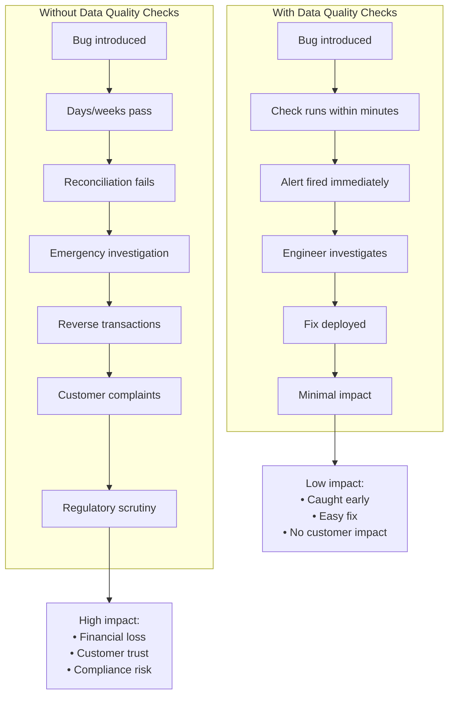
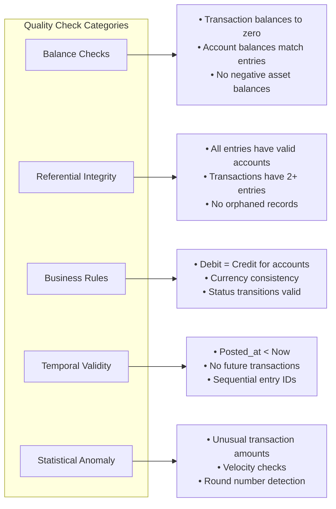
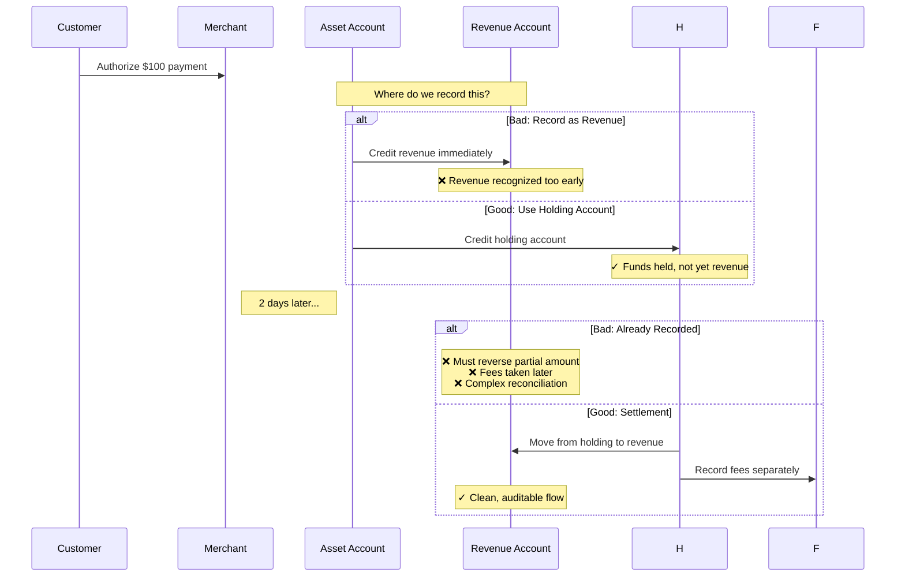
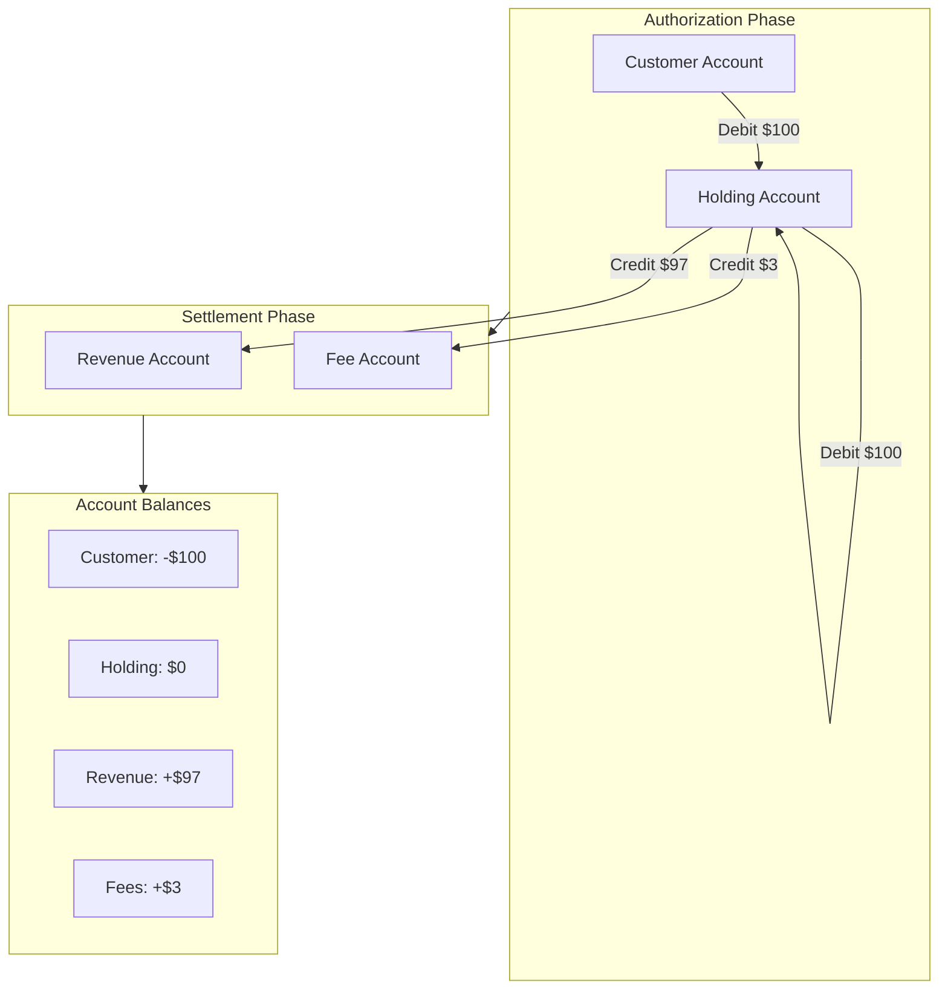
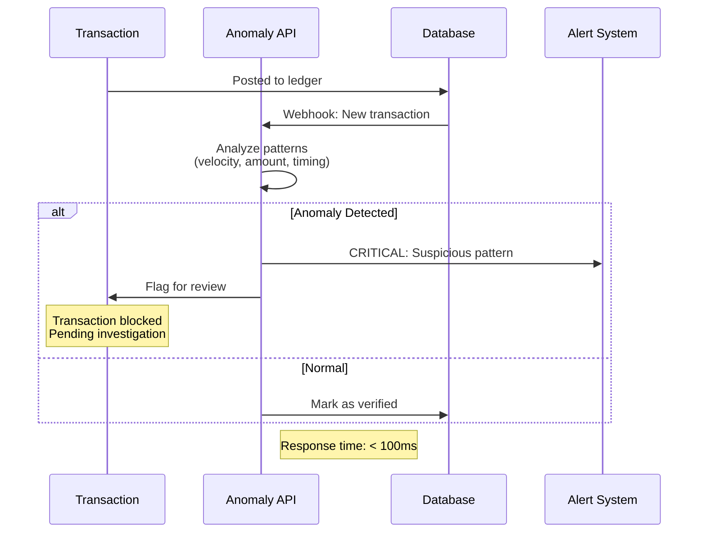
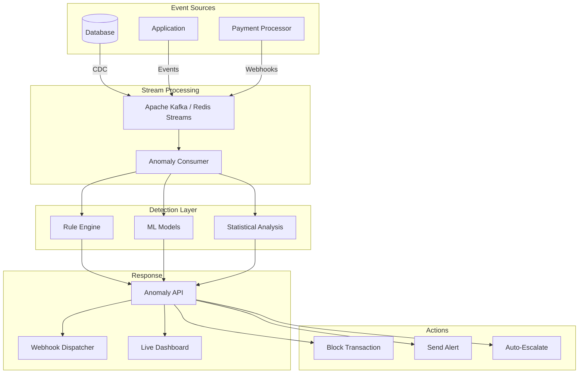

This is the final chapter in our five-part series on building production-ready ledger systems. In the previous chapters, we covered foundations, transaction lifecycles, advanced topics, and production operations. Now we'll focus on keeping your ledger healthy with continuous data quality checks and handling unsettled funds with holding accounts.

## Improvements: Continuous Data Quality Checks

The worst time to discover a ledger bug is when your accountant asks why the trial balance doesn't match. Data quality checks catch problems before they become disasters.

### Why Continuous Validation Matters



### Types of Data Quality Checks



[Continue with the data quality checks implementation from the original file...]

## Improvements: Holding Accounts for Unsettled Funds

One of the most important patterns in financial systems is the **holding account** (also called a float, suspense, or clearing account). When money is in flight—authorized but not yet settled—you need a place to track it.

### The Problem

Without holding accounts, your accounting gets messy:



**Why holding accounts matter:**
- **Revenue Recognition**: Don't count money as revenue until it's actually settled
- **Fee Transparency**: Processors take fees at settlement, not authorization
- **Reconciliation**: Makes matching with processor reports straightforward
- **Audit Trail**: Clear paper trail of where money sits at each stage
- **Error Handling**: If settlement fails, money is still tracked

### Real-World Example: The $50,000 Clearing Nightmare

Let me tell you about a real problem I encountered at a fintech startup. We processed $2M in payments on Black Friday. By Monday, our books were $50,000 off, and nobody knew why.

#### The Problem: No Holding Accounts

Here's what happened:

**Friday (Authorization Day):**
```ruby
# What we did WRONG - recorded revenue immediately
class PaymentService
  def process_payment(amount, customer_id)
    # Authorize with Stripe
    charge = Stripe::Charge.create(
      amount: amount,
      currency: 'usd',
      capture: false  # Just authorize, don't settle yet
    )
    
    # ❌ WRONG: Recorded as revenue immediately
    Transaction.create!(
      from_account: customer_id,
      to_account: 'revenue',  # Revenue credited immediately!
      amount: amount,
      status: 'completed'
    )
    
    # Customer sees charge on their card
    # Company sees revenue in books
    # Everyone thinks transaction is done
  end
end
```

**Monday Morning (The Disaster):**
```
Finance: "Our Stripe dashboard shows $1,950,000 in settlements, 
          but our ledger shows $2,000,000 in revenue. 
          Where's the missing $50,000?"

Engineering: "Let me check..."

# Found the issues:
# 1. 23 transactions failed settlement (card expired, insufficient funds)
#    Total: $4,200 - We recorded revenue, customer never paid
#
# 2. 156 transactions had fees deducted 
#    Total: $45,800 - We recorded gross, Stripe settled net
#
# 3. 3 transactions were duplicate authorizations
#    Total: $1,500 - Recorded twice, settled once
#
# Total discrepancy: $51,500
```

**The Cleanup (2 weeks of hell):**
```ruby
# Manual fixes required:
# 1. Reverse 23 failed transactions
failed_transactions.each do |txn|
  create_reversal_entry(txn, reason: "Settlement failed")
end

# 2. Adjust 156 transactions for fees
fees_transactions.each do |txn|
  # Create fee expense entries
  create_adjustment_entry(txn, fee_amount: calculate_fee(txn))
end

# 3. Find and reverse 3 duplicates
duplicates.each do |txn|
  create_reversal_entry(txn, reason: "Duplicate authorization")
end

# 4. Reconcile with Stripe (took 3 days)
# 5. Explain to auditors why revenue numbers changed
# 6. Restate financials for November
```

**Root Cause:** We treated authorizations like completed payments. They're not.

#### The Solution: Implementing Holding Accounts

Here's how we fixed it:

**Step 1: Database Migration**
```ruby
class AddHoldingAccounts < ActiveRecord::Migration[7.0]
  def change
    # Create holding account
    Account.create!(
      account_number: 'holding_usd',
      account_type: 'liability',
      name: 'USD Holding Account',
      description: 'Unsettled payment authorizations'
    )
    
    # Track authorization state
    add_column :transactions, :authorization_id, :string
    add_column :transactions, :settled_at, :datetime
    add_index :transactions, :authorization_id
  end
end
```

**Step 2: Fixed Payment Service**
```ruby
class PaymentService
  HOLDING_ACCOUNT = 'holding_usd'
  REVENUE_ACCOUNT = 'revenue_sales'
  FEE_ACCOUNT = 'expense_processor_fees'
  
  def process_payment(amount, customer_id)
    # Step 1: Authorize with Stripe
    authorization = Stripe::Authorization.create(
      amount: amount,
      currency: 'usd',
      capture: false
    )
    
    ActiveRecord::Base.transaction do
      # ✓ CORRECT: Record authorization (funds held, not revenue)
      auth_txn = LedgerTransaction.create!(
        external_ref: authorization.id,
        status: 'posted',
        transaction_type: 'authorization',
        description: "Authorization: #{authorization.id}"
      )
      
      # Debit customer (hold their funds)
      LedgerEntry.create!(
        transaction: auth_txn,
        account_id: customer_id,
        direction: 'debit',
        amount: amount,
        description: "Authorization hold"
      )
      
      # Credit holding account (not revenue!)
      LedgerEntry.create!(
        transaction: auth_txn,
        account: Account.find_by!(account_number: HOLDING_ACCOUNT),
        direction: 'credit',
        amount: amount,
        description: "Funds held for #{authorization.id}"
      )
    end
    
    { success: true, authorization_id: authorization.id }
  end
  
  def settle_payment(authorization_id)
    # Step 2: Actually charge the card (settlement)
    charge = Stripe::Charge.capture(authorization_id)
    
    # Calculate actual amounts
    gross_amount = charge.amount / 100.0
    fee_amount = calculate_stripe_fee(gross_amount)
    net_amount = gross_amount - fee_amount
    
    ActiveRecord::Base.transaction do
      # Create settlement transaction
      settlement_txn = LedgerTransaction.create!(
        external_ref: "settlement:#{charge.id}",
        status: 'posted',
        transaction_type: 'settlement',
        description: "Settlement for auth #{authorization_id}"
      )
      
      # Move from holding to actual accounts
      holding_account = Account.find_by!(account_number: HOLDING_ACCOUNT)
      
      # 1. Debit holding (release the hold)
      LedgerEntry.create!(
        transaction: settlement_txn,
        account: holding_account,
        direction: 'debit',
        amount: gross_amount
      )
      
      # 2. Credit revenue (net amount only)
      LedgerEntry.create!(
        transaction: settlement_txn,
        account: Account.find_by!(account_number: REVENUE_ACCOUNT),
        direction: 'credit',
        amount: net_amount
      )
      
      # 3. Credit fee expense
      LedgerEntry.create!(
        transaction: settlement_txn,
        account: Account.find_by!(account_number: FEE_ACCOUNT),
        direction: 'credit',
        amount: fee_amount
      )
      
      # Mark authorization as settled
      auth_txn = LedgerTransaction.find_by!(external_ref: authorization_id)
      auth_txn.update!(settled_at: Time.current)
    end
    
    { 
      success: true, 
      gross: gross_amount,
      fees: fee_amount,
      net: net_amount
    }
  end
  
  def void_authorization(authorization_id, reason: nil)
    # Step 3: Handle failed/expired authorizations
    Stripe::Authorization.void(authorization_id)
    
    auth_txn = LedgerTransaction.find_by!(external_ref: authorization_id)
    
    ActiveRecord::Base.transaction do
      # Return funds to customer
      reversal_txn = LedgerTransaction.create!(
        external_ref: "void:#{authorization_id}",
        status: 'posted',
        transaction_type: 'void',
        description: "Void: #{reason}"
      )
      
      holding_account = Account.find_by!(account_number: HOLDING_ACCOUNT)
      
      # Debit holding
      LedgerEntry.create!(
        transaction: reversal_txn,
        account: holding_account,
        direction: 'debit',
        amount: auth_txn.amount
      )
      
      # Credit customer
      LedgerEntry.create!(
        transaction: reversal_txn,
        account_id: auth_txn.source_account_id,
        direction: 'credit',
        amount: auth_txn.amount
      )
    end
  end
  
  private
  
  def calculate_stripe_fee(amount)
    (amount * 0.029 + 0.30).round(2)
  end
end
```

**Step 3: Daily Reconciliation Report**
```ruby
class DailyReconciliationReport
  def self.generate(date: Date.yesterday)
    holding_account = Account.find_by!(account_number: 'holding_usd')
    
    # Authorizations from yesterday
    authorizations = LedgerTransaction
      .where(transaction_type: 'authorization')
      .where(created_at: date.beginning_of_day..date.end_of_day)
      .sum(:amount)
    
    # Settlements from yesterday  
    settlements = LedgerTransaction
      .where(transaction_type: 'settlement')
      .where(created_at: date.beginning_of_day..date.end_of_day)
      .sum(:amount)
    
    # Voids from yesterday
    voids = LedgerTransaction
      .where(transaction_type: 'void')
      .where(created_at: date.beginning_of_day..date.end_of_day)
      .sum(:amount)
    
    # Outstanding (should match holding account balance)
    outstanding = authorizations - settlements - voids
    holding_balance = holding_account.balance
    
    report = {
      date: date,
      authorizations: authorizations,
      settlements: settlements,
      voids: voids,
      outstanding: outstanding,
      holding_balance: holding_balance,
      discrepancy: outstanding - holding_balance
    }
    
    # Alert if discrepancy
    if report[:discrepancy] != 0
      AlertService.notify(
        "Holding account discrepancy: $#{report[:discrepancy]}",
        level: :critical
      )
    end
    
    report
  end
end

# Example output:
# {
#   date: 2024-11-29,
#   authorizations: 2000000.00,  # $2M authorized
#   settlements: 1950000.00,      # $1.95M settled
#   voids: 4200.00,               # $4,200 voided
#   outstanding: 45800.00,        # $45,800 still pending
#   holding_balance: 45800.00,    # ✓ Matches!
#   discrepancy: 0.00             # ✓ No issues
# }
```

#### The Results

After implementing holding accounts:

1. **Zero reconciliation discrepancies** - Authorizations, settlements, and voids always balance
2. **Instant fee tracking** - Fees recorded at settlement time, not guessed
3. **Clear audit trail** - Every dollar traceable from customer → holding → revenue
4. **No more restatements** - Financial reports are accurate from day one
5. **Happy auditors** - Clean, defensible accounting

**The holding account balance should always equal:**
```
Total Authorizations - Total Settlements - Total Voids = Holding Account Balance
```

If it doesn't, you have a bug. Fix it immediately.

### The Holding Account Pattern



### Rails Implementation

#### Step 1: Schema and Models

```ruby
# db/migrate/xxx_create_holding_accounts.rb
class CreateHoldingAccounts < ActiveRecord::Migration[7.0]
  def change
    # Add holding account type to accounts
    add_column :accounts, :is_holding_account, :boolean, default: false
    add_index :accounts, :is_holding_account
    
    # Track fund movements
    create_table :fund_movements do |t|
      t.references :source_account, null: false, foreign_key: { to_table: :accounts }
      t.references :destination_account, null: false, foreign_key: { to_table: :accounts }
      t.references :ledger_transaction, null: false, foreign_key: true
      t.decimal :amount, precision: 19, scale: 4, null: false
      t.string :movement_type, null: false # 'authorization', 'settlement', 'refund', 'chargeback'
      t.string :status, default: 'pending' # 'pending', 'completed', 'failed', 'reversed'
      t.datetime :occurred_at
      t.jsonb :metadata
      t.timestamps
      
      t.index [:movement_type, :status]
      t.index [:ledger_transaction_id, :movement_type]
    end
    
    # Add settlement tracking to transactions
    add_column :ledger_transactions, :holding_account_id, :bigint
    add_foreign_key :ledger_transactions, :accounts, column: :holding_account_id
    add_index :ledger_transactions, :holding_account_id
  end
end

# app/models/fund_movement.rb
class FundMovement < ApplicationRecord
  belongs_to :source_account, class_name: 'Account'
  belongs_to :destination_account, class_name: 'Account'
  belongs_to :ledger_transaction
  
  validates :amount, numericality: { greater_than: 0 }
  validates :movement_type, inclusion: { in: %w[authorization settlement refund chargeback adjustment] }
  validates :status, inclusion: { in: %w[pending completed failed reversed] }
  
  enum movement_type: {
    authorization: 'authorization',
    settlement: 'settlement',
    refund: 'refund',
    chargeback: 'chargeback',
    adjustment: 'adjustment'
  }
  
  scope :pending, -> { where(status: 'pending') }
  scope :completed, -> { where(status: 'completed') }
  scope :for_holding_account, ->(account_id) { 
    where(source_account_id: account_id).or(where(destination_account_id: account_id)) 
  }
end
```

#### Step 2: Holding Account Service

```ruby
# app/services/ledger/holding_account_service.rb
module Ledger
  class HoldingAccountService
    HOLDING_ACCOUNT_PREFIX = 'holding_'
    
    # Get or create holding account for a currency
    def self.get_holding_account(currency)
      account_number = "#{HOLDING_ACCOUNT_PREFIX}#{currency.downcase}"
      
      Account.find_or_create_by!(account_number: account_number) do |account|
        account.account_type = 'liability'
        account.currency = currency.upcase
        account.is_holding_account = true
        account.status = 'active'
        account.description = "Holding account for #{currency} unsettled funds"
      end
    end
    
    # Move funds to holding (authorization)
    def self.hold_funds(
      from_account_id:, 
      amount:, 
      currency:, 
      transaction:, 
      metadata: {}
    )
      holding_account = get_holding_account(currency)
      
      ActiveRecord::Base.transaction do
        # Create ledger entries
        LedgerEntry.create!(
          ledger_transaction: transaction,
          account_id: from_account_id,
          direction: 'debit',
          amount: amount,
          currency: currency,
          description: "Hold funds: #{metadata[:reason] || 'Authorization'}"
        )
        
        LedgerEntry.create!(
          ledger_transaction: transaction,
          account: holding_account,
          direction: 'credit',
          amount: amount,
          currency: currency,
          description: "Funds held from account #{from_account_id}"
        )
        
        # Track the movement
        FundMovement.create!(
          source_account_id: from_account_id,
          destination_account: holding_account,
          ledger_transaction: transaction,
          amount: amount,
          movement_type: 'authorization',
          status: 'completed',
          occurred_at: Time.current,
          metadata: metadata
        )
        
        # Update transaction reference
        transaction.update!(holding_account_id: holding_account.id)
      end
      
      {
        success: true,
        holding_account_id: holding_account.id,
        amount_held: amount
      }
    end
    
    # Release funds from holding to final destination (settlement)
    def self.release_funds(
      holding_transaction:,
      to_account_id:,
      amount:,
      fee_amount: 0,
      metadata: {}
    )
      holding_account = Account.find(holding_transaction.holding_account_id)
      currency = holding_transaction.ledger_entries.first.currency
      
      net_amount = amount - fee_amount
      
      ActiveRecord::Base.transaction do
        # Create new settlement transaction
        settlement_txn = LedgerTransaction.create!(
          external_ref: "settlement:#{holding_transaction.external_ref}",
          status: 'posted',
          posted_at: Time.current,
          parent_transaction: holding_transaction,
          description: "Settlement for #{holding_transaction.external_ref}",
          metadata: metadata.merge(
            original_transaction_id: holding_transaction.id,
            gross_amount: amount,
            fee_amount: fee_amount,
            net_amount: net_amount
          )
        )
        
        # Debit holding account
        LedgerEntry.create!(
          ledger_transaction: settlement_txn,
          account: holding_account,
          direction: 'debit',
          amount: amount,
          currency: currency,
          description: "Release held funds"
        )
        
        # Credit destination
        LedgerEntry.create!(
          ledger_transaction: settlement_txn,
          account_id: to_account_id,
          direction: 'credit',
          amount: net_amount,
          currency: currency,
          description: "Settlement received"
        )
        
        # Credit fee account (if fees exist)
        if fee_amount > 0
          fee_account = Account.find_by!(account_number: "expense_processor_fees")
          LedgerEntry.create!(
            ledger_transaction: settlement_txn,
            account: fee_account,
            direction: 'credit',
            amount: fee_amount,
            currency: currency,
            description: "Processing fees"
          )
        end
        
        # Track movement
        FundMovement.create!(
          source_account: holding_account,
          destination_account_id: to_account_id,
          ledger_transaction: settlement_txn,
          amount: net_amount,
          movement_type: 'settlement',
          status: 'completed',
          occurred_at: Time.current,
          metadata: metadata
        )
        
        # Mark original as settled
        holding_transaction.update!(
          settled_at: Time.current,
          metadata: holding_transaction.metadata.merge(settled: true)
        )
      end
      
      {
        success: true,
        settlement_transaction_id: settlement_txn.id,
        net_amount: net_amount,
        fee_amount: fee_amount
      }
    end
    
    # Return held funds to source (void authorization)
    def self.return_funds(
      holding_transaction:,
      reason: nil
    )
      holding_account = Account.find(holding_transaction.holding_account_id)
      currency = holding_transaction.ledger_entries.first.currency
      
      # Find the original source account
      original_entry = holding_transaction.ledger_entries.find_by(direction: 'debit')
      source_account_id = original_entry.account_id
      amount = original_entry.amount
      
      ActiveRecord::Base.transaction do
        # Create reversal transaction
        reversal_txn = LedgerTransaction.create!(
          external_ref: "void:#{holding_transaction.external_ref}",
          status: 'posted',
          posted_at: Time.current,
          parent_transaction: holding_transaction,
          description: "Void: #{reason || 'Authorization cancelled'}",
          metadata: { 
            voided_transaction_id: holding_transaction.id,
            void_reason: reason 
          }
        )
        
        # Debit holding (remove the hold)
        LedgerEntry.create!(
          ledger_transaction: reversal_txn,
          account: holding_account,
          direction: 'debit',
          amount: amount,
          currency: currency,
          description: "Release hold back to source"
        )
        
        # Credit source account
        LedgerEntry.create!(
          ledger_transaction: reversal_txn,
          account_id: source_account_id,
          direction: 'credit',
          amount: amount,
          currency: currency,
          description: "Authorization voided"
        )
        
        # Track movement
        FundMovement.create!(
          source_account: holding_account,
          destination_account_id: source_account_id,
          ledger_transaction: reversal_txn,
          amount: amount,
          movement_type: 'refund',
          status: 'completed',
          occurred_at: Time.current,
          metadata: { void_reason: reason }
        )
        
        # Mark original as reversed
        holding_transaction.transition_to!('reversed')
      end
      
      { success: true, reversal_transaction_id: reversal_txn.id }
    end
    
    # Get current holdings summary
    def self.holdings_summary(currency: nil)
      scope = FundMovement.where(status: 'completed')
      scope = scope.joins(:ledger_transaction).where(ledger_transactions: { currency: currency }) if currency
      
      {
        total_authorized: scope.where(movement_type: 'authorization').sum(:amount),
        total_settled: scope.where(movement_type: 'settlement').sum(:amount),
        total_refunded: scope.where(movement_type: 'refund').sum(:amount),
        total_chargebacks: scope.where(movement_type: 'chargeback').sum(:amount),
        net_outstanding: scope.where(movement_type: 'authorization').sum(:amount) - 
                        scope.where(movement_type: ['settlement', 'refund', 'chargeback']).sum(:amount)
      }
    end
    
    # Find stale holdings (authorized but not settled)
    def self.stale_holdings(older_than: 7.days)
      FundMovement
        .where(movement_type: 'authorization')
        .where(status: 'completed')
        .where('created_at < ?', older_than.ago)
        .where.not(
          ledger_transaction_id: FundMovement
            .where(movement_type: ['settlement', 'refund'])
            .select(:ledger_transaction_id)
        )
        .includes(:ledger_transaction)
    end
  end
end
```

#### Step 3: Usage Examples

```ruby
# Example 1: Complete authorization and settlement flow
class PaymentWithHoldingService
  def self.process_payment(payment_params)
    # Step 1: Authorize with processor
    authorization = Stripe::Authorization.create(
      amount: payment_params[:amount],
      currency: payment_params[:currency],
      payment_method: payment_params[:payment_method_id]
    )
    
    # Step 2: Hold funds in ledger
    hold_transaction = LedgerTransaction.create!(
      external_ref: authorization.id,
      status: 'posted',
      transaction_phase: 'authorization',
      description: "Authorization for order #{payment_params[:order_id]}"
    )
    
    # Create the entries
    Ledger::HoldingAccountService.hold_funds(
      from_account_id: payment_params[:customer_account_id],
      amount: payment_params[:amount],
      currency: payment_params[:currency],
      transaction: hold_transaction,
      metadata: {
        order_id: payment_params[:order_id],
        customer_id: payment_params[:customer_id],
        authorization_id: authorization.id
      }
    )
    
    # Step 3: Later, settle the funds (could be async via webhook)
    settlement = Stripe::Charge.capture(authorization.id)
    
    fee_amount = calculate_stripe_fee(payment_params[:amount])
    
    Ledger::HoldingAccountService.release_funds(
      holding_transaction: hold_transaction,
      to_account_id: payment_params[:merchant_account_id],
      amount: payment_params[:amount],
      fee_amount: fee_amount,
      metadata: {
        settlement_id: settlement.id,
        order_id: payment_params[:order_id]
      }
    )
    
    {
      success: true,
      authorization_id: authorization.id,
      net_amount: payment_params[:amount] - fee_amount
    }
  end
  
  def self.void_authorization(authorization_id, reason: nil)
    hold_transaction = LedgerTransaction.find_by!(
      external_ref: authorization_id,
      transaction_phase: 'authorization'
    )
    
    # Void with Stripe
    Stripe::Authorization.void(authorization_id)
    
    # Return funds to customer
    Ledger::HoldingAccountService.return_funds(
      holding_transaction: hold_transaction,
      reason: reason
    )
  end
  
  private
  
  def self.calculate_stripe_fee(amount)
    (amount * 0.029 + 0.30).round(2)
  end
end

# Example 2: Monitoring holdings
class HoldingsMonitor
  def self.daily_report
    summary = Ledger::HoldingAccountService.holdings_summary
    stale = Ledger::HoldingAccountService.stale_holdings(older_than: 3.days)
    
    {
      summary: summary,
      stale_count: stale.count,
      stale_amount: stale.sum(:amount),
      alerts: generate_alerts(summary, stale)
    }
  end
  
  def self.generate_alerts(summary, stale)
    alerts = []
    
    # Alert if outstanding > threshold
    if summary[:net_outstanding] > 1_000_000
      alerts << "High outstanding holdings: $#{summary[:net_outstanding]}"
    end
    
    # Alert on stale holdings
    if stale.any?
      alerts << "#{stale.count} stale holdings over 3 days old"
    end
    
    alerts
  end
end
```

### Key Takeaways

1. **Always Use Holding Accounts**: Never record revenue on authorization. Hold funds in a liability account until settlement.

2. **Track Fund Movements**: Create `FundMovement` records to track every transfer into and out of holding accounts.

3. **Handle Fees Explicitly**: Processors deduct fees at settlement. Record them separately for accurate financial reporting.

4. **Monitor Stale Holdings**: Authorizations expire. Build alerts for holdings that haven't settled within expected timeframes.

5. **Support Partial Settlements**: Some authorizations can be partially captured. Your ledger needs to handle this.

---

## Real-Time Transaction Lifecycle Anomaly Detection

Data quality checks running every 5 minutes are good, but what if you need to catch anomalies **within seconds** of them happening? Real-time anomaly detection lets you stop bad transactions before they propagate through your system.

### Why Real-Time Matters



**Scenarios where real-time detection saves you:**
- **Velocity attack**: Same account making 50 transactions in 1 minute (bot/fraud)
- **Round number clustering**: 100 transactions of exactly $100.00 (testing stolen cards)
- **Off-hours activity**: Large transfers at 3 AM from accounts that never transact at night
- **Rapid state changes**: Transaction going from pending → posted → reversed in 10 seconds (bug)
- **Balance drift**: Account balance changing faster than entries can explain (data corruption)

### Architecture: Streaming Anomaly Detection



### Rails Implementation: Real-Time Anomaly API

#### Step 1: Database Schema for Real-Time Tracking

```ruby
# db/migrate/xxx_create_real_time_anomaly_tables.rb
class CreateRealTimeAnomalyTables < ActiveRecord::Migration[7.0]
  def change
    # Track transaction events for streaming
    create_table :transaction_events do |t|
      t.references :ledger_transaction, null: false, foreign_key: true
      t.string :event_type, null: false # 'created', 'status_changed', 'posted'
      t.string :from_status
      t.string :to_status
      t.jsonb :event_data
      t.datetime :occurred_at, null: false
      t.timestamps
      
      t.index [:ledger_transaction_id, :occurred_at]
      t.index [:event_type, :occurred_at]
    end
    
    # Real-time anomaly detections
    create_table :anomaly_detections do |t|
      t.references :ledger_transaction, null: false, foreign_key: true
      t.string :anomaly_type, null: false
      t.string :severity, null: false # 'low', 'medium', 'high', 'critical'
      t.decimal :risk_score, precision: 5, scale: 2 # 0.00 to 100.00
      t.jsonb :details
      t.string :status, default: 'open' # 'open', 'investigating', 'resolved', 'false_positive'
      t.bigint :detected_by_id # User who reviewed
      t.text :resolution_notes
      t.datetime :resolved_at
      t.timestamps
      
      t.index [:anomaly_type, :status]
      t.index [:severity, :created_at]
      t.index :risk_score
    end
    
    # Sliding window statistics for real-time analysis
    create_table :window_statistics do |t|
      t.references :account, null: false, foreign_key: true
      t.string :window_type, null: false # '1_minute', '5_minute', '1_hour'
      t.datetime :window_start, null: false
      t.integer :transaction_count, default: 0
      t.decimal :total_amount, precision: 19, scale: 4, default: 0
      t.decimal :avg_amount, precision: 19, scale: 4
      t.decimal :max_amount, precision: 19, scale: 4
      t.jsonb :velocity_metrics
      t.timestamps
      
      t.index [:account_id, :window_type, :window_start]
    end
  end
end
```

#### Step 2: Real-Time Anomaly Detection Service

```ruby
# app/services/realtime/anomaly_detection_service.rb
module Realtime
  class AnomalyDetectionService
    VELOCITY_THRESHOLD = 10 # transactions per minute
    AMOUNT_DEVIATION_THRESHOLD = 3.0 # standard deviations
    ROUND_NUMBER_THRESHOLD = 0.8 # 80% round numbers
    
    def initialize(transaction)
      @transaction = transaction
      @anomalies = []
    end
    
    # Main entry point - analyze transaction in real-time
    def analyze!
      Rails.logger.info "Analyzing transaction #{@transaction.id} for anomalies"
      
      # Run all detection checks
      check_velocity_anomaly
      check_amount_anomaly
      check_round_number_pattern
      check_rapid_state_transitions
      check_off_hours_activity
      check_geographic_anomaly
      check_balance_consistency
      
      # Store detections
      store_anomalies
      
      # Return summary
      {
        transaction_id: @transaction.id,
        anomalies_found: @anomalies.count,
        max_severity: @anomalies.map { |a| a[:severity] }.max || 'none',
        risk_score: calculate_overall_risk_score,
        details: @anomalies
      }
    end
    
    private
    
    # Check 1: Velocity - Too many transactions too fast
    def check_velocity_anomaly
      account_id = @transaction.ledger_entries.first&.account_id
      return unless account_id
      
      # Count transactions in last minute
      recent_count = TransactionEvent
        .where(event_type: 'created')
        .where('occurred_at > ?', 1.minute.ago)
        .where(
          ledger_transaction_id: LedgerTransaction
            .joins(:ledger_entries)
            .where(ledger_entries: { account_id: account_id })
            .select(:id)
        )
        .count
      
      if recent_count > VELOCITY_THRESHOLD
        @anomalies << {
          type: 'velocity_anomaly',
          severity: recent_count > VELOCITY_THRESHOLD * 2 ? 'critical' : 'high',
          risk_score: [recent_count * 5, 100].min,
          details: {
            transactions_in_last_minute: recent_count,
            threshold: VELOCITY_THRESHOLD,
            account_id: account_id
          },
          description: "#{recent_count} transactions in last minute (threshold: #{VELOCITY_THRESHOLD})"
        }
      end
    end
    
    # Check 2: Amount - Unusually large amount
    def check_amount_anomaly
      account_id = @transaction.ledger_entries.first&.account_id
      return unless account_id
      
      # Get amount
      amount = @transaction.ledger_entries.sum(:amount)
      
      # Calculate historical statistics
      stats = WindowStatistics
        .where(account_id: account_id)
        .where(window_type: '1_hour')
        .where('window_start > ?', 30.days.ago)
        .select('AVG(avg_amount) as historical_avg, STDDEV(avg_amount) as historical_stddev')
        .first
      
      return unless stats.historical_avg && stats.historical_stddev
      
      # Calculate z-score
      z_score = (amount - stats.historical_avg.to_f) / stats.historical_stddev.to_f
      
      if z_score > AMOUNT_DEVIATION_THRESHOLD
        @anomalies << {
          type: 'amount_anomaly',
          severity: z_score > AMOUNT_DEVIATION_THRESHOLD * 2 ? 'critical' : 'high',
          risk_score: [z_score * 15, 100].min,
          details: {
            amount: amount,
            historical_avg: stats.historical_avg,
            z_score: z_score.round(2)
          },
          description: "Amount $#{amount} is #{z_score.round(2)} standard deviations above average"
        }
      end
    end
    
    # Check 3: Round numbers - Suspicious pattern
    def check_round_number_pattern
      entries = @transaction.ledger_entries
      
      round_count = entries.count do |entry|
        entry.amount > 100 && entry.amount % 100 == 0
      end
      
      total_entries = entries.count
      
      if total_entries > 0 && (round_count.to_f / total_entries) > ROUND_NUMBER_THRESHOLD
        @anomalies << {
          type: 'round_number_pattern',
          severity: 'medium',
          risk_score: 60,
          details: {
            round_amounts: round_count,
            total_entries: total_entries,
            percentage: ((round_count.to_f / total_entries) * 100).round(2)
          },
          description: "#{round_count}/#{total_entries} entries are suspiciously round numbers"
        }
      end
    end
    
    # Check 4: Rapid state changes - Potential bug
    def check_rapid_state_transitions
      transitions = StateTransition
        .where(ledger_transaction: @transaction)
        .order(created_at: :asc)
      
      return if transitions.count < 2
      
      # Check if multiple transitions happened within 10 seconds
      transitions.each_cons(2) do |prev, curr|
        time_diff = curr.created_at - prev.created_at
        
        if time_diff < 10.seconds
          @anomalies << {
            type: 'rapid_state_transition',
            severity: 'high',
            risk_score: 85,
            details: {
              from_state: prev.from_status,
              to_state: curr.to_status,
              time_difference_seconds: time_diff.round(2)
            },
            description: "State changed from #{prev.from_status} to #{curr.to_status} in #{time_diff.round(2)}s"
          }
        end
      end
    end
    
    # Check 5: Off-hours activity
    def check_off_hours_activity
      posted_at = @transaction.posted_at || Time.current
      account_id = @transaction.ledger_entries.first&.account_id
      
      return unless account_id
      
      # Check if transaction is outside business hours (9 AM - 6 PM)
      hour = posted_at.hour
      is_business_hours = hour >= 9 && hour < 18
      
      # Check historical pattern for this account
      historical_hours = LedgerTransaction
        .joins(:ledger_entries)
        .where(ledger_entries: { account_id: account_id })
        .where.not(id: @transaction.id)
        .where('posted_at > ?', 90.days.ago)
        .group("EXTRACT(HOUR FROM posted_at)")
        .count
      
      # If account never transacts during this hour
      current_hour_transactions = historical_hours[hour] || 0
      total_transactions = historical_hours.values.sum
      
      if total_transactions > 10 && current_hour_transactions == 0 && !is_business_hours
        @anomalies << {
          type: 'off_hours_activity',
          severity: 'medium',
          risk_score: 55,
          details: {
            transaction_hour: hour,
            is_business_hours: is_business_hours,
            historical_transactions_this_hour: current_hour_transactions
          },
          description: "Transaction at #{hour}:00 - account never transacts during this hour"
        }
      end
    end
    
    # Check 6: Geographic anomaly (if IP tracking enabled)
    def check_geographic_anomaly
      return unless @transaction.metadata&.dig('ip_address')
      
      ip = @transaction.metadata['ip_address']
      account_id = @transaction.ledger_entries.first&.account_id
      
      # Get country from IP (simplified - use GeoIP in production)
      current_country = ip_country_lookup(ip)
      
      # Get historical countries for this account
      historical_countries = LedgerTransaction
        .joins(:ledger_entries)
        .where(ledger_entries: { account_id: account_id })
        .where.not(id: @transaction.id)
        .where('created_at > ?', 30.days.ago)
        .pluck(Arel.sql("metadata->>'country'"))
        .compact
        .uniq
      
      if historical_countries.any? && !historical_countries.include?(current_country)
        @anomalies << {
          type: 'geographic_anomaly',
          severity: 'high',
          risk_score: 75,
          details: {
            current_country: current_country,
            historical_countries: historical_countries,
            ip_address: ip
          },
          description: "Transaction from #{current_country} - account usually transacts from #{historical_countries.join(', ')}"
        }
      end
    end
    
    # Check 7: Balance consistency
    def check_balance_consistency
      @transaction.ledger_entries.each do |entry|
        account = entry.account
        
        # Calculate expected balance after this transaction
        expected_balance = if entry.direction == 'credit'
          account.balance - entry.amount
        else
          account.balance + entry.amount
        end
        
        # Get sum of all entries for this account
        calculated_balance = LedgerEntry
          .joins(:ledger_transaction)
          .where(account: account)
          .where(ledger_transactions: { status: 'posted' })
          .where('ledger_transactions.posted_at <= ?', @transaction.posted_at)
          .sum("CASE WHEN direction = 'credit' THEN amount ELSE -amount END")
        
        if (expected_balance - calculated_balance).abs > 0.01
          @anomalies << {
            type: 'balance_inconsistency',
            severity: 'critical',
            risk_score: 100,
            details: {
              account_id: account.id,
              expected_balance: expected_balance,
              calculated_balance: calculated_balance,
              difference: (expected_balance - calculated_balance).round(2)
            },
            description: "CRITICAL: Balance drift detected in account #{account.account_number}"
          }
        end
      end
    end
    
    def store_anomalies
      @anomalies.each do |anomaly|
        AnomalyDetection.create!(
          ledger_transaction: @transaction,
          anomaly_type: anomaly[:type],
          severity: anomaly[:severity],
          risk_score: anomaly[:risk_score],
          details: anomaly[:details],
          status: anomaly[:severity] == 'critical' ? 'open' : 'investigating'
        )
      end
    end
    
    def calculate_overall_risk_score
      return 0 if @anomalies.empty?
      
      # Weighted average based on severity
      weights = { 'critical' => 1.0, 'high' => 0.7, 'medium' => 0.4, 'low' => 0.2 }
      
      total_weight = @anomalies.sum { |a| weights[a[:severity]] || 0.1 }
      weighted_score = @anomalies.sum { |a| a[:risk_score] * (weights[a[:severity]] || 0.1) }
      
      (weighted_score / total_weight).round(2)
    end
    
    def ip_country_lookup(ip)
      # In production, use GeoIP2 or similar
      # This is a simplified example
      require 'resolv'
      # Return country code based on IP
      'US' # Placeholder
    end
  end
end
```

#### Step 3: Real-Time API Controller

```ruby
# app/controllers/api/v1/anomalies_controller.rb
module Api
  module V1
    class AnomaliesController < ApplicationController
      before_action :authenticate_user!
      
      # POST /api/v1/anomalies/analyze
      # Real-time anomaly detection for a transaction
      def analyze
        transaction = LedgerTransaction.find(params[:transaction_id])
        
        # Run real-time analysis
        service = Realtime::AnomalyDetectionService.new(transaction)
        result = service.analyze!
        
        # Auto-block if critical
        if result[:max_severity] == 'critical'
          transaction.update!(
            status: 'flagged',
            flagged_reason: 'Critical anomaly detected',
            flagged_at: Time.current
          )
          
          # Send immediate alert
          AlertService.critical_anomaly_detected(transaction, result)
        end
        
        render json: result
      end
      
      # GET /api/v1/anomalies/recent
      # Get recent anomalies for monitoring
      def recent
        scope = AnomalyDetection
          .includes(:ledger_transaction)
          .order(created_at: :desc)
        
        # Filter by severity
        scope = scope.where(severity: params[:severity]) if params[:severity]
        
        # Filter by type
        scope = scope.where(anomaly_type: params[:type]) if params[:type]
        
        # Filter by time window
        if params[:hours]
          scope = scope.where('created_at > ?', params[:hours].to_i.hours.ago)
        end
        
        anomalies = scope.limit(params[:limit] || 50)
        
        render json: {
          count: anomalies.count,
          anomalies: anomalies.map do |anomaly|
            {
              id: anomaly.id,
              transaction_id: anomaly.ledger_transaction_id,
              type: anomaly.anomaly_type,
              severity: anomaly.severity,
              risk_score: anomaly.risk_score,
              status: anomaly.status,
              detected_at: anomaly.created_at,
              details: anomaly.details,
              transaction: {
                external_ref: anomaly.ledger_transaction.external_ref,
                amount: anomaly.ledger_transaction.ledger_entries.sum(:amount),
                status: anomaly.ledger_transaction.status
              }
            }
          end
        }
      end
      
      # GET /api/v1/anomalies/summary
      # Real-time dashboard summary
      def summary
        time_window = params[:hours] ? params[:hours].to_i.hours.ago : 24.hours.ago
        
        summary = {
          time_window: params[:hours] ? "#{params[:hours]} hours" : '24 hours',
          total_anomalies: AnomalyDetection.where('created_at > ?', time_window).count,
          by_severity: AnomalyDetection
            .where('created_at > ?', time_window)
            .group(:severity)
            .count,
          by_type: AnomalyDetection
            .where('created_at > ?', time_window)
            .group(:anomaly_type)
            .count,
          critical_unresolved: AnomalyDetection
            .where(severity: 'critical')
            .where(status: 'open')
            .count,
          avg_risk_score: AnomalyDetection
            .where('created_at > ?', time_window)
            .average(:risk_score)
            &.round(2) || 0,
          velocity_alerts: AnomalyDetection
            .where(anomaly_type: 'velocity_anomaly')
            .where('created_at > ?', time_window)
            .count,
          balance_drift_alerts: AnomalyDetection
            .where(anomaly_type: 'balance_inconsistency')
            .where('created_at > ?', time_window)
            .count
        }
        
        render json: summary
      end
      
      # PATCH /api/v1/anomalies/:id/resolve
      # Mark anomaly as resolved or false positive
      def resolve
        anomaly = AnomalyDetection.find(params[:id])
        
        anomaly.update!(
          status: params[:status], # 'resolved' or 'false_positive'
          resolution_notes: params[:notes],
          resolved_at: Time.current,
          detected_by_id: current_user.id
        )
        
        # If resolving critical anomaly, unflag transaction
        if anomaly.severity == 'critical' && params[:status] == 'false_positive'
          anomaly.ledger_transaction.update!(
            status: 'posted',
            flagged_reason: nil,
            flagged_at: nil
          )
        end
        
        render json: { success: true, anomaly: anomaly }
      end
      
      # GET /api/v1/anomalies/velocity-check
      # Quick velocity check for payment processing
      def velocity_check
        account_id = params[:account_id]
        
        recent_count = TransactionEvent
          .where(event_type: 'created')
          .where('occurred_at > ?', 1.minute.ago)
          .where(
            ledger_transaction_id: LedgerTransaction
              .joins(:ledger_entries)
              .where(ledger_entries: { account_id: account_id })
              .select(:id)
          )
          .count
        
        threshold = Realtime::AnomalyDetectionService::VELOCITY_THRESHOLD
        
        render json: {
          account_id: account_id,
          transactions_last_minute: recent_count,
          threshold: threshold,
          velocity_exceeded: recent_count > threshold,
          risk_level: if recent_count > threshold * 2
            'critical'
          elsif recent_count > threshold
            'high'
          else
            'normal'
          end
        }
      end
    end
  end
end
```

#### Step 4: WebSocket for Real-Time Alerts

```ruby
# app/channels/anomaly_channel.rb
class AnomalyChannel < ApplicationCable::Channel
  def subscribed
    stream_from "anomaly_alerts"
    
    # Send current critical anomalies on connection
    critical_anomalies = AnomalyDetection
      .where(severity: 'critical')
      .where(status: 'open')
      .includes(:ledger_transaction)
      .limit(10)
    
    transmit({
      type: 'initial_state',
      critical_count: critical_anomalies.count,
      anomalies: format_anomalies(critical_anomalies)
    })
  end
  
  def unsubscribed
    # Any cleanup needed
  end
  
  private
  
  def format_anomalies(anomalies)
    anomalies.map do |anomaly|
      {
        id: anomaly.id,
        type: anomaly.anomaly_type,
        severity: anomaly.severity,
        risk_score: anomaly.risk_score,
        transaction_id: anomaly.ledger_transaction_id,
        transaction_ref: anomaly.ledger_transaction.external_ref,
        description: anomaly.details['description'],
        detected_at: anomaly.created_at
      }
    end
  end
end

# Broadcast when anomaly detected (in AnomalyDetectionService)
# AnomalyDetectionBroadcastJob.perform_later(anomaly)

# app/jobs/anomaly_detection_broadcast_job.rb
class AnomalyDetectionBroadcastJob < ApplicationJob
  def perform(anomaly)
    ActionCable.server.broadcast(
      "anomaly_alerts",
      {
        type: 'new_anomaly',
        anomaly: {
          id: anomaly.id,
          type: anomaly.anomaly_type,
          severity: anomaly.severity,
          risk_score: anomaly.risk_score,
          transaction_id: anomaly.ledger_transaction_id,
          description: anomaly.details['description']
        }
      }
    )
  end
end
```

#### Step 5: Client-Side Dashboard (JavaScript)

```javascript
// Real-time anomaly monitoring dashboard
class AnomalyDashboard {
  constructor() {
    this.socket = new WebSocket('wss://api.yoursite.com/cable');
    this.setupSocket();
    this.refreshStats();
    
    // Auto-refresh every 30 seconds
    setInterval(() => this.refreshStats(), 30000);
  }
  
  setupSocket() {
    this.socket.onmessage = (event) => {
      const data = JSON.parse(event.data);
      
      if (data.type === 'new_anomaly') {
        this.showAlert(data.anomaly);
        this.refreshStats();
      }
    };
  }
  
  async refreshStats() {
    const response = await fetch('/api/v1/anomalies/summary?hours=1');
    const stats = await response.json();
    
    this.updateDashboard(stats);
    
    // Alert if critical anomalies exist
    if (stats.critical_unresolved > 0) {
      this.showCriticalWarning(stats.critical_unresolved);
    }
  }
  
  showAlert(anomaly) {
    // Show browser notification or toast
    if (anomaly.severity === 'critical') {
      new Notification('🚨 Critical Anomaly Detected', {
        body: `${anomaly.type}: ${anomaly.description}`,
        requireInteraction: true
      });
    }
    
    // Add to live feed
    this.addToLiveFeed(anomaly);
  }
  
  updateDashboard(stats) {
    document.getElementById('total-anomalies').textContent = stats.total_anomalies;
    document.getElementById('critical-count').textContent = stats.critical_unresolved;
    document.getElementById('avg-risk-score').textContent = stats.avg_risk_score;
    
    // Update severity breakdown chart
    this.updateSeverityChart(stats.by_severity);
  }
}

// Initialize on dashboard page
document.addEventListener('DOMContentLoaded', () => {
  if (document.getElementById('anomaly-dashboard')) {
    new AnomalyDashboard();
  }
});
```

### Key Takeaways

1. **Real-Time Detection**: Analyze every transaction within 100ms of posting. Catch anomalies before they cascade.

2. **Multiple Detection Methods**: Combine rule-based checks (velocity, round numbers) with statistical analysis (z-scores, historical patterns) and ML models.

3. **Risk Scoring**: Assign numerical risk scores (0-100) to prioritize investigations. Critical anomalies (score > 90) should auto-block transactions.

4. **Live Dashboard**: WebSocket-based real-time updates keep ops teams informed without constant page refreshes.

5. **Graduated Response**: 
   - Low/Medium: Log and monitor
   - High: Flag for review
   - Critical: Block transaction + Page on-call engineer

6. **API-First Design**: RESTful APIs allow integration with payment flows, mobile apps, and third-party monitoring tools.

---

## What I'd Do Differently

Looking back at systems I've built, here are the mistakes I made so you don't have to:

**Don't let transactions stay in "Pending" forever.** Build a sweeper that times out old pending transactions and releases reserved funds. Otherwise your accountants will hate you at month-end.

**Use decimal, not float.** Floating point math will betray you. Use DECIMAL(19,4) or similar. Money requires exact precision.

**Index external_ref from day one.** You'll query by it constantly. Make it unique and indexed.

**Plan for the reverse.** Every transaction type needs a reversal strategy. Sometimes it's a matching negative transaction. Sometimes it's a separate "refund" transaction type. Know which is which.

**Test with large numbers.** Don't just test with $100. Test with $999,999,999.99. Test with 10,000 transactions in a batch. Test what happens when you overflow an int32 (you'd be surprised how often this happens).

**Start with holding accounts.** Don't retrofit them later. Design them in from day one.

## The Bottom Line

Building a ledger system isn't about fancy technology. It's about enforcing invariants:

- Every transaction balances to zero
- Records are immutable
- State changes are explicit and auditable
- External systems are reconciled
- Data quality is continuously monitored
- Funds are properly tracked in holding accounts

Get these right, and the rest is implementation details. Get them wrong, and you'll find out in production—usually when someone asks why the numbers don't match.

The best ledger systems are boring. They work silently, consistently, and correctly. They don't make headlines. They just make sure the money is where it should be.

And honestly? That's the highest praise I can give.

---

**Series Navigation:**

- [Chapter 1: Foundations](/posts/ledger-system-chapter-1-foundations)
- [Chapter 2: Transaction Lifecycle](/posts/ledger-system-chapter-2-lifecycle)
- [Chapter 3: Advanced Topics](/posts/ledger-system-chapter-3-advanced)
- [Chapter 4: Production Operations](/posts/ledger-system-chapter-4-production)
- Chapter 5: Data Quality & Best Practices (You are here)
- [Chapter 6: Displaying Balance and Mutations to Users](/posts/ledger-system-chapter-6-user-balance-display)
