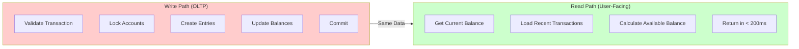
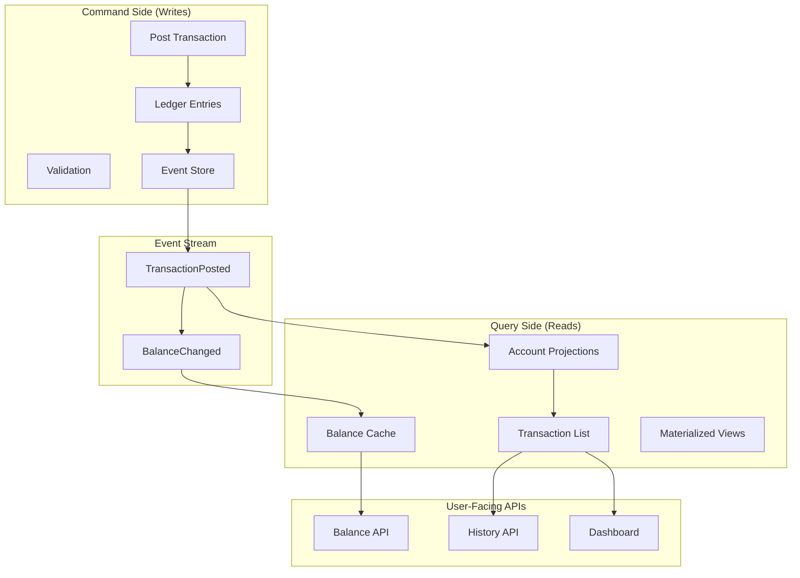

The first time our mobile app loaded a user's transaction history, it took 12 seconds.

Twelve. Whole. Seconds.

I watched our CEO stare at the loading spinner during a demo, and I could see the math happening in his head: *If this takes 12 seconds for one user, what happens when we have 10,000 users checking their balance at 9 AM on payday?*

He didn't say anything. He just raised an eyebrow.

That eyebrow launched a three-week deep dive into query optimization, caching strategies, and the uncomfortable realization that our beautiful double-entry ledger was a nightmare to query at scale.

This chapter covers what I learned: how to build fast, user-facing APIs that display account balances and transaction history without melting your database.

## The Problem: OLTP vs OLAP

Here's the tension at the heart of every ledger system:

Your **write path** (posting transactions) needs strict consistency, complex validation, and careful locking. It's optimized for correctness, not speed.

Your **read path** (showing balance to users) needs to be *fast*. Sub-second fast. Users don't care about your double-entry bookkeeping—they care about knowing how much money they have right now.



The naive approach—querying the same tables you write to—works fine until it doesn't. At around 100K transactions per account, your "simple" balance query starts timing out.

## Layer 1: The Naive Approach (And Why It Fails)

Let's start with the obvious solution and watch it fall over:

```
Pseudocode Implementation:

FUNCTION GetCurrentBalance(account_id):
    entries = QUERY LedgerEntry 
        JOIN LedgerTransaction 
        WHERE account_id = {account_id}
        AND LedgerTransaction.status = 'posted'
    
    balance = 0
    FOR EACH entry IN entries:
        IF entry.direction = 'credit':
            balance = balance + entry.amount
        ELSE:
            balance = balance - entry.amount
    
    RETURN balance

FUNCTION GetTransactionHistory(account_id, limit = 50):
    entries = QUERY LedgerEntry
        JOIN LedgerTransaction
        WHERE account_id = {account_id}
        AND LedgerTransaction.status = 'posted'
        ORDER BY LedgerTransaction.posted_at DESC
        LIMIT {limit}
    
    history = []
    FOR EACH entry IN entries:
        history.APPEND({
            date: entry.posted_at,
            description: entry.description,
            amount: entry.signed_amount,
            balance: CalculateRunningBalance(account_id, entry)
        })
    
    RETURN history

FUNCTION CalculateRunningBalance(account_id, target_entry):
    entries = QUERY LedgerEntry
        JOIN LedgerTransaction
        WHERE account_id = {account_id}
        AND LedgerTransaction.status = 'posted'
        AND LedgerTransaction.posted_at <= target_entry.posted_at
    
    balance = 0
    FOR EACH entry IN entries:
        IF entry.direction = 'credit':
            balance = balance + entry.amount
        ELSE:
            balance = balance - entry.amount
    
    RETURN balance
```

This works beautifully in development with 50 transactions. Then you deploy to production:

```
Account with 500K entries:
- Balance query: 2.3 seconds
- History query (50 items): 8.7 seconds
- Running balance calculation: Timeout after 30 seconds
```

The problem isn't the query complexity—it's that you're scanning half a million rows every time someone opens their app.

## Layer 2: Separation of Concerns (The CQRS Pattern)

The fix is to separate your write model from your read model. In CQRS (Command Query Responsibility Segregation), you optimize each path independently:



The insight: **it's okay to store the same data in multiple formats** if each format is optimized for its use case.

### Real-World Implementation

#### Step 1: Create Read-Optimized Tables

**Account Projections Table:**
```sql
TABLE account_projections (
    account_id              UUID PRIMARY KEY,
    current_balance         DECIMAL(19,4) DEFAULT 0,
    available_balance       DECIMAL(19,4) DEFAULT 0,
    total_transactions      INTEGER DEFAULT 0,
    last_transaction_at     TIMESTAMP,
    last_transaction_id     VARCHAR,
    last_transaction_amount DECIMAL(19,4),
    updated_at              TIMESTAMP NOT NULL
);

INDEX idx_account_projections_updated (account_id, updated_at);
```

**Transaction Projections Table:**
```sql
TABLE transaction_projections (
    id               UUID PRIMARY KEY,
    account_id       UUID NOT NULL,
    transaction_id   VARCHAR NOT NULL UNIQUE,
    external_ref     VARCHAR,
    transaction_type VARCHAR,  -- 'credit', 'debit', 'fee', 'refund'
    amount           DECIMAL(19,4) NOT NULL,
    balance_after    DECIMAL(19,4) NOT NULL,
    currency         VARCHAR NOT NULL,
    status           VARCHAR,  -- 'completed', 'pending', 'failed'
    description      VARCHAR,
    counterparty_name VARCHAR,
    counterparty_icon VARCHAR,
    metadata         JSON,
    posted_at        TIMESTAMP NOT NULL,
    created_at       TIMESTAMP NOT NULL
);

INDEX idx_txn_account_date (account_id, posted_at DESC);
INDEX idx_txn_account_type_date (account_id, transaction_type, posted_at);
INDEX idx_txn_external_ref (external_ref);
```

**Daily Balance Snapshots Table:**
```sql
TABLE daily_balance_snapshots (
    id                UUID PRIMARY KEY,
    account_id        UUID NOT NULL,
    snapshot_date     DATE NOT NULL,
    opening_balance   DECIMAL(19,4),
    closing_balance   DECIMAL(19,4),
    total_credits     DECIMAL(19,4) DEFAULT 0,
    total_debits      DECIMAL(19,4) DEFAULT 0,
    transaction_count INTEGER DEFAULT 0,
    created_at        TIMESTAMP NOT NULL,
    
    UNIQUE (account_id, snapshot_date)
);

INDEX idx_snapshot_date (snapshot_date);
```

Key design decisions:

**Account projections store current state** — no calculations needed at query time.

**Transaction projections are denormalized** — each row has everything needed to display it, even if that duplicates data from the ledger.

**Daily snapshots compress history** — instead of scanning 500K transactions to show a monthly chart, you scan 30 snapshot rows.

#### Step 2: Projection Updater Service

```
Pseudocode - Projection Updater Service:

CLASS ProjectionUpdater:
    
    INITIALIZE batch_size = 1000
    
    # Called whenever a transaction is posted
    FUNCTION UpdateForTransaction(ledger_transaction):
        BEGIN TRANSACTION
            FOR EACH entry IN ledger_transaction.ledger_entries:
                UpdateAccountProjection(entry)
                CreateTransactionProjection(entry, ledger_transaction)
            END FOR
        COMMIT TRANSACTION
    
    # Batch update for backfills or migrations
    FUNCTION BatchUpdateAccounts(account_ids):
        FOR EACH account_id IN account_ids:
            RebuildAccountProjection(account_id)
        END FOR
    
    PRIVATE
    
    FUNCTION UpdateAccountProjection(entry):
        account = GET Account WHERE id = entry.account_id
        
        projection = GET OR CREATE AccountProjection 
            WHERE account_id = account.id
        
        # Calculate new balance
        old_balance = IF projection.current_balance IS NULL THEN 0 
                      ELSE projection.current_balance
        amount_change = entry.signed_amount
        new_balance = old_balance + amount_change
        
        # Calculate available balance (considering reservations)
        reservations = SUM(Reservation.amount)
            WHERE account_id = account.id
            AND expires_at > CurrentTime()
        
        UPDATE AccountProjection
        SET current_balance = new_balance,
            available_balance = new_balance - reservations,
            total_transactions = projection.total_transactions + 1,
            last_transaction_at = entry.posted_at,
            last_transaction_id = entry.transaction_id,
            last_transaction_amount = entry.amount,
            updated_at = CurrentTime()
        WHERE account_id = account.id
    
    FUNCTION CreateTransactionProjection(entry, ledger_transaction):
        # Determine transaction type
        IF entry.direction = 'credit':
            txn_type = 'credit'
        ELSE:
            txn_type = 'debit'
        
        counterparty = FindCounterparty(entry, ledger_transaction)
        balance_after = CalculateBalanceAfter(entry)
        
        INSERT INTO transaction_projections (
            account_id,
            transaction_id,
            external_ref,
            transaction_type,
            amount,
            balance_after,
            currency,
            status,
            description,
            counterparty_name,
            counterparty_icon,
            metadata,
            posted_at,
            created_at
        ) VALUES (
            entry.account_id,
            ledger_transaction.id,
            ledger_transaction.external_ref,
            txn_type,
            entry.amount,
            balance_after,
            entry.currency,
            ledger_transaction.status,
            COALESCE(entry.description, ledger_transaction.description),
            counterparty.name,
            counterparty.icon,
            BuildMetadata(entry, ledger_transaction),
            ledger_transaction.posted_at,
            CurrentTime()
        )
    
    FUNCTION CalculateBalanceAfter(entry):
        entries = QUERY LedgerEntry
            JOIN LedgerTransaction
            WHERE account_id = entry.account_id
            AND LedgerTransaction.status = 'posted'
            AND (
                LedgerTransaction.posted_at < entry.posted_at
                OR (
                    LedgerTransaction.posted_at = entry.posted_at
                    AND LedgerEntry.created_at <= entry.created_at
                )
            )
        
        balance = 0
        FOR EACH e IN entries:
            IF e.direction = 'credit':
                balance = balance + e.amount
            ELSE:
                balance = balance - e.amount
        
        RETURN balance
    
    FUNCTION FindCounterparty(entry, ledger_transaction):
        # Find the other side of the transaction
        other_entry = FIND LedgerEntry 
            WHERE transaction_id = ledger_transaction.id
            AND id != entry.id
        
        IF other_entry EXISTS:
            account = GET Account WHERE id = other_entry.account_id
            RETURN {
                name: COALESCE(account.owner_name, account.account_number),
                icon: account.owner_avatar_url
            }
        ELSE:
            RETURN { name: 'System', icon: NULL }
    
    FUNCTION BuildMetadata(entry, ledger_transaction):
        metadata = {
            entry_id: entry.id,
            transaction_status: ledger_transaction.status,
            can_reverse: (
                ledger_transaction.status = 'posted'
                AND ledger_transaction.is_reversed = FALSE
            )
        }
        
        IF ledger_transaction.is_reversed:
            metadata.reversal_info = {
                reversed_at: ledger_transaction.reversed_at,
                reversal_transaction_id: ledger_transaction.metadata.reversal_transaction_id
            }
        
        RETURN metadata
    
    FUNCTION RebuildAccountProjection(account_id):
        # Full recalculation from source of truth
        entries = QUERY LedgerEntry
            JOIN LedgerTransaction
            WHERE account_id = account_id
            AND LedgerTransaction.status = 'posted'
            ORDER BY LedgerTransaction.posted_at ASC
        
        balance = 0
        last_txn = NULL
        
        FOR EACH entry IN entries:
            balance = balance + entry.signed_amount
            last_txn = entry.ledger_transaction
        
        UPSERT INTO account_projections (
            account_id,
            current_balance,
            total_transactions,
            last_transaction_at,
            last_transaction_id,
            updated_at
        ) VALUES (
            account_id,
            balance,
            COUNT(entries),
            last_txn.posted_at,
            last_txn.id,
            CurrentTime()
        )
```

#### Step 3: Event-Driven Updates

```
Pseudocode - Event-Driven Update System:

CLASS LedgerTransaction:
    ledger_entries: LIST of LedgerEntry
    
    # After transaction is committed
    AFTER_COMMIT ON CREATE:
        IF self.status = 'posted':
            QueueJob(ProjectionUpdateJob, self.id)
    
    # After status changes
    AFTER_COMMIT ON UPDATE:
        IF status_changed AND self.status = 'posted':
            QueueJob(ProjectionUpdateJob, self.id)


CLASS ProjectionUpdateJob:
    queue_name = 'projections'
    max_retries = 5
    retry_delay = 'polynomial'  # Increases with each attempt
    
    FUNCTION Execute(transaction_id):
        transaction = GET LedgerTransaction WHERE id = transaction_id
        
        IF transaction NOT FOUND:
            RETURN  # Transaction was rolled back, ignore
        
        updater = NEW ProjectionUpdater()
        updater.UpdateForTransaction(transaction)
        
        # Also update daily snapshot if needed
        UpdateDailySnapshot(transaction)
    
    PRIVATE
    
    FUNCTION UpdateDailySnapshot(transaction):
        date = DATE(transaction.posted_at)
        
        FOR EACH entry IN transaction.ledger_entries:
            snapshot = GET OR CREATE DailyBalanceSnapshot
                WHERE account_id = entry.account_id
                AND snapshot_date = date
            
            IF entry.direction = 'credit':
                snapshot.total_credits = snapshot.total_credits + entry.amount
            ELSE:
                snapshot.total_debits = snapshot.total_debits + entry.amount
            
            snapshot.closing_balance = entry.account.balance
            snapshot.transaction_count = snapshot.transaction_count + 1
            
            SAVE snapshot
```

Now when a user opens their app:

```
# Lightning-fast balance lookup
SELECT current_balance FROM account_projections 
WHERE account_id = user.account_id
-- => 0.8ms

# Paginated transaction history
SELECT * FROM transaction_projections
WHERE account_id = user.account_id
ORDER BY posted_at DESC
LIMIT 50 OFFSET 0
-- => 12ms
```

That's the difference between a user staring at a spinner and a user smiling because the app feels instant.

## Layer 3: Caching Strategies

Even with projections, you'll hit limits. When 10,000 users check their balance simultaneously, you need caching.

### Redis for Hot Data

```
Pseudocode - Balance Cache Service:

MODULE BalanceCacheService:
    CACHE_TTL = 5 MINUTES
    
    FUNCTION GetCurrentBalance(account_id):
        cache_key = "balance:" + account_id
        
        # Try cache first
        cached = Redis.GET(cache_key)
        IF cached IS NOT NULL:
            RETURN ConvertToDecimal(cached)
        
        # Cache miss - get from projection
        projection = GET AccountProjection WHERE account_id = account_id
        balance = IF projection IS NULL THEN 0 
                  ELSE projection.current_balance
        
        # Store in cache with TTL
        Redis.SETEX(cache_key, CACHE_TTL, balance)
        
        RETURN balance
    
    FUNCTION Invalidate(account_id):
        Redis.DELETE("balance:" + account_id)
        Redis.DELETE("available_balance:" + account_id)
    
    FUNCTION BulkFetch(account_ids):
        IF account_ids IS EMPTY:
            RETURN EMPTY_MAP
        
        # Fetch all balances in one Redis round-trip
        cache_keys = []
        FOR EACH id IN account_ids:
            cache_keys.APPEND("balance:" + id)
        
        cached_values = Redis.MGET(cache_keys)
        
        result = EMPTY_MAP
        missing_ids = []
        
        FOR index = 0 TO LENGTH(account_ids) - 1:
            id = account_ids[index]
            IF cached_values[index] IS NOT NULL:
                result[id] = ConvertToDecimal(cached_values[index])
            ELSE:
                missing_ids.APPEND(id)
        
        # Batch fetch missing balances
        IF missing_ids IS NOT EMPTY:
            projections = QUERY AccountProjection
                WHERE account_id IN missing_ids
            
            FOR EACH proj IN projections:
                result[proj.account_id] = proj.current_balance
                
                # Populate cache
                Redis.SETEX(
                    "balance:" + proj.account_id,
                    CACHE_TTL,
                    proj.current_balance
                )
        
        RETURN result
```

### Cache Invalidation Strategy

The hard part of caching is invalidation. Here's a battle-tested approach:

```
Pseudocode - Cache Invalidator:

MODULE CacheInvalidator:
    
    FUNCTION OnTransactionPosted(ledger_transaction):
        # Invalidate balance cache for affected accounts
        FOR EACH entry IN ledger_transaction.ledger_entries:
            BalanceCacheService.Invalidate(entry.account_id)
            
            # Also invalidate any related list caches
            InvalidateTransactionListCache(entry.account_id)
    
    FUNCTION InvalidateTransactionListCache(account_id):
        # Pattern: transaction_list:{account_id}:{page}
        # We need to find and delete all pages for this account
        pattern = "transaction_list:" + account_id + ":*"
        
        # Use SCAN to find matching keys (safer than KEYS in production)
        cursor = 0
        LOOP:
            cursor, keys = Redis.SCAN(cursor, pattern, batch_size=100)
            IF keys IS NOT EMPTY:
                Redis.DELETE(keys)
            IF cursor = "0":
                BREAK
    
    FUNCTION WarmCacheForAccount(account_id):
        # Pre-populate cache for frequently accessed accounts
        projection = GET AccountProjection WHERE account_id = account_id
        IF projection IS NULL:
            RETURN
        
        # Warm balance cache
        BalanceCacheService.GetCurrentBalance(account_id)
        
        # Pre-load first page of transactions
        transactions = QUERY TransactionProjection
            WHERE account_id = account_id
            ORDER BY posted_at DESC
            LIMIT 50
        
        CacheTransactionList(account_id, 1, transactions)
    
    PRIVATE
    
    FUNCTION CacheTransactionList(account_id, page, transactions):
        cache_key = "transaction_list:" + account_id + ":" + page
        Redis.SETEX(cache_key, CACHE_TTL, SerializeToJSON(transactions))


# Hook into transaction posting
CLASS LedgerTransaction:
    AFTER_COMMIT ON CREATE, UPDATE:
        CacheInvalidator.OnTransactionPosted(self)
```

## Layer 4: API Design for User Dashboards

Now that we have fast queries, let's design clean APIs.

### Balance Endpoint

```
Pseudocode - Balance API Controller:

CLASS BalanceController:
    
    # GET /api/v1/balances
    FUNCTION Show():
        AuthenticateUser()
        
        account = current_user.account
        
        # Use cache-first approach
        current_balance = BalanceCacheService.GetCurrentBalance(account.id)
        available_balance = FetchAvailableBalance(account.id)
        
        RETURN {
            account_id: account.id,
            account_number: MaskAccountNumber(account.account_number),
            current_balance: FormatCurrency(current_balance),
            available_balance: FormatCurrency(available_balance),
            currency: account.currency,
            pending_transactions: CountPendingTransactions(account.id),
            last_updated: GET AccountProjection.updated_at 
                         WHERE account_id = account.id
        }
    
    # GET /api/v1/balances/summary
    # Mini dashboard data
    FUNCTION Summary():
        AuthenticateUser()
        
        account = current_user.account
        
        # Parallel queries using threads or async
        results = ConcurrentMap()
        
        Spawn Task 1:
            results.balance = BalanceCacheService.GetCurrentBalance(account.id)
        
        Spawn Task 2:
            results.recent_transactions = FetchRecentTransactions(account.id, 5)
        
        Spawn Task 3:
            results.monthly_stats = FetchMonthlyStats(account.id)
        
        Wait For All Tasks
        
        RETURN {
            current_balance: FormatCurrency(results.balance),
            recent_transactions: results.recent_transactions,
            monthly_stats: results.monthly_stats,
            currency: account.currency
        }
    
    PRIVATE
    
    FUNCTION FetchAvailableBalance(account_id):
        cache_key = "available_balance:" + account_id
        cached = Redis.GET(cache_key)
        
        IF cached IS NOT NULL:
            RETURN ConvertToDecimal(cached)
        
        projection = GET AccountProjection WHERE account_id = account_id
        balance = IF projection IS NULL THEN 0 
                  ELSE projection.available_balance
        
        Redis.SETEX(cache_key, 1 MINUTE, balance)
        RETURN balance
    
    FUNCTION CountPendingTransactions(account_id):
        RETURN COUNT(LedgerTransaction)
            JOIN LedgerEntry ON LedgerTransaction.id = LedgerEntry.transaction_id
            WHERE LedgerEntry.account_id = account_id
            AND LedgerTransaction.status IN ('pending', 'validated', 'reserved')
    
    FUNCTION FetchRecentTransactions(account_id, limit):
        transactions = QUERY TransactionProjection
            WHERE account_id = account_id
            ORDER BY posted_at DESC
            LIMIT limit
        
        RETURN MAP(transactions, SerializeTransaction)
    
    FUNCTION FetchMonthlyStats(account_id):
        start_of_month = FirstDayOfCurrentMonth()
        
        stats = QUERY DailyBalanceSnapshot
            WHERE account_id = account_id
            AND snapshot_date >= start_of_month
            AGGREGATE 
                SUM(total_credits) AS credits,
                SUM(total_debits) AS debits,
                COUNT(*) AS days
        
        RETURN {
            month_to_date_credits: FormatCurrency(COALESCE(stats.credits, 0)),
            month_to_date_deits: FormatCurrency(COALESCE(stats.debits, 0)),
            transaction_days: COALESCE(stats.days, 0)
        }
    
    FUNCTION SerializeTransaction(txn):
        RETURN {
            id: txn.transaction_id,
            type: txn.transaction_type,
            amount: FormatCurrency(txn.amount),
            balance_after: FormatCurrency(txn.balance_after),
            description: txn.description,
            counterparty: {
                name: txn.counterparty_name,
                icon: txn.counterparty_icon
            },
            posted_at: FormatISO8601(txn.posted_at),
            status: txn.status,
            metadata: txn.metadata
        }
    
    FUNCTION FormatCurrency(amount):
        RETURN {
            value: ConvertToFloat(amount),
            formatted: "$" + FormatToTwoDecimals(amount)
        }
    
    FUNCTION MaskAccountNumber(number):
        RETURN "****" + LastFourDigits(number)
```

### Transaction History with Pagination

```
Pseudocode - Transactions API Controller:

CLASS TransactionsController:
    
    # GET /api/v1/transactions
    FUNCTION Index():
        AuthenticateUser()
        
        account = current_user.account
        
        # Build query
        scope = QUERY TransactionProjection WHERE account_id = account.id
        
        # Apply filters
        scope = FilterByDateRange(scope)
        scope = FilterByType(scope)
        scope = FilterByAmount(scope)
        
        # Apply sorting
        scope = ApplySorting(scope)
        
        # Pagination with cursor for large datasets
        IF params.cursor IS SET:
            scope = PaginateWithCursor(scope)
        ELSE:
            scope = PaginateWithOffset(scope)
        
        transactions = scope.LIMIT(PageSize()).Execute()
        
        RETURN {
            transactions: MAP(transactions, SerializeTransaction),
            pagination: BuildPaginationMetadata(transactions),
            summary: BuildSummary(scope)
        }
    
    # GET /api/v1/transactions/:id
    FUNCTION Show():
        AuthenticateUser()
        
        account = current_user.account
        
        txn = GET TransactionProjection
            WHERE transaction_id = params.id
            AND account_id = account.id
        
        IF txn IS NULL:
            THROW NotFoundError
        
        # Get full ledger details if needed
        ledger_txn = GET LedgerTransaction WHERE id = txn.transaction_id
        
        RETURN {
            transaction: SerializeTransaction(txn),
            entries: MAP(ledger_txn.ledger_entries, entry => {
                account_id: entry.account_id,
                direction: entry.direction,
                amount: entry.amount,
                description: entry.description
            }),
            status_history: MAP(ledger_txn.state_transitions, transition => {
                from: transition.from_status,
                to: transition.to_status,
                at: transition.created_at
            })
        }
    
    PRIVATE
    
    FUNCTION FilterByDateRange(scope):
        IF params.start_date IS SET:
            start_date = ParseDate(params.start_date).StartOfDay()
            scope = scope.WHERE posted_at >= start_date
        
        IF params.end_date IS SET:
            end_date = ParseDate(params.end_date).EndOfDay()
            scope = scope.WHERE posted_at <= end_date
        
        RETURN scope
    
    FUNCTION FilterByType(scope):
        IF params.type IS SET:
            types = Split(params.type, ",")
            scope = scope.WHERE transaction_type IN types
        
        RETURN scope
    
    FUNCTION FilterByAmount(scope):
        IF params.min_amount IS SET:
            scope = scope.WHERE amount >= ConvertToDecimal(params.min_amount)
        
        IF params.max_amount IS SET:
            scope = scope.WHERE amount <= ConvertToDecimal(params.max_amount)
        
        RETURN scope
    
    FUNCTION ApplySorting(scope):
        sort_by = COALESCE(params.sort_by, 'posted_at')
        sort_order = COALESCE(params.sort_order, 'desc')
        
        RETURN scope.ORDER_BY(sort_by + " " + sort_order)
    
    FUNCTION PaginateWithCursor(scope):
        cursor = DeserializeCursor(params.cursor)
        
        RETURN scope.WHERE(
            posted_at < cursor.posted_at
            OR (
                posted_at = cursor.posted_at 
                AND created_at < cursor.created_at
            )
        )
    
    FUNCTION PaginateWithOffset(scope):
        offset = (params.page - 1) * PageSize()
        RETURN scope.OFFSET(offset)
    
    FUNCTION PageSize():
        requested = params.per_page
        RETURN CLAMP(requested, 1, 100)
    
    FUNCTION BuildPaginationMetadata(transactions):
        IF transactions IS EMPTY:
            RETURN { has_more: FALSE }
        
        last_txn = LAST(transactions)
        
        RETURN {
            has_more: HasMorePages(last_txn),
            next_cursor: EncodeCursor(last_txn),
            total_count: EstimateTotalCount()
        }
    
    FUNCTION HasMorePages(last_transaction):
        RETURN EXISTS TransactionProjection
            WHERE account_id = last_transaction.account_id
            AND (
                posted_at < last_transaction.posted_at
                OR (
                    posted_at = last_transaction.posted_at
                    AND created_at < last_transaction.created_at
                )
            )
    
    FUNCTION EncodeCursor(transaction):
        cursor_data = {
            posted_at: transaction.posted_at,
            created_at: transaction.created_at
        }
        RETURN Base64Encode(SerializeToJSON(cursor_data))
    
    FUNCTION EstimateTotalCount():
        # Use database estimate or cached count
        count = QUERY TransactionProjection
            WHERE account_id = current_user.account.id
            RETURN COUNT(*)
        RETURN "~" + count
    
    FUNCTION BuildSummary(scope):
        RETURN {
            total_count: scope.COUNT(),
            total_credits: scope
                .WHERE transaction_type = 'credit'
                .SUM(amount),
            total_debits: scope
                .WHERE transaction_type = 'debit'
                .SUM(amount)
        }
    
    FUNCTION SerializeTransaction(txn):
        RETURN {
            id: txn.transaction_id,
            type: txn.transaction_type,
            amount: {
                value: ConvertToFloat(txn.amount),
                formatted: "$" + FormatToTwoDecimals(txn.amount)
            },
            balance_after: {
                value: ConvertToFloat(txn.balance_after),
                formatted: "$" + FormatToTwoDecimals(txn.balance_after)
            },
            description: txn.description,
            counterparty: {
                name: txn.counterparty_name,
                icon: txn.counterparty_icon
            },
            posted_at: FormatISO8601(txn.posted_at),
            status: txn.status,
            metadata: txn.metadata
        }
```

## Layer 5: Advanced Query Patterns

### Time-Series Aggregation

Users want charts showing balance over time. Don't calculate this on the fly—use pre-aggregated data:

```
Pseudocode - Balance Chart Service:

CLASS BalanceChartService:
    
    FUNCTION BalanceOverTime(account_id, period='30d', granularity='daily'):
        SWITCH granularity:
            CASE 'hourly':
                RETURN HourlyBalanceChart(account_id, period)
            CASE 'daily':
                RETURN DailyBalanceChart(account_id, period)
            CASE 'weekly':
                RETURN WeeklyBalanceChart(account_id, period)
            CASE 'monthly':
                RETURN MonthlyBalanceChart(account_id, period)
    
    PRIVATE
    
    FUNCTION DailyBalanceChart(account_id, period):
        days = PeriodToDays(period)
        start_date = DaysAgo(days)
        
        # Use snapshots for efficiency
        snapshots = QUERY DailyBalanceSnapshot
            WHERE account_id = account_id
            AND snapshot_date >= start_date
            ORDER BY snapshot_date ASC
        
        # If no snapshots exist yet, calculate from projections
        IF snapshots IS EMPTY:
            RETURN CalculateFromProjections(account_id, start_date)
        
        RETURN MAP(snapshots, snapshot => {
            date: snapshot.snapshot_date,
            balance: ConvertToFloat(snapshot.closing_balance),
            credits: ConvertToFloat(snapshot.total_credits),
            debits: ConvertToFloat(snapshot.total_debits)
        })
    
    FUNCTION CalculateFromProjections(account_id, start_date):
        # Get current balance
        current = GET AccountProjection WHERE account_id = account_id
        
        # Walk backwards through transactions (slower but works without snapshots)
        transactions = QUERY TransactionProjection
            WHERE account_id = account_id
            AND posted_at >= StartOfDay(start_date)
            ORDER BY posted_at DESC
        
        # Build chart data by day
        data_by_day = GroupBy(transactions, t => Date(t.posted_at))
        
        balance = current.current_balance
        chart_data = []
        
        FOR date IN Range(start_date, Today()).Reverse():
            day_transactions = data_by_day[date] OR []
            
            day_credits = SUM(
                day_transactions
                WHERE transaction_type = 'credit'
            )
            
            day_debits = SUM(
                day_transactions
                WHERE transaction_type = 'debit'
            )
            
            PREPEND chart_data, {
                date: date,
                balance: ConvertToFloat(balance),
                credits: ConvertToFloat(day_credits),
                debits: ConvertToFloat(day_debits)
            }
            
            # Walk balance backwards
            balance = balance - (day_credits - day_debits)
        
        RETURN chart_data
    
    FUNCTION PeriodToDays(period):
        SWITCH period:
            CASE '7d': RETURN 7
            CASE '30d': RETURN 30
            CASE '90d': RETURN 90
            CASE '1y': RETURN 365
            DEFAULT: RETURN 30
```

### Search and Filtering

```
Pseudocode - Transaction Search Service:

CLASS TransactionSearchService:
    
    FUNCTION Search(account_id, query='', filters={}):
        scope = QUERY TransactionProjection WHERE account_id = account_id
        
        # Full-text search on description and counterparty
        IF query IS NOT EMPTY:
            scope = scope.WHERE(
                description CONTAINS query
                OR counterparty_name CONTAINS query
            )
        
        # Apply filters
        scope = ApplyFilters(scope, filters)
        
        RETURN scope
            .ORDER_BY posted_at DESC
            .LIMIT(100)
            .Execute()
    
    FUNCTION ApplyFilters(scope, filters):
        IF filters.type IS SET:
            scope = scope.WHERE transaction_type = filters.type
        
        IF filters.min_amount IS SET:
            scope = scope.WHERE amount >= filters.min_amount
        
        IF filters.max_amount IS SET:
            scope = scope.WHERE amount <= filters.max_amount
        
        IF filters.date_from IS SET:
            scope = scope.WHERE posted_at >= filters.date_from
        
        IF filters.date_to IS SET:
            scope = scope.WHERE posted_at <= filters.date_to
        
        RETURN scope
```

## The Production Checklist

Before you ship user-facing balance APIs:

**Performance:**
- [ ] Balance lookup < 50ms (with cache)
- [ ] Transaction list < 100ms (first page)
- [ ] Chart data < 200ms (using snapshots)
- [ ] Load tested at 10x expected traffic

**Consistency:**
- [ ] Projection updates are atomic with ledger writes
- [ ] Cache invalidation happens on every transaction
- [ ] Stale cache TTL < 5 minutes for critical data
- [ ] Background jobs have retry logic and alerting

**Monitoring:**
- [ ] Track cache hit rates (target > 90%)
- [ ] Alert on projection lag > 5 seconds
- [ ] Log slow queries (> 500ms)
- [ ] Dashboard showing projection health

**Resilience:**
- [ ] Fallback to direct ledger queries if projections fail
- [ ] Circuit breaker for cache layer
- [ ] Projection rebuild job tested and ready
- [ ] Data integrity checks run hourly

## What I'd Do Differently

Looking back at that 12-second query nightmare, here are my hard-won lessons:

**Start with projections from day one.** Don't wait until you have performance problems. The migration from direct queries to projections is painful—you have to rebuild historical data while keeping the system online.

**Cache isn't optional.** Even "fast" queries add up under load. Redis is your friend.

**Use cursor pagination, not offset.** When a user scrolls to page 1000 of their transaction history, offset pagination becomes O(n) and dies. Cursor pagination stays O(1).

**Denormalize shamelessly.** Your projections should have everything needed to display a transaction. Don't JOIN to five tables at query time—do it once at write time.

**Test with real data volumes.** Development with 100 transactions tells you nothing. Restore a production backup and see what breaks.

## The Bottom Line

Your ledger is the source of truth. Your projections are how users experience that truth.

Get the separation right, and users see instant balances while your ledger stays correct. Get it wrong, and you choose between slow queries and stale data.

The best part? Once you have this architecture, adding features becomes easy:

- Push notifications on balance changes? Just hook into the projection updater.
- Real-time WebSocket updates? Broadcast after projection update.
- Mobile offline support? Cache projections locally.

Build the right foundation, and everything else flows from there.

---

**Series Navigation:**

- [Chapter 1: Foundations](/posts/ledger-system-chapter-1-foundations)
- [Chapter 2: Transaction Lifecycle](/posts/ledger-system-chapter-2-lifecycle)
- [Chapter 3: Advanced Topics](/posts/ledger-system-chapter-3-advanced)
- [Chapter 4: Production Operations](/posts/ledger-system-chapter-4-production)
- [Chapter 5: Data Quality & Best Practices](/posts/ledger-system-chapter-5-data-quality)
- Chapter 6: Displaying Balance and Mutations to Users (You are here)