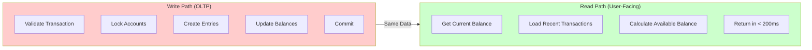
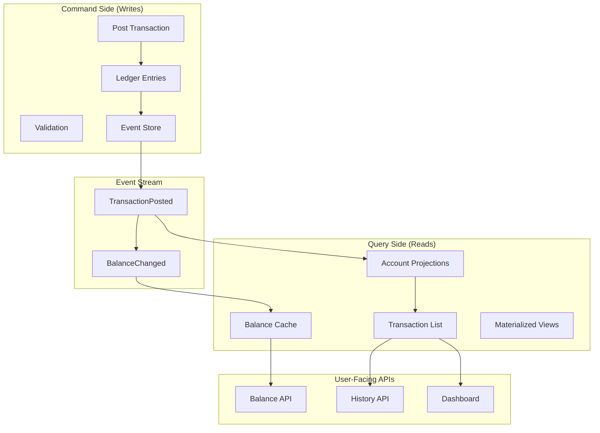

The first time our mobile app loaded a user's transaction history, it took 12 seconds.

Twelve. Whole. Seconds.

I watched our CEO stare at the loading spinner during a demo, and I could see the math happening in his head: *If this takes 12 seconds for one user, what happens when we have 10,000 users checking their balance at 9 AM on payday?*

He didn't say anything. He just raised an eyebrow.

That eyebrow launched a three-week deep dive into query optimization, caching strategies, and the uncomfortable realization that our beautiful double-entry ledger was a nightmare to query at scale.

This chapter covers what I learned: how to build fast, user-facing APIs that display account balances and transaction history without melting your database.

## The Problem: OLTP vs OLAP

Here's the tension at the heart of every ledger system:

Your **write path** (posting transactions) needs strict consistency, complex validation, and careful locking. It's optimized for correctness, not speed.

Your **read path** (showing balance to users) needs to be *fast*. Sub-second fast. Users don't care about your double-entry bookkeeping—they care about knowing how much money they have right now.



The naive approach—querying the same tables you write to—works fine until it doesn't. At around 100K transactions per account, your "simple" balance query starts timing out.

## Layer 1: The Naive Approach (And Why It Fails)

Let's start with the obvious solution and watch it fall over:

```ruby
# app/services/user_balance_service.rb
class UserBalanceService
  # DON'T DO THIS IN PRODUCTION
  def self.current_balance(account_id)
    LedgerEntry
      .joins(:ledger_transaction)
      .where(account_id: account_id)
      .where(ledger_transactions: { status: 'posted' })
      .sum("CASE WHEN direction = 'credit' THEN amount ELSE -amount END")
  end
  
  def self.transaction_history(account_id, limit: 50)
    LedgerEntry
      .joins(:ledger_transaction)
      .where(account_id: account_id)
      .where(ledger_transactions: { status: 'posted' })
      .order('ledger_transactions.posted_at DESC')
      .limit(limit)
      .map do |entry|
        {
          date: entry.ledger_transaction.posted_at,
          description: entry.ledger_transaction.description,
          amount: entry.signed_amount,
          balance: calculate_running_balance(account_id, entry)
        }
      end
  end
  
  private
  
  def self.calculate_running_balance(account_id, entry)
    # This is O(n²) - we're recalculating from scratch for each entry
    LedgerEntry
      .joins(:ledger_transaction)
      .where(account_id: account_id)
      .where(ledger_transactions: { status: 'posted' })
      .where('ledger_transactions.posted_at <= ?', entry.ledger_transaction.posted_at)
      .sum("CASE WHEN direction = 'credit' THEN amount ELSE -amount END")
  end
end
```

This works beautifully in development with 50 transactions. Then you deploy to production:

```
Account with 500K entries:
- Balance query: 2.3 seconds
- History query (50 items): 8.7 seconds
- Running balance calculation: Timeout after 30 seconds
```

The problem isn't the query complexity—it's that you're scanning half a million rows every time someone opens their app.

## Layer 2: Separation of Concerns (The CQRS Pattern)

The fix is to separate your write model from your read model. In CQRS (Command Query Responsibility Segregation), you optimize each path independently:



The insight: **it's okay to store the same data in multiple formats** if each format is optimized for its use case.

### Real-World Implementation

#### Step 1: Create Read-Optimized Tables

```ruby
# db/migrate/xxx_create_user_facing_tables.rb
class CreateUserFacingTables < ActiveRecord::Migration[7.0]
  def change
    # Materialized account summary - one row per account
    create_table :account_projections do |t|
      t.references :account, null: false, foreign_key: true, index: { unique: true }
      t.decimal :current_balance, precision: 19, scale: 4, default: 0
      t.decimal :available_balance, precision: 19, scale: 4, default: 0
      t.integer :total_transactions, default: 0
      t.datetime :last_transaction_at
      t.string :last_transaction_id
      t.decimal :last_transaction_amount, precision: 19, scale: 4
      t.datetime :updated_at, null: false
      
      # Critical: Index for fast lookups
      t.index [:account_id, :updated_at]
    end
    
    # User-facing transaction list - denormalized for fast reads
    create_table :transaction_projections do |t|
      t.references :account, null: false, foreign_key: true
      t.string :transaction_id, null: false
      t.string :external_ref
      t.string :transaction_type # 'credit', 'debit', 'fee', 'refund'
      t.decimal :amount, precision: 19, scale: 4, null: false
      t.decimal :balance_after, precision: 19, scale: 4, null: false
      t.string :currency, null: false
      t.string :status # 'completed', 'pending', 'failed'
      t.string :description
      t.string :counterparty_name # Who sent/received
      t.string :counterparty_icon # URL or identifier
      t.jsonb :metadata # Flexible metadata
      t.datetime :posted_at, null: false
      t.datetime :created_at, null: false
      
      # Indexes for common queries
      t.index [:account_id, :posted_at], order: { posted_at: :desc }
      t.index [:account_id, :transaction_type, :posted_at]
      t.index [:external_ref]
      t.index [:transaction_id], unique: true
    end
    
    # Daily balance snapshots for fast historical queries
    create_table :daily_balance_snapshots do |t|
      t.references :account, null: false, foreign_key: true
      t.date :snapshot_date, null: false
      t.decimal :opening_balance, precision: 19, scale: 4
      t.decimal :closing_balance, precision: 19, scale: 4
      t.decimal :total_credits, precision: 19, scale: 4, default: 0
      t.decimal :total_debits, precision: 19, scale: 4, default: 0
      t.integer :transaction_count, default: 0
      t.datetime :created_at, null: false
      
      t.index [:account_id, :snapshot_date], unique: true
      t.index [:snapshot_date]
    end
  end
end
```

Key design decisions:

**Account projections store current state** — no calculations needed at query time.

**Transaction projections are denormalized** — each row has everything needed to display it, even if that duplicates data from the ledger.

**Daily snapshots compress history** — instead of scanning 500K transactions to show a monthly chart, you scan 30 snapshot rows.

#### Step 2: Projection Updater Service

```ruby
# app/services/projections/projection_updater.rb
module Projections
  class ProjectionUpdater
    def initialize
      @batch_size = 1000
    end
    
    # Called whenever a transaction is posted
    def update_for_transaction(ledger_transaction)
      ActiveRecord::Base.transaction do
        ledger_transaction.ledger_entries.each do |entry|
          update_account_projection(entry)
          create_transaction_projection(entry, ledger_transaction)
        end
      end
    end
    
    # Batch update for backfills or migrations
    def batch_update_accounts(account_ids)
      account_ids.each do |account_id|
        rebuild_account_projection(account_id)
      end
    end
    
    private
    
    def update_account_projection(entry)
      account = entry.account
      
      projection = AccountProjection.find_or_initialize_by(account_id: account.id)
      
      # Calculate new balance
      old_balance = projection.current_balance || 0
      amount_change = entry.signed_amount
      new_balance = old_balance + amount_change
      
      # Calculate available balance (considering reservations)
      reservations = Reservation
        .where(account_id: account.id)
        .where('expires_at > ?', Time.current)
        .sum(:amount)
      
      projection.update!(
        current_balance: new_balance,
        available_balance: new_balance - reservations,
        total_transactions: projection.total_transactions + 1,
        last_transaction_at: entry.ledger_transaction.posted_at,
        last_transaction_id: entry.ledger_transaction.id,
        last_transaction_amount: entry.amount,
        updated_at: Time.current
      )
    end
    
    def create_transaction_projection(entry, ledger_transaction)
      # Determine transaction type and counterparty
      txn_type = entry.direction == 'credit' ? 'credit' : 'debit'
      counterparty = find_counterparty(entry, ledger_transaction)
      
      # Get balance after this transaction
      balance_after = calculate_balance_after(entry)
      
      TransactionProjection.create!(
        account_id: entry.account_id,
        transaction_id: ledger_transaction.id,
        external_ref: ledger_transaction.external_ref,
        transaction_type: txn_type,
        amount: entry.amount,
        balance_after: balance_after,
        currency: entry.currency,
        status: ledger_transaction.status,
        description: entry.description || ledger_transaction.description,
        counterparty_name: counterparty[:name],
        counterparty_icon: counterparty[:icon],
        metadata: build_metadata(entry, ledger_transaction),
        posted_at: ledger_transaction.posted_at,
        created_at: Time.current
      )
    end
    
    def calculate_balance_after(entry)
      # Sum all entries up to and including this one
      LedgerEntry
        .joins(:ledger_transaction)
        .where(account_id: entry.account_id)
        .where(ledger_transactions: { status: 'posted' })
        .where('ledger_transactions.posted_at < ? OR (ledger_transactions.posted_at = ? AND ledger_entries.created_at <= ?)',
               entry.ledger_transaction.posted_at,
               entry.ledger_transaction.posted_at,
               entry.created_at)
        .sum("CASE WHEN direction = 'credit' THEN amount ELSE -amount END")
    end
    
    def find_counterparty(entry, ledger_transaction)
      # Find the other side of the transaction
      other_entry = ledger_transaction.ledger_entries.find { |e| e.id != entry.id }
      
      if other_entry
        account = other_entry.account
        {
          name: account.owner_name || account.account_number,
          icon: account.owner_avatar_url
        }
      else
        { name: 'System', icon: nil }
      end
    end
    
    def build_metadata(entry, ledger_transaction)
      {
        entry_id: entry.id,
        transaction_status: ledger_transaction.status,
        can_reverse: ledger_transaction.posted? && !ledger_transaction.reversed?,
        reversal_info: ledger_transaction.reversed? ? {
          reversed_at: ledger_transaction.reversed_at,
          reversal_transaction_id: ledger_transaction.metadata['reversal_transaction_id']
        } : nil
      }
    end
    
    def rebuild_account_projection(account_id)
      # Full recalculation from source of truth
      entries = LedgerEntry
        .joins(:ledger_transaction)
        .where(account_id: account_id)
        .where(ledger_transactions: { status: 'posted' })
        .order('ledger_transactions.posted_at ASC')
      
      balance = 0
      last_txn = nil
      
      entries.each do |entry|
        balance += entry.signed_amount
        last_txn = entry.ledger_transaction
      end
      
      AccountProjection.find_or_initialize_by(account_id: account_id).update!(
        current_balance: balance,
        total_transactions: entries.count,
        last_transaction_at: last_txn&.posted_at,
        last_transaction_id: last_txn&.id,
        updated_at: Time.current
      )
    end
  end
end
```

#### Step 3: Event-Driven Updates

```ruby
# app/models/ledger_transaction.rb
class LedgerTransaction < ApplicationRecord
  has_many :ledger_entries, dependent: :destroy
  
  after_commit :update_projections, on: :create
  after_commit :update_projections_on_status_change, on: :update
  
  private
  
  def update_projections
    return unless posted?
    
    # Queue async job to update projections
    ProjectionUpdateJob.perform_later(self.id)
  end
  
  def update_projections_on_status_change
    return unless saved_change_to_status? && posted?
    
    ProjectionUpdateJob.perform_later(self.id)
  end
end

# app/jobs/projection_update_job.rb
class ProjectionUpdateJob < ApplicationJob
  queue_as :projections
  
  retry_on StandardError, wait: :polynomially_longer, attempts: 5
  
  def perform(transaction_id)
    transaction = LedgerTransaction.find(transaction_id)
    
    Projections::ProjectionUpdater.new.update_for_transaction(transaction)
    
    # Also update daily snapshot if needed
    update_daily_snapshot(transaction)
  rescue ActiveRecord::RecordNotFound
    # Transaction was rolled back, ignore
  end
  
  private
  
  def update_daily_snapshot(transaction)
    date = transaction.posted_at.to_date
    
    transaction.ledger_entries.each do |entry|
      snapshot = DailyBalanceSnapshot.find_or_initialize_by(
        account_id: entry.account_id,
        snapshot_date: date
      )
      
      if entry.credit?
        snapshot.total_credits += entry.amount
      else
        snapshot.total_debits += entry.amount
      end
      
      snapshot.closing_balance = entry.account.balance
      snapshot.transaction_count += 1
      snapshot.save!
    end
  end
end
```

Now when a user opens their app:

```ruby
# Lightning-fast balance lookup
AccountProjection.find_by(account_id: user.account_id).current_balance
# => 0.8ms

# Paginated transaction history
TransactionProjection
  .where(account_id: user.account_id)
  .order(posted_at: :desc)
  .page(params[:page])
  .per(50)
# => 12ms
```

That's the difference between a user staring at a spinner and a user smiling because the app feels instant.

## Layer 3: Caching Strategies

Even with projections, you'll hit limits. When 10,000 users check their balance simultaneously, you need caching.

### Redis for Hot Data

```ruby
# app/services/balance_cache_service.rb
module BalanceCacheService
  CACHE_TTL = 5.minutes
  
  def self.current_balance(account_id)
    cache_key = "balance:#{account_id}"
    
    # Try cache first
    cached = Redis.current.get(cache_key)
    return cached.to_d if cached
    
    # Cache miss - get from projection
    projection = AccountProjection.find_by(account_id: account_id)
    balance = projection&.current_balance || 0
    
    # Store in cache with TTL
    Redis.current.setex(cache_key, CACHE_TTL, balance.to_s)
    
    balance
  end
  
  def self.invalidate(account_id)
    Redis.current.del("balance:#{account_id}")
    Redis.current.del("available_balance:#{account_id}")
  end
  
  def self.bulk_fetch(account_ids)
    return {} if account_ids.empty?
    
    # Fetch all balances in one Redis round-trip
    cache_keys = account_ids.map { |id| "balance:#{id}" }
    cached_values = Redis.current.mget(*cache_keys)
    
    result = {}
    missing_ids = []
    
    account_ids.each_with_index do |id, index|
      if cached_values[index]
        result[id] = cached_values[index].to_d
      else
        missing_ids << id
      end
    end
    
    # Batch fetch missing balances
    if missing_ids.any?
      projections = AccountProjection.where(account_id: missing_ids)
      
      projections.each do |proj|
        result[proj.account_id] = proj.current_balance
        
        # Populate cache
        Redis.current.setex(
          "balance:#{proj.account_id}",
          CACHE_TTL,
          proj.current_balance.to_s
        )
      end
    end
    
    result
  end
end
```

### Cache Invalidation Strategy

The hard part of caching is invalidation. Here's a battle-tested approach:

```ruby
# app/services/projections/cache_invalidator.rb
module Projections
  class CacheInvalidator
    def self.on_transaction_posted(ledger_transaction)
      # Invalidate balance cache for affected accounts
      ledger_transaction.ledger_entries.each do |entry|
        BalanceCacheService.invalidate(entry.account_id)
        
        # Also invalidate any related list caches
        invalidate_transaction_list_cache(entry.account_id)
      end
    end
    
    def self.invalidate_transaction_list_cache(account_id)
      # Pattern: transaction_list:{account_id}:{page}
      # We need to find and delete all pages for this account
      pattern = "transaction_list:#{account_id}:*"
      
      # Use SCAN to find matching keys (safer than KEYS in production)
      cursor = 0
      loop do
        cursor, keys = Redis.current.scan(cursor, match: pattern, count: 100)
        Redis.current.del(*keys) if keys.any?
        break if cursor == "0"
      end
    end
    
    def self.warm_cache_for_account(account_id)
      # Pre-populate cache for frequently accessed accounts
      projection = AccountProjection.find_by(account_id: account_id)
      return unless projection
      
      BalanceCacheService.current_balance(account_id)
      
      # Pre-load first page of transactions
      transactions = TransactionProjection
        .where(account_id: account_id)
        .order(posted_at: :desc)
        .limit(50)
      
      cache_transaction_list(account_id, 1, transactions)
    end
    
    private
    
    def self.cache_transaction_list(account_id, page, transactions)
      cache_key = "transaction_list:#{account_id}:#{page}"
      Redis.current.setex(cache_key, CACHE_TTL, transactions.to_json)
    end
  end
end

# Hook into transaction posting
class LedgerTransaction < ApplicationRecord
  after_commit :invalidate_caches, on: [:create, :update]
  
  private
  
  def invalidate_caches
    Projections::CacheInvalidator.on_transaction_posted(self)
  end
end
```

## Layer 4: API Design for User Dashboards

Now that we have fast queries, let's design clean APIs.

### Balance Endpoint

```ruby
# app/controllers/api/v1/balances_controller.rb
module Api
  module V1
    class BalancesController < ApplicationController
      before_action :authenticate_user!
      
      # GET /api/v1/balances
      def show
        account = current_user.account
        
        # Use cache-first approach
        current_balance = BalanceCacheService.current_balance(account.id)
        available_balance = fetch_available_balance(account.id)
        
        render json: {
          account_id: account.id,
          account_number: mask_account_number(account.account_number),
          current_balance: format_currency(current_balance),
          available_balance: format_currency(available_balance),
          currency: account.currency,
          pending_transactions: count_pending_transactions(account.id),
          last_updated: AccountProjection.find_by(account_id: account.id)&.updated_at
        }
      end
      
      # GET /api/v1/balances/summary
      # Mini dashboard data
      def summary
        account = current_user.account
        
        # Parallel queries using threads or concurrent-ruby
        results = Concurrent::Hash.new
        
        threads = []
        
        threads << Thread.new do
          results[:balance] = BalanceCacheService.current_balance(account.id)
        end
        
        threads << Thread.new do
          results[:recent_transactions] = fetch_recent_transactions(account.id, 5)
        end
        
        threads << Thread.new do
          results[:monthly_stats] = fetch_monthly_stats(account.id)
        end
        
        threads.each(&:join)
        
        render json: {
          current_balance: format_currency(results[:balance]),
          recent_transactions: results[:recent_transactions],
          monthly_stats: results[:monthly_stats],
          currency: account.currency
        }
      end
      
      private
      
      def fetch_available_balance(account_id)
        cache_key = "available_balance:#{account_id}"
        cached = Redis.current.get(cache_key)
        
        if cached
          cached.to_d
        else
          projection = AccountProjection.find_by(account_id: account_id)
          balance = projection&.available_balance || 0
          Redis.current.setex(cache_key, 1.minute, balance.to_s)
          balance
        end
      end
      
      def count_pending_transactions(account_id)
        LedgerTransaction
          .joins(:ledger_entries)
          .where(ledger_entries: { account_id: account_id })
          .where(status: %w[pending validated reserved])
          .distinct
          .count
      end
      
      def fetch_recent_transactions(account_id, limit)
        TransactionProjection
          .where(account_id: account_id)
          .order(posted_at: :desc)
          .limit(limit)
          .map { |txn| serialize_transaction(txn) }
      end
      
      def fetch_monthly_stats(account_id)
        start_of_month = Date.today.beginning_of_month
        
        DailyBalanceSnapshot
          .where(account_id: account_id)
          .where('snapshot_date >= ?', start_of_month)
          .select('SUM(total_credits) as credits, SUM(total_debits) as debits, COUNT(*) as days')
          .first
          .then do |stats|
            {
              month_to_date_credits: format_currency(stats.credits || 0),
              month_to_date_debits: format_currency(stats.debits || 0),
              transaction_days: stats.days || 0
            }
          end
      end
      
      def serialize_transaction(txn)
        {
          id: txn.transaction_id,
          type: txn.transaction_type,
          amount: format_currency(txn.amount),
          balance_after: format_currency(txn.balance_after),
          description: txn.description,
          counterparty: {
            name: txn.counterparty_name,
            icon: txn.counterparty_icon
          },
          posted_at: txn.posted_at.iso8601,
          status: txn.status,
          metadata: txn.metadata
        }
      end
      
      def format_currency(amount)
        {
          value: amount.to_f,
          formatted: "$#{'%.2f' % amount}"
        }
      end
      
      def mask_account_number(number)
        "****#{number.last(4)}"
      end
    end
  end
end
```

### Transaction History with Pagination

```ruby
# app/controllers/api/v1/transactions_controller.rb
module Api
  module V1
    class TransactionsController < ApplicationController
      before_action :authenticate_user!
      
      # GET /api/v1/transactions
      def index
        account = current_user.account
        
        # Build query
        scope = TransactionProjection.where(account_id: account.id)
        
        # Filters
        scope = filter_by_date_range(scope)
        scope = filter_by_type(scope)
        scope = filter_by_amount(scope)
        
        # Sorting
        scope = apply_sorting(scope)
        
        # Pagination with cursor for large datasets
        if params[:cursor]
          scope = paginate_with_cursor(scope)
        else
          scope = paginate_with_offset(scope)
        end
        
        transactions = scope.limit(page_size).to_a
        
        render json: {
          transactions: transactions.map { |t| serialize_transaction(t) },
          pagination: build_pagination_metadata(transactions),
          summary: build_summary(scope)
        }
      end
      
      # GET /api/v1/transactions/:id
      def show
        account = current_user.account
        
        txn = TransactionProjection.find_by!(
          transaction_id: params[:id],
          account_id: account.id
        )
        
        # Get full ledger details if needed
        ledger_txn = LedgerTransaction.find(txn.transaction_id)
        
        render json: {
          transaction: serialize_transaction(txn),
          entries: ledger_txn.ledger_entries.map do |entry|
            {
              account_id: entry.account_id,
              direction: entry.direction,
              amount: entry.amount,
              description: entry.description
            }
          end,
          status_history: ledger_txn.state_transitions.map do |transition|
            {
              from: transition.from_status,
              to: transition.to_status,
              at: transition.created_at
            }
          end
        }
      end
      
      private
      
      def filter_by_date_range(scope)
        return scope unless params[:start_date] || params[:end_date]
        
        if params[:start_date]
          scope = scope.where('posted_at >= ?', Date.parse(params[:start_date]).beginning_of_day)
        end
        
        if params[:end_date]
          scope = scope.where('posted_at <= ?', Date.parse(params[:end_date]).end_of_day)
        end
        
        scope
      end
      
      def filter_by_type(scope)
        return scope unless params[:type]
        
        scope.where(transaction_type: params[:type].split(','))
      end
      
      def filter_by_amount(scope)
        return scope unless params[:min_amount] || params[:max_amount]
        
        if params[:min_amount]
          scope = scope.where('amount >= ?', params[:min_amount].to_d)
        end
        
        if params[:max_amount]
          scope = scope.where('amount <= ?', params[:max_amount].to_d)
        end
        
        scope
      end
      
      def apply_sorting(scope)
        sort_by = params[:sort_by] || 'posted_at'
        sort_order = params[:sort_order] || 'desc'
        
        scope.order("#{sort_by} #{sort_order}")
      end
      
      def paginate_with_cursor(scope)
        cursor = JSON.parse(Base64.decode64(params[:cursor]))
        
        scope.where('posted_at < ? OR (posted_at = ? AND created_at < ?)',
                    cursor['posted_at'],
                    cursor['posted_at'],
                    cursor['created_at'])
      end
      
      def paginate_with_offset(scope)
        offset = (params[:page].to_i - 1) * page_size
        scope.offset(offset)
      end
      
      def page_size
        [params[:per_page].to_i, 100].min.clamp(1, 100)
      end
      
      def build_pagination_metadata(transactions)
        return { has_more: false } if transactions.empty?
        
        last_txn = transactions.last
        
        {
          has_more: has_more_pages?(last_txn),
          next_cursor: encode_cursor(last_txn),
          total_count: total_count_estimate
        }
      end
      
      def has_more_pages?(last_transaction)
        TransactionProjection
          .where(account_id: last_transaction.account_id)
          .where('posted_at < ? OR (posted_at = ? AND created_at < ?)',
                 last_transaction.posted_at,
                 last_transaction.posted_at,
                 last_transaction.created_at)
          .exists?
      end
      
      def encode_cursor(transaction)
        Base64.encode64({
          posted_at: transaction.posted_at,
          created_at: transaction.created_at
        }.to_json)
      end
      
      def total_count_estimate
        # Use PostgreSQL's estimated count for performance
        # or cached count for exact numbers
        "~#{TransactionProjection.where(account_id: current_user.account.id).count}"
      end
      
      def build_summary(scope)
        {
          total_count: scope.count,
          total_credits: scope.where(transaction_type: 'credit').sum(:amount),
          total_debits: scope.where(transaction_type: 'debit').sum(:amount)
        }
      end
      
      def serialize_transaction(txn)
        {
          id: txn.transaction_id,
          type: txn.transaction_type,
          amount: {
            value: txn.amount.to_f,
            formatted: "$#{'%.2f' % txn.amount}"
          },
          balance_after: {
            value: txn.balance_after.to_f,
            formatted: "$#{'%.2f' % txn.balance_after}"
          },
          description: txn.description,
          counterparty: {
            name: txn.counterparty_name,
            icon: txn.counterparty_icon
          },
          posted_at: txn.posted_at.iso8601,
          status: txn.status,
          metadata: txn.metadata
        }
      end
    end
  end
end
```

## Layer 5: Advanced Query Patterns

### Time-Series Aggregation

Users want charts showing balance over time. Don't calculate this on the fly—use pre-aggregated data:

```ruby
# app/services/balance_chart_service.rb
class BalanceChartService
  def self.balance_over_time(account_id, period: '30d', granularity: 'daily')
    case granularity
    when 'hourly'
      hourly_balance_chart(account_id, period)
    when 'daily'
      daily_balance_chart(account_id, period)
    when 'weekly'
      weekly_balance_chart(account_id, period)
    when 'monthly'
      monthly_balance_chart(account_id, period)
    end
  end
  
  private
  
  def self.daily_balance_chart(account_id, period)
    days = period_to_days(period)
    start_date = days.days.ago.to_date
    
    # Use snapshots for efficiency
    snapshots = DailyBalanceSnapshot
      .where(account_id: account_id)
      .where('snapshot_date >= ?', start_date)
      .order(snapshot_date: :asc)
    
    # If no snapshots exist yet, calculate from projections
    if snapshots.empty?
      calculate_from_projections(account_id, start_date)
    else
      snapshots.map do |snapshot|
        {
          date: snapshot.snapshot_date,
          balance: snapshot.closing_balance.to_f,
          credits: snapshot.total_credits.to_f,
          debits: snapshot.total_debits.to_f
        }
      end
    end
  end
  
  def self.calculate_from_projections(account_id, start_date)
    # Get current balance
    current = AccountProjection.find_by(account_id: account_id)
    
    # Walk backwards through transactions (slower but works without snapshots)
    transactions = TransactionProjection
      .where(account_id: account_id)
      .where('posted_at >= ?', start_date.beginning_of_day)
      .order(posted_at: :desc)
    
    # Build chart data by day
    data_by_day = transactions.group_by { |t| t.posted_at.to_date }
    
    balance = current.current_balance
    chart_data = []
    
    (start_date..Date.today).reverse_each do |date|
      day_transactions = data_by_day[date] || []
      
      day_credits = day_transactions.select { |t| t.transaction_type == 'credit' }.sum(&:amount)
      day_debits = day_transactions.select { |t| t.transaction_type == 'debit' }.sum(&:amount)
      
      chart_data.unshift({
        date: date,
        balance: balance.to_f,
        credits: day_credits.to_f,
        debits: day_debits.to_f
      })
      
      # Walk balance backwards
      balance -= (day_credits - day_debits)
    end
    
    chart_data
  end
  
  def self.period_to_days(period)
    case period
    when '7d' then 7
    when '30d' then 30
    when '90d' then 90
    when '1y' then 365
    else 30
    end
  end
end
```

### Search and Filtering

```ruby
# app/services/transaction_search_service.rb
class TransactionSearchService
  def self.search(account_id, query:, filters: {})
    scope = TransactionProjection.where(account_id: account_id)
    
    # Full-text search on description and counterparty
    if query.present?
      scope = scope.where(
        "description ILIKE ? OR counterparty_name ILIKE ?",
        "%#{query}%",
        "%#{query}%"
      )
    end
    
    # Apply filters
    scope = apply_filters(scope, filters)
    
    scope.order(posted_at: :desc).limit(100)
  end
  
  def self.apply_filters(scope, filters)
    if filters[:type]
      scope = scope.where(transaction_type: filters[:type])
    end
    
    if filters[:min_amount]
      scope = scope.where('amount >= ?', filters[:min_amount])
    end
    
    if filters[:max_amount]
      scope = scope.where('amount <= ?', filters[:max_amount])
    end
    
    if filters[:date_from]
      scope = scope.where('posted_at >= ?', filters[:date_from])
    end
    
    if filters[:date_to]
      scope = scope.where('posted_at <= ?', filters[:date_to])
    end
    
    scope
  end
end
```

## The Production Checklist

Before you ship user-facing balance APIs:

**Performance:**
- [ ] Balance lookup < 50ms (with cache)
- [ ] Transaction list < 100ms (first page)
- [ ] Chart data < 200ms (using snapshots)
- [ ] Load tested at 10x expected traffic

**Consistency:**
- [ ] Projection updates are atomic with ledger writes
- [ ] Cache invalidation happens on every transaction
- [ ] Stale cache TTL < 5 minutes for critical data
- [ ] Background jobs have retry logic and alerting

**Monitoring:**
- [ ] Track cache hit rates (target > 90%)
- [ ] Alert on projection lag > 5 seconds
- [ ] Log slow queries (> 500ms)
- [ ] Dashboard showing projection health

**Resilience:**
- [ ] Fallback to direct ledger queries if projections fail
- [ ] Circuit breaker for cache layer
- [ ] Projection rebuild job tested and ready
- [ ] Data integrity checks run hourly

## What I'd Do Differently

Looking back at that 12-second query nightmare, here are my hard-won lessons:

**Start with projections from day one.** Don't wait until you have performance problems. The migration from direct queries to projections is painful—you have to rebuild historical data while keeping the system online.

**Cache isn't optional.** Even "fast" queries add up under load. Redis is your friend.

**Use cursor pagination, not offset.** When a user scrolls to page 1000 of their transaction history, offset pagination becomes O(n) and dies. Cursor pagination stays O(1).

**Denormalize shamelessly.** Your projections should have everything needed to display a transaction. Don't JOIN to five tables at query time—do it once at write time.

**Test with real data volumes.** Development with 100 transactions tells you nothing. Restore a production backup and see what breaks.

## The Bottom Line

Your ledger is the source of truth. Your projections are how users experience that truth.

Get the separation right, and users see instant balances while your ledger stays correct. Get it wrong, and you choose between slow queries and stale data.

The best part? Once you have this architecture, adding features becomes easy:

- Push notifications on balance changes? Just hook into the projection updater.
- Real-time WebSocket updates? Broadcast after projection update.
- Mobile offline support? Cache projections locally.

Build the right foundation, and everything else flows from there.

---

**Series Navigation:**

- [Chapter 1: Foundations](/posts/ledger-system-chapter-1-foundations)
- [Chapter 2: Transaction Lifecycle](/posts/ledger-system-chapter-2-lifecycle)
- [Chapter 3: Advanced Topics](/posts/ledger-system-chapter-3-advanced)
- [Chapter 4: Production Operations](/posts/ledger-system-chapter-4-production)
- [Chapter 5: Data Quality & Best Practices](/posts/ledger-system-chapter-5-data-quality)
- Chapter 6: Displaying Balance and Mutations to Users (You are here)
